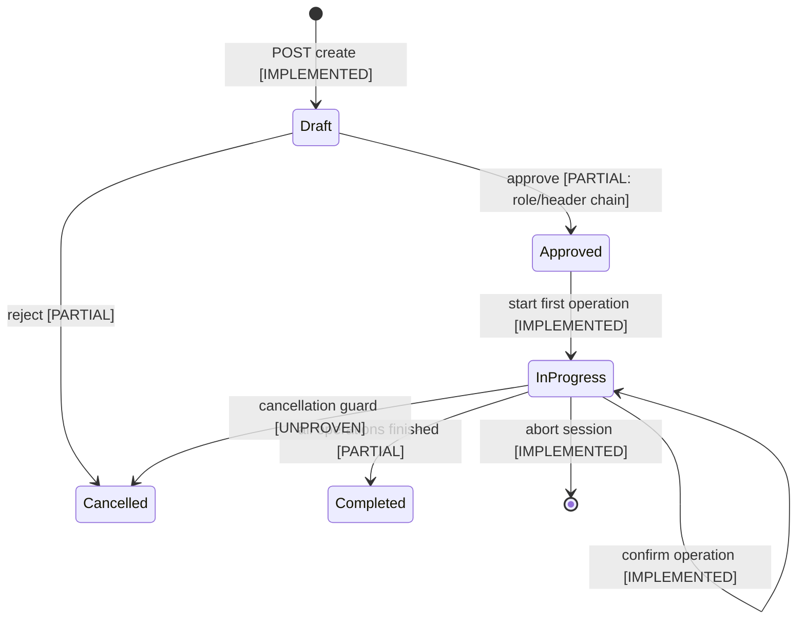
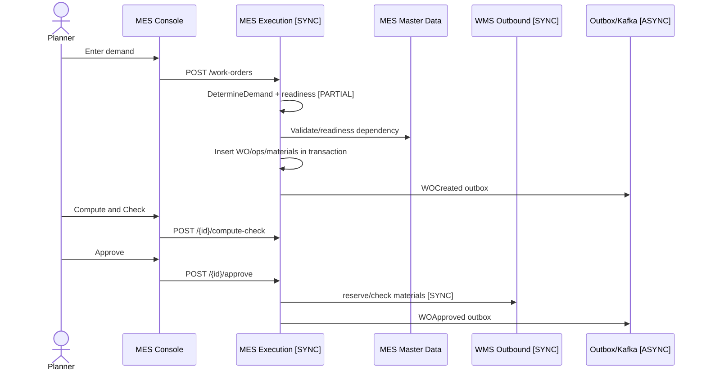
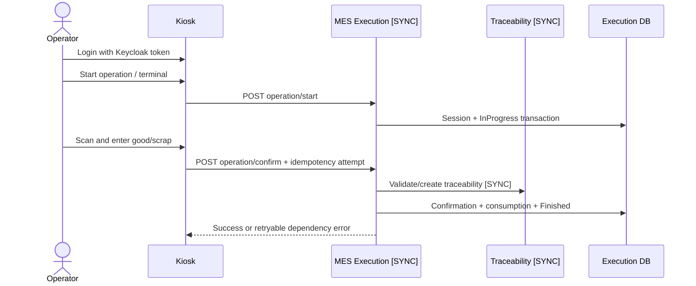

# AI_CONTEXT.md - Canonical Full Context for AI Agents

Last updated: 2026-07-24
Repository: `/home/neurosus/mes-system`
Project: S-Factory MOM Platform - MES / WMS / QMS
Audience: AI agents, engineers, architects, and maintainers continuing this codebase.

This is the first file to read before making changes in this repository. It consolidates:

- Product demand and domain catalogs from `product-doc/`.
- Current workload, roadmap, and process prompts from `process/`.
- Strategy and tech-stack decisions.
- Current implementation reports from `implementation/` and `implementation-fix/`.
- Runtime topology, services, ports, event contracts, and engineering rules.

This document is intentionally long. It is designed to let a new AI agent understand the system without
needing to rediscover the whole repository from scratch.

## 0. Source Of Truth Rules

Do not treat any single prompt as current truth by itself.

Use this precedence order exactly:

1. Running source code.
2. Service manifests.
3. Docker Compose and infrastructure configuration.
4. Database migrations and schemas.
5. Automated tests.
6. API handlers, domain logic, repositories, consumers, producers, and frontend behavior.
7. Implementation records in `implementation/` and `implementation-fix/`.
8. Current progress tracker: `process/PROJECT_WORKLOAD_PROGRESS.md`.
9. This `AI_CONTEXT.md`.
10. Product catalogs and design documents in `product-doc/`.
11. Historical process prompts in `process/` and `process-fix/`.

Prompt files describe intended work at a point in time. Implementation records and source code describe
what actually exists. Some product/process docs are deliberately historical and may still mention
obsolete scaffolding such as the old Hello World validator. The Hello World service has been
decommissioned and removed from active code/runtime.

### Evidence status vocabulary

Every new claim added to this context must be classified with one of these statuses. Do not convert a
product requirement or process instruction into an implemented fact without evidence:

- `IMPLEMENTED_AND_VERIFIED`: source exists and a repeatable build, test, runtime, API, or database check passed.
- `IMPLEMENTED_BUT_NOT_TESTED`: source exists but verification is still missing.
- `PARTIALLY_IMPLEMENTED`: some required behavior exists, but a documented part is absent or incomplete.
- `DOCUMENTED_INTENT_ONLY`: only product/process documentation describes the behavior.
- `PLANNED`: explicitly scheduled but not implemented.
- `MISSING`: searched source, manifests, migrations, and tests do not contain the behavior.
- `AMBIGUOUS`: evidence exists but the contract or ownership is unclear.
- `CONFLICTING_SOURCES`: code and documentation disagree; code wins for current behavior and the discrepancy must be recorded.
- `DEPRECATED`: historical behavior or artifact no longer belongs to the active runtime.
- `DEMO_ONLY`: implemented for seeded/demo workflows and not proven as production-grade behavior.

For each important claim record the evidence path, owning service, verification command/result, confidence,
and any discrepancy. When evidence is insufficient, use this exact form:

```text
Status: MISSING_OR_UNVERIFIED
Expected behavior: <documented or requested behavior>
Evidence searched: <paths, handlers, migrations, tests, runtime checks>
Gap: <what cannot be proven>
Recommended clarification: <specific next question or test>
```

## 1. Current Executive Summary

S-Factory manufactures technical rubber products and rubber-metal automotive components. The MOM
platform is being built as three independent but integrated clusters:

- MES: Manufacturing execution, master data, traceability, work orders, kiosk, and planning console.
- WMS: Warehouse master data, inventory ledger, inbound receipt, outbound staging, and the implemented WMS console.
- QMS: Inspection plans/results and NCR/CAPA case management are implemented, with the QMS Console deployed on port 13130.

Current implementation state:

- Phase 0 Platform Foundation is implemented.
- Phase 1 MES is implemented through Step 8 plus the Step 8a i18n/data-quality hotfix.
- Phase 2 Step 1 WMS Master Data is implemented and closure-verified.
- Phase 2 Step 2 WMS Inventory / Inbound / Outbound is implemented.
- Phase 2 Step 3 WMS Console is implemented.
- Circuit-breaker hardening is implemented across synchronous server-to-server MES/WMS dependencies,
  including MES execution, WMS outbound, WMS inbound, and kiosk gateway Keycloak login.
- Phase 3 Step 1 QMS Inspection Service is implemented on port `13110` with database port `15442`.
- Phase 3 Step 2 QMS Nonconformance Service is implemented on port `13120` with database port `15443`.
- Current active milestone is Phase 4 Platform E2E Integration.
- QMS Console is implemented as React/Vite and deployed on port 13130.
- QMS Console Step 3b UI/UX hardening is implemented: no native interactive controls outside UI primitives,
  URL-persisted 10/50/100 pagination, action-specific Radix AlertDialogs for irreversible mutations,
  WMS-matching navy/slate/amber tokens, and QMS JA/KO fallback flags registered in the MES Translation
  Review Queue (`qms_console_i18n_resource`, two OPEN flags).
- UI issue note fixes are recorded in `implementation-fix/ui-note-fix.md`: canonical MES Item/Production
  Version field mappings, translated Tier-2 titles, routing nowrap, detailed WO page guidance, Portal
  i18n/icon cleanup, and persisted Portal/MES light-dark mode.
- MES Console light-theme audit/refinement is implemented in `services/mes-console/src/index.css`,
  `tailwind.config.js`, `Sidebar.tsx`, `Navbar.tsx`, the shared badge primitives, and `StatusBadge.tsx`:
  semantic surface/border/selected/hover/status tokens, readable light-mode legacy compatibility,
  a dark-readable selected sidebar state, and centralized status tones are present. Status:
  `IMPLEMENTED_AND_VERIFIED` by MES typecheck/build and `git diff --check`; browser screenshot review is
  `IMPLEMENTED_BUT_NOT_TESTED` in this latest pass.
- MES Item Revision release-route fix is implemented: `ItemsScreen.tsx` calls the canonical
  `releaseResource('item-revisions', revisionId, user)` contract. The old nested
  `/items/{itemId}/revisions/{revisionId}/release` URL was not registered and caused the first 404.
  The UI now only submits `Draft`, `InReview`, or `Inactive` revisions and never re-releases a revision
  already in `Released`. Status: `IMPLEMENTED_AND_VERIFIED`; a safe runtime contract probe returned the
  expected `409 Record is not releasable or not found` for a valid-shaped nonexistent ID, proving the
  request reaches the release handler rather than the 404 fallback.
- Hello World scaffolding validator was used during Phase 0, then removed from source/runtime on
  2026-07-22.

Current progress from `process/PROJECT_WORKLOAD_PROGRESS.md`:

| # | Milestone | Status | Trace |
|---|---|---|---|
| 0 | Phase 0 Platform Foundation | Completed | `implementation/phase-0-platform-foundation.md` |
| 1 | Phase 1 Step 1 MES Master Data | Completed | `implementation/phase-1-mes-master-data-service.md` |
| 2 | Phase 1 Step 2 MES Traceability | Completed | `implementation/phase-1-2-mes-traceability-service.md` |
| 3 | Phase 1 Step 3 MES Execution Stage A | Completed | `implementation/phase-1-3-mes-execution-service.md` |
| 4 | Phase 1 Step 4 MES Execution Stage B | Completed | `implementation/phase-1-4-mes-execution-service-b.md` |
| 5 | Phase 1 Step 5 Kiosk Gateway and Kiosk UI | Completed | `implementation/phase-1-5-mes-kiosk-gateway.md` |
| 6 | Phase 1 Step 6 MES Console | Completed | `implementation/phase-1-6-mes-console.md` |
| 7 | Phase 1 Step 7 Labor Resource + WorkCenter CRUD + MBOM UI Fix | Completed | `implementation/phase-1-7-labor-resource-management.md` |
| 8 | Phase 1 Step 8 i18n Platform Foundation | Completed | `implementation/phase-1-8-i18n-platform-foundation.md` |
| 8a | Phase 1 Step 8a i18n Static Coverage and Data Quality Hotfix | Completed | `implementation/phase-1-8a-i18n-coverage-data-quality-hotfix.md` |
| 9 | Phase 2 Step 1 WMS Master Data | Completed | `implementation/phase-2-1-wms-master-data-service.md` |
| 10 | Phase 2 Step 2 WMS Inventory / Inbound / Outbound | Completed | `implementation/phase-2-2-wms-inventory-stock.md` |
| 11 | Phase 2 Step 3 WMS Console | Completed | `implementation/phase-2-3-wms-console.md` |
| 12a | Phase 3 Step 1 QMS Inspection Service | Completed | `implementation/phase-3-1-qms-inspection-service.md` |
| 12b | Phase 3 Step 2 QMS Nonconformance / NCR / CAPA | Completed | `implementation/phase-3-2-qms-nonconformance-service.md` |
| 12c | Phase 3 Step 3 QMS Console | Completed | `implementation/phase-3-3-qms-console.md` |
| 13 | Phase 4 Cross-cluster Integration and Hardening | Pending | none |

Current active task after WMS Console:

- Phase 3 Step 3 QMS Console is complete; continue with Phase 4 cross-context integration and security/load verification.
- QMS Inspection Service is implemented with localized plans/characteristics/defect codes, server-side
  result evaluation, idempotent `OperationFinished` draft creation, and `InspectionFailed` events for
  the next NCR service. Trace: `implementation/phase-3-1-qms-inspection-service.md`.
- QMS Console follows the React/Vite, Tailwind, shared shadcn-style pattern, starts with i18n, and is served on `13130`.
- The latest completed demo workload is the route-aware page-detail modal in both consoles. Every
  current MES and WMS route exposes a top-right detail action with client-only VI/EN/JA/KO content
  covering purpose, usage, displayed data, statuses, and demo limitations. Trace:
  `implementation/demo-page-detail-modals-mes-wms.md`.
- WMS Console follow-up work already completed includes shared `SelectBase` controls and CRUD
  confirmation dialogs, common paginated tables (10/50/100 rows), complete status/type i18n coverage,
  warehouse descriptions stored as localized database data, and a real warehouse-map movement ledger
  endpoint. Traces are in `implementation/wms-console-selectbase-crud-confirmation.md`,
  `implementation/wms-console-datatable-pagination-status-i18n.md`,
  `implementation/wms-warehouse-map-description-i18n.md`, and
  `implementation/wms-warehouse-map-movement-ledger.md`.
- Do not resurrect Hello World. It is not an active scaffold, workspace, route, image, container, or DB.
- Preserve the circuit-breaker baseline from `implementation-fix/circuit-breaker-hardening.md` for any
  new synchronous service dependency.

## 2. Business Context

S-Factory manufactures technical rubber products, especially rubber-metal automotive parts such as
automotive engine mounts. The MES MVP controls the production route, materials, labels, work orders,
shopfloor operator workflow, and planning/manager console.

Product families in the catalog:

- Finished goods:
  - `FG_RUBBER_METAL`
  - `FG_SEALS_ORING`
- Semi-finished goods:
  - `SFG_COMPOUND`
  - `SFG_TREATED_METAL`
- Raw materials:
  - `RM_RUBBER_BASE`
  - `RM_CHEMICALS`
  - `RM_METAL_BASE`

Representative seed product:

- Item Revision: `FG-WS-CM01-R1`
- Product: automotive engine mount / `Cao su chan may o to`
- Base quantity: `100.000000`
- Base UOM: `PCS`

The system is built to support data-driven execution, traceability, and future cross-cluster flows:

- MES produces and records shopfloor events.
- WMS stages and consumes material by WorkCenter.
- QMS inspects production results, raises NCR/CAPA records, and publishes quality decisions/events for
  future MES/WMS workflow integration.

## 3. Core MES Production Flow

The MVP route for `FG-WS-CM01` is:

| Sequence | Operation Code | Vietnamese Name | MES Behavior |
|---:|---|---|---|
| 10 | `OP-MIX` | Luyen can cao su | Start/finish execution, material scan, issue mother batch label. |
| 20 | `OP-PREP` | Xu ly loi kim loai | Quantity confirmation, manual raw steel scan, no output label. |
| 30 | `OP-CUT` | Cat tach phoi tam me-con | Scan mother QR, call traceability split, activate child labels. |
| 40 | `OP-MOLD` | Ep dinh va luu hoa | Scan child QR and pallet, consume child label, issue finished output label. |
| 50 | `OP-TRIM` | Cat bavia / dinh hinh | Quantity confirmation, record good and scrap. |
| 60 | `OP-QC` | Kiem tra chat luong | PASS issues label; FAIL requires reason code and no PASS label. |

Operation-specific behavior must remain data-driven where possible. Traceability calls are allowed where
the business process requires them (`OP-MIX`, `OP-CUT`, `OP-MOLD`, `OP-QC`), but code must not duplicate
traceability ownership inside execution.

## 4. Representative Product Structure

MBOM for `FG-WS-CM01-R1`:

| Seq | Component Revision | Material | Qty | UOM | Scrap | Issue Operation | Backflush | Phantom |
|---:|---|---|---:|---|---:|---|---|---|
| 10 | `SFG-MET-CM01-R1` | Treated metal core | 100.000000 | PCS | 1.00% | `OP-MOLD` | Yes | No |
| 20 | `SFG-RUB-CM01-R1` | Rubber child blank | 102.000000 | PCS | 2.00% | `OP-MOLD` | Yes | No |
| 30 | `RM-STL-05-R1` | Raw steel blank | 101.000000 | PCS | 0.50% | `OP-PREP` | No | No |
| 40 | `RM-CHEM-BOND-R1` | Bonding chemical | 1.500000 | KG | 5.00% | `OP-PREP` | Yes | No |
| 50 | `SFG-ROLL-EPDM-R1` | EPDM parent roll | 15.500000 | M2 | 3.00% | `OP-CUT` | Yes | Yes |

Important rules:

- `SFG-ROLL-EPDM-R1` is a phantom component.
- Phantom is a relationship property on `MD_MBOM_LINE`, not a fixed property on `MD_ITEM`.
- At `OP-CUT`, traceability splits the parent roll/sheet into child labels and records genealogy.
- Manual material scan is required for `RM-STL-05-R1` at `OP-PREP`.
- Backflush lines are automatically consumed on operation confirmation.

## 5. Product Master Data Catalogs

The product catalogs in `product-doc/` are the domain authority for field-level meaning and validation
intent. Current implementation does not necessarily implement every optional/recommended field, but new
work should align with these catalogs unless there is a documented implementation decision.

### 5.1 Foundation Master Data

Source: `product-doc/I-FOUNDATION-MASTER-DATA-CATALOG.md`

#### `MD_SITE`

Purpose:

- Defines plant/site scope for SKU, MBOM, Work Center, calendar, and permissions.
- Data owner: system admin / plant manager.
- Priority: MVP-Core.

Fields:

| Field | Meaning |
|---|---|
| `SiteID` | Primary key. |
| `SiteCode` | Unique plant code, e.g. `HN01`. |
| `SiteName` | Display name. |
| `TimeZone` | Timezone for kiosk start/end timestamps, e.g. `Asia/Ho_Chi_Minh`. |
| `DefaultCalendarID` | Optional default plant calendar. |
| `Status` | `Active` or `Inactive`. |

Validation:

- `SiteCode` unique globally.
- Do not delete a site after WO transactions exist; mark `Inactive`.

#### `MD_PRODUCTION_AREA`

Purpose:

- Production hierarchy for workshop, line, cell, zone.
- Used to attach Work Centers, devices, and permissions.

Fields:

| Field | Meaning |
|---|---|
| `AreaID` | Primary key. |
| `SiteID` | Owning site. |
| `AreaCode` | Area code. |
| `AreaName` | Display name. |
| `AreaType` | `Workshop`, `Line`, `Cell`, `Zone`. |
| `ParentAreaID` | Optional tree parent. |
| `SequenceNo` | Display ordering. |
| `Status` | `Active` or `Inactive`. |

Validation:

- No cycles in `ParentAreaID`.
- Work Center area must belong to same site.

#### `MD_UOM`

Purpose:

- Standard units for products, raw materials, sheets, child blanks, and BOM quantities.

Fields:

| Field | Meaning |
|---|---|
| `UOMID` | Primary key. |
| `UOMCode` | Unique UOM code such as `M2`, `PCS`, `KG`. |
| `UOMName` | Display name. |
| `UOMType` | `Count`, `Length`, `Area`, `Weight`, `Time`. |
| `DecimalPrecision` | Allowed decimal precision. |
| `AllowFraction` | Whether fractional quantities are allowed. |
| `Status` | `Active` or `Inactive`. |

Validation:

- `UOMCode` unique globally.
- Do not change `UOMType` after use/release.

#### `MD_UOM_CONVERSION`

Purpose:

- Converts between purchasing, warehouse, and production units.
- Example: Roll -> Meter, Sheet -> M2.

Fields:

| Field | Meaning |
|---|---|
| `ConversionID` | Primary key. |
| `ItemID` | Optional item-specific conversion. |
| `FromUOMID` | Source UOM. |
| `ToUOMID` | Target UOM. |
| `Factor` | `1 FromUOM = Factor * ToUOM`. |
| `RoundingRule` | Rounding policy. |
| `EffectiveFrom` | Start date. |

Validation:

- `Factor` must not be zero.
- Only one effective conversion per `[Item + FromUOM + ToUOM]` at a time.

#### `MD_SHIFT`

Purpose:

- Defines shift time, breaks, and net available minutes.
- Used for scheduling and execution reporting.

Fields:

| Field | Meaning |
|---|---|
| `ShiftID` | Primary key. |
| `SiteID` | Owning site. |
| `ShiftCode` | Shift code such as `A`. |
| `StartTime` | Shift start. |
| `EndTime` | Shift end. |
| `BreakMinutes` | Total break duration. |
| `NetAvailableMinutes` | Shift duration minus break. |
| `CrossMidnight` | Whether shift crosses midnight. |

Validation:

- `NetAvailableMinutes = shift duration - BreakMinutes`.
- Avoid overlapping shifts in one site unless explicitly allowed by plant policy.

#### `MD_REASON_CODE`

Purpose:

- Standard reasons for downtime, scrap, rework, hold, and adjustment.

Fields:

| Field | Meaning |
|---|---|
| `ReasonID` | Primary key. |
| `ReasonCode` | Short reason code, e.g. `MAT_WAIT`. |
| `ReasonName` | Display name. |
| `ReasonCategory` | `Downtime`, `Scrap`, `Rework`, `Hold`, `Adjustment`. |
| `RequiresComment` | Requires operator text comment. |
| `RequiresApproval` | Requires manager approval. |
| `ApplicableAreaID` | Optional area scope. |
| `Status` | `Active` or `Inactive`. |

Validation:

- `ReasonCode` unique within category.
- Do not delete used reason codes; mark `Inactive`.

### 5.2 Product and MBOM Catalog

Source: `product-doc/II-PRODUCTS-&-MBOM-CATALOG.md`

#### `MD_ITEM`

Purpose:

- Master item/SKU catalog for 160-200 SKU across finished goods, semi-finished goods, raw materials,
  and consumables.

Fields:

| Field | Meaning |
|---|---|
| `ItemID` | Primary key. |
| `ItemCode` | Globally unique SKU code. |
| `ItemName` | Display name. |
| `ItemType` | `FinishedGood`, `SemiFinished`, `RawMaterial`, `Consumable`. |
| `ItemGroup` | Technical product group. |
| `BaseUOMID` | Base UOM. |
| `PlanningStrategy` | `MTS`, `MTO`, `ETO`. |
| `ProcurementType` | `Make`, `Buy`, `Subcontract`. |
| `TrackingLevel` | `None`, `Lot`, `Serial`, `ParentChild`. |
| `DefaultScrapRate` | Optional default scrap rate. |
| `Status` | `Draft`, `Active`, `Inactive`. |

Validation:

- `ItemCode` should not change after `Active`.
- `ItemType` and `ProcurementType` must be logically compatible.

#### `MD_ITEM_REVISION`

Purpose:

- Engineering revision/version control without overwriting production history.

Fields:

| Field | Meaning |
|---|---|
| `ItemRevisionID` | Primary key. |
| `ItemID` | Parent item. |
| `RevisionNo` | Revision code such as `R1`. |
| `RevisionStatus` | `Draft`, `InReview`, `Released`, `Obsolete`. |
| `SpecificationRef` | Optional document/spec reference. |
| `EffectiveFrom` | Start datetime. |
| `EffectiveTo` | Optional end datetime. |
| `ChangeReason` | Reason for revision. |
| `ReleasedBy` | Approver reference. |

Validation:

- Only one effective default released revision per SKU/site at a time.
- Do not edit core released revision data; release a new revision.

#### `MD_MBOM_HEADER`

Purpose:

- Defines a production BOM for a product revision at a site.

Fields:

| Field | Meaning |
|---|---|
| `MBOMID` | Primary key. |
| `MBOMCode` | MBOM code. |
| `ProductRevisionID` | Finished/semi-finished output revision. |
| `SiteID` | Site scope. |
| `MBOMVersion` | Version number. |
| `BaseQuantity` | Base output quantity. |
| `BaseUOMID` | Base output UOM. |
| `ValidFrom` | Effective start. |
| `ValidTo` | Optional effective end. |
| `Status` | `Draft`, `InReview`, `Released`, `Obsolete`. |

Validation:

- Released MBOM must contain at least one line.
- Only released MBOMs can be linked to `MD_PRODUCTION_VERSION`.

#### `MD_MBOM_LINE`

Purpose:

- Defines component, hierarchy, quantity, scrap, phantom behavior, and issue operation.

Fields:

| Field | Meaning |
|---|---|
| `MBOMLineID` | Primary key. |
| `MBOMID` | Parent MBOM. |
| `ParentLineID` | Optional parent line for multi-level tree. |
| `SequenceNo` | Display/explosion sequence. |
| `ComponentRevisionID` | Component item revision. |
| `QuantityPer` | Component quantity per base output quantity. |
| `UOMID` | UOM. |
| `ScrapRate` | Expected scrap rate. |
| `PhantomFlag` | Whether line is phantom/exploded and not independent output. |
| `IssueOperationID` | Operation consuming/issuing material. |
| `BackflushFlag` | Auto-consume on operation completion. |
| `OptionalFlag` | Optional material. |
| `EffectiveFrom` | Effective start. |
| `EffectiveTo` | Optional effective end. |

Validation:

- No circular BOM tree.
- `QuantityPer > 0`.
- Phantom is line-level relationship logic.

#### `MD_COMPONENT_SUBSTITUTE`

Purpose:

- Defines allowed substitute materials when primary material is unavailable.

Fields:

| Field | Meaning |
|---|---|
| `SubstituteID` | Primary key. |
| `MBOMLineID` | Original MBOM line. |
| `SubstituteRevisionID` | Substitute item revision. |
| `PriorityNo` | Priority order. |
| `ConversionFactor` | Conversion ratio. |
| `MaxUsagePercent` | Maximum usage percentage. |
| `RequiresApproval` | Whether substitution requires approval. |
| `EffectiveFrom` | Effective start. |

Validation:

- Substitute cannot be the same as original component revision.
- Substitute must be same technical group or approved by quality/engineering.

#### `MD_PRODUCTION_VERSION`

Purpose:

- Locks the valid triple `[Item Revision + MBOM + Routing]` for WO creation.

Fields:

| Field | Meaning |
|---|---|
| `ProductionVersionID` | Primary key. |
| `ProductRevisionID` | Product revision. |
| `MBOMID` | Released MBOM. |
| `RoutingID` | Released routing. |
| `SiteID` | Site. |
| `MinLotSize` | Minimum lot size. |
| `MaxLotSize` | Maximum lot size. |
| `DefaultFlag` | Default version selector. |
| `ValidFrom` | Effective start. |
| `ValidTo` | Optional effective end. |
| `Status` | `Draft`, `InReview`, `Released`, `Obsolete`. |

Validation:

- MBOM and Routing must match site and product revision.
- Only one effective default production version per product/site/lot-size range.

### 5.3 Routing and Standards Catalog

Source: `product-doc/III-ROUTING-&-STANDARDS-CATALOG.md`

#### `MD_OPERATION`

Purpose:

- Standard operation catalog for production, inspection, packing, and handling steps.

Fields:

| Field | Meaning |
|---|---|
| `OperationID` | Primary key. |
| `OperationCode` | Unique operation code. |
| `OperationName` | Display name. |
| `OperationType` | `Production`, `Inspection`, `Packing`, `Handling`. |
| `ConfirmationMode` | `StartFinish`, `QuantityOnly`, `Auto`. |
| `QuantityReporting` | `GoodOnly`, `GoodScrap`. |
| `RequiresMaterialScan` | Whether material scan is mandatory. |
| `RequiresOutputLabel` | Whether output label is required. |
| `AllowPartialCompletion` | Whether partial completion is allowed. |
| `Status` | `Active` or `Inactive`. |

Validation:

- `OperationCode` unique globally.
- Do not delete operations used in WO transactions; mark `Inactive`.

#### `MD_ROUTING_HEADER`

Purpose:

- Defines process route for one product revision at one site.

Fields:

| Field | Meaning |
|---|---|
| `RoutingID` | Primary key. |
| `RoutingCode` | Routing code. |
| `ProductRevisionID` | Product revision. |
| `SiteID` | Site. |
| `RoutingVersion` | Version number. |
| `RoutingType` | `Standard`, `Alternate`, `Rework`. |
| `ValidFrom` | Effective start. |
| `ValidTo` | Optional effective end. |
| `Status` | `Draft`, `InReview`, `Released`, `Obsolete`. |

Validation:

- Released routing must have at least one operation.
- Do not directly edit routing used by production orders.

#### `MD_ROUTING_OPERATION`

Purpose:

- Defines operation sequence, default Work Center, dependencies, queue/move time, and scheduling params.

Fields:

| Field | Meaning |
|---|---|
| `RoutingOperationID` | Primary key. |
| `RoutingID` | Parent routing. |
| `SequenceNo` | Operation sequence. |
| `OperationID` | Operation catalog reference. |
| `DefaultWorkCenterID` | Default Work Center. |
| `PredecessorSeq` | Predecessor sequences for dependencies/parallelism. |
| `SchedulingMode` | `Finite` or `Infinite`. |
| `OverlapAllowed` | Whether overlap/partial transfer is allowed. |
| `TransferBatchQty` | Transfer batch quantity. |
| `QueueTimeMin` | Queue time. |
| `MoveTimeMin` | Move time. |
| `MilestoneFlag` | Progress milestone marker. |

Validation:

- `SequenceNo` unique within routing.
- `PredecessorSeq` cannot create a cycle.

#### `MD_PRODUCTION_STANDARD`

Purpose:

- Defines setup time, cycle time, labor count, yield, and efficiency by product/operation/resource.

Fields:

| Field | Meaning |
|---|---|
| `StandardID` | Primary key. |
| `ProductRevisionID` | Product revision. |
| `RoutingOperationID` | Routing operation. |
| `WorkCenterID` | Work Center. |
| `EquipmentID` | Optional equipment-specific standard. |
| `BaseQuantity` | Quantity basis. |
| `SetupTimeMin` | Setup duration. |
| `CycleTimeSec` | Cycle time. |
| `LaborCount` | Direct labor count. |
| `StandardYield` | Expected yield. |
| `EfficiencyFactor` | Planning efficiency factor. |
| `SourceMethod` | `Engineering`, `TimeStudy`, `HistoricalApproved`. |
| `SampleSize` | Optional measured sample size. |
| `ValidFrom` | Effective start. |
| `ReviewDueDate` | Review date. |

Validation:

- Prefer equipment-specific standard; otherwise use WorkCenter standard.
- One effective standard per `[ProductRevisionID + RoutingOperationID + Resource]`.
- Do not auto-overwrite standard from transaction data without approval.

#### `MD_WORK_INSTRUCTION`

Purpose:

- Released SOP/instruction content for Kiosk.

Fields:

| Field | Meaning |
|---|---|
| `InstructionID` | Primary key. |
| `InstructionCode` | Document code. |
| `OperationID` | Operation reference. |
| `ProductRevisionID` | Optional SKU-specific instruction. |
| `InstructionVersion` | Version number. |
| `ContentType` | `Text`, `PDF`, `Image`, `Video`, `URL`. |
| `ContentURI` | File/link. |
| `AcknowledgementRequired` | Operator must acknowledge before start. |
| `Status` | `Draft`, `InReview`, `Released`, `Obsolete`. |

Validation:

- Kiosk shows only released/effective instructions.
- Product-specific instructions override generic operation instructions.

### 5.4 Resources and Capabilities Catalog

Source: `product-doc/IV-RESOURCES & CAPABILITIES CATALOG.md`

#### `MD_WORK_CENTER`

Purpose:

- Logical capacity group used for routing, scheduling, and production load/progress aggregation.

Fields:

| Field | Meaning |
|---|---|
| `WorkCenterID` | Primary key. |
| `WorkCenterCode` | Unique code. |
| `WorkCenterName` | Display name. |
| `AreaID` | Area/workshop. |
| `ResourceType` | `MachineGroup`, `LaborCell`, `Mixed`. |
| `CapacityModel` | `TimeBased`, `QuantityBased`. |
| `FiniteCapacityFlag` | Whether finite planning applies. |
| `DefaultShiftID` | Optional default shift. |
| `MaxConcurrentJobs` | Jobs that can run in parallel. |
| `Status` | `Active`, `Inactive`. |

Validation:

- Must belong to valid area/site.
- Do not store machine IP or IoT config in Work Center.

#### `MD_WORKSTATION`

Purpose:

- Logical execution point where operators interact through Kiosk/Tablet.

Fields:

| Field | Meaning |
|---|---|
| `WorkstationID` | Primary key. |
| `WorkstationCode` | Unique code. |
| `WorkstationName` | Display name. |
| `AreaID` | Area. |
| `ExecutionMode` | `Kiosk`, `Tablet`, `Manual`, `Automatic`. |
| `MaxConcurrentJobs` | Concurrent job capacity. |
| `DefaultTerminalID` | Optional terminal. |
| `Status` | `Active`, `Inactive`. |

Validation:

- Workstation is logical; physical machinery is `MD_EQUIPMENT`.
- Do not delete workstations with transaction history.

#### `MD_EQUIPMENT`

Purpose:

- Physical machines/equipment used for planning and execution records.

Fields:

| Field | Meaning |
|---|---|
| `EquipmentID` | Primary key. |
| `EquipmentCode` | Site-unique machine code. |
| `EquipmentName` | Display name. |
| `EquipmentType` | Machine type. |
| `Manufacturer` | Optional manufacturer. |
| `Model` | Optional model. |
| `SerialNumber` | Physical serial number. |
| `PlanningResourceFlag` | Can be used for scheduling. |
| `ExecutionStatus` | `Available`, `Maintenance`, `OutOfService`. |
| `DefaultEfficiency` | Default efficiency factor. |
| `Status` | `Active`, `Inactive`. |

Validation:

- `EquipmentCode` unique per site.
- Master `ExecutionStatus` is reference state; downtime transactions are separate.

#### `MD_RESOURCE_ASSIGNMENT`

Purpose:

- Effective-dated relationship between Work Center, Workstation, and Equipment.

Fields:

| Field | Meaning |
|---|---|
| `AssignmentID` | Primary key. |
| `WorkCenterID` | Work Center. |
| `WorkstationID` | Workstation. |
| `EquipmentID` | Optional equipment. |
| `AssignmentRole` | `Primary`, `Alternate`, `Supporting`. |
| `SchedulingFlag` | Available to planning. |
| `OEEAggregationFlag` | Future KPI/OEE aggregation. |
| `EffectiveFrom` | Start. |
| `EffectiveTo` | Optional end. |

Validation:

- One equipment cannot be primary on two workstations in the same effective time range.
- Related resources must belong to the same site.

#### `MD_RESOURCE_CAPABILITY`

Purpose:

- Defines which Work Centers/equipment can execute which product/operation and priority.

Fields:

| Field | Meaning |
|---|---|
| `CapabilityID` | Primary key. |
| `ProductRevisionID` | Optional product revision. |
| `ItemGroup` | Optional item group. |
| `OperationID` | Operation. |
| `WorkCenterID` | Work Center. |
| `EquipmentID` | Optional equipment. |
| `Eligibility` | Whether resource is eligible. |
| `PriorityNo` | Selection priority. |
| `SpeedFactor` | Speed vs standard. |
| `MinLotSize` | Minimum lot size. |
| `MaxLotSize` | Maximum lot size. |
| `SetupFamily` | Setup grouping. |

Validation:

- Must specify either `ProductRevisionID` or `ItemGroup`.
- Equipment must belong to the WorkCenter during the effective period.

#### `MD_RESOURCE_CALENDAR`

Purpose:

- Resource availability by date/shift, planned down time, holidays, capacity factors.

Fields:

| Field | Meaning |
|---|---|
| `ResourceCalendarID` | Primary key. |
| `ResourceType` | `WorkCenter`, `Workstation`, `Equipment`. |
| `ResourceID` | Resource id. |
| `CalendarDate` | Date. |
| `ShiftID` | Shift. |
| `AvailabilityStatus` | `Available`, `PlannedDown`, `Holiday`. |
| `AvailableMinutes` | Available minutes. |
| `CapacityFactor` | Availability multiplier. |
| `ReasonID` | Optional reason code. |

Validation:

- Unique `[ResourceID + CalendarDate + ShiftID]`.
- Long-term capacity changes should use Production Standard approval, not ad hoc calendar edits.

#### `MD_SKILL`

Purpose:

- Skill catalog for operation qualification and workforce planning.

Fields:

| Field | Meaning |
|---|---|
| `SkillID` | Primary key. |
| `SkillCode` | Unique skill code. |
| `SkillName` | Display name. |
| `SkillCategory` | `MachineOperation`, `Quality`, `MaterialHandling`. |
| `LevelScale` | e.g. `L1,L2,L3,L4`. |
| `CertificationRequired` | Whether certification is required. |
| `Status` | `Active`, `Inactive`. |

Validation:

- `SkillCode` unique globally.
- HR may own detailed certification; MES stores needed execution references.

#### `MD_OPERATION_SKILL_REQUIREMENT`

Purpose:

- Skill and headcount requirements for routing operations.

Fields:

| Field | Meaning |
|---|---|
| `RequirementID` | Primary key. |
| `RoutingOperationID` | Routing operation. |
| `SkillID` | Required skill. |
| `MinimumLevel` | Required level. |
| `RequiredPersons` | Number of people. |
| `MandatoryFlag` | Blocks if not met. |
| `EffectiveFrom` | Effective start. |

Validation:

- `RequiredPersons > 0`.
- Required skill must be active and in site scope when site scoping exists.

### 5.5 Traceability and QR Catalog

Source: `product-doc/V-QR-CATALOG.md`

#### `MD_TRACEABILITY_POLICY`

Purpose:

- Defines whether item/item-group is tracked by Lot, Serial, or ParentChild and when labels are created.

Fields:

| Field | Meaning |
|---|---|
| `TracePolicyID` | Primary key. |
| `ItemID` | Optional specific item. |
| `ItemGroup` | Optional group. |
| `TrackingLevel` | `None`, `Lot`, `Serial`, `ParentChild`. |
| `LotCreationPoint` | `WORelease`, `OperationStart`, `OperationFinish`. |
| `ChildLabelCreationMode` | `OnDemand`, `PreGenerateInactive`. |
| `AllowSplit` | Whether split is allowed. |
| `AllowMerge` | Whether merge is allowed. |
| `RequireMaterialGenealogy` | Whether genealogy is mandatory. |
| `Status` | `Active`, `Inactive`. |

Validation:

- Must specify `ItemID` or `ItemGroup`.
- Item-specific policy overrides group policy.

#### `MD_NUMBERING_RULE`

Purpose:

- Generates unique codes for lots, parent labels, child labels.

Fields:

| Field | Meaning |
|---|---|
| `NumberRuleID` | Primary key. |
| `EntityType` | `Lot`, `ParentLabel`, `ChildLabel`. |
| `SiteID` | Site. |
| `PrefixTemplate` | Prefix with date tokens. |
| `SequenceLength` | Padded sequence length. |
| `ResetFrequency` | `Never`, `Yearly`, `Monthly`, `Daily`. |
| `CheckDigitMethod` | Optional `Mod10`/custom. |
| `CurrentSequence` | Current sequence. |
| `Status` | `Active`, `Inactive`. |

Validation:

- Sequence increments must be atomic in the database.
- No overlapping active rule per `[EntityType + SiteID]`.

#### `MD_QR_SPLIT_RULE`

Purpose:

- Defines parent-to-child split behavior at cutting operations.

Fields:

| Field | Meaning |
|---|---|
| `SplitRuleID` | Primary key. |
| `SourceItemRevisionID` | Parent revision. |
| `TargetItemRevisionID` | Child revision. |
| `OperationID` | Operation allowed to split, usually `OP-CUT`. |
| `SourceUOMID` | Source UOM. |
| `TargetUOMID` | Target UOM. |
| `QuantityMethod` | `Fixed`, `OperatorInput`, `FromTemplate`. |
| `DefaultChildQty` | Optional default child qty. |
| `MaxChildren` | Maximum child labels. |
| `TolerancePercent` | Material balance tolerance. |
| `ActivationMode` | `ActivateOnScan`, `ActivateOnConfirm`. |
| `RemainderPolicy` | `KeepParentBalance`, `CreateRemainderChild`, `Scrap`. |
| `RequireSecondCheck` | Manager/QC second check. |
| `Status` | `Active`, `Inactive`. |

Validation:

- Source and target revisions must have valid traceability policies.
- Sum child quantity cannot exceed parent quantity plus tolerance.
- Split can run only at the configured operation.

#### `MD_LABEL_TEMPLATE`

Purpose:

- Defines QR label layout, size, printer language, and payload schema.

Fields:

| Field | Meaning |
|---|---|
| `LabelTemplateID` | Primary key. |
| `TemplateCode` | Template code. |
| `LabelPurpose` | `ParentLabel`, `ChildLabel`, `LotLabel`. |
| `ItemGroup` | Optional group. |
| `WidthMM` | Label width. |
| `HeightMM` | Label height. |
| `PrinterLanguage` | `ZPL`, `TSPL`, `PDF`. |
| `TemplateContentURI` | Template file URI. |
| `PayloadSchema` | Required QR payload fields. |
| `TemplateVersion` | Version. |
| `Status` | `Draft`, `InReview`, `Released`, `Obsolete`. |

Validation:

- Released label templates are immutable; release a new version for changes.
- Child label payload must contain unique `LabelID` and `ParentID`.

### 5.6 Kiosk and Security Catalog

Source: `product-doc/VI-KIOSK-&-SECURITY-CATALOG.md`

#### `MD_TERMINAL`

Purpose:

- Field device/tablet/kiosk definition, tied to Workstation and printer/scan setup.

Fields:

| Field | Meaning |
|---|---|
| `TerminalID` | Primary key. |
| `TerminalCode` | Unique device code. |
| `TerminalName` | Display name. |
| `TerminalType` | `Kiosk`, `Tablet`, `WebStation`. |
| `WorkstationID` | Default workstation. |
| `ScanMode` | `Camera`, `USBScanner`, `RFID`. |
| `PrinterEndpointRef` | Printer/print service reference. |
| `OfflineModeEnabled` | Whether offline queue is enabled. |
| `HeartbeatIntervalSec` | Heartbeat interval. |
| `Status` | `Active`, `Inactive`. |

Validation:

- One terminal should have one default Workstation at a time.
- Never store plain-text credentials/secrets in terminal data.

#### `MD_ROLE_PERMISSION`

Purpose:

- Domain permission matrix for configuration, release/approval, WO creation, and execution.

Fields:

| Field | Meaning |
|---|---|
| `PermissionID` | Primary key. |
| `RoleCode` | Role from IAM/Keycloak. |
| `ResourceType` | `Item`, `MBOM`, `Routing`, `WO`, `Execution`, `Traceability`. |
| `Action` | `View`, `Create`, `Edit`, `Release`, `Approve`, `Execute`. |
| `DataScopeType` | `All`, `Site`, `Area`, `WorkCenter`, `OwnAssignment`. |
| `ConditionExpression` | Optional business condition. |
| `Status` | `Active`, `Inactive`. |

Validation:

- Deny by default.
- Approve/release must be separated from edit for important master data.

#### `MD_USER_RESOURCE_SCOPE`

Purpose:

- Assigns user/employee to site/area/workcenter/workstation scope.

Fields:

| Field | Meaning |
|---|---|
| `UserScopeID` | Primary key. |
| `UserID` | IAM/user reference. |
| `RoleCode` | Role in this scope. |
| `SiteID` | Site. |
| `AreaID` | Optional area. |
| `WorkCenterID` | Optional Work Center. |
| `WorkstationID` | Optional Workstation. |
| `ValidFrom` | Start. |
| `ValidTo` | Optional end. |
| `Status` | `Active`, `Inactive`. |

Validation:

- Child scopes must belong to parent scopes.
- If Area/WorkCenter/Workstation are null, scope is all of the site for that role.

### 5.7 ERD Matrix and Release Validation

Source: `product-doc/VII-ERD-MATRIX-&-DEV-VALIDATION.md`

Core relationships:

| Source | Target | Rule |
|---|---|---|
| `MD_ITEM` | `MD_ITEM_REVISION` | WO must reference a concrete item revision, not only item. |
| `MD_ITEM_REVISION` | `MD_MBOM_HEADER` | One revision can have multiple MBOMs by site/version. |
| `MD_MBOM_HEADER` | `MD_MBOM_LINE` | Multi-level tree through `ParentLineID`; cycle checks mandatory. |
| `[ItemRevision + MBOM + Routing]` | `MD_PRODUCTION_VERSION` | Production Version is the official configuration for WO creation. |
| `MD_ROUTING_HEADER` | `MD_ROUTING_OPERATION` | Operation order through `SequenceNo` and `PredecessorSeq`. |
| `MD_ROUTING_OPERATION` | `MD_WORK_CENTER` | Work Center is the default logical resource for an operation. |
| WorkCenter/Workstation/Equipment | `MD_RESOURCE_ASSIGNMENT` | Effective-dated resource relationship. |
| Item/Operation | Resource | `MD_RESOURCE_CAPABILITY` allows only eligible resources. |
| Item/Operation/Resource | `MD_PRODUCTION_STANDARD` | Equipment standard has priority over WorkCenter standard. |
| Item/ItemGroup | `MD_TRACEABILITY_POLICY` | Item-specific policy overrides group policy. |
| Traceability Policy | Split/Number/Label rules | Traceability config drives QR flow. |
| `MD_TERMINAL` | `MD_WORKSTATION` | Terminal filters WOs and routes print commands by workstation. |
| User | `MD_USER_RESOURCE_SCOPE` | Role permission plus resource scope controls authorization. |

Release validation checklist:

1. Item Revision is `Released` and effective.
2. MBOM has lines, no tree cycle, positive quantities, valid UOM.
3. Phantom component has released/effective child MBOM.
4. Routing has operations, unique sequences, no predecessor cycle.
5. Work Center is active and in correct site.
6. Resource Capability has at least one eligible resource.
7. Production Standard exists with positive setup/cycle values for schedulable operations.
8. Resource Calendar exists for planning period.
9. Traceability rules exist for ParentChild products; delegated to `mes-traceability-service`.
10. Permissions and resource scope exist for release/approval/operation.

Transactional read flow:

1. Create WO reads item revision, production version, MBOM, and routing.
2. Explode operations and duration from routing operations, production standards, and shifts.
3. Planning/allocation reads Work Center, assignment, capability, and calendar.
4. Kiosk reads terminal, workstation, resource scope, and role permissions.
5. Execution reads operation, standard, reason code, and work instruction.
6. Parent QR scan reads traceability policy, split rule, and UOM conversion.
7. Label generation uses numbering rule, label template, and kiosk printer endpoint.

## 6. Architecture Strategy

Source: `process/stragegy.md`

Core mental model:

- MES, WMS, and QMS are clusters, not single services.
- Each cluster is a set of independently deployable services with their own databases.
- Shared infrastructure belongs to Platform Foundation.
- Cross-cluster integration happens through events and explicit APIs, never shared databases.

Invariant:

- One service = one database = one bounded context = one ownership boundary = one independent deployment
  capability.

Cluster decomposition:

| Cluster | Service | Bounded Context |
|---|---|---|
| MES | `mes-master-data-service` | Slow-changing master data: foundation, products, routing, standards, resources, domain access. |
| MES | `mes-traceability-service` | Traceability policy, numbering, QR split, label instances, genealogy. |
| MES | `mes-execution-service` | Work order lifecycle, operation execution, material consumption, completion. |
| MES | `mes-kiosk-gateway-service` | Edge-facing terminal login, WebSocket hub, offline queue. |
| MES | `kiosk-operator-ui` | Shopfloor operator tablet/kiosk workflow. |
| MES | `mes-console` | Planner/manager desktop UI. |
| WMS | `wms-master-data-service` | Warehouse, zone, location, bin, WMS UOM mapping. |
| WMS | `wms-inventory-service` | Append-only stock ledger and balance projection. |
| WMS | `wms-inbound-service` | Receipt and putaway workflow. |
| WMS | `wms-outbound-service` | Material request, staging-first allocation, shortage. |
| WMS | `wms-console` | Implemented React/Vite/shadcn-style operational console. |
| QMS | `qms-inspection-service` | Inspection plans, defect codes, characteristics, results, MES event consumer, and quality events. |
| QMS | `qms-nonconformance-service` | NCR header, disposition history, CAPA, inspection-failure consumer, idempotent case creation, and quality events. |
| QMS | `qms-console` | React/Vite QMS UI on `13130`; inspection queue, result recording, NCR and CAPA workflows. |

Cross-service rules:

- No service queries another service database.
- Consumers build local read models from events or call explicit APIs with circuit breakers.
- Outbox pattern is mandatory for meaningful transactional state changes.
- Event names follow `<Cluster>.<BoundedContext>.<EventName>.v<N>`.
- Event envelope shape is:
  - `event_id`
  - `event_type`
  - `occurred_at`
  - `source_service`
  - `trace_id`
  - `payload`
- Use choreography-based sagas initially. Move to orchestration only if saga complexity justifies it.
- Use Anti-Corruption Layers for cross-cluster model differences.
- Use service manifests as a living registry of ownership, events, and APIs.

Anti-drift governance:

- ADRs for major architecture choices.
- Bounded Context Canvas before implementing a new service.
- Contract tests for event publisher/consumer compatibility.
- Service manifest registry/script should eventually generate the event map.
- Definition of Ready for a new service: canvas, event contract, ownership, and dependencies known.
- i18n completeness gate before marking any cluster/console completed.

## 7. Tech Stack Decisions

Source: `process/TECH-STACK-DECISION.md`

The platform is polyglot by workload, not by developer preference.

Decision criteria:

| Workload | Prefer Node.js | Prefer Go |
|---|---|---|
| Request style | CRUD request/response, read-heavy | High-frequency writes, long-lived connections |
| Concurrency | Low write race pressure | High concurrency / many clients |
| CPU per request | Light query/validation | CPU-bound calculations/algorithms |
| Tail latency | Not strict | Must be stable under spikes |
| Connections | Short-lived HTTP | WebSocket/MQTT/long-lived or high throughput |

Current and planned stack choices:

| Service/App | Current/Planned | Stack | Reason |
|---|---|---|---|
| Unified Portal | Implemented | React + Vite SPA | Lightweight app launcher. |
| `mes-master-data-service` | Implemented | Node.js, TypeScript, Express, Drizzle, PostgreSQL, KafkaJS | CRUD/read-heavy master data. |
| `mes-traceability-service` | Implemented | Go, Chi, pgx, Kafka | Atomic numbering and concurrent QR split/label workflow. |
| `mes-execution-service` | Implemented | Go, Chi, pgx, gobreaker, Kafka | Real-time execution and CPU-bound compute/check in same bounded context. |
| `mes-kiosk-gateway-service` | Implemented | Go | Long-lived WebSocket/edge gateway workload. |
| `kiosk-operator-ui` | Implemented | React/Vite app served by Docker/nginx | Tablet/kiosk shopfloor UI. |
| `mes-console` | Implemented | React/Vite/Tailwind/shadcn-style UI served by Docker/nginx | Current codebase reality; earlier strategy mentioned Remix, but actual implementation is Vite. |
| `wms-master-data-service` | Implemented | Node.js/TypeScript/Express/Drizzle | CRUD/read-heavy WMS master data. |
| `wms-inventory-service` | Implemented | Go | Append-only stock ledger, concurrent stock movement correctness. |
| `wms-inbound-service` | Implemented | Node.js/TypeScript/Express/PostgreSQL | Receipt workflow, lower concurrency. |
| `wms-outbound-service` | Implemented | Go | Latency-sensitive staging-first allocation and shortage logic. |
| `wms-console` | Implemented | React 18, Vite, TypeScript, Tailwind, Radix/shadcn-style primitives, TanStack Query/Table, Recharts, Docker/nginx | Built to match the actual MES Console pattern; includes Keycloak PKCE, VI/EN/JA/KO i18n, warehouse map, master data, inventory, inbound, outbound, shared selects/tables, confirmations, error/404 handling, and route-aware detail modals. |
| `qms-inspection-service` | Implemented | Node.js/TypeScript/Express/Drizzle/PostgreSQL/KafkaJS | Inspection plans/results and quality-event publication; uses an `opossum` breaker for MES reference validation. |
| `qms-nonconformance-service` | Implemented | Node.js, TypeScript, Express, PostgreSQL, KafkaJS | NCR, disposition, CAPA, and idempotent inspection-failure case management. |

Shared libraries:

- `libs/shared-kernel`: TypeScript shared contracts and DB SQL helpers.
- `libs/shared-kernel-go`: Go shared event/outbox helpers.
- `libs/i18n-ui-shared`: React i18n provider/hooks and shared locale model.

Frontend design rules already applied to MES Console:

- Use shadcn-style common UI components where possible.
- Industrial MES theme: deep navy primary, slate/charcoal structure, light slate neutral surfaces,
  safety amber/rubber orange for actions/active/critical highlights.
- High contrast for factory kiosks, tablets, and desktop workstations.
- MES Console has global ErrorBoundary/404 handling and a default Vietnamese language toggle.
- WMS Console follows the same industrial theme and has route-level ErrorBoundary/404 handling,
  Vietnamese as the default locale, a language toggle, shared `SelectBase`, shared paginated tables,
  and confirmation dialogs for mutating actions.
- QMS Console follows the same industrial theme and has route-level ErrorBoundary/404 handling,
  Vietnamese as the default locale, VI/EN/JA/KO locale support, shared Radix/shadcn-style primitives,
  URL-persisted pagination, and confirmation dialogs for mutating actions.

## 8. Platform Foundation

Compose file: `infra/docker-compose.platform.yml`

Shared runtime infrastructure:

| Component | Container | Host Port | Internal Port | Notes |
|---|---|---:|---:|---|
| Kafka KRaft | `platform-kafka` | `19092`, `19093` | `9092`, `9093`, `29092` | Event broker. |
| Schema Registry | `platform-schema-registry` | `18081` | `8081` | Event schema registry. |
| Kafka UI | `platform-kafka-ui` | `18082` | `8080` | Dev inspection UI. |
| Keycloak | `platform-keycloak` | `18080` | `8080` | Realm `wonsealtech`. |
| Kong | `platform-kong` | `18000`, `18001` | `8000`, `8001` | DB-less API Gateway. |
| OTel Collector | `platform-otel-collector` | `14317`, `14318`, `18888`, `18889` | `4317`, `4318`, `8888`, `8889` | Trace/metric collection. |
| Tempo | `platform-tempo` | `13200`, `14319` | `3200`, `4317` | Distributed tracing. |
| Loki | `platform-loki` | `13100` | `3100` | Log aggregation. |
| Prometheus | `platform-prometheus` | `19090` | `9090` | Metrics. |
| Grafana | `platform-grafana` | `13001` | `3000` | Dashboards. |
| Portal | `platform-portal` | `13000` | `80` | Defined in `infra/docker-compose.yml`. |

Current compose layering:

- `infra/docker-compose.platform.yml`: shared infrastructure.
- `infra/docker-compose.mes.yml`: MES services and MES UIs.
- `infra/docker-compose.wms.yml`: WMS services.
- `infra/docker-compose.yml`: root include for platform + MES + WMS + QMS + Portal.
- `infra/docker-compose.qms.yml`: QMS inspection database/service, nonconformance database/service,
  and QMS Console. The root Compose file includes this file; explicit commands may also add it for clarity.

Common commands:

```bash
cd /home/neurosus/mes-system
docker compose -f infra/docker-compose.platform.yml -f infra/docker-compose.yml ps
docker compose -f infra/docker-compose.platform.yml -f infra/docker-compose.yml up -d --build <service>
docker compose -f infra/docker-compose.platform.yml -f infra/docker-compose.yml logs --tail=100 <service>
# Equivalent explicit full-stack form:
docker compose -f infra/docker-compose.platform.yml -f infra/docker-compose.yml \
  -f infra/docker-compose.mes.yml -f infra/docker-compose.wms.yml -f infra/docker-compose.qms.yml ps
```

Hello World decommission:

- Removed service source: `services/hello-world-service/`.
- Removed compose services: `hello-world-service`, `hello-world-db`.
- Removed Kong route: `/api/hello`.
- Removed Docker containers, image, and DB volume.
- Historical Phase 0 implementation record notes the validator was decommissioned.

## 9. Identity, SSO, and Portal Policy

Keycloak:

- Realm: `wonsealtech`
- Admin user: `admin` / `Admin@123!`
- Realm export: `infra/keycloak/realm-export.json`

OIDC clients:

| Client | URL | Purpose |
|---|---|---|
| `portal-client` | `http://100.68.50.41:13000` | Unified Portal. |
| `mes-client` | `http://100.68.50.41:13052` | MES Console and MES browser login. |
| `wms-client` | `http://100.68.50.41:13091` | WMS Console and WMS API bearer tokens. |
| `qms-client` | `http://100.68.50.41:13130` | QMS Console. |

Global roles:

- `EXECUTIVE`
- `PLANT_MANAGER`
- `OPERATOR`
- `QC_TECHNICIAN`
- `WAREHOUSE_STAFF`

Seed users:

| Username | Password | Roles / Behavior |
|---|---|---|
| `admin` | `Admin@123!` | `EXECUTIVE`; multi-app chooser. |
| `plant.manager` | `Manager@123!` | `PLANT_MANAGER`, often also `EXECUTIVE`; multi-app chooser. |
| `qc.tech01` | `Quality@123!` | `QC_TECHNICIAN`; QMS inspection/result recording workflow. |
| `operator01` | `Operator@123!` | `OPERATOR`; direct MES redirect from Portal. |
| `warehouse.staff` | See realm export/live Keycloak | `WAREHOUSE_STAFF`; used in WMS auth verification. |

Auth flows:

- Unified Portal uses Authorization Code + PKCE with `portal-client`.
- MES Console uses Authorization Code + PKCE with `mes-client`.
- Kiosk Gateway uses Direct Access Grant through `mes-kiosk-gateway-service` against `mes-client`.
- WMS Kong routes use native Kong JWT verification against Keycloak RS256 token for WMS APIs.

Portal app-resolution policy from `implementation-fix/sso-flow-portal-hotfix.md`:

- Count role-entitled apps before filtering by deployment status.
- `0` role-entitled apps -> no-access page.
- Exactly `1` live role-entitled app -> direct redirect to that app.
- `2+` role-entitled apps -> render chooser.
- MES, WMS, and QMS are all deployed and live; multi-app users see all entitled live applications.
- Direct app URLs remain valid; each app owns its own Keycloak client and PKCE flow.

Key SSO hotfix outcome:

- H1 (`portal-client` points to MES) was not reproduced after audit; live and checked-in config point
  Portal to `:13000`.
- H2 was hardened: Portal now has explicit 0/1/2+ app-resolution logic and tests.
- Live Keycloak client URL/logout drift was normalized.
- On 2026-07-23 the live `wms-client` was corrected from the stale `:4001` origin to the deployed
  `:13091` WMS Console origin; the realm export and Portal defaults now match.
- Browser-only SSO reuse/logout visual check was not executed from CLI, but config and code paths were
  verified.

React Keycloak init rule:

- React StrictMode can mount components twice.
- Do not call `keycloak.init()` from multiple places.
- MES Console fixed `"A 'Keycloak' instance can only be initialized once."` by using idempotent init in
  `services/mes-console/src/context/AuthContext.tsx`.

Current three-console SSO verification:

- Portal `13000`, MES `13052`, WMS `13091`, and QMS `13130` all returned HTTP 200.
- Keycloak issued correctly scoped `portal-client`, `mes-client`, `wms-client`, and `qms-client` tokens.
- WMS and QMS Kong APIs rejected missing tokens with 401 and wrong-client tokens with 403.
- MES browser login and token-backed API calls work, but the legacy MES Kong routes currently accept
  unauthenticated requests and synthesize forwarded headers. This is an API gateway security gap for
  Phase 4, not a failure of the browser SSO flow. See `docs/SSO-USER-GUIDE-MES-WMS-QMS.md` and
  `implementation-fix/sso-mes-wms-qms-verification.md`.

Vite build-time env rule:

- Vite apps served by nginx cannot read runtime env vars after build.
- Any `VITE_*` value must be passed as Docker build arg.
- MES Console Docker build passes `VITE_KEYCLOAK_URL=http://100.68.50.41:18080`.

## 10. API Gateway

Kong config: `infra/kong/kong.yml`

Gateway behavior:

- DB-less declarative mode.
- Adds correlation IDs.
- MES routes generally use pre-function header forwarding/defaults.
- WMS routes use native Kong JWT plugin plus pre-function role extraction.
- Global OpenTelemetry plugin forwards traces to OTel Collector.
- `/api/hello` no longer exists.

Current routes:

| Kong Path | Service |
|---|---|
| `/api/mes/master-data` | `mes-master-data-service:3020` |
| `/api/mes/execution` | `mes-execution-service:3030` |
| `/api/mes/traceability` | `mes-traceability-service:3040` |
| `/api/mes/kiosk-gateway` | `mes-kiosk-gateway-service:3050` |
| `/api/wms/master-data` | `wms-master-data-service:3060` |
| `/api/wms/inventory` | `wms-inventory-service:3070` |
| `/api/wms/inbound` | `wms-inbound-service:3080` |
| `/api/wms/outbound` | `wms-outbound-service:3090` |
| `/api/qms/inspection` | `qms-inspection-service:3110` |
| `/api/qms/nonconformance` | `qms-nonconformance-service:3120` |

WMS auth closure rules:

- No WMS anonymous/default identity.
- No token returns `401`.
- Kong validates Keycloak token signature/expiry.
- WMS pre-function accepts expected app/client and forwards:
  - `X-User-ID = sub`
  - `X-Role-Code = first supported realm role`
  - `X-Trace-ID`

QMS auth closure rules:

- No QMS anonymous/default identity.
- No token returns `401`.
- Kong validates the Keycloak JWT signature and expiry.
- QMS pre-function requires `azp=qms-client`, accepts `QC_TECHNICIAN`, `PLANT_MANAGER`, or `EXECUTIVE`,
  and forwards `X-User-ID`, `X-Role-Code`, and `X-Trace-ID`.

MES gateway security status:

- MES browser consoles use Keycloak PKCE and token-backed requests can be made successfully.
- The current legacy MES Kong routes use pre-function forwarded-header/default behavior without the native
  JWT plugin used by WMS/QMS. A request without a bearer token can therefore reach MES master-data APIs.
- This is an explicit Phase 4 security gap. Adding the JWT plugin requires updating all MES frontend API
  clients to send the current bearer token in the same coordinated change.

## 11. Services and Ownership

### `mes-master-data-service`

Manifest: `services/mes-master-data-service/service.manifest.yaml`
Stack: Node.js, TypeScript, Express, Drizzle, PostgreSQL, KafkaJS, OTel.
Port: direct `13020` -> internal `3020`; Kong `/api/mes/master-data`.
Database: `mes_master_data_db`, host `mes-master-data-db`.

Owns:

- MES foundation/product/process/resource/labor/access master data.
- Does not own traceability config tables.
- Does not own kiosk terminals.
- Does not own execution transactions.

HTTP:

- `GET /api/mes/master-data/:resource`
- `GET /api/mes/master-data/:resource/:id`
- `POST /api/mes/master-data/:resource`
- `PATCH /api/mes/master-data/:resource/:id`
- `POST /api/mes/master-data/:resource/:id/release`
- `POST /api/mes/master-data/production-versions/:id/validate`
- `POST /api/mes/master-data/employee-schedules/bulk`
- `GET /api/mes/master-data/employee-schedules?work_center_id=&date=`
- `GET /api/mes/master-data/work-centers/:id/headcount`
- `GET /api/mes/master-data/employees/:id/skills`
- `PUT /api/mes/master-data/employees/:id/skills`

Publishes:

- `MES.MasterData.ItemRevisionReleased.v2`
- `MES.MasterData.MBOMReleased.v2`
- `MES.MasterData.RoutingReleased.v1`
- `MES.MasterData.ProductionVersionReleased.v1`
- `MES.MasterData.ProductionStandardReleased.v1`
- `MES.MasterData.WorkCenterActivated.v2`
- `MES.MasterData.EquipmentActivated.v2`
- `MES.MasterData.EmployeeCreated.v1`
- `MES.MasterData.ShiftCreated.v1`
- `MES.MasterData.EmployeeScheduleAssigned.v1`

Important notes:

- Step 8 introduced LocalizedText-capable `.v2` events for ItemRevision, MBOM, WorkCenter, Equipment.
- `.v1` schemas may remain registered; new consumers should use `.v2`.
- Validation rule #9 (Traceability) is delegated to `mes-traceability-service`.
- RoleCode/UserID are Keycloak references, not local foreign keys.

### `mes-traceability-service`

Stack: Go, Chi, pgx/v5, Kafka, OTel.
Port: direct `13040` -> internal `3040`; Kong `/api/mes/traceability`.
Database: `mes_traceability_db`.

Owns:

- Traceability policies.
- Numbering rules and atomic sequences.
- QR split rules.
- Label templates.
- Label instances.
- Immutable genealogy events.

Consumes:

- `MES.MasterData.ItemRevisionReleased.v2`
- `MES.MasterData.MBOMReleased.v2`

Publishes:

- `MES.Traceability.LabelIssued.v1`
- `MES.Traceability.QRSplitPerformed.v1`
- `MES.Traceability.GenealogyRecorded.v1`

Implemented behavior:

- Policy resolution.
- Mother label issuance.
- Atomic sequence increments.
- QR split with idempotency.
- Label consumption.
- Genealogy graph query.
- Local read models preserve LocalizedText JSONB from Master Data `.v2`.

### `mes-execution-service`

Stack: Go, Chi, pgx/v5, gobreaker, Kafka, OTel.
Port: direct `13030` -> internal `3030`; Kong `/api/mes/execution`.
Database: `mes_execution_db`.

Owns:

- Work orders.
- WO operations.
- WO material requirements.
- WO approval log.
- Execution sessions.
- Operation confirmations.
- Material consumption.
- WMS staging status/details on material requirements.

HTTP:

- `POST /api/mes/execution/work-orders`
- `POST /api/mes/execution/work-orders/:id/compute-check`
- `POST /api/mes/execution/work-orders/:id/approve`
- `POST /api/mes/execution/work-orders/:id/stage-materials`
- `POST /api/mes/execution/work-orders/:id/reject`
- `GET /api/mes/execution/work-orders/:id`
- `GET /api/mes/execution/work-orders`

Consumes:

- `MES.MasterData.ItemRevisionReleased.v2`
- `MES.MasterData.MBOMReleased.v2`
- `MES.MasterData.RoutingReleased.v1`
- `MES.MasterData.ProductionVersionReleased.v1`
- `MES.MasterData.ProductionStandardReleased.v1`
- `MES.MasterData.WorkCenterActivated.v2`
- `MES.MasterData.EquipmentActivated.v2`

Publishes:

- `MES.Execution.WOCreated.v1`
- `MES.Execution.WOApproved.v1`
- `MES.Execution.OperationStarted.v1`
- `MES.Execution.OperationFinished.v1`
- `MES.Execution.MaterialConsumed.v1`
- `MES.Execution.WOCompleted.v1`

Important behavior:

- Creates Draft WO by exploding MBOM and snapshotting routing.
- Computes standard time and capacity advisory.
- Approval performs freshness and permission checks through circuit-breaker guarded sync calls to
  `mes-master-data-service`.
- Stage B handles real-time start/finish/abort, backflush/manual consumption, traceability service calls,
  and auto-completion.
- Phase 2 Step 2 added `POST /stage-materials` as a retryable WMS staging action after WO release.
- `MES.Execution.MaterialConsumed.v1` additively carries `work_center_id` for WMS staging decrement.

### `mes-kiosk-gateway-service`

Stack: Go, WebSocket, PostgreSQL, Kafka, Keycloak integration.
Port: direct `13050` -> internal `3050`; Kong `/api/mes/kiosk-gateway`.
Database: `mes_kiosk_gateway_db`.

Owns:

- Terminal login/session gateway.
- WebSocket hub.
- Offline server-to-terminal message queue.
- Edge-facing integration for kiosk clients.

Key behavior:

- Direct Access Grant login through Keycloak.
- Kiosk WebSocket updates.
- Offline queue and reconnect behavior.
- Should remain separate from MES domain services.

### `kiosk-operator-ui`

Stack: React/Vite frontend served by Docker/nginx.
Port: `13051`.

Purpose:

- Shopfloor operator tablet/kiosk workflow.
- Pessimistic UI: no success before backend success.
- Three-layer error handling.
- Offline/connection status handling.
- i18n enabled after Phase 1 Step 8.

### `mes-console`

Stack: React/Vite/Tailwind/shadcn-style UI served by Docker/nginx.
Port: `13052`.
Auth: Keycloak `mes-client`.

Purpose:

- Planner/manager/admin desktop UI.
- MES master data admin.
- Labor resource management.
- WorkCenter CRUD and headcount.
- MBOM tree editor.
- Routing, Production Version, Tier2 admin.
- Work order list/create/detail, compute-check, approve/reject, material staging view.
- ErrorBoundary and 404 page.
- Language toggle; default Vietnamese.
- Industrial MES theme.

Known important fixes:

- Keycloak init is idempotent.
- `/master-data/routings` crash from undefined `.slice()` was fixed with defensive UI and ErrorBoundary.
- Static i18n coverage/hardcoded string audit was run and improved.
- Seed-data/localized-text enrichment scripts exist.

### `wms-master-data-service`

Stack: Node.js, TypeScript, Express, Drizzle, PostgreSQL, KafkaJS, OTel.
Port: direct `13060` -> internal `3060`; Kong `/api/wms/master-data`.
Database: `wms_master_data_db`.

Owns:

- `wms_warehouse`
- `wms_zone`
- `wms_storage_location`
- `wms_storage_bin`
- `wms_item_uom_mapping`
- Local `rm_item_revision` read model from MES.

Publishes:

- `WMS.MasterData.WarehouseCreated.v1`
- `WMS.MasterData.ZoneCreated.v1`
- `WMS.MasterData.LocationCreated.v1`
- `WMS.MasterData.StorageBinCreated.v1`
- `WMS.MasterData.ItemUOMMappingCreated.v1`

Consumes:

- `MES.MasterData.ItemRevisionReleased.v2`

Important rules:

- All translatable WMS fields use LocalizedText JSONB from day one.
- No direct queries to MES DB.
- WMS app runtime DB user has no DELETE grants on owned WMS master-data tables.
- Location model was patched with:
  - `location_purpose`: `Storage` or `WorkCenterStaging`
  - `staging_for_work_center_ref`: MES WorkCenter reference only
  - one staging location per WorkCenter

### `wms-inventory-service`

Stack: Go, PostgreSQL, Kafka.
Port: direct `13070` -> internal `3070`; Kong `/api/wms/inventory`.
Database: `wms_inventory_db`.

Owns:

- `inv_lot`
- `inv_balance`
- append-only `inv_stock_movement`
- `inv_discrepancy_log`

HTTP:

- `GET /api/wms/inventory/balances`
- `GET /api/wms/inventory/movements`
- `POST /api/wms/inventory/movements/receipt`
- `POST /api/wms/inventory/movements/transfer-to-staging`

Consumes:

- `MES.MasterData.ItemRevisionReleased.v2`
- `WMS.MasterData.LocationCreated.v1`
- `MES.Execution.MaterialConsumed.v1`

Rules:

- Balance changes only in same transaction as stock movement.
- Current balance is a projection of append-only movement ledger.
- Expired lots excluded from new allocation/consumption queries but visible for audit.
- `wms_inventory_user` has no DELETE on lot/balance/movement.
- `wms_inventory_user` has no UPDATE on movement.
- Consumption decrements WorkCenter staging by `work_center_id`.

### `wms-inbound-service`

Stack: Node.js, TypeScript, Express, PostgreSQL.
Port: direct `13080` -> internal `3080`; Kong `/api/wms/inbound`.
Database: `wms_inbound_db`.

Owns:

- Receipt header/lines.
- Inbound receiving workflow.

HTTP:

- `POST /api/wms/inbound/receipts`
- `POST /api/wms/inbound/receipts/:id/confirm`
- `GET /api/wms/inbound/receipts/:id`

Rules:

- Confirmed receipts call `wms-inventory-service` receipt API.
- Inbound receives into ordinary Warehouse `Storage` locations only.
- Direct receipt into `WorkCenterStaging` is rejected.

### `wms-outbound-service`

Stack: Go, PostgreSQL, Kafka.
Port: direct `13090` -> internal `3090`; Kong `/api/wms/outbound`.
Database: `wms_outbound_db`.

Owns:

- Material requests for WorkCenter staging.
- Shortage/allocation decisions.

HTTP:

- `POST /api/wms/outbound/material-requests`
- `GET /api/wms/outbound/material-requests/:id`

Consumes:

- `WMS.MasterData.LocationCreated.v1`

Publishes:

- `WMS.Outbound.MaterialStaged.v1`
- `WMS.Outbound.MaterialShortageDeclared.v1`

Rules:

- Staging-first allocation: check existing WorkCenter staging balance before Warehouse transfer.
- Transfer only the shortfall from Warehouse Storage to WorkCenter staging.
- Shortage is all-or-nothing per material line; no partial transfer when total available stock is below
  shortfall.
- Leftover staged stock stays at that WorkCenter and is reused by later requests.
- FEFO allocation from non-expired Warehouse Storage lots.

### `qms-inspection-service`

Stack: Node.js, TypeScript, Express, Drizzle, PostgreSQL, KafkaJS, OTel, `opossum`.
Port: direct `13110` -> internal `3110`; Kong `/api/qms/inspection`.
Database: `qms_inspection_db`, host port `15442`.

Owns:

- Inspection plans and release validation.
- Inspection characteristics, defect codes, result headers, and result details.
- MES item-revision/local reference projections needed for plan validation.
- Inspection result evaluation and quality outbox events.

HTTP capabilities:

- Defect-code list/create/update.
- Inspection plan list/detail/create/update/release.
- Characteristic list/create/update.
- Result list/detail/record with server-side pass/fail recomputation.

Consumes:

- `MES.MasterData.ItemRevisionReleased.v2`.
- `MES.Execution.OperationFinished.v1`.

Publishes:

- `QMS.Inspection.InspectionPlanReleased.v1`.
- `QMS.Inspection.InspectionResultRecorded.v1`.
- `QMS.Inspection.InspectionFailed.v1`.

Rules:

- Only operations resolved as `operation_type=Inspection` create draft results; `OP-QC` is not hardcoded.
- Draft creation is idempotent by source event ID.
- Release validation checks characteristics, variable bounds/UOM, MES references, operation type, and
  duplicate effective plans.
- MES reference validation uses the circuit-breaker baseline and emits OTel state transitions.

### `qms-nonconformance-service`

Stack: Node.js, TypeScript, Express, PostgreSQL, KafkaJS, OTel.
Port: direct `13120` -> internal `3120`; Kong `/api/qms/nonconformance`.
Database: `qms_nonconformance_db`, host port `15443`.

Owns:

- NCR headers and lifecycle state.
- Append-only disposition history with one active disposition per NCR.
- CAPA records, verification/closure audit, and NCR/CAPA links.
- Atomic per-site NCR/CAPA numbering and outbox events.

HTTP capabilities:

- NCR list/detail/create/update/disposition.
- CAPA list/detail/create/update/link/verify/close.

Consumes:

- `QMS.Inspection.InspectionFailed.v1`.

Publishes:

- `QMS.Nonconformance.NCRRaised.v1`.
- `QMS.Nonconformance.NCRDispositioned.v1`.
- `QMS.Nonconformance.CAPAClosed.v1`.

Rules:

- Inspection-failure consumption uses advisory locking and unique `source_event_id`; duplicate Kafka
  delivery cannot create a second NCR.
- Defect severity maps `Critical > Major > Minor`; legacy events without a category conservatively use
  `Major`.
- There is no DELETE endpoint or delete database privilege.
- CAPA closure is allowed only from `Verified`; same-person verification is retained as an audit flag.

### `qms-console`

Stack: React 18, Vite, TypeScript, Tailwind, Radix/shadcn-style primitives, TanStack Query/Table,
Keycloak-js, Docker/nginx.
Port: host `13130` -> container `80`.
Auth: Keycloak PKCE with realm `wonsealtech`, client `qms-client`.

Screens/workflows:

- Dashboard and inspection plan list/detail/release.
- Defect-code list.
- Pending/pass/fail/history inspection result queue and result recording.
- NCR list/detail/disposition.
- CAPA list/detail/create/link/verify/close.

UI rules delivered:

- Vietnamese default with VI/EN/JA/KO locale support; QMS-specific JA/KO fallback quality flags are
  tracked in the MES translation review queue.
- Shared data table defaults to 10 rows with 10/50/100 options and URL-persisted query/page/page-size.
- Mutations use action-specific pessimistic confirmation dialogs.
- Route ErrorBoundary and 404 page are enabled.
- Page-detail modal content is client-only and describes purpose, usage, fields, and status meanings.
- QMS and WMS currently have local copies of the shared primitives; extracting `libs/console-ui-shared`
  is deferred to Phase 4 to avoid deployment import-graph drift.

## 12. WMS Two-Echelon Inventory Rule

This is permanent domain architecture:

- WMS inventory uses two echelons:
  - Central Warehouse `Storage` locations.
  - Per-WorkCenter `WorkCenterStaging` locations.
- `wms_storage_location.location_purpose` distinguishes `Storage` and `WorkCenterStaging`.
- `wms_storage_location.staging_for_work_center_ref` stores the MES WorkCenter reference for staging.
- Material requests check existing WorkCenter staging stock first.
- Only shortfall is transferred from Warehouse Storage.
- Leftover staged material is not automatically returned to Warehouse.
- Consumption events from MES decrement the correct WorkCenter staging location.
- Expired lots are not allocated for new requests.
- FEFO is used for Warehouse transfers.

Canonical verification from Phase 2 Step 2:

1. Receipt 100 sheets into Storage.
2. Outbound request 60 to WorkCenter staging -> transferred 60.
3. Warehouse balance 40, staging balance 60.
4. MES consumption event for 40 with `work_center_id` -> staging becomes 20.
5. Second request for 15 -> already staged 20, no transfer.
6. Request 1000 -> `409 INSUFFICIENT_STOCK`.
7. Expired-only request -> `409 INSUFFICIENT_STOCK`, available 0.
8. FEFO lots `2026-08-01` qty 30 and `2026-11-01` qty 50, request 40 -> transfers 30 then 10.

## 13. i18n Platform

Phase 1 Step 8 and Step 8a implemented platform i18n:

- Supported locales: Vietnamese (`vi`), English (`en`), Japanese (`ja`), Korean (`ko`).
- Vietnamese is the default UI locale.
- `LocalizedText` contract exists in TypeScript shared kernel.
- Go shared kernel has equivalent i18n contract.
- `libs/i18n-ui-shared` provides frontend i18n provider/hooks.
- MES master data schemas/events were retrofitted to LocalizedText where fields are translatable.
- Go services preserve LocalizedText JSONB read models.
- Portal, MES Console, and Kiosk have locale support.
- WMS Console and QMS Console also support VI/EN/JA/KO with Vietnamese default; QMS-specific JA/KO
  fallback entries are tracked as two OPEN review flags.
- Static coverage scanner exists: `npm run i18n:scan`.
- MES audit script exists: `npm run i18n:audit:mes`.
- Seed enrichment script exists: `npm run i18n:seed:enrich:mes`.
- ADR: `docs/adr/0002-i18n-completeness-governance.md`.
- Checklist: `docs/i18n/coverage-checklist.md`.

i18n governance:

- Before any cluster/console is marked complete, hardcoded string scan should have zero unexplained
  exemptions.
- Any migration from scalar text to LocalizedText must use data quality heuristic/backfill and track flags
  through review queue.
- New WMS/QMS features must use LocalizedText from the first migration for translatable fields.

Step 8a delivered:

- MES static i18n gap fixes.
- `i18n_data_quality_flag` sidecar table/API.
- MES Translation Review Queue.
- Audit script for mislabeled Vietnamese.
- Seed-data language enrichment migration/script.
- Frontend hardcoded UI string scanner.
- ADR governance update.

## 14. Implementation Reports

Implementation records are important because they reflect what was actually delivered.

### Phase 0 - Platform Foundation

Trace: `implementation/phase-0-platform-foundation.md`

Delivered:

- Kafka KRaft.
- Schema Registry.
- Keycloak realm and clients.
- Kong API Gateway.
- Observability stack.
- Shared kernel.
- Unified Portal.
- Temporary Hello World validator, now decommissioned.

Verification:

- Platform containers healthy.
- Keycloak realm available.
- Portal login/render verified.
- SSO/SLO historically verified.
- Tempo/Grafana verified.

### Phase 1 Step 1 - MES Master Data

Trace: `implementation/phase-1-mes-master-data-service.md`

Delivered:

- `mes-master-data-service`.
- 26+ master-data tables.
- Validation Engine.
- Event outbox.
- Service manifest.
- Docker/Compose/Kong route.
- Seed data for representative product flow.

### Phase 3 Step 1 - QMS Inspection Service

Trace: `implementation/phase-3-1-qms-inspection-service.md`

Delivered:

- `qms-inspection-service` with owned `qms_inspection_db`.
- Inspection plan, characteristic, defect-code, result, and result-detail tables with LocalizedText fields.
- Release checklist returning all validation errors, including Inspection operation and effective-plan rules.
- Server-side result evaluation with mandatory-characteristic and variable-spec validation.
- MES master-data local projections and `MES.Execution.OperationFinished.v1` consumer.
- Idempotent draft inspection creation keyed by source event ID; no hardcoded `OP-QC` filter.
- `QMS.Inspection.InspectionPlanReleased.v1`, `InspectionResultRecorded.v1`, and `InspectionFailed.v1`.
- QMS-specific Kong JWT route for `qms-client` and QC/manager roles.

Verification:

- QMS TypeScript typecheck/build passed.
- MES execution Go tests passed after enriching the OperationFinished payload.
- Docker Compose config passed; QMS database/service started healthy.
- Direct health endpoint returned `200`; gateway route returned `401` without a bearer token.

Key implementation:

- Node.js/TypeScript/Express/Drizzle.
- Lifecycle state and audit columns.
- Optimistic row versions.
- Release events for item revision, MBOM, routing, production version, standards, work centers, equipment.

### Phase 3 Step 2 - QMS Nonconformance Service

Trace: `implementation/phase-3-2-qms-nonconformance-service.md`

Delivered:

- `qms-nonconformance-service` with owned `qms_nonconformance_db`, NCR numbering rules/sequences,
  NCR header, disposition history, CAPA, and NCR/CAPA link tables.
- Atomic per-site NCR/CAPA codes (`NCR-YYYYMMDD-00001` and `CAPA-YYYYMMDD-00001`) allocated with
  PostgreSQL insert/upsert `RETURNING` semantics.
- Inspection-failure Kafka consumer with advisory-lock and unique `source_event_id` idempotency;
  inspection failures map the producer's worst defect category to NCR severity; legacy events without a
  category conservatively use `Major`.
- Manual NCR, disposition, CAPA, link, verify, and close APIs with role restrictions, optimistic row
  versions, outbox events, and no DELETE endpoint.
- Kong route `/api/qms/nonconformance` using the existing QMS Keycloak JWT/prefunction policy.
- Full QMS demo data is seeded with `npm run seed:qms:demo`; trace:
  `implementation/qms-demo-seed-data.md`. The idempotent seed covers four plan states, Attribute/Variable
  characteristics, pending/pass/fail/history results, all defect severities, NCR/disposition states, CAPA
  states, and NCR/CAPA links without emitting Kafka events.

Verification:

- TypeScript typecheck/build passed; Docker Compose rebuilt and started the service and owned database.
- Service health returned `ok` from inside the container; Kafka consumer joined the
  `QMS.Inspection.InspectionFailed.v1` group; database reported healthy.
- Kong was force-recreated with the new route configuration. Direct host curl can be unavailable in
  this restricted runtime, so gateway response verification is retained as an environment check.

### Phase 3 Step 3 - QMS Console

Trace: `implementation/phase-3-3-qms-console.md`

Delivered:

- React/Vite QMS Console on `13130` with `qms-client` PKCE authentication.
- Inspection plan/detail/release, defect-code, result queue/recording, NCR/disposition, and CAPA
  create/link/verify/close workflows.
- Vietnamese default, VI/EN/JA/KO locale support, industrial navy/slate/amber theme, shared UI
  primitives, route ErrorBoundary, 404 page, page-detail modal, and pessimistic mutation confirmations.
- Shared 10/50/100 pagination with URL persistence for plans, defect codes, results, NCR, and CAPA.
- QMS JA/KO fallback registration into the MES translation review queue.

Verification:

- QMS Console typecheck and production build passed.
- Full QMS Compose topology is running on `13110`, `13120`, and `13130`, with databases healthy on
  `15442` and `15443`.
- Deterministic idempotent QMS demo seed ran successfully twice; it covers plan states, characteristics,
  results, defects, NCR/disposition, CAPA, and links without emitting Kafka events.
- Real MES `OP-QC` FAIL -> `InspectionFailed.v1` -> Critical NCR and duplicate-redelivery idempotency are
  verified in the QMS nonconformance implementation trace.

### Phase 1 Step 2 - MES Traceability

Trace: `implementation/phase-1-2-mes-traceability-service.md`

Delivered:

- Traceability service in Go.
- Label template, numbering rule, numbering sequence, QR split rule, traceability policy.
- Label instance and genealogy event runtime tables.
- Local read models for item revisions/MBOM.
- Atomic sequence generation.
- Idempotent split engine.
- Label issue/split/consume and genealogy APIs.
- Outbox events.

Acceptance passed:

- Policy resolution.
- Mother label issue.
- Atomic sequence increment.
- QR split.
- Idempotency.
- Consumption.
- Genealogy graph.
- Kafka outbox publish.
- Kong route header forwarding.

### Phase 1 Step 3 - MES Execution Stage A

Trace: `implementation/phase-1-3-mes-execution-service.md`

Delivered:

- Go `mes-execution-service` Stage A.
- `libs/shared-kernel-go`.
- WorkOrder domain model.
- Demand, readiness, create WO, compute/check, approve use cases.
- Local read models from Master Data.
- `MES.Execution.WOCreated.v1` and `MES.Execution.WOApproved.v1`.

Verification:

- `go test ./...`.
- Master Data events projected into execution DB.
- WO creation and approval through Kong.
- Outbox events published.

### Phase 1 Step 4 - MES Execution Stage B

Trace: `implementation/phase-1-4-mes-execution-service-b.md`

Delivered:

- Real-time operation execution.
- Execution sessions.
- Operation confirmations.
- Material consumption ledger.
- Traceability client with circuit breaker.
- Backflush and manual scan material consumption.
- Operation start/finish and WO completion events.

Acceptance passed:

- Create/approve WO.
- `OP-MIX` label issue.
- `OP-PREP` manual scan.
- `OP-CUT` QR split.
- `OP-MOLD` child consume and FG label issue.
- `OP-TRIM` good/scrap.
- `OP-QC` PASS label.
- Auto-completion.
- Outbox publish.

### Phase 1 Step 5 - Kiosk Gateway and UI

Trace: `implementation/phase-1-5-mes-kiosk-gateway.md`

Delivered:

- `mes-kiosk-gateway-service`.
- Keycloak Direct Access Grant login.
- WebSocket hub.
- Offline queue.
- Kiosk Operator UI.
- Offline banner and error boundary.
- Kiosk routes for login, WO list, operation screen.

Rules:

- Kiosk must be pessimistic.
- No success UI before backend success.
- Offline/connection states must be explicit.

### Phase 1 Step 6 - MES Console

Trace: `implementation/phase-1-6-mes-console.md`

Delivered:

- MES Console app.
- Navbar/sidebar/auth context.
- Items, MBOM, Routing, Production Version, Tier2 admin.
- WO list/create/detail.
- Role-gated approval/rejection.
- 503 circuit breaker retry UI.
- Confirmation and comment checks for rejection.

Later hotfixes extended it with:

- ErrorBoundary and 404.
- Shadcn-style common UI components.
- Industrial theme.
- i18n coverage.
- WorkCenters, Employees, Shifts, Work Calendar screens.

### Phase 1 Step 7 - Labor Resource Management

Trace: `implementation/phase-1-7-labor-resource-management.md`

Delivered:

- `md_employee`
- `md_skill`
- `md_employee_skill`
- `md_shift`
- `md_employee_shift_schedule`
- WorkCenter full CRUD.
- Employee/Shift/Work Calendar UI.
- WorkCenter create/edit/headcount UI.
- MBOM UI fix and routing alias fix.

Known design:

- Employee multi-skill assignment implemented.
- WorkCenter eligibility remains simple through employee default WorkCenter.
- Explicit per-day schedule rows instead of recurrence rules.
- Compute/check labor capacity remains follow-up.

### Phase 1 Step 8 - i18n Platform Foundation

Trace: `implementation/phase-1-8-i18n-platform-foundation.md`

Delivered:

- Shared LocalizedText contracts in TS/Go.
- React i18n shared package.
- MES master-data schema/event retrofits.
- Read model updates in Go services.
- Locale switchers in Portal/MES/Kiosk.
- VI/EN/JA/KO resources.

Manual checks remaining in trace:

- Some SSO/label-print browser checks may require manual UI verification.

### Phase 1 Step 8a - i18n Coverage and Data Quality Hotfix

Trace: `implementation/phase-1-8a-i18n-coverage-data-quality-hotfix.md`

Delivered:

- Static string coverage fixes.
- Data quality flag table/API.
- Translation Review Queue.
- Audit/enrichment scripts.
- ADR and checklist.

### Phase 2 Step 1 - WMS Master Data

Trace: `implementation/phase-2-1-wms-master-data-service.md`

Delivered:

- First WMS service.
- Warehouse, Zone, Location, Storage Bin, Item UOM mapping.
- Local MES ItemRevision read model.
- LocalizedText JSONB from first migration.
- WMS master-data events.
- Kong route `/api/wms/master-data`.
- Closure fixed WMS auth, DB grants, and observability traces.

Closure evidence:

- No token returns 401 at Kong.
- WMS DB runtime user has no DELETE grants.
- Tempo trace captured Kong/WMS/DB spans.
- Full four-locale round trip verified.

### Phase 2 Step 2 - WMS Inventory / Inbound / Outbound

Trace: `implementation/phase-2-2-wms-inventory-stock.md`

Delivered:

- WMS storage vs WorkCenter staging location patch.
- `wms-inventory-service`.
- `wms-inbound-service`.
- `wms-outbound-service`.
- MES `stage-materials` integration.
- `stock_check_status` and `stock_check_detail`.
- Additive `work_center_id` in material consumed event.
- Compose/Kong wiring for WMS services.

Acceptance passed:

- Storage/staging validation.
- DB security grants.
- Canonical staging/consumption/reuse flow.
- Shortage.
- Expiry filtering.
- FEFO allocation.

### SSO Flow Portal Hotfix

Trace: `implementation-fix/sso-flow-portal-hotfix.md`

Delivered:

- Explicit Portal app resolution module.
- Unit tests for 0/1/2+ app decisions.
- Portal direct redirect for single live app.
- Multi-app chooser for Plant Manager/Admin.
- Live Keycloak URL/logout normalization.
- AI rule update for `process-fix/` -> `implementation-fix/`.

### Three-console SSO Verification

Trace: `implementation-fix/sso-mes-wms-qms-verification.md`

Verified on 2026-07-23:

- Portal `13000`, MES `13052`, WMS `13091`, and QMS `13130` returned HTTP 200.
- Keycloak issued correctly scoped tokens for `portal-client`, `mes-client`, `wms-client`, and
  `qms-client`; WMS/QMS APIs rejected missing tokens with 401 and wrong-client tokens with 403.
- Portal WMS/QMS defaults and cards were corrected to live ports/status, and live/checked-in `wms-client`
  redirect/logout origins were corrected from `4001` to `13091`.
- User-facing flow is documented in `docs/SSO-USER-GUIDE-MES-WMS-QMS.md`.
- Remaining gap: legacy MES Kong routes do not yet enforce bearer JWT at the gateway; this is a Phase 4
  security task requiring coordinated MES frontend Authorization-header changes.

### Circuit Breaker Hardening Hotfix

Trace: `implementation-fix/circuit-breaker-hardening.md`

Prompt: `implementation-fix/Circuit-breaker-audit.md`

Delivered:

- Full source audit of outbound synchronous HTTP calls between MES/WMS services.
- Shared Go circuit-breaker helper in `libs/shared-kernel-go/circuit_breaker.go`.
- Standard Go baseline via `gobreaker`:
  - Minimum request volume: 4.
  - Failure threshold: >= 50%.
  - Open timeout: 30s.
  - Half-open trial requests: 2.
  - Retryable dependency error wrapper.
  - OTel span `circuit_breaker.state_change`.
  - OTel metric `circuit_breaker_state_changes_total`.
- Node baseline via `opossum` for `wms-inbound-service`:
  - `volumeThreshold: 4`.
  - `errorThresholdPercentage: 50`.
  - `resetTimeout: 30_000`.
  - `timeout: 10_000`.
  - 4xx responses filtered as business errors.
  - OTel span and metric for state transitions.

Hardened dependencies:

| Caller | Dependency | Endpoint(s) | Result |
|---|---|---|---|
| `mes-execution-service` | `mes-master-data-service` | approval freshness/permission check | Shared breaker, bounded client timeout, no swallowed connection failures, 503 retryable response. |
| `mes-execution-service` | `mes-traceability-service` | label issue/split/consume | Shared breaker, 5xx/network retryable, 4xx business errors, OP-QC PASS-label failures now propagate. |
| `mes-execution-service` | `wms-outbound-service` | `POST /api/wms/outbound/material-requests` | Shared breaker, shortage remains business result, 503 retry UI preserved. |
| `wms-outbound-service` | `wms-inventory-service` | `GET /balances`, `POST /transfer-to-staging` | Shared breaker, 503 inventory-unavailable response, duplicate staging protection. |
| `wms-inbound-service` | `wms-inventory-service` | `POST /movements/receipt` | Opossum breaker, 503 retryable failures, receipt remains Draft on rollback. |
| `mes-kiosk-gateway-service` | `platform-keycloak` | token endpoint | Shared breaker, Keycloak 5xx/network returns 503, invalid credentials remain 401. |

Stage-materials idempotency rule:

- `wms-outbound-service` serializes duplicate material staging requests with
  `pg_advisory_xact_lock(hashtext(idempotencyKey))`.
- Idempotency key shape: `wo_id + work_center_ref + item_revision_id + required_qty`.
- While the lock is held, the service checks for an existing `material_request` and returns it.
- Repeated calls must not double-transfer warehouse stock to WorkCenter staging.

Intentionally left outside this hotfix:

- Browser UI `fetch` calls. These are user-agent calls, not server-to-server business dependencies.
- Schema Registry bootstrap registration calls. These are platform startup/infrastructure calls and should
  be handled by a separate startup resilience policy if needed.

Verification passed:

- `env GOCACHE=/tmp/go-build-cache /usr/local/go/bin/go test ./...` in:
  - `libs/shared-kernel-go`
  - `services/mes-execution-service`
  - `services/wms-outbound-service`
  - `services/mes-kiosk-gateway-service`
- `npm run test --workspace=wms-inbound-service`
- `npm run build --workspace=wms-inbound-service`

Manifest updates:

- `services/mes-execution-service/service.manifest.yaml`
- `services/wms-outbound-service/service.manifest.yaml`
- `services/wms-inbound-service/service.manifest.yaml`
- `services/mes-kiosk-gateway-service/service.manifest.yaml`

## 15. Runtime Ports

Current important local/external ports:

| Component | URL |
|---|---|
| Unified Portal | `http://100.68.50.41:13000` or `http://127.0.0.1:13000` |
| Grafana | `http://100.68.50.41:13001` |
| MES Master Data | `http://127.0.0.1:13020` |
| MES Execution | `http://127.0.0.1:13030` |
| MES Traceability | `http://127.0.0.1:13040` |
| MES Kiosk Gateway | `http://127.0.0.1:13050` |
| Kiosk Operator UI | `http://100.68.50.41:13051` |
| MES Console | `http://100.68.50.41:13052` |
| QMS Inspection | `http://127.0.0.1:13110` |
| QMS Nonconformance | `http://127.0.0.1:13120` |
| QMS Console | `http://100.68.50.41:13130` |
| WMS Master Data | `http://127.0.0.1:13060` |
| WMS Inventory | `http://127.0.0.1:13070` |
| WMS Inbound | `http://127.0.0.1:13080` |
| WMS Outbound | `http://127.0.0.1:13090` |
| WMS Console | `http://100.68.50.41:13091` |
| Loki | `http://127.0.0.1:13100` |
| Tempo | `http://127.0.0.1:13200` |
| OTel gRPC | `127.0.0.1:14317` |
| OTel HTTP | `http://127.0.0.1:14318` |
| Kong Proxy | `http://100.68.50.41:18000` |
| Kong Admin | `http://127.0.0.1:18001` |
| Keycloak | `http://100.68.50.41:18080` |
| Schema Registry | `http://127.0.0.1:18081` |
| Kafka UI | `http://127.0.0.1:18082` |
| Prometheus | `http://127.0.0.1:19090` |
| Kafka host bootstrap | `localhost:19092` |

Database host ports:

| DB | Host Port |
|---|---:|
| `mes_master_data_db` | `15434` |
| `mes_execution_db` | `15435` |
| `mes_traceability_db` | `15436` |
| `mes_kiosk_gateway_db` | `15437` |
| `wms_master_data_db` | `15438` |
| `wms_inventory_db` | `15439` |
| `wms_inbound_db` | `15440` |
| `wms_outbound_db` | `15441` |
| `qms_inspection_db` | `15442` |
| `qms_nonconformance_db` | `15443` |

## 16. Common Verification Commands

Root:

```bash
npm run typecheck --workspaces --if-present
npm run lint --workspaces --if-present
npm run test --workspaces --if-present
```

i18n:

```bash
npm run i18n:scan
npm run i18n:audit:mes
npm run i18n:seed:enrich:mes
```

Portal:

```bash
npm run test --workspace=mom-unified-portal
npm run build --workspace=mom-unified-portal
npm run lint --workspace=mom-unified-portal
```

WMS master data:

```bash
npm run build --workspace=wms-master-data-service
npm run test --workspace=wms-master-data-service
```

WMS inbound:

```bash
npm run build --workspace=wms-inbound-service
npm run test --workspace=wms-inbound-service
```

WMS demo data:

```bash
npm run seed:wms:demo
```

This seed script is documented in `implementation/wms-demo-seed-data.md`. It reads MES master data
references where available, then upserts WMS master data, inventory lots/balances/movements,
inbound receipts, outbound material requests, and discrepancy examples across `2026-04-23` through
`2026-07-22`.

QMS services and console:

```bash
npm run typecheck --workspace=qms-inspection-service
npm run build --workspace=qms-inspection-service
npm run test --workspace=qms-inspection-service
npm run typecheck --workspace=qms-nonconformance-service
npm run build --workspace=qms-nonconformance-service
npm run test --workspace=qms-nonconformance-service
npm run typecheck --workspace=qms-console
npm run build --workspace=qms-console
npm run seed:qms:demo
```

Go services:

```bash
go test ./...
```

Run stack:

```bash
docker compose -f infra/docker-compose.platform.yml -f infra/docker-compose.yml ps
docker compose -f infra/docker-compose.platform.yml -f infra/docker-compose.yml up -d --build <service>
docker compose -f infra/docker-compose.platform.yml -f infra/docker-compose.yml logs --tail=100 <service>
```

## 17. Current Known Caveats

### Open Issues and Next Actions

| Priority | Issue / risk | Current impact | Next action / owner |
|---|---|---|---|
| High | MES Kong routes lack native bearer-JWT enforcement | MES APIs can be reached without a bearer token because legacy routes synthesize forwarded identity headers. | Phase 4 security task: add JWT/client/role policy and update every MES frontend API client to send `Authorization`. |
| Medium | QMS JA/KO strings use shared English fallback | QMS locale switching works, but QMS-specific translations are incomplete. | Translate the QMS dictionaries and close the two OPEN `qms_console_i18n_resource` review flags. |
| Medium | Browser-only SSO/SLO visual flow | CLI proved URLs, token issuance, and gateway responses, but not browser tab reuse/front-channel logout fan-out. | Run Playwright/manual browser verification across Portal -> MES/WMS/QMS and logout. |
| Medium | Historical `OperationFinished` events lack enriched context | Old Kafka messages are ignored by QMS inspection consumption rather than creating incomplete drafts. | Retain compatibility policy; use newly enriched MES events for production flow and replay only with an explicit migration plan. |
| Medium | Schema Registry additive compatibility warning in dev | Some WMS additive schema registration can return dev HTTP 409; the service logs a warning where no live consumer exists. | Resolve registry compatibility policy before external consumers or production promotion. |
| Low | WMS/QMS duplicate local UI primitives | No runtime failure; shared controls can drift between consoles. | Consider `libs/console-ui-shared` extraction during Phase 4 after import/deployment compatibility tests. |
| Low | QMS service manifest coverage | QMS implementation is running and documented, but service manifests should be added if the platform service registry requires every service to have one. | Add manifests and include them in the service inventory/contract validation workflow. |

The only active milestone is Phase 4 Platform E2E Integration. It must cover MES -> WMS material
staging/consumption, MES -> QMS inspection failure/NCR, cross-console SSO/SLO, contract compatibility,
load behavior, gateway security, circuit-breaker behavior, and observability evidence. Do not mark Phase 4
complete from UI health checks alone.

- QMS Inspection, Nonconformance, and Console are implemented; real FAIL-to-NCR and duplicate redelivery evidence is in the Phase 3 traces.
- QMS-specific Japanese/Korean console strings currently use the shared English fallback and have two
  OPEN quality flags in the MES translation review queue; this is tracked data-quality work, not a missing
  locale switch.
- MES Console is Vite/React in current code even though older strategy preferred Remix for business
  consoles.
- Product overview file is current through QMS Console Step 3b; Phase 4 remains the next workload.
- Historical prompts may mention Hello World; it is removed from active runtime/source.
- Some browser-only SSO/SLO checks cannot be proven from CLI alone; use Playwright/browser if required.
- Step 2 WMS known note: dev Schema Registry may reject additive `WMS.MasterData.LocationCreated.v1`
  fields under current compatibility mode; service treats that specific dev 409 as warning because no
  live external consumer existed before Step 2. Do not generalize this into a no-version-bump rule.
- Root Compose includes QMS, but a platform/MES-only Compose command does not start QMS; use the root
  Compose file or add `infra/docker-compose.qms.yml` explicitly when verifying all three clusters.

## 18. Working Rules For Future AI Agents

Before implementing anything:

1. Read this file.
2. Read `process/PROJECT_WORKLOAD_PROGRESS.md`.
3. Read the relevant prompt in `process/` or `process-fix/`.
4. Read the relevant implementation record:
   - Roadmap prompts in `process/` write/update `implementation/`.
   - Hotfix/regression prompts in `process-fix/` write/update `implementation-fix/`.
5. Read target service manifest.
6. Inspect source code, migrations, Dockerfile, compose, and Kong route.
7. Run `git status --short`; worktree may be dirty with user/previous-agent changes.
8. Never revert unrelated user changes.

Implementation trace rule:

- If the task comes from `process/Phase-X...`, write/update `implementation/...`.
- If the task comes from `process-fix/...`, write/update `implementation-fix/...`.
- Do not renumber workload for hotfix/regression prompts.
- Update `process/PROJECT_WORKLOAD_PROGRESS.md` only when the milestone status genuinely changes.

Architecture rules:

- No cross-service DB reads.
- No shared DB ownership.
- Use local read models or explicit APIs.
- Use circuit breakers for synchronous service dependencies.
  - Go services use `libs/shared-kernel-go.NewCircuitBreaker` unless there is a documented exception.
  - Node services use `opossum` or an equivalent proven library, not a custom breaker.
  - Default baseline: >=50% failure ratio after at least 4 requests, open timeout about 30s, half-open 1-3
    probes.
  - Open/downstream-unavailable dependencies must return explicit retryable errors and service-level 503
    responses, not silent success.
  - Breaker state transitions must emit OTel telemetry through the existing collector path.
- Use outbox for meaningful state changes.
- Preserve event compatibility or version event names.
- Service manifests must be kept current.
- New translatable fields use LocalizedText from day one.
- New UI must use shared i18n and no unexplained hardcoded strings.
- WMS stock must follow two-echelon staging rule.
- Keycloak is the SSO source of truth.
- Portal chooser policy must preserve multi-app chooser behavior.

Cleanup/decommission rules:

- Removing a service requires:
  - Delete source/workspace package.
  - Remove compose service, DB, volumes.
  - Remove Kong route.
  - Remove package-lock/workspace entries.
  - Update AI context and implementation trace if relevant.
  - Stop/remove running containers, images, and obsolete DB volumes.
  - Verify compose config and route removal.

## 19. Next Workload Direction

Immediate next milestone:

- Phase 3 Step 3 QMS Console (inspection queue, result recording, NCR, disposition, and CAPA UI) is complete.
- Phase 4 Platform E2E Integration is the next workload; it remains pending.
- Phase 4 cross-cluster E2E integration, load/security/chaos hardening.
- Step 3b trace: `implementation/phase-3-3-qms-console.md`; optional `libs/console-ui-shared` extraction is
  a Phase 4 anti-drift follow-up because WMS/QMS currently have identical local primitive APIs.
- Current cross-console SSO behavior and role/user flow: `docs/SSO-USER-GUIDE-MES-WMS-QMS.md`.
- Latest SSO audit: `implementation-fix/sso-mes-wms-qms-verification.md`; it records the corrected live
  WMS client URL and the remaining MES Kong bearer-auth gap.

## 20. Transformation Audit and Latest Repository Evidence

This section was added after applying `implementation-fix/Transform-AI_CONTEXT.md` on 2026-07-23. It
records architecture evidence and the latest verified changes that were not present in earlier context
snapshots. It is additive to the product catalogs and implementation reports above; when it conflicts
with an older paragraph, the source-precedence rules in section 0 apply.

### 20.1 Repository and frontend architecture diagnosis

Status: `IMPLEMENTED_AND_VERIFIED`

Evidence:

- `services/mes-console/package.json`: React 18, Vite, TypeScript, Tailwind, `lucide-react`, and Radix
  Select dependency.
- `services/mes-console/tailwind.config.js`: Tailwind content scanning covers `index.html` and
  `src/**/*.{js,ts,jsx,tsx}`; semantic colors are bound to CSS HSL variables.
- `services/mes-console/postcss.config.js`: Tailwind/PostCSS build path is active.
- `services/mes-console/vite.config.ts`: Vite is the actual MES Console build/runtime toolchain.
- `services/mes-console/src/index.css`: global tokens, base styles, shared `.mes-panel`, `.mes-table`,
  `.mes-form-field`, `.mes-action`, and light-mode compatibility rules.
- `services/mes-console/src/components/ui/`: local shadcn-style primitives. These are not a separately
  installed shadcn package; they are repository-owned components using Tailwind and selected Radix
  primitives.

Dark-mode mechanism:

- The default token set in `:root` is the dark industrial theme.
- `Navbar.tsx` reads `mes-console-theme` from `localStorage`, toggles `mes-light` on
  `document.documentElement`, and persists the choice.
- `:root.mes-light` overrides semantic tokens and narrowly adapts legacy slate/semantic utility classes.
- There is no Tailwind `darkMode` configuration and no `dark:` class strategy in MES. Do not introduce
  a second dark-mode mechanism without an explicit migration.

Architecture conclusion:

- Tailwind is fully configured and used, but older MES pages contain many direct slate/amber/rose
  utility overrides. The compatibility selectors in `index.css` protect light-mode readability while
  pages are incrementally moved to semantic primitives.
- `Button`, `Input`, `SelectBase`, `Card`, `Badge`, and table styles are shared inside MES. WMS and QMS
  have parallel local primitive sets with similar APIs; they are not currently extracted into a shared
  workspace package.
- Arbitrary gradients remain only in the controlled `.mes-main` background; new page-level arbitrary
  colors are prohibited unless documented as an intentional overlay or status exception.

### 20.2 Semantic color token table

The following is the current MES token contract. Values are HSL triplets consumed through Tailwind;
the exact declarations are in `services/mes-console/src/index.css`.

| Token | Purpose | Light role | Dark role | Primary consumers | Contrast intent |
|---|---|---|---|---|---|
| `background` | Application canvas | Cool off-white | Deep navy | `body`, `.mes-main` | Keeps page canvas distinct from surfaces. |
| `foreground` | Primary text | Deep blue-gray | Light slate | headings, body text | Normal text target >= 4.5:1. |
| `surface` / `card` | Primary panel | White | Navy charcoal | cards, page headers, sidebar surfaces | Elevated by border/shadow, not color noise. |
| `surface-subtle` | Secondary structure | Pale cool slate | Muted navy | sidebar, grouped controls | Separates navigation from content. |
| `surface-elevated` | Dialog/popover elevation | White | Raised charcoal | future dialogs/popovers | Used with border and shadow. |
| `border` | Standard structure | Visible cool gray | Dark slate | panels, tables, inputs | Non-text structure target >= 3:1 where meaningful. |
| `border-strong` | Selected/focused grouping | Darker cool gray | Strong slate | selected controls and groups | Reserved for emphasis. |
| `primary` | Deep navy brand | Deep navy | Deep navy | header, primary identity | Paired with `primary-foreground`. |
| `action` / `selected` | Safety orange action and active indicator | Orange | Safety amber-orange | primary buttons, active nav, focus ring | Paired with dark `action-foreground`. |
| `hover` | Interaction surface | Light slate | Dark slate | nav/table/control hover | Must not rely on text color alone. |
| `success` | Released/approved/completed/pass | Green tone | Green tone | `StatusBadge` | Paired with dark light-mode or light dark-mode foreground. |
| `warning` | Draft/in-review/pending/quarantine | Amber tone | Amber tone | `StatusBadge`, alerts | Amber is not used as low-contrast body text. |
| `danger` | Rejected/failed/blocked/expired | Red tone | Red tone | `StatusBadge`, destructive actions | Paired with readable semantic foreground. |
| `info` | In-progress/technical information | Cyan/blue tone | Cyan/blue tone | `StatusBadge`, nav icons | Used for technical state, not generic decoration. |
| `muted-foreground` | Secondary labels | Medium blue-gray | Muted light slate | subtitles, table headers | Kept readable; no excessive opacity. |

### 20.3 Shared UI state contract

Status: `IMPLEMENTED_AND_VERIFIED` for shared primitives; `PARTIALLY_IMPLEMENTED` for legacy route
markup that still overrides them.

- `Button`: default/action, secondary, ghost, outline, destructive, icon/sm sizes; focus ring,
  disabled opacity/pointer protection, and theme-aware foreground tokens are centralized in
  `src/components/ui/button.tsx`.
- `Input`: semantic input/surface/foreground/placeholder/focus tokens in `input.tsx`.
- `SelectBase`: Radix Select with controlled values, keyboard navigation, empty-value normalization,
  selected indicator, disabled state, and a deliberately visible menu surface in `select.tsx`.
- `Badge`: shared variants `default`, `success`, `warning`, `danger`, `info`, `neutral`, and
  `secondary` in `src/components/ui/badge.tsx`.
- `StatusBadge`: centralized status-to-tone mapping in `src/components/StatusBadge.tsx`. Current
  mappings include success (`Released`, `Approved`, `Completed`, `Active`, `Pass`), info
  (`InProgress`), warning (`Pending`, `InReview`, `OnLeave`, `Quarantined`), neutral (`Draft` and
  unknown), and danger (`Rejected`, `Cancelled`, `Blocked`, `Fail`, `Inactive`, `Obsolete`, `Expired`).
- `.mes-table`: shared text, header, border, row-divider, and hover hierarchy in `index.css`.
- `Sidebar.tsx`: active navigation uses a tinted action background, readable foreground, visible
  border indicator, and action-colored active icon; it no longer uses bright amber body text for the
  selected label.
- `PageDetailButton.tsx`: uses semantic card/foreground styling for its trigger and content summary;
  it no longer forces a black/dark trigger in light mode.

Known exception: legacy route files still contain exact slate/amber/rose classes in forms and status
markup. `:root.mes-light` compatibility rules adapt these known classes for light mode without changing
dark mode. New code must use semantic tokens or shared components instead of adding to this exception.

### 20.4 Item Revision release contract and business logic

Owning service: `mes-master-data-service`.

Status: `IMPLEMENTED_AND_VERIFIED` for the current API route and UI fix; `DEMO_ONLY` for the current
seed state because all seeded revisions are already Released.

Business rule evidence:

- `product-doc/II-PRODUCTS-&-MBOM-CATALOG.md`: Item Revision has lifecycle `Draft`, `InReview`,
  `Released`, `Obsolete`; released revisions are immutable and new changes require a new revision.
- `services/mes-master-data-service/src/domain/table-registry.ts`: resource `item-revisions` maps to
  `md_item_revision`, publishes `MES.MasterData.ItemRevisionReleased.v2`, and is protected after release.
- `services/mes-master-data-service/src/infrastructure/http/master-data.router.ts`: generic
  `POST /api/mes/master-data/:resource/:id/release` updates the resource row, writes audit/outbox data,
  and returns 409 when the record is missing or not in `Draft`, `InReview`, or `Inactive`.
- `services/mes-console/src/lib/masterDataApi.ts`: `releaseResource(resource, id, user)` is the
  canonical frontend release helper.
- `services/mes-console/src/routes/master-data/ItemsScreen.tsx`: release now calls
  `releaseResource('item-revisions', revisionId, user)`; it never includes the parent item ID in the
  URL and does not select an already Released default revision.

Previous defect:

- The UI called `/items/{itemId}/revisions/{revisionId}/release`, which is not registered by the
  generic router and fell through to the service 404 handler (`Not Found`).
- The same selection expression preferred `is_default` or `lifecycle_status === 'Released'`, which
  would have caused a second error after the URL fix because a Released row is not releasable.

Current runtime data:

- Database query on `mes-master-data-db` returned 9 item revisions; all are `Released`.
- Therefore the current demo UI disables the release action for every seeded item until a Draft,
  InReview, or Inactive revision is created. This is intentional protection against an invalid
  lifecycle transition, not a missing endpoint.

Safe verification:

```bash
docker compose -f infra/docker-compose.platform.yml -f infra/docker-compose.yml exec -T \
  mes-master-data-service node -e "fetch('http://127.0.0.1:3020/api/mes/master-data/item-revisions/00000000-0000-0000-0000-000000000000/release',{method:'POST',headers:{'X-User-ID':'00000000-0000-0000-0000-000000000001','X-Role-Code':'PROD_MANAGER'}}).then(async r=>console.log(r.status,await r.text()))"
```

Observed result: `409 {"error":"Record is not releasable or not found"}`. This is a non-mutating
probe using a valid-shaped nonexistent ID and proves the canonical route is reached. The UI build and
MES Console Docker image build both passed after the fix.

### 20.5 Latest verification ledger

All results below were observed in the current repository/runtime on 2026-07-23:

| Check | Result | Evidence/status |
|---|---|---|
| MES workspace production build | Passed; Vite warning only for >500 kB bundle | `npm run build --workspace=mes-console`; `IMPLEMENTED_AND_VERIFIED` |
| MES workspace typecheck | Passed | `npm run typecheck --workspace=mes-console`; `IMPLEMENTED_AND_VERIFIED` |
| WMS workspace production build | Passed; Vite warning only for >500 kB bundle | `npm run build --workspace=wms-console`; `IMPLEMENTED_AND_VERIFIED` |
| QMS workspace production build | Passed; Vite warning only for >500 kB bundle | `npm run build --workspace=qms-console`; `IMPLEMENTED_AND_VERIFIED` |
| Full targeted MES/WMS/QMS Docker image build | Passed for 14 images | `docker compose ... build ...`; `IMPLEMENTED_AND_VERIFIED` |
| MES traceability Go dependency repair | Passed | `go mod tidy`, `go build ./cmd/server`, `go test ./...`; `IMPLEMENTED_AND_VERIFIED` |
| MES/WMS/QMS compose recreation | Application containers recreated and running; configured healthchecks healthy | `docker compose ... up -d`, `docker compose ... ps`; `IMPLEMENTED_AND_VERIFIED` |
| MES Console release fix image | Built and restarted on host port `13052` | targeted Docker build/up; `IMPLEMENTED_AND_VERIFIED` |
| Host-side curl from restricted agent sandbox | Not usable | published ports returned `000` due sandbox network boundary; use compose health or container-local probes |
| Browser visual light/dark screenshot regression | Not completed in latest context pass | `MISSING_OR_UNVERIFIED`; use Playwright/manual browser check |

Bundle-size warnings are non-failing optimization warnings. Do not report them as build failures.

### 20.6 Current gap and risk register

| Status | Gap | Evidence / next action |
|---|---|---|
| `PARTIALLY_IMPLEMENTED` | MES legacy Kong routes still lack equivalent bearer JWT/client/role enforcement used by WMS/QMS | `implementation-fix/sso-mes-wms-qms-verification.md`; Phase 4 security task |
| `IMPLEMENTED_BUT_NOT_TESTED` | Item Revision release success path has not been exercised against a newly created Draft revision in the current demo DB | Create a controlled Draft fixture or add an integration test, release it once, assert outbox/event/audit, then clean up |
| `DEMO_ONLY` | Current seed revisions are all Released, so the visible release action has no positive demo case | Add a deliberately Draft revision seed only if product/demo owner approves lifecycle fixture |
| `IMPLEMENTED_BUT_NOT_TESTED` | MES light-theme visual screenshots and keyboard-state review | Verify Items, MBOM, Routing, Production Version, WO, Employees, Shifts, Work Calendar, Work Centers, Equipment, Production Standards, Reason Codes, Skills in both modes |
| `PARTIALLY_IMPLEMENTED` | QMS Japanese/Korean-specific strings still use shared English fallback in two registered review flags | Translate dictionaries and close flags through MES Translation Review Queue |
| `PLANNED` | Optional `libs/console-ui-shared` extraction for duplicated WMS/QMS primitives | Phase 4 anti-drift follow-up after import/deployment tests |

### 20.7 Latest changed-file index for the current workstream

- Theme foundation: `services/mes-console/src/index.css`, `services/mes-console/tailwind.config.js`.
- Navigation/header: `services/mes-console/src/components/Sidebar.tsx`, `Navbar.tsx`.
- Shared status UI: `services/mes-console/src/components/ui/badge.tsx`,
  `services/mes-console/src/components/StatusBadge.tsx`, `components/ui/index.ts`.
- Page details: `services/mes-console/src/components/PageDetailButton.tsx`.
- Item release behavior: `services/mes-console/src/routes/master-data/ItemsScreen.tsx`,
  `services/mes-console/src/lib/masterDataApi.ts`.
- MES traceability Go dependency metadata repaired earlier: `services/mes-traceability-service/go.mod`
  and `go.sum`.
- Historical UI/design rationale: `implementation-fix/ui-note-fix.md` and
  `implementation-fix/Audit-and-Refine-the-MES-Console-Light-Theme-Color-System.md`.

### 20.8 Required procedure for the next AI agent

1. Read this file and `process/PROJECT_WORKLOAD_PROGRESS.md`.
2. Identify whether the request is roadmap work (`implementation/`) or hotfix/regression work
   (`implementation-fix/`).
3. Inspect current source, service manifest, Compose, migration/schema, tests, and runtime before
   trusting product documentation.
4. Classify each important conclusion with the evidence status vocabulary in section 0.
5. Preserve one database owner per service and do not implement cross-service database reads.
6. For release/lifecycle actions, verify the exact resource route, allowed state transition, permissions,
   audit trigger, outbox event, and idempotency behavior before changing UI.
7. For UI changes, use existing semantic tokens and shared primitives; do not add route-specific dark
   colors to solve a light-mode problem.
8. Run focused typecheck/build/tests, then the relevant Docker rebuild/recreate and container-local
   health/log checks.
9. Update the matching implementation record, workload tracker, and this context when the work changes
   current behavior or verification status.

## 21. Transform Audit Baseline and Operational Catalogs

This section is the current evidence-backed expansion required by
`implementation-fix/Transform-AI_CONTEXT.md`. The repository audit that supports it is
`implementation-fix/AI_CONTEXT-repository-audit.md`. Every status below is deliberate:

- `IMPLEMENTED_AND_VERIFIED`: source and a focused build/runtime/test check prove the behavior.
- `IMPLEMENTED_BUT_NOT_TESTED`: source exists, but the required positive or negative verification is missing.
- `PARTIALLY_IMPLEMENTED`: only part of the requested business behavior is present.
- `DOCUMENTED_INTENT_ONLY`: product/process documents describe it, but active code was not proven.
- `PLANNED` / `MISSING`: no active implementation was found.
- `DEMO_ONLY`: seeded or UI-visible behavior exists for demonstration, not as a complete production capability.

### 21.1 Bounded-context ownership map

| Context | Owning runtime | Persistent owner | UI clients | Integration boundary |
|---|---|---|---|---|
| Identity and application routing | Keycloak, Kong, Portal | Keycloak realm/config; portal DB where applicable | Portal, MES, WMS, QMS, Kiosk | OIDC/token validation and forwarded identity |
| MES master data | `mes-master-data-service` | `mes_master_data_db` | MES Console, MES Kiosk | REST, `MES.MasterData.*` outbox events |
| MES execution | `mes-execution-service` | `mes_execution_db` | MES Console, Kiosk | REST; WMS outbound and traceability HTTP clients; execution outbox |
| MES traceability | `mes-traceability-service` | `mes_traceability_db` | Kiosk and execution flows | REST plus traceability events |
| WMS master data | `wms-master-data-service` | WMS master-data DB | WMS Console, MES staging | REST |
| WMS inventory | `wms-inventory-service` | WMS inventory DB | WMS Console, MES staging | REST; immutable ledger and balance projection |
| WMS inbound/outbound | `wms-inbound-service`, `wms-outbound-service` | Separate WMS bounded-context DBs | WMS Console, MES execution | REST and outbox/event consumers |
| QMS inspection | `qms-inspection-service` | QMS inspection DB | QMS Console | REST; inspection result/failure events |
| QMS nonconformance | `qms-nonconformance-service` | QMS NCR/CAPA DB | QMS Console | Inspection-failure consumer and outbox |

Rule: a UI may call an owning service through its API, but it must not read another service's
database. A resource name in a frontend route does not establish ownership; the handler and migration do.

### 21.2 Mandatory Work Order contract

#### Business purpose and actors

A Work Order converts a demand for a released product revision into an executable production plan. The
primary actors are a planner/production manager (create, compute, approve/reject), an operator (start and
confirm an operation), WMS (material staging/availability), and traceability/QMS dependencies. The product
documents describe a richer planning model than the current execution service proves. Current status:
`PARTIALLY_IMPLEMENTED`.

#### Entry points and actual API contract

| Method | Gateway/application path | Owning handler | Auth evidence | Payload/result |
|---|---|---|---|---|
| `POST` | `/api/mes/execution/work-orders` | `handleCreateWorkOrder` | Forwarded `X-User-ID`; gateway enforcement must be verified | `item_revision_id`, `item_code`, `item_name`, `quantity`, `uom_id`, `site_id`, `planned_start_at`, `planned_end_at`; returns created WO |
| `GET` | `/api/mes/execution/work-orders?limit=N` | `handleListWorkOrders` | Same gateway assumption | Recent `wo_id`, `wo_code`, `item_code`, `quantity`, `status`, `created_at`; maximum 500 |
| `GET` | `/api/mes/execution/work-orders/{id}` | `handleGetWOByID` | Same gateway assumption | Header, operations, material requirements, approval logs |
| `POST` | `/api/mes/execution/work-orders/{id}/compute-check` | `handleComputeCheck` | Same gateway assumption | Computed operation timing/readiness result |
| `POST` | `/api/mes/execution/work-orders/{id}/approve` | `handleApproveWO` | `X-Role-Code` is consumed by handler; exact trusted-header chain is a security gap | Optional `comment`; approval result and WMS check behavior |
| `POST` | `/api/mes/execution/work-orders/{id}/reject` | `handleRejectWO` | Same | Optional `comment`; rejected/cancelled result |
| `POST` | `/api/mes/execution/work-orders/{id}/stage-materials` | `handleStageMaterials` | Same | No body required; WMS staging results, `409` for shortage, `503` for dependency failure |
| `POST` | `/api/mes/execution/work-orders/{id}/operations/{opId}/start` | `handleStartOperation` | Operator identity header; default terminal is demo-only | `{terminal_ref}`; execution session |
| `POST` | `/api/mes/execution/work-orders/{id}/operations/{opId}/confirm` | `handleConfirmOperation` | Operator and role headers | session, good/scrap qty, reason, label/material scans, pieces, idempotency attempt |
| `POST` | `/api/mes/execution/work-orders/{id}/operations/{opId}/abort` | `handleAbortSession` | Operator identity header | `{session_id}`; aborted session |
| `GET` | `/api/mes/execution/work-orders/{id}/operations/{opId}/consumption` | `handleGetConsumption` | Same gateway assumption | Material consumption ledger rows |

The current handler defaults (`systemUserID`, `OPERATOR`, `KIOSK-LINE-01`, sample item/site/UOM, and
default dates) are `DEMO_ONLY` fallbacks. They are not acceptable substitutes for required validation in
a production deployment.

#### Form and input contract

| Field | Type | Required business meaning | Current validation |
|---|---|---|---|
| `item_revision_id` | UUID | Product revision to manufacture | Readiness lookup; missing/invalid behavior is not uniformly normalized |
| `item_code`, `item_name` | text | Snapshot for WO display | Defaults exist in handler; authoritative revision lookup is a gap |
| `quantity` | number | Planned output | Positive fallback/default exists; range/precision rules need stronger proof |
| `uom_id` | UUID | Quantity unit | Demo default exists; conversion validation not proven |
| `site_id` | UUID | Manufacturing scope | Readiness check; wrong-site rules require explicit test coverage |
| `planned_start_at`, `planned_end_at` | RFC3339 text | Planning window | End defaults to +24 hours; ordering/calendar validation is incomplete |
| `terminal_ref` | text | Workstation/terminal identity | Defaults to a demo terminal; terminal ownership/scope enforcement unproven |
| `qty_good`, `qty_scrap` | number | Operation result | Confirm handler reads both; quantity-balance and reason guards are source-dependent and need tests |
| `reason_code` | text | Required explanation for scrap/failure paths | Accepted as optional at HTTP boundary; mandatory cases must be verified in use case/tests |
| `session_id` | UUID | Active execution session | Confirm/abort use it as the session key |
| scan fields | UUID/text | Input label or material identity | Traceability/material clients validate downstream where configured |
| `idempotency_attempt` | text | Confirmation retry correlation | Default `1`; durable idempotency semantics require verification |

#### Lifecycle and guards

Observed `wo_header` states include `Draft`, `Approved`, `InProgress`, `Completed`, and `Cancelled`.
Observed operation/session states include `Pending`, `InProgress`, `Finished`, and `Aborted`.
The handlers prove the following transitions; enum names alone are not treated as proof:

| Current | Action | Actor | Guard | Next | Side effects | Status |
|---|---|---|---|---|---|---|
| absent | create | planner | demand and master-data readiness | `Draft` | header, operations, requirements, WOCreated outbox | `IMPLEMENTED_AND_VERIFIED` |
| `Draft` | approve | authorized production role | production version and requirements/readiness; transaction | `Approved` | approval log, WMS reservation/check path, WOApproved outbox | `IMPLEMENTED_BUT_NOT_TESTED` |
| `Draft`/reviewable | reject | authorized role | action accepted by approval use case | `Cancelled`/rejected behavior | approval log and event path | `IMPLEMENTED_BUT_NOT_TESTED` |
| `Approved` | start operation | operator | previous operation sequence and session checks | WO/operation `InProgress` | execution session, start outbox | `IMPLEMENTED_BUT_NOT_TESTED` |
| `InProgress` | confirm | operator | active session, quantity/scan/use-case checks | operation `Finished` | confirmation, consumption, traceability call, confirmation event | `IMPLEMENTED_BUT_NOT_TESTED` |
| all operations finished | complete | execution path | no unfinished operations and output/traceability checks | WO `Completed` | completion record/event | `IMPLEMENTED_BUT_NOT_TESTED` |
| active session | abort | operator | session exists and is active | session `Aborted` | session mutation | `IMPLEMENTED_BUT_NOT_TESTED` |



The diagram reflects the code path, not the full product roadmap. Scheduling, labor, equipment, QMS
release gates, and offline kiosk transitions are not silently inserted into it.

#### Persistence, transaction, integration, and recovery

- `wo_header` owns the Work Order identity, product/site snapshot, quantity, status, audit fields, and
  row version. `wo_operation` owns route execution order/status. `wo_material_requirement` owns component
  demand, backflush/phantom flags, and WMS stock-check result/detail. `wo_approval_log` is append-oriented
  approval evidence.
- `execution_session`, `operation_confirmation`, and `material_consumption` hold execution evidence.
  Foreign keys bind them to the Work Order/operation. Lifecycle/audit triggers exist in the execution schema.
- Creation, approval, operation start, confirmation, consumption, and completion use database transactions
  where their use cases open a transaction. Outbox writes are part of the proven transaction in those paths.
- WMS staging is a separate action. A WMS timeout/circuit failure returns `503 WMS_STAGING_UNAVAILABLE` or
  `DEPENDENCY_UNAVAILABLE`; shortage returns `409` and stores shortage detail. There is no distributed
  transaction across MES and WMS, so retry/reconciliation is required.
- Traceability is called synchronously by confirmation. Dependency failure is mapped to `503` when the shared
  retryable-dependency classifier recognizes it. The local transaction must not be described as globally atomic.
- Durable duplicate protection, stale-version conflict handling, print retry, and offline queue behavior are
  not all proven in the current handler set. They remain `IMPLEMENTED_BUT_NOT_TESTED`, `PARTIAL`, or `MISSING`
  per feature rather than being promised to an AI agent.

#### Work Order error and recovery matrix

| Condition | Current evidence/status | HTTP/user effect | Recovery |
|---|---|---|---|
| Work Order not found | handler query | `404` on detail; compute currently maps use-case error to `404` | Refresh/list and verify identifier |
| Missing/invalid master data | readiness check | `422` with `missing_prerequisites` | Fix released item revision/MBOM/routing/production version |
| Quantity/date invalid | demand/handler checks | `400` or use-case error; exact normalized code is incomplete | Correct payload; add contract tests |
| Invalid lifecycle transition | approval/use-case guards | `409` or raw conflict message | Refresh state and perform allowed action |
| WMS shortage | staging result status | `409` with per-requirement shortage detail | Replenish, allocate, or adjust WO demand under policy, then retry staging |
| WMS unavailable/circuit open | dependency classifier/client | `503` `WMS_STAGING_UNAVAILABLE` or `DEPENDENCY_UNAVAILABLE` | Retry after dependency recovery; reconcile WMS result |
| Traceability unavailable | confirm dependency | `503` when classified retryable | Retry with same business request only if idempotency is proven |
| invalid scan/consumed/expired label | downstream/use-case validation | `400`/dependency error depending on source | Scan correct label and do not retry a rejected label blindly |
| labor/skill/equipment unavailable | no complete handler proof | `UNPROVEN` | Treat as a product gap; do not claim Compute and Check enforces it |
| duplicate request/stale version | partial row-version/idempotency evidence | exact response not fully verified | Add integration tests and explicit conflict contract |
| outbox/persistence failure | transaction error path | `500` or rollback | Retry after health recovery; inspect outbox/audit before replay |

### 21.3 Active feature catalog

The following is the active catalog at evidence level. A page/resource is listed as implemented only when
its route/source and owning API were found. “CRUD” means the actual exposed operations, not the operations
desired by the product documents.

| Feature group | Active UI/pages | Actual API/resource surface | Lifecycle/status | Evidence status |
|---|---|---|---|---|
| Items and revisions | MES master-data Items | `items`, `item-revisions`, generic CRUD plus release | Revision release protection and outbox | `IMPLEMENTED_AND_VERIFIED` |
| MBOM | MES MBOM | MBOM header/lines/substitutes resource endpoints | Draft/review/released behavior varies by handler | `PARTIALLY_IMPLEMENTED` |
| Routing and operations | MES Routings/Operations | routing headers/operations and generic resources | Release/readiness paths present | `PARTIALLY_IMPLEMENTED` |
| Production versions | MES Production Versions | CRUD, validate, release/readiness | Release and validation handlers present | `IMPLEMENTED_BUT_NOT_TESTED` |
| Resources | Work Centers, Workstations, Equipment, assignments, capabilities, calendars | master-data resources plus resource-specific endpoints | active/inactive and scope fields | `PARTIALLY_IMPLEMENTED` |
| Workforce | Employees, Shifts, Skills, schedules, work calendar | CRUD, employee skills, bulk schedules | skill data exists; runtime labor enforcement unproven | `PARTIALLY_IMPLEMENTED` |
| Execution | Work Orders and operation flow | execution endpoints in 21.2 | lifecycle and outbox present | `PARTIALLY_IMPLEMENTED` |
| Traceability | kiosk/traceability flows | labels, genealogy, split/consume/issue APIs | labels and genealogy present; route-wide rules need tests | `PARTIALLY_IMPLEMENTED` |
| WMS master data | warehouses, zones, locations, map | WMS master-data resources | CRUD/read model and descriptions | `IMPLEMENTED_AND_VERIFIED` |
| WMS inventory | balances, ledger, movements | inventory APIs, paginated tables, movement detail | ledger/balance invariants and idempotency | `IMPLEMENTED_BUT_NOT_TESTED` |
| WMS inbound/outbound | inbound, receipt, putaway, outbound, allocation, picking, staging, dispatch | dedicated inbound/outbound endpoints | FEFO and shortage paths | `PARTIALLY_IMPLEMENTED` |
| QMS inspection | plans, characteristics, defect codes, queue/results | inspection router CRUD/release/result record | server-side evaluation and failure event | `PARTIALLY_IMPLEMENTED` |
| QMS NCR/CAPA | NCR queue, dispositions, CAPA | nonconformance router and inspection-failure consumer | Open/InProgress/Verified/Closed and dispositions | `IMPLEMENTED_BUT_NOT_TESTED` |
| Authentication | Portal, per-console login, Kiosk | Keycloak OIDC and Kong paths | realm/client/role routing | `IMPLEMENTED_BUT_NOT_TESTED` for negative token cases |

### 21.4 WMS and QMS behavioral boundaries

WMS inventory has two authoritative views: an immutable movement ledger and a balance projection. An
inventory mutation must preserve quantity arithmetic, source/destination constraints, lot/expiry rules,
duplicate movement protection, and transaction/outbox boundaries. Current UI pagination defaults to 10 with
10/50/100 choices where the shared table is applied. Any status/type label not passed through the console
i18n/status mapping is a localization defect, not a new database state.

QMS inspection plans contain localized names, characteristics, measurement type, limits, target, UOM,
defect, and mandatory flags. Variable characteristics require a UOM; minimum cannot exceed maximum.
Results are evaluated server-side. A failure can be consumed by the nonconformance service to create an NCR;
NCR disposition and CAPA are QMS-owned. Future automatic MES/WMS hold, rework, return, or scrap effects are
`PLANNED` unless an active consumer proves them. QMS handlers use role checks for manager/executive actions;
full negative authorization coverage is still `IMPLEMENTED_BUT_NOT_TESTED`.

### 21.5 Page-to-service traceability matrix

| Application | Representative route/page | Query owner | Mutation owner | Key state/UI behavior | Status |
|---|---|---|---|---|---|
| Portal | `/` and application links | Portal/auth/session | navigation/logout | Keycloak login and console visibility | `IMPLEMENTED_BUT_NOT_TESTED` |
| MES Console | `/master-data/items` | MES master data | MES master data lifecycle | revision release button disabled for non-releasable state | `IMPLEMENTED_AND_VERIFIED` |
| MES Console | `/master-data/mboms`, `/master-data/routings` | MES master data | MES master data | detail modal, CRUD, release/readiness | `PARTIALLY_IMPLEMENTED` |
| MES Console | execution/work-order page | MES execution | MES execution | WO list/detail and lifecycle actions | `PARTIALLY_IMPLEMENTED` |
| MES Kiosk | terminal/operator execution routes | MES execution/traceability | execution/traceability | start, scan, confirm, abort | `PARTIALLY_IMPLEMENTED` |
| WMS Console | warehouse map | WMS master data/inventory | map/read model and movements | recent movements and detail/error states | `IMPLEMENTED_BUT_NOT_TESTED` |
| WMS Console | inventory/balances | WMS inventory | WMS inventory | table pagination and translated statuses | `IMPLEMENTED_BUT_NOT_TESTED` |
| WMS Console | inbound/outbound pages | WMS inbound/outbound | same owning service | dialogs require confirmation before mutation | `PARTIALLY_IMPLEMENTED` |
| QMS Console | plans/inspection queue/results | QMS inspection | QMS inspection | localized plan/characteristic/result UI | `PARTIALLY_IMPLEMENTED` |
| QMS Console | NCR/CAPA pages | QMS nonconformance | QMS nonconformance | confirmation dialogs and lifecycle badges | `IMPLEMENTED_BUT_NOT_TESTED` |

Frontend error handling uses route ErrorBoundary/404 behavior and toast/dialog mutation states. Pages that
display raw backend `error` strings remain a UX/i18n gap; the API catalog must preserve the raw code for
diagnosis while the UI maps stable codes to localized remediation text.

### 21.6 Event and integration atlas

| Event family | Producer | Trigger | Consumer/effect | Delivery/status |
|---|---|---|---|---|
| `MES.MasterData.*` | MES master data | lifecycle mutation | registered downstream consumers where configured | outbox relay; `IMPLEMENTED_BUT_NOT_TESTED` end to end |
| `MES.Execution.WOCreated/WOApproved/*` | MES execution | create/approval/execution transaction | traceability or operational consumers where configured | outbox; `PARTIALLY_IMPLEMENTED` |
| material consumption | MES execution | confirm/consumption | inventory/traceability integration depending on client/event | outbox plus synchronous calls; `PARTIAL` |
| WMS inventory movement | WMS inventory | receipt/adjustment/transfer/dispatch | balance projection and audit/read models | ledger/projection; `IMPLEMENTED_BUT_NOT_TESTED` |
| `QMS.Nonconformance.InspectionFailed.v1` | QMS inspection | failed finalized result | QMS nonconformance consumer creates NCR | Kafka/outbox consumer; `IMPLEMENTED_BUT_NOT_TESTED` |
| `QMS.Nonconformance.CAPAClosed.v1` | QMS nonconformance | CAPA close | future downstream effects not proven | outbox; `PLANNED` downstream integration |

Canonical envelope fields observed in event code include event type/version, event ID, source service,
occurred time, trace ID, correlation ID, and payload. Outbox relay/retry exists in the relevant services;
the repository does not prove a uniform dead-letter, ordering, or compatibility policy for every topic.

```mermaid
flowchart LR
    MES[ MES Execution\n[SYNC] ] -->|WMS outbound client| WMS[ WMS Outbound\n[SYNC] ]
    MES -->|Traceability client| TRACE[ MES Traceability\n[SYNC] ]
    MES -->|outbox events| EK[(Kafka / Schema Registry)\n[ASYNC]]
    QI[QMS Inspection] -->|InspectionFailed\n[ASYNC]| QN[QMS Nonconformance]
    QN -->|NCR/CAPA outbox\n[ASYNC]| EK
```

This map intentionally distinguishes proven synchronous clients from asynchronous outbox paths. It does
not imply that a QMS failure currently blocks or automatically changes MES/WMS state.

### 21.7 Role, scope, and security atlas

| Role/evidence | Application surface | Observed actions | Scope/enforcement status |
|---|---|---|---|
| `PROD_MANAGER` / production approval role | MES Console | master-data release, WO approval paths | Handler role checks exist in selected paths; complete matrix untested |
| `OPERATOR` | MES Kiosk/execution | start, confirm, abort | Header role is consumed; trusted-token/audience enforcement must be proven |
| `PLANT_MANAGER`, `EXECUTIVE` | QMS Console | plan/defect/CAPA manager actions | Router checks exist; site/area scope coverage unproven |
| WMS operational roles | WMS Console/services | receipt, allocation, pick, dispatch, adjustments | Source and gateway checks require full negative test matrix |
| Keycloak realm roles | Portal/console visibility | application access and logout | Realm/client configuration is the authority; direct console and wrong-client cases remain test gaps |

Security invariant: frontend visibility is not authorization. Any route accepting `X-User-ID` or
`X-Role-Code` must be behind a gateway/auth layer that validates the bearer token, client/audience, and
scope, then overwrites forwarded identity headers. This is a current security risk until an integration test
proves it.

### 21.8 Canonical business rules

| Rule ID | Rule | Enforced by | Status |
|---|---|---|---|
| `BR-MES-REV-001` | A released Item Revision is immutable; release only an allowed pre-release state | master-data router/table registry | `IMPLEMENTED_AND_VERIFIED` |
| `BR-MES-WO-001` | Work Order creation requires demand shape and master-data readiness | execution create handler/use cases | `IMPLEMENTED_BUT_NOT_TESTED` |
| `BR-MES-WO-002` | Approval/rejection is a lifecycle action with approval log and transaction | execution approval use case | `IMPLEMENTED_BUT_NOT_TESTED` |
| `BR-MES-EXEC-001` | Operation confirmation requires an execution session and records good/scrap/consumption evidence | execution use case | `IMPLEMENTED_BUT_NOT_TESTED` |
| `BR-MES-EXEC-002` | Traceability dependency failure must not be presented as successful confirmation | execution/traceability client | `PARTIALLY_IMPLEMENTED` |
| `BR-WMS-INV-001` | Inventory ledger is immutable and balance is derived/projected from movements | WMS inventory service/schema | `IMPLEMENTED_BUT_NOT_TESTED` |
| `BR-WMS-INV-002` | WMS shortage is a conflict result and must preserve shortage detail | MES staging and WMS outbound | `IMPLEMENTED_AND_VERIFIED` at handler level |
| `BR-QMS-INSP-001` | Variable inspection characteristics require UOM and valid limits | QMS inspection router | `IMPLEMENTED_BUT_NOT_TESTED` |
| `BR-QMS-NCR-001` | A failed inspection can create one NCR through consumer/idempotency protection | QMS nonconformance consumer/router | `IMPLEMENTED_BUT_NOT_TESTED` |
| `BR-SEC-SSO-001` | Console access requires a token valid for the intended Keycloak client/audience and realm role | Keycloak/Kong/backend | `PARTIALLY_IMPLEMENTED` |

Use these IDs in future implementation records, tests, errors, and flow updates instead of restating
different versions of the same rule.

### 21.9 Implemented behavior versus product intent

| Concern | Current implementation | Product intent | Gap/risk | Next step |
|---|---|---|---|---|
| WO stock availability | WMS check/staging path and shortage detail | reservation and complete availability planning | distributed consistency and reconciliation | add contract/idempotency/failure tests |
| finite-capacity scheduling | operation timing computation | capacity-aware schedule | not proven | implement or explicitly defer scheduler |
| labor and skills | master data and assignments | enforce skill/certification/availability | runtime guards unproven | add Compute/Start guards and tests |
| equipment availability | equipment master data | real-time readiness | no complete runtime proof | integrate equipment state source |
| MES API authentication | forwarded identity headers and gateway design | strict token/client/role enforcement | header spoofing risk if bypassed | add Kong-to-service negative tests |
| QMS integration | inspection failure to QMS NCR | automatic MES/WMS holds/rework/scrap effects | downstream consumers not proven | define event contracts and consumers |
| substitution approval | MBOM substitute fields/routes | controlled substitute approval | lifecycle enforcement needs proof | add approval/state tests |
| WMS reservation | outbound client/check path | durable reservation across retries | no distributed transaction | idempotent reservation/reconciliation |
| print failure recovery | label issue paths exist in traceability | durable print/reprint recovery | printer/device failure coverage incomplete | add print command status and retry contract |
| offline kiosk | online execution flow | offline queue/sync | not found/proven | keep explicitly planned |

## 22. Required end-to-end flow atlas

### Flow A/B: product configuration to Work Order

1. A planner creates an Item, then an Item Revision, MBOM, Routing, and Production Version in MES master
   data. Each owner validates its own row and release state. Status: `PARTIAL`; every desired readiness rule
   is not yet proven.
2. The planner submits the Work Order payload in 21.2. MES determines demand and checks readiness, then
   creates header/operation/material rows plus an outbox event. Status: `IMPLEMENTED_BUT_NOT_TESTED`.
3. Compute and Check reads WO quantity/date and persisted operations and returns calculated timing. It is not
   a finite-capacity, labor, or live equipment scheduler. Status: `PARTIAL`.
4. Approval writes an approval log and may call WMS material reservation/check behavior. Approval is not a
   distributed transaction. Status: `PARTIAL`.



### Flow C/J: material staging and WMS movement

MES staging calls WMS outbound separately from the approval transaction. WMS owns allocation, FEFO,
picking, staging, and dispatch state. A shortage is returned as a conflict with detail; a timeout/open
circuit is a retryable dependency failure. WMS owns the immutable movement ledger and balance projection.
The exact event chain and compensation across services are `PARTIAL`, not assumed atomic.

### Flow D/E/F: operation execution, split, and label issue

The kiosk/operator starts a Work Order operation with a terminal reference, confirms good/scrap quantities,
optional reason and scanned label/material data, and the execution service records confirmation and
consumption. Traceability is called synchronously where configured. Parent/child split, genealogy, label
numbering/template selection, print command, and reprint must be treated per endpoint evidence; offline
queue and printer recovery are `PLANNED`/`PARTIAL` unless a dedicated handler proves them.



### Flow G/H: quality pass/fail

QMS records and evaluates inspection results. A failed finalized result can publish/consume
`InspectionFailed` to create an NCR, after which QMS disposition and CAPA actions proceed through their
own guards. Automatic MES/WMS blocking, rework, return, or scrap consequences are not claimed unless an
active consumer is found. This is the required boundary between implemented QMS flow and product intent.

### Flow K/L: SSO and dependency recovery

Portal redirects to the configured Keycloak realm/client. Console access should be reached with a token whose
realm, audience/client, and roles match the target application. Kong must validate the token and trusted
forwarded identity before backend handlers use role headers. For synchronous WMS/traceability calls, timeout
or open circuit maps to a retryable error, local transaction rollback where applicable, and no false success.
Outbox events already committed before a downstream failure remain for relay; cross-service compensation is
not globally automatic.

## 23. Relationship and state atlas

### 23.1 Core relationship matrix

| Source | Target | Relationship/owner | Validation time | Failure consequence |
|---|---|---|---|---|
| Site | Item/Work Center/Location | scope association; respective context owns row | master-data create/readiness | wrong-site readiness failure |
| Item | Item Revision | one-to-many; MES master data | revision create/release | invalid or missing revision |
| Item Revision | MBOM/Routing/Production Version | released revision configuration | release/readiness | WO cannot be created or computed |
| MBOM | MBOM Line | one-to-many; MBOM owner | create/validate/release | missing/invalid material demand |
| Routing | Routing Operation | one-to-many ordered route | create/validate/release | missing operation/timing |
| Routing Operation | Work Center/Standard | runtime dependency | compute/start | unavailable or incomplete operation |
| Work Order | Work Order Operation/Material Requirement | execution-owned composition | create/confirm | invalid execution/shortage |
| Work Order | WMS Inventory | synchronous request, WMS owns stock | approve/stage/consume | shortage/dependency failure |
| Work Order Operation | Label/Genealogy | synchronous traceability relation | confirm | no false completion on dependency error |
| Inspection Result | NCR | async QMS consumer relation | finalize fail | NCR creation/retry/idempotency path |
| NCR | Disposition/CAPA | QMS-owned one-to-many/link | disposition/CAPA action | invalid lifecycle conflict |
| User | Role/Resource Scope/Terminal | identity and scope mapping | login/action | authorization failure |

Relationships are stored directly when foreign keys exist, resolved synchronously for HTTP clients, and
projected asynchronously only where an outbox/consumer is present. Effective dating and release rules must
be read from the owning migration/handler; enum names are not sufficient evidence. Deletion is generally
restricted for released/audited records and must be checked per resource.

### 23.2 Lifecycle state coverage

| Entity | Proven states/actions | Evidence status |
|---|---|---|
| Item Revision | Draft/InReview/Released/Inactive/Obsolete; release guard | `IMPLEMENTED_AND_VERIFIED` |
| MBOM/Routing/Production Version | draft/review/released patterns and resource handlers | `PARTIALLY_IMPLEMENTED` |
| Work Order | Draft, Approved, InProgress, Completed, Cancelled through use cases | `IMPLEMENTED_BUT_NOT_TESTED` |
| Work Order Operation | Pending/InProgress/Finished | `IMPLEMENTED_BUT_NOT_TESTED` |
| Execution Session | active/aborted/completed behavior in use cases | `IMPLEMENTED_BUT_NOT_TESTED` |
| WMS inbound/outbound | request/receipt/putaway and allocation/pick/stage/dispatch handlers | `PARTIALLY_IMPLEMENTED` |
| Inspection Result | pending/finalized with pass/fail evaluation | `PARTIALLY_IMPLEMENTED` |
| NCR/CAPA | Open/InProgress/Verified/Closed and disposition handlers | `IMPLEMENTED_BUT_NOT_TESTED` |

## 24. Documentation completeness and next workload

The transform audit is now recorded, but exhaustive generated catalogs still have verification work. The
next documentation step is to enumerate every active frontend route, Kong route, handler, migration table,
event schema/consumer, and negative authorization test into machine-checkable inventories. That work belongs
in the next implementation-fix record and must not be represented as complete in this file until generated
from repository evidence.

The current implementation baseline remains Phase 4 pending. No new product phase is claimed by this
documentation update.

## 26. MES Console Shared Route Header

Status: `IMPLEMENTED_AND_VERIFIED` after the MES Console production build.

`services/mes-console/src/components/RouteHeader.tsx` is the shared route-aware breadcrumb/header
primitive. It is mounted once in `services/mes-console/src/App.tsx`, so all active routes receive it,
including canonical paths, legacy `/console/mes/*` aliases, Work Order detail/create paths, MBOM detail
paths, and the 404 route. Labels use existing MES i18n keys plus localized `home`, `detail`, breadcrumb,
and page-navigation keys for VI/EN/JA/KO.

The header provides accessible navigation semantics, a home link, section/current-route hierarchy, current
pathname context, and responsive stacking for narrow tablet/mobile layouts. Page-specific action toolbars and
business headers remain owned by their screens; the shared header does not duplicate those mutation actions.

## 25. Real-Time Work Order Creation Progress

Source of truth: `process-expend/Real-Time-Work-Order.md` and
`implementation/mes-work-order-creation-realtime-progress.md`.

Status: `PARTIALLY_IMPLEMENTED`. The current implementation exposes real persisted workflow progress for
the existing synchronous MES creation contract. It does not claim separate MBOM/routing/resource/labor
steps that the current create API does not emit.

### 25.1 Current backend behavior

- `POST /api/mes/execution/work-order-creation-workflows` accepts the existing create payload plus required
  `Idempotency-Key`, creates a persisted workflow row, and returns `202` with `workflow_id`.
- The in-process workflow runner emits actual `workflow.started`, request validation, master-data readiness,
  creation transaction, `outbox_queued`, and final workflow events.
- Readiness calls `CheckMasterDataReadiness` against the execution read model and exposes the resolved released
  Production Version, MBOM, and Routing IDs.
- Creation delegates to the existing `CreateWorkOrder` use case. That use case commits the WO header,
  exploded material requirements, routing operations, and `MES.Execution.WOCreated.v1` transactional outbox
  write together. The workflow reports `event_queued`, not downstream completion.
- `GET /api/mes/execution/work-order-creation-workflows/:id` returns the owner-scoped persisted snapshot and
  ordered events.
- `GET /api/mes/execution/ws/work-order-creation` sends a `workflow.snapshot` on connection, then streams
  versioned ordered events. The service verifies workflow ownership; Kong/Keycloak must remain the trusted
  token and forwarded-identity boundary.

### 25.2 Persistence and event statuses

Migration `services/mes-execution-service/migrations/000006_work_order_creation_workflows.up.sql` adds
`wo_creation_workflow` and `wo_creation_workflow_event`. Each event includes event ID, workflow ID,
correlation ID, schema version, sequence, timestamp, source service, event type, and step/workflow payload.
The frontend ignores duplicate sequences and requests the HTTP snapshot when it detects a gap or disconnect.

Verified successful sequence: `workflow.started` -> request validation success -> readiness started/success ->
transaction started/success -> `outbox_queued` -> `workflow.succeeded`.

### 25.3 Current MES Console behavior

`services/mes-console/src/routes/work-orders/WOCreateScreen.tsx` keeps the surface open as a large responsive
dialog, displays timeline and summary columns, shows connection state, renders inline failures/skipped work,
and only enables `Open Work Order` after persisted success. Strings are translated in `services/mes-console/src/i18n.ts`
for Vietnamese, English, Japanese, and Korean. No timer or fabricated percentage drives progress.

### 25.4 Verification evidence

- MES Console production build: passed.
- MES execution `go test ./...`: passed.
- Targeted execution Docker build/recreate: passed; migration 000006 applied and service healthy.
- Controlled container workflow probe: eight persisted events, `WO-1012`, six operations, five materials.
- Same-user/same-payload idempotency probe: one Work Order remained.

### 25.5 Explicit gaps

- WebSocket browser integration and gateway negative-authorization tests are `IMPLEMENTED_BUT_NOT_TESTED`.
- Browser WebSocket uses an owner identity query parameter because browser WebSocket cannot set arbitrary
  headers; production exposure depends on Kong validating the Keycloak token and trusted identity.
- Workflow execution is in-process. A service restart after `accepted` can leave a workflow without a worker;
  durable queue/worker recovery is a Phase 4 hardening item.
- The creation UX now uses the production-ready item-revision selector and submits explicit revision/site/
  UOM/production-version IDs; the earlier limitation is superseded by section 27 below.
- Separate MBOM, routing, resource, labor, capacity, and production-standard progress steps are not claimed.

## 27. Work Order Creation UX Upgrade

Source of truth: `process-expend/Improve-Work-Order-Creation-UX.md` and
`implementation/mes-work-order-creation-ux.md`.

Status: `IMPLEMENTED_AND_VERIFIED` for the current demo contract.

The MES Work Order create form no longer asks the operator to type an item code as the primary
selection. It calls `GET /api/mes/master-data/production-ready-item-revisions` with debounced search,
planned date, optional site, and limit. The master-data service joins item, item revision, UOM,
production version, MBOM, routing, and site records, then applies the existing production-version
validation engine. Only released/effective and structurally ready configurations are returned.

The selector option identity is `production_version_id`, not only `item_revision_id`, because one
revision may have multiple valid production versions. The form stores the complete selected
production configuration object and clears it only if a later remote refresh no longer returns that
PV. The selected summary shows localized item name, revision, PV, UOM, site, MBOM ID, Routing ID, and
readiness. The request submits `item_id`, `item_revision_id`,
`production_version_id`, `uom_id`, `site_id`, quantity, and target date. The typed/display code is
compatibility metadata; the backend resolves authoritative master data and performs final readiness.

New Work Orders use the execution service's atomic daily counter and format `WO-YYYYMMDD-####`.
Migration `000007_work_order_numbering_daily.up.sql` uses an `INSERT ... ON CONFLICT DO UPDATE`
counter inside the Work Order transaction and preserves the existing unique code constraint. Legacy
`WO-####` records remain unchanged. `GET /api/mes/execution/work-order-code-preview` is advisory only
and returns `is_reserved: false`; concurrency can make the final code differ.

The Page Detail modal is now a route-aware guide with two primary sections only: localized How to use
instructions and one route-specific context section. Work Order creation has a ten-step ordered
process; list pages describe their actual columns, filters, status meanings, and actions. Content is
available in VI/EN/JA/KO and uses a semantic, scrollable dialog with anchor navigation.

Verification on 2026-07-23: MES Console and master-data TypeScript builds passed; execution `go test
./...` passed; affected Docker images built and were recreated; migration 000007 applied; live
readiness endpoint returned valid configurations including two PVs for one revision; live preview
returned `WO-20260723-0001`; MES Console returned HTTP 200. Existing Schema Registry compatibility
409 startup warnings remain a pre-existing platform condition and did not prevent service health.

Remaining boundaries: preview is not a reservation; readiness has a simple limit rather than cursor
pagination; the workflow runner remains in-process; and separate downstream MBOM/routing/resource/
capacity progress is not emitted by the current create contract.

## 28. Internal Database ID Display Policy

Source of truth: `process-fix/exposing-internal-database-IDs.md` and the audit recorded in
`implementation/mes-work-order-creation-ux.md`.

Status: `IMPLEMENTED` for the audited MES Console surfaces.

Normal business UI must display business identity: Item/Revision code, Production Version code, MBOM
code/name, Routing code/name, Work Center code/name, Employee code/name, Site code/name, UOM code, and
localized statuses. UUIDs are retained only for API payloads, route/mutation parameters, React keys,
logs, technical diagnostics, and explicit technical references.

The master-data list contract enriches Production Version, Routing, and MBOM responses with related
business display fields. The production-ready Work Order selector returns MBOM/Routing business codes
and names alongside stable IDs. MES Console audit fixes removed visible UUID fallbacks from Production
Version, Routing, MBOM, Work Order detail, Tier-2 notes, and workflow progress result rendering.

## 29. MBOM and Routing Domain Model Enrichment

Source of truth: `implementation-fix/Enrich-MBOM-and-Routing-Domain-Models.md` and
`implementation-fix/mes-mbom-routing-domain-model-and-ux-enrichment.md`.

Status: `IMPLEMENTED_AND_RUNTIME_VERIFIED` on 2026-07-23.

Migration `0007_enrich_mbom_routing_domain_models` enriched MES MBOM and Routing headers with JSONB
LocalizedText `name`, `description`, `change_reason`, and `engineering_note`, business version,
purpose/type, validity and engineering reference metadata. Operations now have localized descriptions
and quantity-reporting, partial-completion, operator-instruction, and quality-requirement fields.
The migration is forward-only, preserves IDs, foreign keys, released lifecycle identity, and
production-version references, and disables released-row protection only for controlled backfill.
Existing verified records were backfilled from item, revision, site, code, and operation-sequence
evidence; insufficiently evidenced records use code fallbacks and remain translation-review
candidates.

The seed normalizer writes JSONB LocalizedText for the new fields. API creation requires a non-empty
Vietnamese primary name and validates localized metadata, dates, reference-document length, and
MBOM/Routing enums. Partial updates remain valid without resending the name. List/readiness APIs
return stable IDs plus business display fields: product/revision/site/UOM codes and localized names,
Routing operation count, operation/work-center descriptions, and MBOM/Routing code/name.

Event names and versions were not changed. MBOM/Routing event payloads add optional fields while
retaining existing IDs, code, version, and lifecycle fields, so existing consumers remain compatible.

MES Console now uses `/master-data/mboms/new`, `/master-data/routings/new`, and
`/master-data/routings/:id/operations`. Inline MBOM header quick-create was removed. Dedicated forms
use the shared VI/EN/JA/KO localized editor and cover basic, quantity/type, validity, and engineering
metadata. Lists show localized business meaning, product/revision/site, purpose/type, UOM, and
operation count. Routing operation selection shows operation/work-center code plus localized name
and execution behavior.

Verification: master-data and console TypeScript/production builds passed; Docker images were rebuilt
and recreated; migration and localized seed startup succeeded; live MBOM, Routing, routing-operation,
and production-readiness responses returned enriched fields. No browser-driver test is available in
the repository, so browser screenshot automation remains an explicit verification gap.

## 30. Work Order Form Display Identity

On 2026-07-23, the MES Work Order creation form was refined so the production-ready selector uses the
localized product name as its primary visible label. Item code, revision code, Production Version
code, UOM, site, MBOM code, and Routing code remain secondary context rather than the only displayed
identity. The readiness summary shows localized MBOM and Routing names with codes as references. The
workflow progress header and summary show the localized product name first.

This is display-only: the selector still uses `production_version_id` as its control value and the
request still submits authoritative `item_id`, `item_revision_id`, `production_version_id`, `uom_id`,
and `site_id`. The API contract and backend validation were not weakened or changed.

## 31. MBOM and Item Creation Form Identity

On 2026-07-23, MBOM creation stopped exposing an editable Version field. The form retains the
backend default business version `1` and shows a generated, read-only MBOM code preview. Item
creation now generates a read-only Item code preview when the modal opens; the generated code remains
the submitted `code` value and backend uniqueness remains authoritative.

Item Name creation now uses the shared `LocalizedTextFields` component with required Vietnamese and
VI/EN/JA/KO fields. Each locale has an `Apply for all` action that copies the entered source value to
all locale fields. The same component is used by MBOM localized name, description, change reason, and
engineering note fields. Item Type remains a stable backend enum (`FG`, `SFG`, `RM`) but the UI now
shows an information tooltip and translated descriptions explaining Finished Good, Semi-Finished
Good, and Raw Material in all four supported languages.

Code previews are client-side demo-form identity only, using a date and random suffix. They are
read-only display values; the backend continues to validate and persist the submitted code.

## 32. Browser Request-ID Compatibility

On 2026-07-23, Work Order creation failed in a deployed browser runtime because the form called
`crypto.randomUUID()` directly while that runtime exposed `crypto` without `randomUUID`. The shared
`services/mes-console/src/lib/codePreview.ts` now provides `generateRequestId()`, using
`crypto.randomUUID` when available, `crypto.getRandomValues` as the browser fallback, and a
timestamp/random fallback for restricted runtimes. Work Order idempotency keys and generated code
previews use this helper. The API contract and idempotency behavior are unchanged.

## 33. Work Order Idempotency-Key CORS Contract

The Work Order creation POST sends an `Idempotency-Key` header so duplicate submissions are protected
by the execution workflow contract. On 2026-07-23, browser preflight failed because the header was
missing from both Kong's global CORS allow-list and the execution service's direct CORS middleware.
Both allow-lists now include `Idempotency-Key`. Authentication, forwarded identity headers, origin
behavior, and backend idempotency semantics are unchanged.

## 34. Work Order Operation Display Contract

The execution Work Order detail endpoint now returns `operation_name` as LocalizedText in addition to
the stable `operation_code`. Migration `000008_operation_names.up.sql` added the field to
`wo_operation` and backfilled live legacy data. The verified database had 74 rows: 11 each for
`OP-MIX`, `OP-PREP`, `OP-CUT`, `OP-MOLD`, `OP-TRIM`, and `OP-QC`, plus 18 generic `OP` rows. Known
operations use evidence-based VI/EN/JA/KO names; unknown legacy codes use a controlled code fallback.

New Work Order routing snapshots persist the same localized names. MES Console Work Order detail no
longer shows a separate Operation Code column or an empty Operation Name column. It shows one
localized Operation column as `Localized operation name (operation code)`, preserving the code only as
technical context and using the current locale with a code translation fallback.

## 35. Routing Detail UX and Backend Numbering

Source of truth: `implementation-fix/routing-detail-modal-and-numbering.md`.

Status: `IMPLEMENTED_AND_RUNTIME_VERIFIED` on 2026-07-23.

MES Console `/master-data/routings` is now a business-facing routing inspection surface. A row click
or keyboard activation opens a responsive detail modal with routing code, localized name and
description, version, type, product/revision, site, lifecycle status, validity, and operation count.
The modal renders operations in sequence order as a vertical process flow. Each operation displays
sequence, business operation code, localized name, short description, work center, and predecessor
indicators. A selected-operation panel displays scheduling mode, queue/move time, overlap,
transfer-batch, milestone, confirmation, material-scan, and output-label requirements. UUIDs are
retained only as API relationships and are not shown in the UI. Multiple predecessor values are
rendered when the response supplies them; the current database relation remains the single
`predecessor_seq` field and is therefore accurately shown as linear/first-or-dependent.

New Routing Codes are owned by `mes-master-data-service`, not the browser. Migration
`0008_routing_numbering_and_operation_timing` creates `md_routing_numbering_daily`, adds operation
execution-detail columns with backward-compatible defaults, and creates a unique index on
`md_routing_header(code)`. The create handler allocates a code inside the existing PostgreSQL
transaction using an atomic `INSERT ... ON CONFLICT DO UPDATE ... RETURNING` counter:
`RT-YYYYMMDD-####`. Concurrent requests receive distinct values and the database remains the final
uniqueness guard. `GET /api/mes/master-data/routing-headers/code-preview` is advisory only and
returns `{ preview_code, is_reserved: false }`; the create form shows it read-only and the backend
overwrites any submitted preview or client value.

The pure formatter is covered by Vitest. Master-data and MES Console builds passed, both Docker
images were rebuilt and recreated, migration 0008 was confirmed in startup logs, the master-data
container became healthy, and the live preview plus routing-header/routing-operation endpoints
returned the expected business and execution fields. The known Schema Registry compatibility warning
for an existing ItemRevision subject is unrelated and remains non-blocking. Browser automation is
not configured, so live container/API verification supplements the production build.

## 36. MES Work Order Detail Contract and MES-to-WMS Material Requests

Source of truth: `implementation-fix/mes-wms-work-order-material-request-integration.md` and
`scripts/test-mes-wms-material-request-flow.sh`.

On 2026-07-23 the live execution endpoint for Work Order `WO-1004` returned a document response with
`header`, `operations`, `material_requirements`, and `approval_logs`. MES Console previously treated
the response as a flat header, causing the Work Order detail route to render stale/undefined fields
and crash in the deployed UI. `WODetailScreen` now normalizes `data.data || data`, requires a valid
`header.wo_id`, and supplies safe arrays for every child collection before rendering. It displays
material requirements and WMS staging results without exposing UUIDs as business identity.

The verified executable-ready lifecycle is `Released`; `InProgress` remains stageable. Approval
transitions Draft/PendingApproval to Released, writes the approval log, and writes
`MES.Execution.WOApproved.v1` through the MES transactional outbox. There is no WMS Kafka consumer
for that event in the current repository, so the canonical request creator is the existing explicit
`POST /api/mes/execution/work-orders/:id/stage-materials` command. This prevents two independent
automatic paths from creating duplicate WMS demand. The command rejects non-executable states with
`WMS_INVALID_WORK_ORDER_STATE`, excludes phantom requirements, maps requirements to issue/fallback
Work Centers, and persists WMS response status/detail on each MES material requirement.

WMS outbound remains idempotent using an advisory transaction lock and the logical key
`wo_id + work_center_ref + item_revision_id + required_qty`. Repeated staging returned the same
request IDs and business request codes such as `MR-1DF642E8`; no second transfer was created. WMS
uses existing WorkCenterStaging quantity first and transfers only the shortfall from eligible
Storage inventory through the existing circuit-breaker-protected inventory client. Current WMS
status vocabulary is intentionally limited to the schema-supported `Staged` and `Shortage` states.

Migrations `000002_material_request_business_identity` and forward-only `000003_material_request_display_fields`
add request code/source/update metadata and nullable item/work-center display fields. WMS outbound now
exposes `GET /api/wms/outbound/material-requests`; WMS Console renders generated MES requests instead
of the previous backend-gap placeholder. The non-destructive integration script checks health,
detail shape, staging, duplicate-safe retry, and list visibility, and reports unsupported cases as
`SKIPPED_WITH_DOCUMENTED_GAP`. Current run: 8 PASS, 0 FAIL, 18 documented skips. Full event-consumer,
cancellation, request-line, reconciliation, isolated-fixture, and failure-injection flows remain
Phase 4 gaps and are not claimed as implemented.

## 37. WMS Outbound Request Table Display Contract

On 2026-07-23, WMS `/outbound/requests` was refined after the table showed untranslated or misused
headers and raw identifiers. Dedicated VI/EN/JA/KO keys now label request code, Work Order, Work
Center, required quantity, request status, and creation time. The creation-time cell is formatted
as exactly `HH:mm dd/mm/yyyy`; it no longer uses `common.created`, which is reserved for the
successful-create toast. Required quantity includes the UOM immediately after the number, with the
current demo fallback rendered as `item(s)`.

The MES-to-WMS request contract now carries `work_order_code`, `work_order_name`, `work_center_code`,
`item_code`, and optional `uom_code`. WMS migrations 000004 and 000005 persist these fields and grant
the application role the update permission needed to enrich existing idempotent rows. The WMS list
API returns these business fields, and the UI uses Work Order code/name and Work Center code without
showing UUIDs. Live WO-1004 refresh confirmed `WO-1004` and `Cao su chân máy ô tô` in the request
payload/list. The MES execution read model currently lacks the seeded Work Center projection, so
missing Work Center code is shown with a translated unavailable label pending event replay.

## 38. Product Recipe, S-Factory Rebrand, and Demo Cleanup

The repository has no persisted EBOM or Product Recipe aggregate. Items, item revisions, MBOMs,
routings, production versions, work centers, and production standards remain separate resources
owned by `mes-master-data-service`. The implemented decision is Option 2: a read/navigation
aggregator is consolidated into `/master-data/production-versions`: each Production Version row opens
the combined Item Revision/MBOM/Routing detail and explicitly marks EBOM unavailable. The former
`/master-data/product-recipes` path redirects to Production Version for bookmark compatibility. Existing
CRUD screens remain authoritative writers; no duplicate recipe schema was added.

The MES Work Order list opens a document detail modal using the shared
`services/mes-console/src/routes/work-orders/workOrderDetail.ts` normalizer. The route detail page
keeps compute, approval, rejection, and material-staging actions. Create Work Order is removed from
the sidebar but remains available from the list page. `RouteHeader` now contains breadcrumbs only.
`LocalizedTextFields` is the shared bordered VI/EN/JA/KO editor with Apply for all.

Item Management now renders localized Item Type descriptions with the business code suffix, uses the
shared `InfoTooltip`, and opens a combined Item plus Revision detail modal on row click or keyboard
activation. Routing creation displays localized revision names and translated routing types, removes
the UI Change Reason field, and includes a capability-constrained Operation Flow step. Migration 0009
adds positive `cycle_time_sec` to the existing `md_resource_capability` table. Work Center CRUD edits
operation capabilities and cycle time; the master-data API rejects routing operations without an
active matching capability. This preserves `mes-master-data-service` as the sole owner.

Active user-facing brand text is now `S-Factory` across portal, MES, kiosk, Keycloak display metadata,
product documentation, seed site data, and the MES flow test. The Keycloak realm identifier
`wonsealtech` and other technical integration identifiers remain unchanged intentionally.

`scripts/consolidated-demo-cleanup-reseed.sh` is the guarded demo-data maintenance entrypoint. It
requires `APPLY=1 APP_ENV=development|demo CONFIRM_DEMO_CLEANUP=YES`, truncates only MES execution,
WMS outbound/inventory/inbound transactions, and QMS inspection/nonconformance transactions, then
resets the MES demo Work Order numbering counter, invokes the existing WMS and QMS seed scripts,
restarts the MES master-data service for its idempotent master-data/read-model seed, and prints
verification counts. Master-data databases are preserved. The WMS seed now populates mandatory
request code plus business display fields.
The complete guarded run on 2026-07-23 succeeded: MES execution transaction tables 0, WMS 7
material requests/24 movements/6 receipts, QMS 4 inspection results/4 NCRs/4 CAPAs.

Evidence report: `implementation-expand/Product-Recipe-Model-Decision-Global-Rebrand-and-Data-Cleanup-Migration.md`.

Maintenance rule: any future change to the consolidated cleanup/reseed script must update this
section and its `implementation-expand` evidence report, preserve the development/demo guardrails,
keep SQL inside the owning service database, record pre/post counts, and rerun the dry-run, guarded
runtime, full workspace build, and Docker health checks. Do not add production execution flags or
truncate master-data tables without a separately approved forward migration.

## 39. Cross-Document Reconciliation: EBOM, Labor Matching, Production Version CRUD, Item Completeness

Audit source: `process-expand/Cross-Doc-Reconciliation,-EBOM-Design,-Labor/Shift-Matching,-Production-Version-CRUD,-Item-Master-Data-Completeness.md`,
the current `product-doc` catalogs, and runtime source under `services/mes-master-data-service` and
`services/mes-execution-service`. Evidence status is classified using the repository precedence rule.

### 39.1 Product catalog versus running master-data schema

- `md_item` has required `code`, localized `name`, `item_group`, `item_type`, and non-null `base_uom_id`
  in `schema.ts`/the labor-resource migration. Product documentation additionally specifies planning,
  procurement, tracking, scrap, and lifecycle fields that are not present in this runtime table.
  **CONFLICTING_SOURCES**; running schema wins.
- `md_item_revision` has item, revision code, site, default flag, and common lifecycle/audit columns.
  Specification reference, effective dates, change reason, and released-by are not present in the
  running table. **CONFLICTING_SOURCES**.
- `md_mbom_header` has item revision, site, business version, purpose, localized name/description,
  quantities/UOM and engineering fields. Product-document lifecycle/effective fields are represented
  through common columns where available; the documented header naming is not a separate runtime code
  field. **CONFLICTING_SOURCES**.
- `md_mbom_line` has parent/sequence/component/quantity/UOM, scrap, issue operation, backflush, and
  phantom fields. Optional flag and effective dates from the catalog are absent. **CONFLICTING_SOURCES**.
- `md_component_substitute` has source line, substitute revision, and priority. Conversion factor,
  maximum usage, approval, and effective-from fields are absent. **CONFLICTING_SOURCES**.
- `md_production_version` has item revision, MBOM header, routing header, site, default flag, and common
  lifecycle/audit columns. Product-document lot-size and effective-date fields are absent.
  **CONFLICTING_SOURCES**.

### 39.2 Confirmed missing capabilities

- The Production Version route is currently a read/navigation aggregator; there is no dedicated
  `/master-data/production-versions/new` or `/:id/edit` screen. The generic backend registry exposes
  the resource but does not provide the requested constrained CRUD workflow. **MISSING**.
- No `md_ebom_*` table, EBOM route, or EBOM console screen exists in the repository. **MISSING**.
- `md_operation_skill_requirement` exists and is seeded, but no routing-operation skill editor and no
  employee eligibility/scoring/assignment logic exists in Work Order Compute & Check. **PARTIALLY_IMPLEMENTED**
  for master data, **MISSING** for runtime labor matching.

### 39.3 Employee and availability model

`md_employee.default_work_center_id` is an optional employee attribute, not a Work Center roster join.
Skills are independently stored in `md_employee_skill`; shift membership is stored in
`md_employee_shift_schedule`. `md_employee_shift_schedule.schedule_status` already exists with the
database constraint `Scheduled`, `Absent`, `OnLeave`, or `Cancelled`, and defaults to `Scheduled`.
There is no clock-in, attendance, or real-time presence table/handler. **IMPLEMENTED_AND_VERIFIED** for
scheduled status; **MISSING** for real-time attendance. Labor matching must use scheduled presence as
an explicit availability proxy.

### 39.4 Item UI gap

`services/mes-console/src/routes/master-data/ItemsScreen.tsx` currently creates Items without a UOM
selector, has no Item/Revision edit action, and exposes release only; no deactivation command is wired
for this screen. The backend `md_item.base_uom_id` is non-null, so the UI cannot claim completeness.
**PARTIALLY_IMPLEMENTED** for the data model and **MISSING** for the requested UI actions.

### 39.5 Implementation decisions

EBOM will be additive and owned by master data. Work Order explosion remains MBOM-only. Labor
assignments will be execution-owned and recalculated on Compute & Check until Work Order approval;
approved assignments are not silently overwritten. Scheduled shift status is the only availability
signal in this scope. `BR-MES-LABOR-001` ranks matching employees by operation Work Center, closest
sufficient skill level, lowest same-shift assignment load, then employee code ascending.

## 40. Cross-Doc Implementation Status (2026-07-24)

Evidence report: `implementation-expand/Cross-Doc-Reconciliation-EBOM-Labor-PV-Item-Completeness.md`.
Master-data migration `0010_ebom_and_mbom_traceability` is applied in the running container and adds
EBOM header/line data plus MBOM source-line traceability. `/master-data/eboms` supports design-tree
create/release and released-EBOM-to-MBOM-draft conversion. Production Version create/edit routes use
server-side Item Revision/Site/Released MBOM/Routing predicates. Item create/edit/deactivate handles
required Base UOM.

Execution migration `000009_labor_assignments_and_read_models` is applied and Compute & Check returns
labor assignments, optional warnings, and mandatory shortages. Assignment recomputation is allowed
until approval; approved/in-progress assignments are retained. Current master-data event projection
does not populate the new employee/skill/schedule read models, so live labor matching is
**PARTIALLY_IMPLEMENTED** and must not be described as fully available. Real-time attendance remains
**MISSING**. MES execution still explodes Work Orders from MBOM only.

## 41. MES Labor Demo Seed (2026-07-24)

Evidence report: `implementation-expand/MES-Labor-Demo-Seed.md`.
`npm run seed:mes:labor:demo` runs `scripts/seed-mes-labor-demo.sh`, an idempotent seed against the
MES master-data database. It preserves master data and creates the existing `SHIFT-A` plus `SHIFT-B`
and `SHIFT-C`, eight employees `EMP-001` through `EMP-008`, deterministic work-center and skill
assignments, and weekday schedules over a rolling `CURRENT_DATE - 90` to `CURRENT_DATE + 90` window.
`EMP-008` has a deliberate next-weekday `OnLeave` row; generated schedule rows otherwise use
`Scheduled`. The verified live result is 8 employees, 3 shifts, and 1,032 schedules. The guarded
`scripts/consolidated-demo-cleanup-reseed.sh` invokes this seed after the master-data service restart
and verifies employee/schedule counts. Rerunning the seed is expected to retain the same counts.

## 42. MES Console Tabbed Localization and Inline Item UOM (2026-07-24)

Evidence report: `implementation-expand/MES-Console-Item-UOM-and-Tabbed-Localization.md`.
The shared `services/mes-console/src/components/LocalizedTextFields.tsx` now uses the same tabbed
VI/EN/JA/KO interaction as `LocalizedTextInput` in Work Center forms. This applies to Item, MBOM,
Routing, and EBOM forms; Apply for all copies the active locale into all four values. Item creation and
editing no longer select a preloaded UOM. The Base UOM card accepts a full name and sign, creates the
UOM through `POST /api/mes/master-data/uoms` when the sign is new, reuses a matching sign otherwise,
then submits the returned `base_uom_id`. Item UOM display uses `Full name (SIGN)`. This preserves the
required `md_item.base_uom_id` foreign key and is **IMPLEMENTED_AND_VERIFIED** by typecheck, build,
i18n scan, and diff checks.

## 43. MES Console Display Indexes and Item Revision Labels (2026-07-24)

Evidence report: `implementation-expand/MES-Console-Display-Indexes-and-Revision-Labels.md`.
The MES console now separates visual ordinal positions from backend business sequence values.
Routing Detail, the routing operation list, and the MBOM tree/line selectors display `1, 2, 3...`
based on sorted operation or sibling position. Raw routing/MBOM `seq` values such as `10, 20, 30`
remain unchanged for create/edit payloads and predecessor/dependency resolution. Routing Detail
maps predecessor sequence references to the corresponding visual position when available.

The master-data `md_item_revision` response now joins the parent `md_item` and exposes localized
`item_name` plus `item_code`. EBOM Item Revision and Component Revision selectors display the
localized Item name without a code; the revision name is the fallback, followed by the localized
not-available label. This is **IMPLEMENTED_AND_VERIFIED**. The master-data service still logs the
pre-existing Schema Registry backward-compatibility warning for the Item Revision event schema,
but starts successfully and remains healthy.

## 44. Prior Gap Closure and Item Revision Engineering Change Control (2026-07-24)

Evidence report: `implementation-fix/close-prior-work-gaps.md`.
Part A added master-data employee, schedule, and employee-skill event contracts plus execution local
read-model consumers. Live runtime evidence now shows the EmployeeCreated payload carrying the
localized `SK_MIX_MASTER` snapshot, `rm_employee_skill` containing `EMP-001 / SK_MIX_MASTER / L3`,
and `rm_employee_shift_schedule` containing a `2026-07-24 Scheduled` row. The consolidated cleanup script now truncates
`wo_operation_labor_assignment` and reports its post-cleanup count; EBOM master data remains preserved.

Part B migrations `0011_item_revision_engineering_change_control`, `0012_item_revision_engineering_change_control_constraints`,
and repair migration `0013_item_revision_backfill_repair` add revision-owned item-group/UOM/planning/
procurement/tracking/scrap/specification/change-control fields, atomic per-item revision numbering,
and UOM uniqueness. Item creation atomically creates `Item + R1 Draft`; successor creation requires a
future/equal server-clock effective date and non-empty change reason; successor release closes the
previous revision's effective window and default flag. The legacy `md_item` specification columns are
**IMPLEMENTED_AND_VERIFIED as retained compatibility columns**, not dropped. A later drop migration is
pending until the full read-path/UI audit and production probes are complete. Live probes verified UOM
creation, atomic Item/R1 creation, backdate rejection, R2 numbering/linkage, R1 effective-to closure,
and the concurrent UOM create-or-reuse invariant. No suitable live Work Order was present for a
Compute & Check probe, so assignment scoring and explicit EMP-008 OnLeave exclusion remain
**UNVERIFIED**. Full revision identity/status/effective-date UI rollout remains pending.

## 45. MES Console Persistent Labels and Localized Employee Selectors (2026-07-24)

Evidence report: `implementation-fix/mes-console-persistent.md`.
The shared `SelectBase` now supports a persistent translated label and reusable two-line options:
localized display name primary, italic muted business code secondary. The Employee create/edit form
now labels Employee code, Full name, Site, Work Center, Status, hire date, and skill level. Site,
Work Center, and Skill values resolve the current VI/EN/JA/KO locale with fallback instead of
showing raw codes as values. Master-data migration `0014_site_localized_name` converted Site names
to LocalizedText JSONB and enforced a non-empty Vietnamese name; Site, Work Center, and Skill create
validation now follows the same rule. The governed i18n audit includes Site missing/code-mirrored
checks and passed with zero open findings in the live demo database. The confirmed Employee form is
**IMPLEMENTED_AND_VERIFIED**. Older forms with code-only selectors remain explicitly partial and are
listed in the evidence report.

## 46. MES Console Modal and Panel Layout Fix (2026-07-24)

Evidence report: `implementation-fix/mes-console-modal-panel.md`.
The Create EBOM issue was caused by a screen-local `fixed inset-0 z-50` overlay with no portal, no
body scroll region, and no viewport height contract competing with the sticky `z-40` navbar. A shared
portal-backed `Modal` now renders above the navbar at `z-[100]`, caps height relative to the
viewport, scrolls only the body, and keeps header/footer action bars pinned. EBOM is
**IMPLEMENTED_AND_VERIFIED** by production build and source inspection. Other legacy modal consumers
are **PARTIAL** migration scope and are listed in the evidence report; browser screenshot and
short-viewport automation remain unavailable.

## 47. MES Master-Data 502 Rebuild and Filter Hotfix (2026-07-24)

Evidence report: `implementation-fix/mes-master-data-502-rebuild.md`.
Kong 502s during the service replacement were caused by temporary upstream connection refusal. The
underlying persistent 500 was PostgreSQL `42702`: filtered Routing/MBOM queries used unqualified
`site_id` predicates after joining Site and related tables. The filter builder now qualifies
`item_revision_id`, `site_id`, and `lifecycle_status` with the base table. Master-data and MES Console
images were rebuilt, Kong upstream resolution refreshed, and live MES Sites, Work Orders, filtered
Routing, and filtered MBOM requests returned **200**. WMS/QMS probes without Keycloak tokens returned
expected **401**, not 502.

## 48. MES Console Real shadcn/ui Foundation (2026-07-24)

Evidence report: `implementation-fix/Adopt-Real-shadcn-ui.md`.
The MES Console now has a real shadcn generator contract in `services/mes-console/components.json`
using the existing CSS-variable theme and `mes-light` mode. Official generated primitives are present
for Button, Input, Label, Checkbox, Tooltip, Dialog, AlertDialog, Popover, Table, Calendar, and Form;
the shared MES `Modal` facade is implemented on top of generated Dialog primitives. The generated Button
was reconciled with MES semantics: safety-amber action default, semantic light-theme variants, and the
legacy `type="button"` default are preserved.

The Employee `common.site`/`common.level` leak was confirmed as missing locale resources, not a bad
translation call. VI/EN/JA/KO entries were added. The static scanner now rejects rendered dotted
translation-key literals while permitting intentional `titleKey`/`subtitleKey` props, and passes.

`SelectBase`, `Badge`, and `Card` remain shared MES adapters because they preserve localized option
rendering and status-tone behavior; full consumer-by-consumer migration remains an explicit follow-up.
Browser screenshot and short-viewport verification are unavailable in the current environment. The
adoption foundation is **IMPLEMENTED_AND_VERIFIED** by production build, scanner, and source inspection.

## 49. MES-to-WMS Material Request Audit and Realtime Notifications (2026-07-24)

Evidence report: `implementation-fix/mes-wms-material-request-flow-audit.md`; ADR:
`docs/adr/0003-mes-wms-material-demand-and-realtime.md`.
The explicit staging contract is confirmed as the single canonical WMS demand creator because MES
approval publishes `MES.Execution.WOApproved.v1` but no WMS consumer exists for that event. MES staging
now serializes commands by Work Order, excludes phantom/non-positive/already-Staged requirements, and
aggregates duplicate MBOM lines by Work Order + Work Center + Item Revision before calling WMS.

WMS retains its advisory lock through the idempotent path, canonicalizes the quantity identity, and
enforces `uq_material_request_business_identity` through migration `000006`. Repeated logical requests
return the existing record; shortage remains a business result, while dependency failures remain
retryable. WMS event payloads include business display fields for downstream notifications.

WMS previously had no WebSocket/SSE endpoint or console client. WMS Outbound now fans out staged/shortage
outbox events through an authenticated WebSocket endpoint; WMS Console reconnects with jitter, shows
connection status, deduplicates event IDs, invalidates affected queries, and refetches REST. This path is
**IMPLEMENTED_BUT_NOT_TESTED** for valid-token event delivery because the live database has no Work Order
and browser automation is unavailable. Docker rebuild, health, migration/index, invalid-token handshake,
Go tests, and both console builds passed. Full live staging and valid-token realtime verification remain
explicitly **UNVERIFIED**.

## 50. Universal Name-Primary / Code-Secondary Display Rule (2026-07-24)

Evidence report: `implementation-fix/Universal-Name-Primary-Display-Rule.md`; process:
`process-fix/Universal-Name-Primary-Display-Rule.md`.

This is a binding repository-wide UI rule for MES Console, WMS Console, QMS Console, and future
consoles. Every business entity shown to a user must render its localized business name as the normal-
weight primary identity. Its business code may appear only as smaller, muted secondary context. Raw
internal UUIDs are never user-facing. This extends section 28 and must be applied by every future
implementation or process prompt touching UI.

The canonical existing example is the Work Order operation column: `Localized name (CODE)`. The Work
Center column on that same screen was a known violation and is now supplied with projected localized
name/code fields. MES Work Order material results show item name, code, quantity, UOM fallback, status,
and Work Center identity. WMS outbound rows show item, Work Order, and Work Center names first with
codes secondary. WMS request detail reads actual inventory-ledger movements through the inventory API,
without cross-service database access.

The live quantity investigation is **IMPLEMENTED_AND_VERIFIED**: MBOM math and stored WMS values match
for all four named requests. The original issue was display/enrichment, not aggregation. UOM code/name
enrichment for legacy execution rows is **PARTIAL / UNVERIFIED** and requires a future UOM projection;
no fabricated UOM is permitted. The four audited WMS rows were backfilled from authoritative UOM data
(`PCS` or `KG`) and now have item/work-center names and codes; broad historical UOM projection remains
open.

## 51. WMS Material Request Fulfillment Detail (2026-07-24)

Evidence report: `implementation-fix/WMS-Material-Request-Fulfillment-Detail-Implementation.md`;
process source: `implementation-fix/WMS-Material-Request-Fulfillment-Detail.md`.

WMS request detail is now a traceability surface, not only an aggregate summary. The inventory API
filters ledger movements by Work Order, Work Center, and Item Revision and returns lot code, expiry,
UOM, source/destination location IDs/codes/names, quantity, timestamp, and movement type. The WMS
Console resolves each location through the WMS master-data APIs and renders Warehouse → Zone →
Storage Location → available Storage Bin links. Existing staging is represented by a real balance row;
it is never reduced to a prose-only empty state. Shortage requests show the shortage summary and keep
the same traceability table for any available movements. The warehouse map accepts `?location_id=` for
a scoped deep link and reuses the existing map implementation.

All WMS quantity surfaces use `formatWmsQuantity`, which produces unambiguous fixed decimal/thousands
punctuation. The i18n scanner now checks literal translation calls against shared/app resource keys;
the prior JSX-only scanner limitation is documented. Unknown translation calls fail the scan, while
missing business names resolve to a translated unavailable label, never a raw dotted key.

This implementation is **IMPLEMENTED_AND_VERIFIED** by service tests, WMS build, scanner regression,
live API checks, migration, and container health. Browser click-through/screenshots and a genuine
single-request multi-lot live fixture remain **UNVERIFIED**.

## 52. WMS Material Request Detail UX (2026-07-24)

Evidence report: `implementation-fix/Improve-WMS-Material-Request-Detail-UX-Implementation.md`;
process source: `process-fix/Improve-WMS-Material-Request-Detail-UX.md`.

WMS material-request detail rows now use a weighted location hierarchy instead of flat repeated text.
Warehouse name/code is primary, Zone and Storage Location are compact linked context, and Bins are
collapsed chips that expand only when needed. Each movement row has a directional source-to-destination
route, while lot, quantity/UOM, expiry, movement type, and time remain independently scannable.
Summary labels explain allocatable source stock and remaining staging shortage; tooltips describe
multi-lot/bin/location aggregation and the shortage calculation. The page supports existing staging,
full/partial allocation, and shortage states without changing the inventory-ledger API contract.

The implementation is **IMPLEMENTED_AND_VERIFIED** by WMS Console build, i18n scan, Docker rebuild,
and live API evidence. Browser screenshots and genuine multi-lot/multi-source single-request fixtures
remain **UNVERIFIED**.

## 53. Reusable WMS Location Hierarchy UX (2026-07-24)

Evidence report: `implementation-fix/Redesign-WMS-Location-Hierarchy-Component-Implementation.md`;
process source: `process-fix/Redesign-the-WMS-Location-Hierarchy-as-a-Reusable-UX-Component.md`.

WMS material-request movement routes now use the shared `components/wms/location-hierarchy` family.
`LocationHierarchyCard` renders Warehouse, Zone, Storage Location or Work Center staging location, and
Bins as explicit display-only semantic nodes with icons, connector lines, localized primary names, and
secondary codes. The only card navigation is the dedicated location icon. `LocationHierarchyBins` keeps
available bins collapsed and shows their code/name/status inline when expanded; it supports an optional
actual movement-bin ID without implying that every listed bin participated in the movement.
The inventory movement API currently does not provide source/destination bin IDs, so the UI correctly
labels current bins as available context until that contract is enriched.

The implementation is **IMPLEMENTED_AND_VERIFIED** by WMS Console build, i18n scan, and source checks;
Docker deployment and browser/keyboard review status are recorded in the implementation report.

The Bin section also has a separate icon-only action to open the parent Location detail route. This
action is intentionally independent from the Bin disclosure toggle and the individual Bin links, so
users can inspect the location without changing the hierarchy card state.

## 54. MES Resource Master Data Foundation (2026-07-24)

Evidence report: `implementation-fix/mes-resource-master-data-foundation-phase-1.md`; process source:
`process-expand/Complete-MES-Resource-Master-Data-Foundation.md`.

The MES resource model is now explicit and effective-dated: `Site -> Production Area -> Work Center ->
Workstation -> Equipment`. A Site is the plant boundary. A Production Area is an internal workshop,
line, cell, or zone. A Work Center is a logical capacity/planning group. A Workstation is an execution
point such as a kiosk, tablet, manual, or automatic station. Equipment is the physical machine or
asset. Routing operations still reference Work Centers; equipment participation is represented by
Resource Assignments.

Migrations `0015`-`0018` added localized JSONB names/descriptions, Area sequence and parent metadata,
Work Center resource/capacity/finite/concurrency fields, Workstation Area/execution/concurrency fields,
Equipment manufacturer/model/serial/planning/execution-status/efficiency fields, and Assignment Site,
role, scheduling, OEE, and effective-date fields. Database triggers enforce same-Site and same-Area
hierarchy consistency, reject inactive or OutOfService assignment targets, validate Area parent Site
and cycles, and a GiST exclusion constraint prevents overlapping Primary assignments for one Equipment.
Assignment history is closed by `effective_to`; assignment move closes the old record and creates a
replacement record. Delete is not the lifecycle operation.

The master-data API has specialized assignment list/create/end/move endpoints and detail endpoints for
Work Centers, Workstations, and Equipment. Assignment lifecycle events are written to the outbox:
`MES.MasterData.ResourceAssignmentCreated.v1` and `MES.MasterData.ResourceAssignmentEnded.v1`. Generic
resource projections include business names/codes, Site/Area context, child counts, and active
assignment counts. UUIDs remain API/internal identifiers and are not intended for UI display.

MES Console added `ResourceFoundationScreen` and reusable `ResourceHierarchy`. Production Area,
Workstation, Equipment, Resource Assignment, and Work Center child routes use localized names as the
primary identity, business code as secondary context, shared SelectBase/StatusBadge/localized-input
components, assignment history, and a nested hierarchy view. Equipment forms expose execution status,
planning-resource intent, and default efficiency. New translations are covered in VI/EN/JA/KO.

Runtime state is **IMPLEMENTED_AND_VERIFIED** for builds, unit tests, i18n scanning, Docker startup,
migrations, health, and resource API payloads. The existing Schema Registry incompatibility warning for
`ItemRevisionReleased.v1` remains non-fatal and predates this task. Browser click-through/screenshot
review was unavailable. Finite-capacity scheduling, machine allocation, kiosk enforcement, and OEE
calculation are deliberately out of scope for this phase. The legacy Work Center list remains for
backward compatibility while dedicated child/detail routes use the foundation implementation.
## 55. MES Resource Detail React and Breadcrumb Hotfix (2026-07-24)

The Workstation detail React error was a display-boundary bug, not bad resource data. Resource detail
assignment projections correctly return localized objects such as `{vi, en, ja, ko}` for Work Center
and Workstation names. Rendering those objects directly as JSX children caused minified React error
31. `ResourceDetail` now resolves every localized assignment name through `useLocalizedText` before
rendering and keeps business codes as secondary context.

`RouteHeader` previously mapped resource collection routes but fell through to `common.notFound` for
resource detail URLs. Explicit mappings now cover Work Center, Workstation, Equipment, Production Area,
and Resource Assignment collection/detail routes. Transport JSON must be resolved at the UI display
boundary and must never be rendered as a raw localized object.

## 56. MES Resource Planning Constraints Phase 2 (2026-07-24)

Evidence report: `implementation-fix/mes-resource-planning-constraints-phase-2.md`; process source:
`process-fix/Complete-MES-Resource-Planning-Constraints-phase-2.md`.

Phase 2 extends the Phase 1 resource hierarchy with planning constraints. Resource Capability now has
Site, Product Revision or Item Group scope, Operation, Work Center, optional Equipment, eligibility,
priority, speed factor, lot-size bounds, setup family, and effective dates. Equipment-specific capability
rules take precedence over Work Center rules; explicit denial is a blocking result. Database validation
checks active same-Site Work Centers, planning-eligible Equipment, and effective Resource Assignment.

Resource Calendar now supports Work Center, Workstation, and Equipment daily records by Site, date, and
Shift with Available/PlannedDown/Holiday status, minutes, capacity factor, reason, and deterministic
uniqueness. Calendar inheritance is Equipment -> Workstation -> Work Center. Missing calendar data uses
an advisory 480-minute/default-capacity fallback and is reported as a warning; PlannedDown/Holiday never
adds capacity.

Production Standards now include Site, Routing Operation, base quantity, setup/cycle time, labor count,
yield, efficiency, source method, valid period, and review date. Released effective Equipment standards
override Work Center standards; Work Center fallback is warned. Operation Skill Requirements now include
Routing Operation, Site, required persons, mandatory flag, active state, and effective dates. Skill
availability is reported as a requirement; Phase 2 does not claim employee schedule qualification.

`POST /api/mes/master-data/resource-planning/readiness` is a non-persistent candidate projection. It
checks routing context, effective scheduling assignments, Workstation/Equipment status and planning flag,
capability precedence and lot limits, calendar inheritance, Production Standard precedence, and skill
requirements. It returns backend-owned `Ready`, `ReadyWithWarnings`, or `Blocked` severity, stable error
codes, deterministic candidate order, selected records, and decimal duration diagnostics. It does not
persist a Work Order allocation.

MES Console has dedicated planning CRUD routes for Resource Capabilities, Resource Calendars, Production
Standards, and Operation Skill Requirements. The shared planning screen uses localized name-primary /
code-secondary identity and SelectBase resource selectors; raw UUID inputs are not used for resource
selection. The verification script is `scripts/test-mes-resource-planning-constraints.mjs`.

Runtime status is **CORE_IMPLEMENTED_AND_VERIFIED**: migrations `0019`/`0020`, master-data build/tests,
Console build, i18n scan, container health, four planning APIs, and a seeded `Ready` readiness probe all
passed. Calendar month/bulk overwrite UX and an isolated mutation test database remain hardening gaps.
Phase 3 owns persistent WO allocation, finite scheduling, reservation, operator assignment, kiosk
enforcement, actual equipment confirmation, and OEE calculation.

## 57. Phase 3 — Resource Planning in Work Order Allocation (2026-07-24)

Process source: `process-fix/Phase-3—Integrate-Resource-Planning-into-Work-Order-Allocation.md`.
Implementation report: `implementation-fix/mes-resource-planning-work-order-allocation-phase-3.md`.

Before Phase 3, `wo_operation` had a logical Work Center and planned timestamps but no persistent
Workstation/Equipment/Shift allocation, reservation occupancy, immutable planning snapshot,
idempotency, audit history, or release-time readiness revalidation. Phase 3 keeps Routing Operations
logical and stores physical resource decisions only in execution-owned Work Order allocation rows.

Migration `000010_resource_allocations.up.sql` adds `wo_resource_allocation`,
`wo_capacity_reservation`, `wo_resource_allocation_audit`, and
`wo_resource_allocation_idempotency`, plus `wo_operation.routing_operation_id`. Allocation rows keep
references and compact facts from the readiness response: assignment, capability, calendar,
production standard, duration calculation, warning codes, actor, source, status, validation status,
row version, and change reason. Reservations cover active Equipment, Workstation, and Work Center
time windows. Superseded/cancelled reservations do not consume capacity. No historical Work Orders
are fabricated allocations.

`mes-execution-service` now has `ResourcePlanningClient`, a circuit-breaker guarded seven-second
client for `POST /api/mes/master-data/resource-planning/readiness`, and `AllocationService`. The
service revalidates every selected candidate, serializes resource mutations, detects overlapping
active reservations, supports idempotent replay and conflicting-key rejection, writes transactional
outbox events, records allocation audit, and marks stale allocations during revalidation. Current
allocation endpoints are:

- `GET /api/mes/execution/work-orders/:id/operations/:opId/resource-candidates`
- `POST /api/mes/execution/work-orders/:id/operations/:opId/resource-allocation`
- `POST /api/mes/execution/work-orders/:id/operations/:opId/reallocate`
- `DELETE /api/mes/execution/work-orders/:id/operations/:opId/resource-allocation`
- `POST /api/mes/execution/work-orders/:id/resource-allocations/revalidate`

Approval now invokes allocation revalidation and blocks release unless every Work Order operation has
a current valid committed allocation. Work Order detail exposes allocation state and the MES Console
contains a translated Resource Planning section with operation status, candidate cards, duration,
capacity/conflict warnings, and explicit selection/commit. UUIDs are not rendered as user-facing
identity.

Runtime verification: Docker build and Go compilation passed; MES Console build passed; migration
`000010` applied in the live execution database; execution health is green; all four Phase 3 tables
exist; the Work Order detail endpoint returns allocation-shaped operation data. Existing demo data was
already Released with no shift/allocation, so it was not mutated and correctly cannot satisfy the new
release gate. An isolated Phase 3 mutation script/database fixture remains required for genuine
concurrency, conflict, stale-master-data, reallocation, and release-success evidence. Operator
assignment, kiosk enforcement, actual equipment confirmation, autonomous scheduling, and OEE remain
deferred.

## 58. Correct MES Resource Hierarchy and Resource Management UX (2026-07-24)

Process source: `process-fix/Correct MES-Resource-Hierarchy-and-Complete-Resource-Management-UX.md`.
Implementation report: `implementation-fix/mes-resource-hierarchy-and-management-ux-correction.md`.

The audited domain confirms that `md_site` is the physical Factory boundary. Existing `md_production_area`
records describe workshop-level areas and are referenced by existing Work Centers, so their IDs and legacy
route are preserved. Migration `0021_correct_resource_hierarchy_shopfloors` creates explicit `md_shopfloor`
rows using the same IDs as the production areas, backfills Work Center and Workstation `shopfloor_id`, and
adds Workstation machine requirement metadata. Migration `0022_shopfloor_version_compatibility` adds the
version field required by the common master-data list contract.

The canonical resource hierarchy is now Factory/Site -> Shopfloor -> Work Center -> Workstation -> Machine.
The master-data registry aliases `factories` to `sites` and `machines` to legacy `equipment`; old routes remain
compatible. Backend-owned daily numbering allocates FAC, SF, WC, WS, and MC business codes atomically through
`md_resource_numbering_daily`. Work Center creation requires Shopfloor and derives Site/legacy Area. Workstation
creation requires Work Center and at least one active same-Site eligible Machine, then creates the primary
Resource Assignment in the same transaction. Safe-delete guards return `RESOURCE_REFERENCED` when dependent
routing, assignment, capability, or production data exists.

MES Console now has Factory, Shopfloor, and Machine routes, read-only generated-code fields, translated status
switches/badges, hierarchy context, and Machine selectors for Workstation creation. Resource management tables
paginate at 10 by default with 10/50/100 choices in all four supported locales. The Machine detail alias now
renders manufacturer/model/serial fields, and production-area hierarchy rows are collapsed independently from
the external-link navigation action.

Runtime evidence: Docker rebuild/recreate succeeded; live Factory, Shopfloor, and Machine endpoints returned
localized records; migrations 0021/0022 are applied; the live database contains two Shopfloors, four Work Centers
with Shopfloor IDs, and one Workstation with a Shopfloor ID. MES Console build and master-data unit tests pass.
The non-fatal pre-existing Schema Registry compatibility warning remains. Remaining gaps are a canonical
Factory-to-Shopfloor tree visualization, derived-parent selectors in Resource Assignment CRUD, broader filters,
and browser click-through evidence.

## 59. Workstation Machine Groups and Machine Quantity (2026-07-24)

Process source: `process-fix/Implement-Workstation-Machine-Groups-and-Machine-Quantity-Management.md`.
Implementation report: `implementation-fix/mes-workstation-machine-groups-and-machine-quantity.md`.

The former Workstation model accepted one `machine_id` and created one generic Primary assignment. Migration
`0023_workstation_machine_groups_and_units` preserves `md_equipment` IDs as compatibility Machine Master/
physical identities, adds required `quantity >= 1`, creates `md_machine_unit`, and backfills one unit per
existing Machine. Unit codes use the existing Machine code plus a sequence suffix such as `EQ-MOLD-HYD01-01`.
Quantity increases create additional units; reductions deactivate units only when no active assignment references
them, otherwise `MACHINE_UNIT_ACTIVE_ASSIGNMENT` is returned. History is retained rather than deleting units.

The same migration creates `md_workstation_machine_group` and extends `md_resource_assignment` with
`machine_group_id`, `machine_unit_id`, `requirement_type`, and `sequence_no`. Deterministic legacy Workstation/
Machine assignments become `MG-LEGACY-<workstation>` groups with one Required Primary member. New group APIs
support list, atomic create, member add/end, and effective-dated Primary replacement. Group creation validates
same-Site active machines, exactly one Primary, unique active physical units, minimum required member count,
and Required/Optional Supporting semantics.

MES Console Workstation forms now have a localized Machine Groups editor with multiple groups, Primary selection,
Supporting checkboxes, Required/Optional controls, and minimum counts. Machine forms require quantity. Machine and
Workstation detail APIs return units, group, role, requirement, effective dates, and business codes. Resource
Assignment creation selects Workstation first and derives Site/Work Center, with optional Machine Group selection.

Readiness now evaluates group candidates and returns `machine_group`, `primary_machine`, `supporting_machines`,
Primary Equipment compatibility, capability/calendar/standard diagnostics, and blocking codes for missing or
unavailable required members. Optional Supporting failure is a warning. Execution migration
`000011_machine_group_allocations.up.sql` stores group/Primary Unit/Supporting Unit snapshots and creates
MachineUnit reservations for required Supporting members in the same transaction as Workstation, Work Center,
and Primary Equipment reservations.

Runtime evidence: master-data migration 0023 and execution migration 000011 applied in Docker; builds and tests
pass; live Machine units and Workstation group detail endpoints return migrated records; live readiness returns a
group candidate with Primary unit identity. Remaining limitations are browser screenshots, a dedicated physical-
unit editing picker/serial panel, full group-aware revalidation reporting, and explicit Supporting replacement
policy configuration.

## 60. Resource CRUD, Operation Capabilities, and Hierarchical Skills (2026-07-24)

Process source: `process-fix/Complete-MES-Resource-CRUD,-Operation-Capabilities,-and-Hierarchical-Skill.md`.
Implementation report: `implementation-fix/mes-resource-crud-operation-capabilities-and-hierarchical-skill.md`.

Migration `0024_resource_crud_capabilities_and_skill_scopes` adds `md_workstation_machine_requirement` for Machine
Group requirement lines with role, required quantity, Required/Optional type, optional pinned physical-unit IDs,
sequence, effective period, active state, and actor timestamps. Existing resource assignments are backfilled and the
old assignment/minimum columns remain temporarily for compatibility. Workstation creation accepts the new
`requirements` payload, validates same-site active machines and available physical units, and stores compatibility
assignment snapshots.

The migration adds `md_workstation_operation_capability` for workstation/operation eligibility and cycle/setup/base
quantity, efficiency, scheduling mode, effective dates, and lifecycle. Workstation detail and capability routes expose
localized operation names and business codes. `GET /machines/:id/change-impact` reports active group demand,
assignments, and capabilities before machine changes. Skill governance now has `md_skill_group`, scope types
Machine/Workstation/WorkCenter/Employee, and `md_resource_skill_assignment`; existing skills use a localized LEGACY
group. Skill-group and scoped assignment APIs are available.

MES Console Workstation editing uses requirement lines instead of the deprecated minimum-machine control. New labels
are translated in VI/EN/JA/KO. Docker migration/build verification is complete, and health, skill-group, and machine
change-impact endpoints were exercised against live seeded data. Existing Schema Registry compatibility warnings are
non-fatal. Full Work Center composition CRUD, a dedicated skill-management workspace, browser click-through evidence,
and complete execution-side group-aware revalidation remain partial hardening work.

## 62. MES Workstation and Machine Form i18n Hotfix (2026-07-24)

Implementation report: `implementation-fix/mes-console-workstation-machine-i18n-hotfix.md`.

The shared resource form no longer exposes English-only helper/caption text for Workstations or Machines. Generated
code guidance, hierarchy caption, Workstation execution modes, and Machine execution statuses use VI/EN/JA/KO keys.
Hierarchy context now resolves localized Factory, Shopfloor, and Work Center names instead of showing only codes.
MES Console build, static i18n scan, diff check, and Docker rebuild/restart passed.

## 61. Resource CRUD, Workstation Operations, Work Center Composition, and Skill Management (2026-07-24)

Process source: `process-fix/Complete-MES-Resource-CRUD,-Workstation-Operations,-Work-Center-Composition,-and-Skill-Management.md`.
Implementation report: `implementation-fix/mes-resource-crud-workstation-operations-work-center-composition-skill-management.md`.

Migration `0025_work_center_composition_and_code_reservations` adds effective-dated
`md_work_center_composition` rows, each linking a Work Center to a same-Shopfloor Workstation and one supported
Operation. `POST /work-centers/:id/composition` replaces the active composition transactionally and rejects missing
Workstations, cross-hierarchy Workstations, empty operation selections, and operations without active Workstation
capabilities. Work Center detail remains the routing-facing logical resource; Routing does not reference Workstations.

Backend business-code reservations are stored in `md_business_code_reservation` and exposed through
`POST /business-codes/reservations`. Reservations are opaque, expire after two hours, and are consumed atomically by
resource create handlers. Prefixes include FAC, SF, WC, WS, MC, scoped SKG, and scoped SK. Existing direct allocation
remains a compatibility fallback.

Workstation forms now persist supported operation capabilities with cycle time, setup time, base quantity, efficiency,
and effectivity. Work Center forms select Shopfloor-filtered Workstations and operation checkboxes from the active
capabilities. Skill Management routes are `/master-data/skills`, `/master-data/skills/machines`,
`/master-data/skills/workstations`, and `/master-data/skills/work-centers`; the workspace manages central scoped
groups/definitions, while Machine/Workstation/Work Center forms assign existing scoped skills. The status control now
uses Radix Switch, and the corrupted Vietnamese `common.site` source is corrected to `Nhà máy`.

Machine dependency projections and stable delete errors are available; required machine-demand checks block unsafe
quantity reductions. Docker migration/build/runtime checks passed. Remaining gaps are full dependency-impact dialog
navigation, inline Other-skill creation, actor directory name projection, and complete execution legacy-path
revalidation migration.
