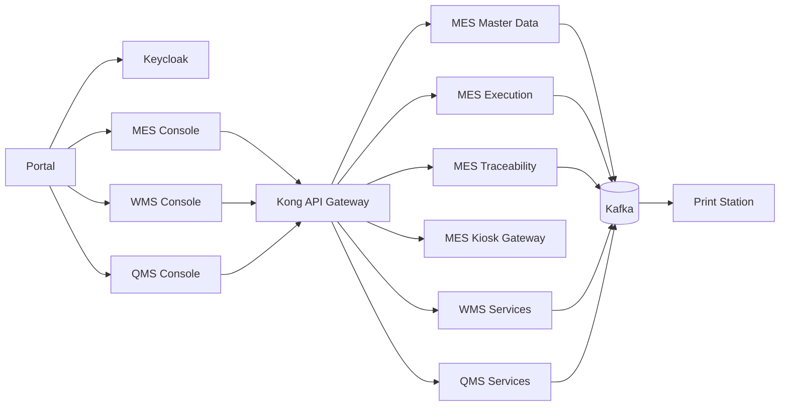

# Project Overview

## Purpose

S-Factory MOM Platform is a Manufacturing Operations Management platform for technical rubber and rubber-metal automotive component production. It combines MES, WMS, QMS, SSO portal, shopfloor kiosk workflows, traceability, and print-station integration.

The current AI authority remains `AI_CONTEXT.md` and `UI_AI_CONTEXT.md`. This library expands those files into onboarding documentation for senior engineers and AI agents. Source code, migrations, service manifests, Docker Compose, and tests are more authoritative than product intent.

## Manufacturing Scope

The MES scope centers on products such as `FG-WS-CM01`, an automotive engine mount. The representative route is:

1. `OP-MIX`: mix rubber and issue mother batch label.
2. `OP-PREP`: prepare metal core and manually scan raw steel.
3. `OP-CUT`: split parent rubber roll/blank into child QR labels.
4. `OP-MOLD`: mold/vulcanize, consume child labels, and issue finished label.
5. `OP-TRIM`: trim, count good quantity, and record scrap.
6. `OP-QC`: inspect quality; pass issues label, fail requires reason and no pass label.

Evidence: `product-doc/product-doc.md`.

## Supported Systems

- Portal: SSO entry point and app chooser.
- MES Console: master data, production configuration, Work Orders, resource planning, execution supervision.
- Kiosk Operator UI: shopfloor operator workflow.
- WMS Console and services: warehouse master data, inventory, inbound, outbound/material staging.
- QMS Console and services: inspection plans/results, NCR, disposition, CAPA.
- Print Station Kiosk and station services: print execution, printer status, template/management surfaces.

## High-Level Architecture

The platform uses independently owned services and databases. Cross-service relationships use IDs, codes, snapshots, events, projections, or APIs. Direct cross-service database reads are forbidden.

## Technology Stack

- Frontend: React, Vite, TypeScript, Tailwind CSS, Radix/shadcn-style primitives, TanStack Query.
- Backend: TypeScript/Node/Express for several services; Go for MES execution, traceability, and kiosk gateway; .NET in the print-station services.
- Data: PostgreSQL per service; Redis where the owning service requires it.
- Integration: Kafka, Schema Registry, transactional outbox, service-local read models.
- Platform: Docker Compose, Kong, Keycloak, OpenTelemetry Collector, Prometheus, Grafana, Loki, Tempo.

## Repository Organization

- `services/`: MES, QMS, kiosk, console services.
- `portal/`: unified app entry point.
- `infra/`: Docker Compose, Kong, Keycloak, schemas, observability.
- `product-doc/`: business/product catalog and ERD intent.
- `docs/`: user, testing, demo, ADR references.
- `process-fix/`, `process-expand/`, `implementation-fix/`: task prompts and implementation records.
- `scripts/`: seed, reset, verification, build, and operational scripts.
- `print-marking/`: print-station and printer-adapter domain.

## Runtime Components

Main Compose files:

- `infra/docker-compose.platform.yml`: Kafka, Schema Registry, Keycloak, Kong, observability.
- `infra/docker-compose.mes.yml`: MES cluster.
- `infra/docker-compose.qms.yml`: QMS cluster.
- `infra/docker-compose.print-station.yml`: station control plane.
- `infra/docker-compose.yml`: integrated local stack entry point.

Unknown: a complete current production deployment topology beyond the Compose and Cloudflare notes requires human/runtime confirmation.

## Source References

- Canonical context: `AI_CONTEXT.md`, `UI_AI_CONTEXT.md`.
- Product overview: `product-doc/product-doc.md`.
- Product catalogs: `product-doc/I-FOUNDATION-MASTER-DATA-CATALOG.md` through `product-doc/VII-ERD-MATRIX-&-DEV-VALIDATION.md`.
- Runtime topology: `infra/docker-compose.platform.yml`, `infra/docker-compose.mes.yml`, `infra/docker-compose.qms.yml`, `infra/docker-compose.print-station.yml`, `infra/docker-compose.yml`.
- Service evidence: `services/*/service.manifest.yaml`.
- Frontend routes: `services/mes-console/src/App.tsx`, `services/qms-console/src/routes.tsx`.

## Implementation Coverage Note

This repository checkout contains local MES and QMS service source, Portal source, Kiosk source, and Print Station source. WMS is described by the canonical context and product docs, but no `services/wms-*` source directories are present in this checkout. Treat WMS implementation details as integration-context facts unless local WMS source is added or provided.
