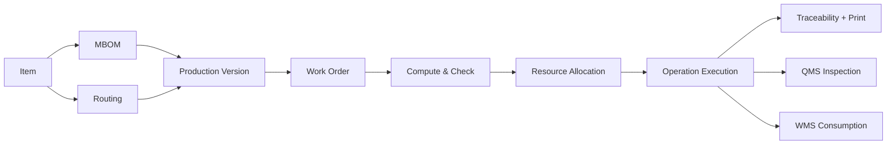

# Business Domain

## Manufacturing Lifecycle

The business manufactures rubber and rubber-metal products. The manufacturing lifecycle starts with released product engineering data, turns it into manufacturing definitions, creates a Work Order, reserves/material-stages inputs, allocates resources, executes operations, records traceability and quality, and completes or rejects output.



## Factory Hierarchy

The factory hierarchy is:

```text
Site
  -> Shopfloor / Production Area
    -> Work Center
      -> Workstation
        -> Machine Requirement Groups
        -> Resource Assignments
Equipment
  -> Machine Units
```

Business rule: Work Center is the logical routing location. Workstation is the execution candidate. Machine Unit is the physical resource. Do not collapse these concepts.

## Product Lifecycle

`md_item` owns the stable product identity. `md_item_revision` owns engineering version, site scope, base UOM, lifecycle, and effectivity. Released revisions are not edited in place when referenced; new versions preserve production history.

SAP owns EBOM when an engineering structure exists. MES currently does not persist, edit, import, or compare EBOM data. MBOM is the manufacturing material structure, Routing is the process structure, and Production Version is the only valid production configuration selected by a Work Order.

## Material Lifecycle

Material starts as item revisions and MBOM component lines. Work Order creation snapshots material requirements. WMS owns stock truth. MES may request staging and consume WMS material status events, but must not compute stock from MES tables.

Operation-specific material readiness matters: an operation with no required material is `NotRequired`; an operation with mandatory material waits for its own staged/approved lines according to the active WMS policy.

## Work Order Lifecycle

The strict lifecycle is:

```text
Draft -> Compute & Check -> Resource Proposal/Commit -> Approved/Released -> InProgress -> Completed
```

Additional states include rejection/cancellation paths where implemented. Work Orders snapshot Production Version, Routing operations, MBOM lines, planning values, material requirements, and resource allocation history. Later master-data edits must not rewrite existing Work Orders.

## Execution Lifecycle

Execution starts an operation session, validates predecessors and committed allocations, records confirmations, consumes material, calls traceability for labels/genealogy when configured, writes outbox events, and advances operation/WO state.

Implemented endpoints include operation start, confirm, abort, and consumption list in `services/mes-execution-service/internal/infrastructure/http/router.go`.

## Inspection Lifecycle

QMS inspection owns plans, characteristics, inspections, result drafts, and recorded results. Failed inspection can publish `QMS.Inspection.InspectionFailed.v1`; QMS nonconformance consumes it to raise NCR. CAPA is managed by QMS nonconformance.

Unknown: every MES-side consequence of QMS failure beyond documented event flow requires source-level confirmation before implementation.

## Warehouse Interaction

WMS is the authority for inventory, lots, reservations, outbound material requests, staging, FEFO, and shortage declaration. MES execution publishes `MES.Execution.MaterialStagingRequested.v1` and consumes `WMS.Outbound.MaterialStaged.v1` / `WMS.Outbound.MaterialShortageDeclared.v1`.

The existing `stage-materials` endpoint is implemented but documented as retryable/manual compatibility, not the final automatic lifecycle.

## Printing Lifecycle

Print jobs are persisted in MES execution tables and sent through Kafka to the Print Station / remote Printer Adapter. The adapter returns printed/failed/status events on Kafka. Projection service and kiosk UI reflect real-time state.

Demo-only: `MES_DEMO_PRINT_ON_APPROVAL=true` can queue demo print jobs during approval. This must never be treated as strict production behavior.
