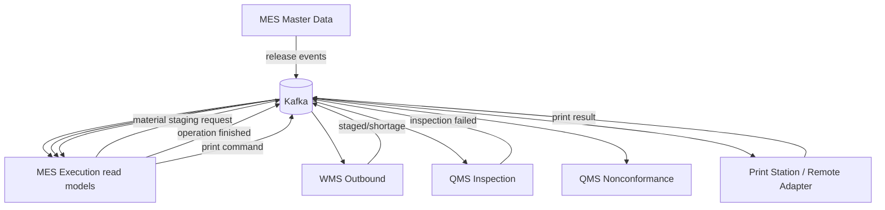

# System Architecture

## Architecture Style

The platform is a modular MOM system split by bounded context. Each service owns its database and publishes or consumes integration events through Kafka. Synchronous HTTP is allowed for explicit validation/readiness contracts but must not replace ownership.

## Bounded Contexts

| Context | Runtime ownership |
|---|---|
| Platform | Keycloak, Kong, Kafka, Schema Registry, observability, Portal |
| MES Master Data | Product, routing, standards, resources, labor, UOM, print-station master data |
| MES Execution | Work Orders, snapshots, resource allocation, execution sessions, confirmations, print jobs |
| MES Traceability | Policies, numbering, split rules, labels, genealogy |
| MES Kiosk Gateway | Terminal login/session/status, WebSocket fan-out |
| WMS | Warehouse, inventory, inbound, outbound/material staging |
| QMS Inspection | Inspection plans, characteristics, results, inspection failure events |
| QMS Nonconformance | NCR, disposition, CAPA, failure-event handling |
| Print Station | Runtime print projection, kiosk, remote adapter integration |

## Ownership Rules

- One service owns one schema/database.
- No service reads another service database.
- Cross-service links use IDs, business codes, snapshots, events, read models, or explicit APIs.
- Work Order snapshots are immutable historical truth after creation.
- Master data release events update execution read models.

## Communication

## Dependencies

Synchronous dependencies found in manifests:

- MES execution to MES master data for approval freshness/permission and resource readiness.
- MES execution to traceability for label issuance during operation confirmation.
- MES kiosk gateway to Keycloak for terminal operator login.
- QMS inspection to MES master data for reference validation.

These calls use circuit breakers where documented in manifests. If a dependency is unavailable, the owning operation should fail safely and remain retryable where possible.

## External Systems

- Keycloak: identity provider.
- Kong: external API gateway.
- Kafka/Schema Registry: asynchronous integration.
- Remote Printer Adapter / physical printer: print execution.
- Cloudflare tunnels: deployment access surface, not source-controlled business configuration.

Unknown: ERP, HR, or PLM integration is not proven in current source and should be documented as future integration until implemented.

## Integration Boundaries

- WMS stock truth must not be duplicated in MES.
- QMS quality decisions must not mutate MES/WMS state unless an explicit consumer exists.
- Print Adapter HTTP APIs are management/diagnostic/manual-test surfaces, not normal production print transport.
- Resource Assignment master data is not the same as Work Order Resource Allocation.
