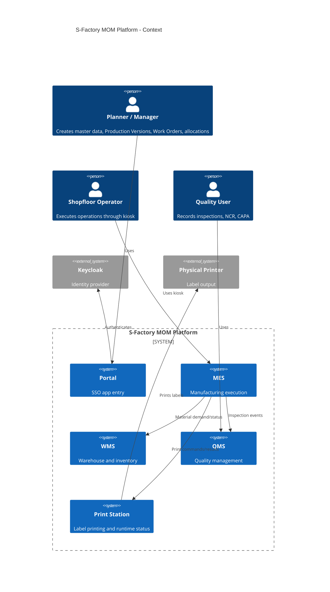
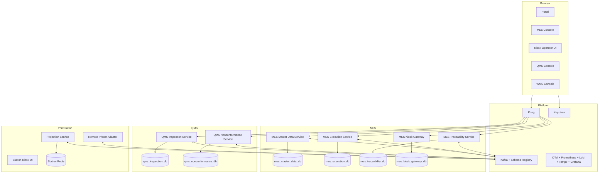
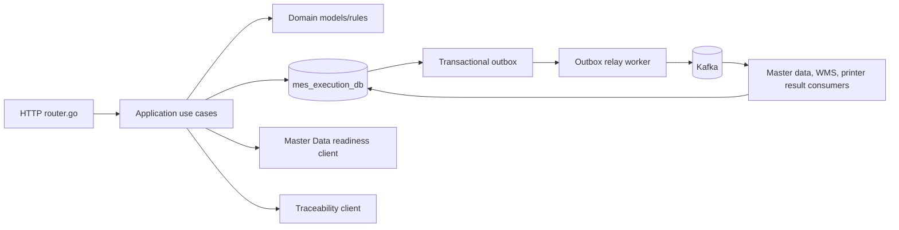
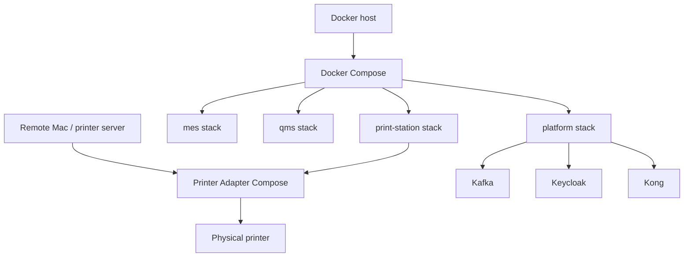

# C4 Architecture

## Context Diagram

## Container Diagram

## Component Diagram - MES Execution

## Deployment Diagram

Status: diagrams are based on current docs, manifests, and Compose files. Runtime production network details require environment confirmation.
