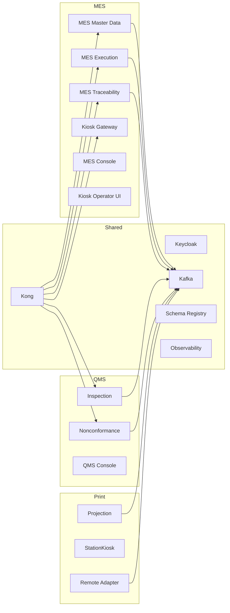

# Deployment Architecture

## Docker Compose

Deployment is Compose-first in this repository. Important files:

- `infra/docker-compose.platform.yml`: shared platform.
- `infra/docker-compose.mes.yml`: MES services and consoles.
- `infra/docker-compose.qms.yml`: QMS services and console.
- `infra/docker-compose.print-station.yml`: print-station control plane.
- `infra/docker-compose.yml`: combined local environment.
- `docker-compose.print-adapter.yml` and related files: printer adapter build/deploy support.

## Infrastructure Components

| Component | Role |
|---|---|
| Kong | API gateway, service path mapping, CORS/auth forwarding |
| Keycloak | Realm `wonsealtech`, browser SSO, portal/client tokens |
| PostgreSQL | Service-owned persistence |
| Kafka KRaft | Event transport |
| Schema Registry | Event schema registry |
| Redis | Print-station or service-specific runtime state where configured |
| OpenTelemetry Collector | Trace/metric/log collection path |
| Prometheus/Grafana/Loki/Tempo | Observability stack |

## Service Topology

## Kong

Kong owns externally exposed API routes. Product docs state WMS and QMS routes enforce bearer-token signature, expiry, client (`azp`), and role checks. MES browser SSO is live, but legacy MES Kong routes still need equivalent bearer-token enforcement before being considered fully protected.

## Keycloak

Keycloak is the single SSO source. Portal uses `portal-client`, MES uses `mes-client`, WMS uses `wms-client`, and QMS uses `qms-client`. Kiosk gateway terminal login uses Keycloak password grant per `services/mes-kiosk-gateway-service/service.manifest.yaml`.

## PostgreSQL

Each service owns its own database. Direct cross-service joins are prohibited. Execution and traceability maintain local read models from events.

## Kafka

Kafka is the active asynchronous integration transport. Meaningful state changes must use outbox where implemented/required.

## SignalR

SignalR is used in the Print Station projection/kiosk services for live station dashboard state. MES Kiosk Gateway uses WebSocket fan-out for terminal updates.

## Print Station

The Print Station control plane is deployed separately from the physical Printer Adapter. The adapter can run on a remote Mac/printer server. Normal production print flow is Kafka command/result, not direct HTTP polling.

## Runtime Unknowns

- Current Cloudflare URLs and remote Mac LAN addresses are runtime state, not durable source configuration.
- Physical printer readiness cannot be proven from repository files alone.
- Production environment sizing, backup, TLS, and secret-management policies require operator confirmation.
