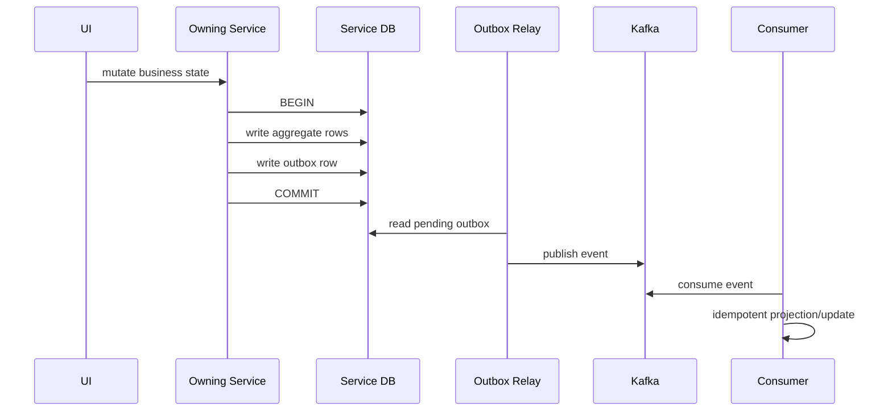
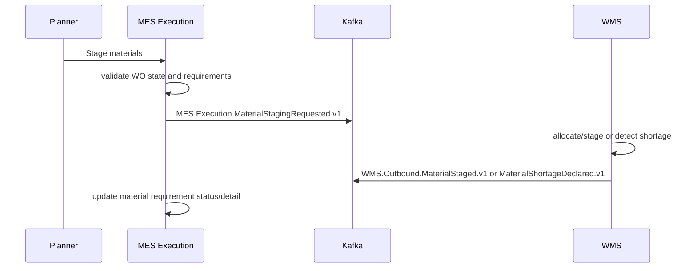
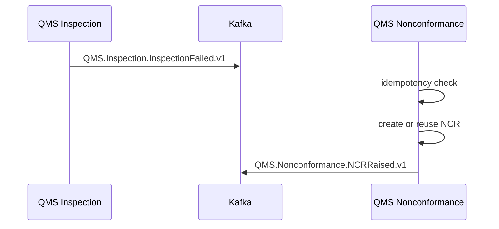

# Event Driven Architecture

## Event Flow

Kafka is the active asynchronous integration transport. Services publish meaningful state changes through transactional outbox where implemented. Consumers update local projections/read models and must tolerate redelivery.

## Outbox Pattern

The outbox pattern stores an event in the same database transaction as the business state change. A relay publishes it to Kafka later. This prevents a business row from committing without the integration event.

## Idempotency

Idempotency exists in multiple places:

- Work Order creation workflow uses user plus idempotency key.
- Resource allocation records idempotency key and request hash.
- Traceability label instance supports idempotency key.
- Printer result consumer inserts print job event by event ID with conflict handling.
- QMS nonconformance handles duplicate inspection failure without a second NCR per product docs.

## Retry

Retryable operations include outbox relay publishing, WMS material staging, resource allocation replay with the same idempotency key, and print result consumption. Synchronous dependency failures should return safe errors such as dependency unavailable rather than partially committing.

## Event Ordering

Ordering is normally by aggregate key/topic partition where configured. Do not assume global event ordering. Consumers must handle late duplicate messages using event ID, business ID, sequence, or idempotency constraints.

## Consumer Responsibilities

- Validate envelope and payload shape.
- Apply only after checking idempotency.
- Persist projection atomically.
- Commit Kafka offset only after safe persistence.
- Treat unknown future fields as compatible unless schema says otherwise.

## Producer Responsibilities

- Publish only implemented facts.
- Include event ID, event type, occurred at, source service, trace/correlation ID, and payload.
- Use stable event names.
- Keep payloads compatible or versioned.

## Failure Recovery

Not implemented / unknown: a full DLQ strategy is not proven from the focused evidence. Before adding DLQ behavior, inspect shared kernels, consumer code, and deployment config.

## Sequence: Work Order to WMS

## Sequence: Inspection Failure to NCR

