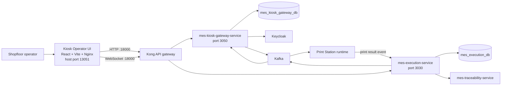
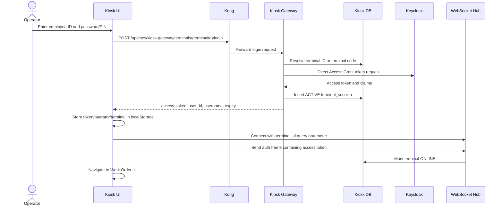
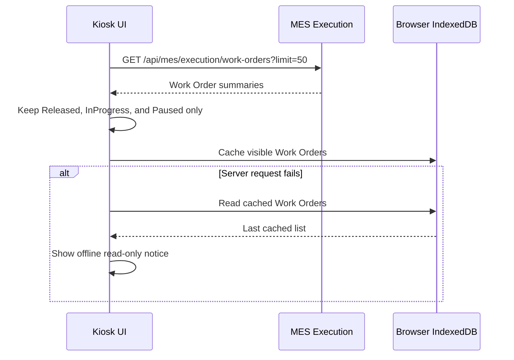
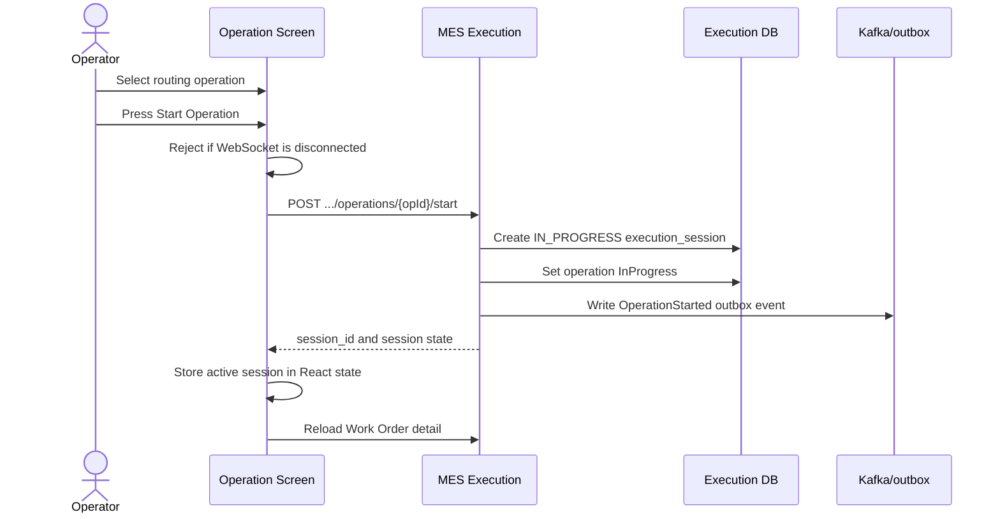
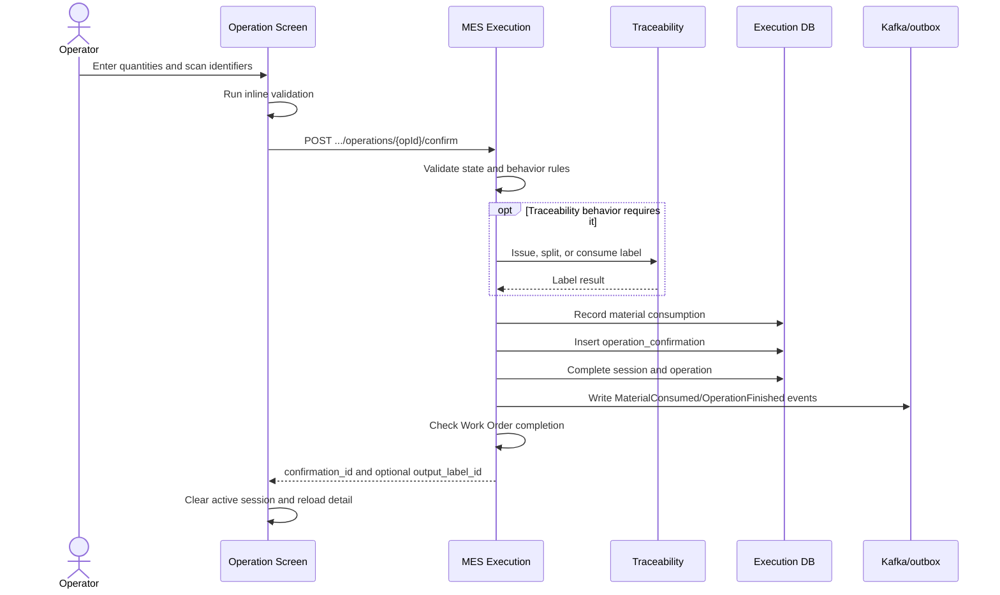
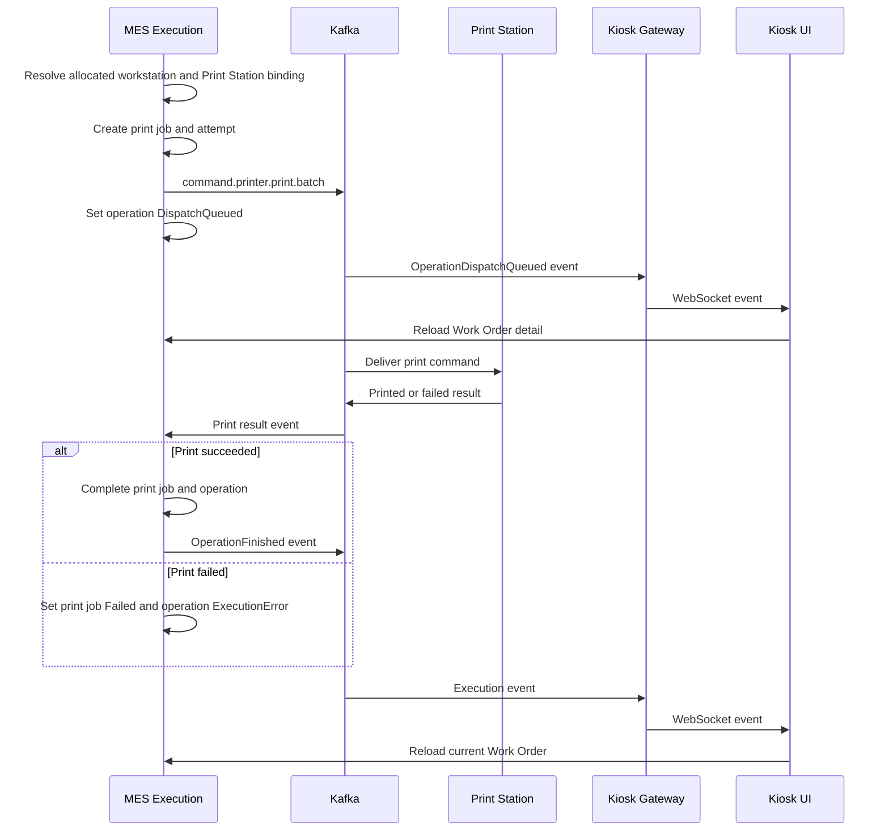

# MOM Platform Kiosk Operator UI Service Flow

Document status: Current implementation reference  
Service image: `mom-platform-kiosk-operator-ui`  
Compose service and container: `kiosk-operator-ui`  
Source: `services/kiosk-operator-ui`  
Last source review: 2026-08-03

## 1. Purpose

`mom-platform-kiosk-operator-ui` is the shopfloor tablet UI used by an operator to:

- authenticate at a registered MES terminal;
- view released or active Work Orders;
- open a Work Order and inspect its routing operations;
- start a manually executed operation;
- scan material or label identifiers;
- report good and scrap quantity;
- confirm or abort an execution session;
- observe automatic Print Station operation status;
- receive execution updates through WebSocket events;
- retain a read-only cached Work Order list during a network interruption.

The UI does not own Work Order, operation, material, traceability, or print state. Those states remain authoritative in MES Execution, MES Traceability, and the Print Station integration.

## 2. Runtime Topology



### Deployed ports

| Component | Container port | Host port | Browser usage |
| --- | ---: | ---: | --- |
| Kiosk Operator UI | `3051` | `13051` | Loads the static React application |
| MES Kiosk Gateway | `3050` | `13050` | Direct health/debug access |
| Kong | `8000` in the platform mapping | `18000` | All UI API and WebSocket traffic |

The UI image is built with Node 20 and served by Nginx. Nginx uses SPA fallback through `try_files`, so browser routes resolve to `index.html`.

## 3. UI Route Flow

| Route | Screen | Responsibility |
| --- | --- | --- |
| `/` | Redirect | Redirects to `/kiosk/KIOSK-DEMO-01/login` |
| `/kiosk/:terminalId/login` | `LoginScreen` | Terminal/operator authentication and WebSocket connection |
| `/kiosk/:terminalId/wo-list` | `WOListScreen` | Active Work Order discovery and cached fallback |
| `/kiosk/:terminalId/wo/:woId` | `OperationScreen` | Routing selection and operation execution |
| Any unknown route | Redirect | Redirects to the demo terminal login |

The current router has no protected-route component. Navigation control is primarily performed by the normal login flow, not by a route-level authentication gate.

## 4. Login and Terminal Session Flow



### Login request

```http
POST /api/mes/kiosk-gateway/terminals/{terminalId}/login
Content-Type: application/json

{
  "employee_id": "operator01",
  "pin": "Operator@123!"
}
```

The gateway first verifies that the terminal exists. It then exchanges the credentials at Keycloak realm `wonsealtech`, client `mes-client`. A successful login creates an `ACTIVE` row in `terminal_session`.

The browser stores:

- `kiosk_access_token`;
- `kiosk_operator_id`;
- `kiosk_terminal_id`.

The access token is currently used to authenticate the WebSocket. MES Execution HTTP commands use identity headers described in section 8.

## 5. WebSocket and Realtime Event Flow

The UI connects to:

```text
ws://{browser-host}:18000/api/mes/kiosk-gateway/ws?terminal_id={terminalId}
```

After the socket opens, the browser sends:

```json
{"type":"auth","token":"<access-token>"}
```

It then sends a heartbeat every 30 seconds:

```json
{"type":"heartbeat"}
```

The gateway replies with `heartbeat_ack`, updates `terminal.last_seen_at`, and marks the terminal `ONLINE`. A connection is closed when no valid frame is received for more than 90 seconds; disconnect also marks the terminal `OFFLINE`.

### Execution event delivery

The gateway consumes these Kafka topics:

- `MES.Execution.OperationStarted.v1`;
- `MES.Execution.OperationDispatchQueued.v1`;
- `MES.Execution.OperationFinished.v1`;
- `MES.Execution.WOCompleted.v1`.

Normal events are routed to terminals assigned to the event's Work Center. Events with `dispatch_mode=DEMO_SHARED_KIOSK` are routed to `KIOSK-DEMO-01` or the configured `DEMO_KIOSK_TERMINAL_CODE`.

When the target terminal is offline, the gateway writes a `PENDING` row to `outbound_message_queue`. After authenticated reconnect, queued events are sent FIFO as `queued_event` frames and marked `DELIVERED`.

The Work Order list refreshes after any received event. The operation screen refreshes for dispatch-queued and operation-finished events.

## 6. Work Order Discovery Flow



Each card shows Work Order code, item code, requested quantity and status. An operator can open only a Work Order in `Released`, `InProgress`, or `Paused` state.

IndexedDB database `mom-kiosk-db` contains stores for `work_orders` and `operations`. The current code writes and reads only `work_orders`; operation detail is not available offline.

## 7. Manual Operation Execution Flow

### Preconditions owned by MES Execution

The start use case validates that:

- the Work Order is in an executable state;
- the selected operation belongs to that Work Order;
- predecessor and operation state permit start;
- execution target and dispatch flow have made the operation available;
- an active duplicate session is not created.

### Start



Start payload:

```json
{"terminal_ref":"KIOSK-DEMO-01"}
```

### Confirm

The operator enters good quantity and scrap quantity, optionally selects a scrap reason, and scans a label or material code where required. Confirmation is pessimistic: the button remains disabled and success is not shown until MES Execution returns success.



Confirmation payload fields are:

- `session_id`;
- `qty_good`;
- `qty_scrap`;
- `reason_code`;
- `scanned_label_id`;
- `scanned_material_code`;
- `idempotency_attempt`.

Backend traceability behavior currently includes label issue at `OP-MIX`, label split at `OP-CUT`, label consume/output at `OP-MOLD`, and PASS label issue at `OP-QC`. Material requirements are recorded as `BACKFLUSH` or `MANUAL_SCAN` consumption.

### Abort

When a React `activeSession` exists, the operator may open a destructive confirmation dialog and call:

```http
POST /api/mes/execution/work-orders/{woId}/operations/{opId}/abort
```

The request carries the session ID. MES Execution changes that execution session to its aborted state without recording production quantity.

## 8. HTTP Identity and Authorization Path

| Request | Current browser identity |
| --- | --- |
| Terminal login | Employee ID and PIN in request body |
| WebSocket auth | Keycloak access token in the first socket frame |
| Work Order list/detail | No browser `Authorization` header |
| Start operation | `X-User-ID` from `kiosk_operator_id` |
| Confirm operation | `X-User-ID` plus static `X-Role-Code: OPERATOR` |
| Abort operation | `X-User-ID` from `kiosk_operator_id` |

Kong currently injects fallback MES identity headers when they are absent. The MES kiosk and execution routes shown in the current Kong configuration do not have the JWT plugin used by the WMS routes. This is an implementation boundary, not a recommended production trust model.

## 9. Automatic Print Station Flow

An operation with `execution_target_type=PRINT_STATION` is not started manually from the kiosk. The operation panel presents automatic print status:

- waiting/ready: automatic Print Station;
- `DispatchQueued`: waiting for Print Station;
- `Finished`: print completed;
- `ExecutionError`: print failed and needs retry through the supported MES flow.



The Print Station adapter and physical printer are separate services. The kiosk observes MES operation status; it does not send a command directly to a printer.

## 10. State Ownership

| State | Owner | Kiosk behavior |
| --- | --- | --- |
| Terminal definition/status | Kiosk Gateway DB | Sends heartbeat and displays connection state |
| Terminal login session | Kiosk Gateway DB | Created during login |
| Access token | Keycloak/browser localStorage | Used for WebSocket auth |
| Work Order and routing | MES Execution | Read and rendered |
| Execution session | MES Execution | Started/confirmed/aborted by API |
| Active session UI reference | React local state | Lost on browser reload |
| Material consumption | MES Execution | Created during confirmation |
| Label genealogy | MES Traceability | Triggered synchronously by confirmation rules |
| Print job/attempt | MES Execution | Observed through operation status |
| Offline event queue | Kiosk Gateway DB | Drained after reconnect |
| Cached WO list | Browser IndexedDB | Read-only fallback |

## 11. Error and Offline Behavior

The UI implements three visible error layers:

1. Inline validation and form errors for start/confirm failures.
2. Route-level error cards for unauthorized, circuit-breaker/503, and generic failures.
3. A global WebSocket disconnect banner.

Consequential actions are disabled when the WebSocket state is `disconnected`. There is no offline command queue: start, confirm, and abort must reach MES Execution online. The only browser-side offline capability is reading the cached Work Order list.

The Traceability call is synchronous during confirmation. If the dependency circuit breaker returns 503, the kiosk shows the service-interruption card and does not report optimistic completion.

## 12. Gateway Persistence Model

`mes_kiosk_gateway_db` contains:

- `terminal`: terminal code, site, Work Center, status and heartbeat time;
- `terminal_session`: operator login/logout session;
- `outbound_message_queue`: pending/delivered realtime messages;
- `schema_migrations`: applied migration tracking.

Seeded terminals include Work Center-specific kiosks and `KIOSK-DEMO-01`. Only one active WebSocket client is retained per terminal ID; a new connection closes the previous connection.

## 13. Current Implementation Limitations

These points describe current source behavior and should be considered before production rollout:

1. There is no route guard. A user can navigate directly to list/detail routes without a local token check.
2. The Keycloak token is not attached to MES Execution REST calls. Identity is supplied through browser-controlled headers, with Kong fallback identities.
3. The gateway validates WebSocket JWT format and expiry using unverified claim parsing; it does not verify token signature, issuer, audience, or Keycloak keys.
4. The UI marks WebSocket state `connected` immediately after socket open, before the gateway confirms auth. The gateway sends no explicit auth acknowledgement.
5. Automatic reconnect is not implemented. `authRef` is retained but unused after disconnect; the operator must login or otherwise reconnect explicitly.
6. UI logout closes only the socket and removes `kiosk_access_token`. It does not call the gateway logout API and does not remove stored operator/terminal IDs, so the server `terminal_session` can remain `ACTIVE`.
7. The active execution session is local React state. Reloading the page loses it; no API call restores an in-progress session.
8. Confirmation falls back to a generated `MOCK-*` session ID when local session state is absent. This does not represent a valid production recovery strategy.
9. Abort currently does not check `response.ok` before showing success.
10. `idempotency_attempt` is based on the current timestamp, so a user retry creates a new key rather than reusing the original attempt key.
11. IndexedDB operation storage exists but is not populated; offline operation execution is intentionally unavailable.
12. Work Order and operation fetches use hardcoded `http://{host}:18000`. Compose `PUBLIC_GATEWAY_URL` and `PUBLIC_WS_URL` are runtime environment values on a static Nginx image and are not consumed by the current bundle.
13. Login defaults are prefilled with demo credentials in source.
14. Full i18n is incomplete. Login keys support vi/en/ja/ko, while most Work Order and operation text remains Vietnamese literals.
15. `qtyGood` defaults to `100` rather than deriving from the Work Order remaining quantity.
16. Some UI validation is hardcoded to legacy operation codes (`OP-QC`, `OP-PREP`) rather than rendered from backend behavior metadata.
17. The Print Station panel suppresses manual Start, but the common confirmation form remains rendered for a Print Station operation. The authoritative print completion remains the printer result consumer, so manual confirmation should not be treated as the normal print path.
18. WebSocket origin checks currently allow every origin and gateway CORS allows `*`.

## 14. Operational Support Checks

### UI availability

```bash
curl -I http://localhost:13051/
```

Expected: HTTP `200` from Nginx.

### Kiosk gateway health

```bash
curl http://localhost:13050/health
```

Expected:

```json
{"service":"mes-kiosk-gateway-service","status":"ok"}
```

### Container status

```bash
docker ps --filter name=kiosk-operator-ui --filter name=mes-kiosk-gateway-service
```

### Gateway logs

```bash
docker logs --since 10m mes-kiosk-gateway-service
```

Useful log categories include bootstrap/database status, WebSocket authentication, terminal timeout, Kafka consumer errors, event relay, offline queue delivery, and demo-kiosk broadcast failures.

### Terminal and queue inspection

```sql
SELECT terminal_code, status, last_seen_at FROM terminal ORDER BY terminal_code;
SELECT terminal_id, operator_user_id, logged_in_at, logged_out_at, status
FROM terminal_session ORDER BY logged_in_at DESC;
SELECT terminal_id, event_type, status, created_at, delivered_at
FROM outbound_message_queue ORDER BY created_at DESC;
```

## 15. Build and Deployment

Build only the UI image:

```bash
docker compose -f infra/docker-compose.platform.yml -f infra/docker-compose.mes.yml build kiosk-operator-ui
```

Recreate it:

```bash
docker compose -f infra/docker-compose.platform.yml -f infra/docker-compose.mes.yml up -d --no-build --force-recreate kiosk-operator-ui
```

Local static build:

```bash
npm --prefix services/kiosk-operator-ui run typecheck
npm --prefix services/kiosk-operator-ui run build
```

The repository-wide MES rebuild script also includes `kiosk-operator-ui`.

## 16. Source Map

| Concern | Source |
| --- | --- |
| Route table and providers | `services/kiosk-operator-ui/src/App.tsx` |
| Login | `services/kiosk-operator-ui/src/routes/LoginScreen.tsx` |
| Work Order list/cache fallback | `services/kiosk-operator-ui/src/routes/WOListScreen.tsx` |
| Start/confirm/abort and print status | `services/kiosk-operator-ui/src/routes/OperationScreen.tsx` |
| WebSocket/heartbeat state | `services/kiosk-operator-ui/src/context/KioskSocketContext.tsx` |
| IndexedDB | `services/kiosk-operator-ui/src/lib/db.ts` |
| Offline/error presentation | `services/kiosk-operator-ui/src/components` |
| Kiosk login API | `services/mes-kiosk-gateway-service/internal/application/auth_service.go` |
| Gateway HTTP routes | `services/mes-kiosk-gateway-service/internal/infrastructure/http/router.go` |
| WebSocket hub and offline queue | `services/mes-kiosk-gateway-service/internal/websocket/hub.go` |
| Kafka-to-WebSocket relay | `services/mes-kiosk-gateway-service/internal/infrastructure/events/execution_consumer.go` |
| Start operation domain flow | `services/mes-execution-service/internal/application/usecase/start_operation.go` |
| Confirm operation domain flow | `services/mes-execution-service/internal/application/usecase/confirm_operation.go` |
| Automatic dispatch | `services/mes-execution-service/internal/application/usecase/dispatch_execution.go` |
| Print result completion | `services/mes-execution-service/internal/infrastructure/events/printer_result_consumer.go` |
| Runtime composition | `infra/docker-compose.mes.yml` |
| Kong route | `infra/kong/kong.yml` |

## 17. End-to-End Flow Summary

The normal current flow is:

1. Open `http://{host}:13051/kiosk/{terminalCode}/login`.
2. Authenticate the operator through Kiosk Gateway and Keycloak.
3. Establish and authenticate the terminal WebSocket.
4. Load active Work Orders from MES Execution.
5. Open a Work Order and select a manual operation.
6. Start an execution session while online.
7. Scan required identifiers and report good/scrap quantity.
8. Confirm pessimistically; MES performs traceability and consumption in the backend transaction flow.
9. Receive execution events through Kafka, Kiosk Gateway, and WebSocket.
10. Let `PRINT_STATION` operations dispatch and complete automatically through the Print Station result flow.
11. Refresh Work Order state after dispatch or completion events.
12. Return to the list for the next operation or Work Order.

During network loss, operators may inspect the cached Work Order list, but all physical or production-changing actions remain disabled until online connectivity is restored.
