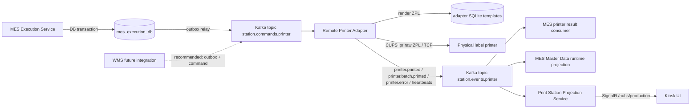
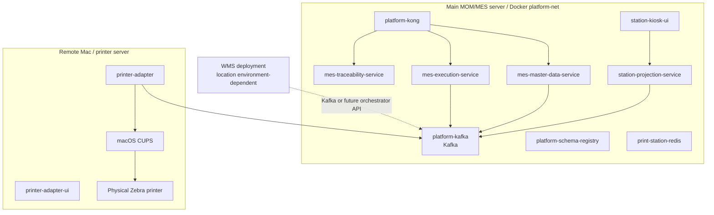
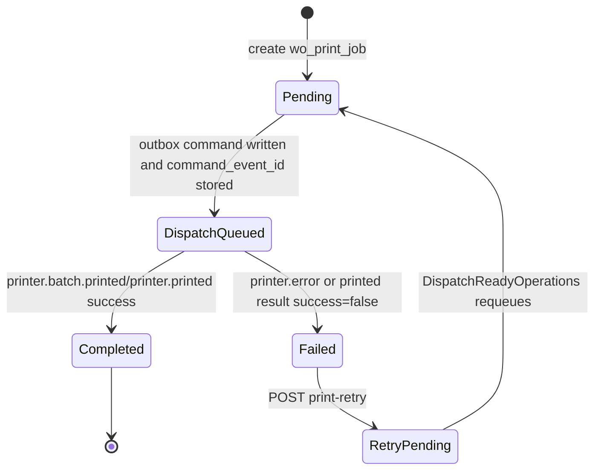
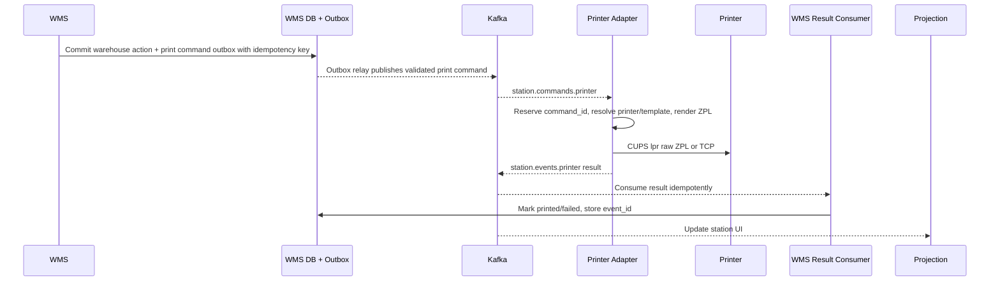
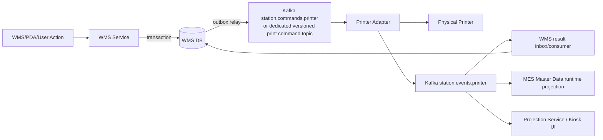

# Print Station Integration for WMS

Canonical technical integration reference for WMS QR-code label printing through the current MES Print Station infrastructure.

Last source review: 2026-08-02.

## 1. Executive Summary

Current status: `PARTIALLY_IMPLEMENTED` for MES-originated warehouse-style QR label printing. MES can create print jobs for Work Order operations, persist attempts/events, publish printer commands through the transactional outbox, and consume printer result events. A remote Printer Adapter consumes commands from Kafka, renders ZPL, prints through CUPS or raw TCP printer drivers, and publishes result/heartbeat/status events. Physical WMS QR label printing is not currently implemented as a WMS-owned production workflow in this repository.

Normal production print-command transport: `Kafka`.

Not the normal production command path: `HTTP`, `SignalR`, or direct WMS-to-printer connection. HTTP APIs are used for management, diagnostics, readiness checks, retry orchestration, template administration, and local/manual test surfaces. SignalR is used for UI updates from the Projection Service to kiosk/browser clients.

WMS integration recommendation: WMS should not call the remote Printer Adapter HTTP `/api/print` endpoint as a production path. WMS should either publish a validated Kafka command compatible with the Print Station command contract or call a future Print Orchestrator/MES-owned print-command API that persists an outbox row and publishes to Kafka. WMS must own its warehouse transaction, idempotency key, and outbox, then consume result events idempotently.

Do not claim WMS QR printing is production-ready until Kafka, adapter, template assignment, physical printer, result consumption, and QR scan validation have been executed in the target environment.

## 2. Current Print Architecture

| Component name | Repository path | Runtime/deployment name | Responsibility | Inputs | Outputs | Network protocol | Database ownership | Current status | WMS relevance |
|---|---|---|---|---|---|---|---|---|---|
| MES Execution Service | `services/mes-execution-service` | `mes-execution-service` | Owns WO execution print jobs, attempts, retry state, and printer result application. | HTTP execution APIs, PostgreSQL, Kafka `station.events.printer`, Master Data readiness HTTP. | Transactional outbox rows for `command.printer.print.batch`, `MES.Execution.OperationFinished.v1`; WO/operation/print state. | HTTP, PostgreSQL, Kafka. | `mes_execution_db`: `wo_print_job`, `wo_print_job_attempt`, `wo_print_job_event`, `outbox_events`. | `IMPLEMENTED_AND_VERIFIED` by source inspection; physical print not executed here. | Reference implementation for durable print command creation and result handling. |
| MES Master Data Service | `services/mes-master-data-service` | `mes-master-data-service` | Owns print-station master data, workstation binding, runtime projection from printer events. | HTTP master-data APIs, Kafka `station.events.printer`. | Readiness and runtime APIs; `md_print_station_runtime_projection`. | HTTP, PostgreSQL, Kafka. | `mes_master_data_db`: `md_print_station`, `md_workstation_print_station_binding`, runtime event/projection tables. | `IMPLEMENTED_AND_VERIFIED` by source inspection. | WMS should use the same selection/readiness concept, not duplicate station ownership. |
| MES Traceability Service | `services/mes-traceability-service` | `mes-traceability-service` | Owns traceability labels, policies, genealogy, and label-template references. | HTTP traceability APIs, PostgreSQL, Master Data events. | Traceability label records and traceability events. | HTTP, PostgreSQL, Kafka outbox. | `mes_traceability_db`: `md_label_template`, `md_traceability_policy`, `label_instance`, `genealogy_event`. | `IMPLEMENTED_NOT_FULLY_VERIFIED` for WMS print use; QR print template bridge to adapter is not proven. | Potential source of QR/label identity, but not a WMS print-command endpoint. |
| Print Station Projection Service | `print-marking/station-agent/services/projection-service` | `station-projection-service` | Builds station read models, printer dashboard, device/runtime projections, and pushes SignalR updates. | Kafka topics mapped from routing keys; adapter management request/reply over Kafka; SQLite. | REST projection APIs, SignalR hub `/hubs/production`, local projection DB. | HTTP, Kafka, SignalR, SQLite. | SQLite `projection.db`. | `IMPLEMENTED_AND_VERIFIED` by source inspection. | WMS can use it for station/operator visibility, not for owning print commands. |
| Print Station Kiosk UI | `print-marking/station-agent/services/kiosk-ui` | `station-kiosk-ui` | Browser UI for station monitoring and printer/template management via Projection Service. | Projection REST APIs, SignalR. | Operator UI. | HTTP, SignalR. | SQLite `kiosk.db`; mainly UI-side service storage. | `IMPLEMENTED_NOT_FULLY_VERIFIED`. | Useful for operators; not a WMS system integration boundary. |
| Remote Printer Adapter | `print-marking/station-agent/services/printer-adapter` | `printer-adapter` | Consumes production printer commands, renders ZPL labels, sends to printer, publishes printed/error/heartbeat/status events. | Kafka `station.commands.printer`; local SQLite templates/printers; CUPS/TCP printer. | Kafka `station.events.printer`; management HTTP; SQLite print history. | Kafka, HTTP, CUPS/lpr, TCP 9100 where configured. | SQLite `printer.db`: printers, templates, assignments, command executions, print history. | `IMPLEMENTED_AND_VERIFIED` by source inspection; physical hardware execution remains runtime verification. | The physical print executor. WMS should not bypass Kafka to call it for production. |
| Physical printer | Outside repository | Example runtime queue in compose: `Zebra_Technologies_ZTC_GK420t` | Produces physical labels. | ZPL via CUPS `lpr -P <queue> -o raw` or raw TCP. | Printed labels, printer state. | CUPS/IPP, lpr, TCP. | None in MES. | `UNKNOWN_REQUIRES_RUNTIME_CONFIRMATION`. | Must be validated with target QR template and scan. |
| Kafka | `infra/docker-compose.platform.yml` | `platform-kafka` / hostname `kafka` | Production async print transport and platform event bus. | Outbox relay and adapter/projection publishers. | Topics consumed by adapter/MES/projection. | Kafka plaintext in current compose. | Kafka volume `kafka-data`. | `IMPLEMENTED_AND_VERIFIED` by source inspection. | WMS should integrate through Kafka or a service outbox that publishes to Kafka. |
| Schema Registry | `infra/docker-compose.platform.yml`, `infra/schemas` | `platform-schema-registry` | Registry for selected platform schemas. | Registered schemas under `infra/schemas`. | Schema subjects. | HTTP. | Schema Registry internal Kafka topic. | `PARTIALLY_IMPLEMENTED`. | No print-command/result JSON schema was found under `infra/schemas`; WMS contracts require formalization. |
| Redis | `infra/docker-compose.print-station.yml` | `print-station-redis` | Print Station/Kiosk cache, locks, idempotency support where used by station services. | Station services. | Cache/lock state. | Redis. | Redis volume. | `IMPLEMENTED_NOT_FULLY_VERIFIED`. | WMS should not share this Redis. |
| Kong | `infra/kong/kong.yml` | `platform-kong` | API gateway for MES/WMS/QMS HTTP APIs. | HTTP client traffic, JWTs. | Routed HTTP requests with `X-User-ID`, `X-Role-Code`, `X-Trace-ID`. | HTTP. | None. | `IMPLEMENTED_AND_VERIFIED` by source inspection. | Useful for MES readiness/query APIs; not Kafka print transport. |
| Keycloak | `infra/docker-compose.platform.yml`, `infra/keycloak/realm-export.json` | `platform-keycloak` | IAM/SSO. | Tokens. | JWTs. | HTTP/OIDC. | Keycloak volume. | `IMPLEMENTED_NOT_FULLY_VERIFIED`. | WMS HTTP calls through Kong require WMS-compatible tokens. Kafka auth is not enforced in current compose. |



## 3. Deployment Topology

| Deployment file | Components owned | Notes |
|---|---|---|
| `infra/docker-compose.platform.yml` | Kafka, Schema Registry, Keycloak, Kong, observability. | `platform-net` Docker network; Kafka internal listener `kafka:29092`, external listener configured by `KAFKA_EXTERNAL_HOST` and `KAFKA_EXTERNAL_PORT`, host port mapping `19092:9092`. |
| `infra/docker-compose.mes.yml` | MES Master Data, Execution, Traceability, Kiosk Gateway, MES DBs. | MES services use `KAFKA_BROKERS=kafka:29092`; Execution uses `MASTER_DATA_SERVICE_URL=http://mes-master-data-service:3020`. |
| `infra/docker-compose.print-station.yml` | Print Station Redis, Projection Service, Kiosk UI. | Explicitly excludes the physical Printer Adapter. Kiosk/projection use Kafka and do not depend on `PRINTER_ADAPTER_URL`. |
| `docker-compose.print-adapter.yml` | Remote Printer Adapter and Printer Adapter UI. | Intended for the printer/Mac host. Current file contains environment-specific addresses; treat as deployment configuration, not universal contract. |
| `docker-compose.print-adapter.local-amd64.yml` | Local AMD64 override for adapter image and `platform-net`. | Local verification/runtime override only. |
| `print-marking/station-agent/docker-compose*.yml` | Historical/full station-agent stacks. | Inspect before use; current MES integration uses the canonical files above. |



Cloudflare tunnel or external access is mentioned in existing documentation, but no canonical current Cloudflare URL is established by source. Use `UNKNOWN_REQUIRES_RUNTIME_CONFIRMATION` and retrieve it from runtime/deployment ownership if needed.

## 4. Network Connectivity Matrix

| Source | Destination | Protocol | Host/IP source | Port | TLS | Authentication | Purpose | Required for production | Current value source |
|---|---|---|---|---:|---|---|---|---|---|
| MES Execution | Kafka | Kafka | `KAFKA_BROKERS` | env-dependent | No in current compose | None in current compose | Publish outbox events and commands; consume WMS/material/printer events. | Yes | `infra/docker-compose.mes.yml` |
| MES Master Data | Kafka | Kafka | `KAFKA_BROKERS` | env-dependent | No in current compose | None in current compose | Consume printer runtime events. | Yes for readiness projection | `infra/docker-compose.mes.yml` |
| Projection Service | Kafka | Kafka | `Kafka__BootstrapServers` | env-dependent | No in current compose | None in current compose | Consume commands/results/runtime and publish management requests. | Yes for station UI | `infra/docker-compose.print-station.yml` |
| Kiosk UI service | Projection Service | HTTP | `PROJECTION_SERVICE_URL` | 5009 in compose | No in compose | Not evident in source | Query station projections. | Yes for UI | `infra/docker-compose.print-station.yml` |
| Browser/Kiosk | Projection Service | SignalR | station-projection-service URL | 5009 in compose | Environment-dependent | Not evident in source | Real-time UI updates. | No for print execution; yes for UI | `Program.cs` maps `/hubs/production` |
| Remote Printer Adapter | Kafka | Kafka | `KAFKA_BOOTSTRAP_SERVERS` | env-dependent | No in current compose (`Plaintext`) | Optional SASL env supported; unset in compose | Consume print commands; publish results and heartbeats. | Yes | `docker-compose.print-adapter.yml`, adapter `Program.cs` |
| Printer Adapter | CUPS | CUPS/IPP/lpr | `CUPS_SERVER`, `CUPS_HEALTH_HOST`, `CUPS_QUEUE` | 631 for CUPS | Runtime-dependent | `CUPS_USER` configured | Print raw ZPL through CUPS and check hardware state. | Yes for CUPS printers | `docker-compose.print-adapter.yml`, `CupsPrinterDriver.cs` |
| Printer Adapter | Physical TCP printer | TCP | `PRINTER_HOST`, `PRINTER_PORT` or seeded DB | default 9100 if unset | No | None in source | Raw TCP print path where configured. | Only for TCP printers | adapter `Program.cs`, `.env.example` |
| Printer Adapter UI | Kafka | Kafka | `KAFKA_BOOTSTRAP_SERVERS` | env-dependent | No in current compose | Optional SASL env supported | Monitoring/management request-reply. | No for print execution | `docker-compose.print-adapter.yml` |
| MES/Kong clients | Kong | HTTP | platform host | 18000 host mapped to 8000 | No in compose | JWT/pre-function per route | MES/WMS/QMS HTTP APIs. | Yes for HTTP access | `infra/docker-compose.platform.yml`, `infra/kong/kong.yml` |
| Kong | MES Execution | HTTP | `mes-execution-service` | 3030 container | No | Internal headers | Execution APIs. | Yes for HTTP APIs | `infra/kong/kong.yml` |
| Kong | MES Master Data | HTTP | `mes-master-data-service` | 3020 container | No | Internal headers | Master-data/readiness APIs. | Yes for HTTP APIs | `infra/kong/kong.yml` |
| Kong | MES Traceability | HTTP | `mes-traceability-service` | 3040 container | No | Internal headers | Traceability APIs. | As needed | `infra/kong/kong.yml` |
| Platform services | Schema Registry | HTTP | `schema-registry` / host mapped `18081` | 8081 container | No | None in compose | Event schema registry. | Recommended; not complete for print topics | `infra/docker-compose.platform.yml` |
| Print Station services | Redis | Redis | `REDIS_CONNECTION_STRING` | 6379 | No | Password in compose | Cache/locks/state. | Yes for Kiosk service as deployed | `infra/docker-compose.print-station.yml` |
| MES services | PostgreSQL | PostgreSQL | `DATABASE_URL` | 5432 container, host mapped 15434-15436 | No in compose | DB credentials from env/compose | Service-owned data. | Yes | `infra/docker-compose.mes.yml` |

Host/IP rules:

| Runtime value | Configuration key | Example placeholder | Safe to share | Owner | Runtime discovery |
|---|---|---|---|---|---|
| Kafka internal broker | `KAFKA_BROKERS`, `Kafka__BootstrapServers` | `kafka:29092` | Yes if internal-only | Platform/MES ops | `docker compose -f infra/docker-compose.platform.yml config | rg KAFKA_ADVERTISED_LISTENERS` |
| Kafka external broker | `KAFKA_EXTERNAL_HOST`, `KAFKA_EXTERNAL_PORT`, adapter `KAFKA_BOOTSTRAP_SERVERS` | `<KAFKA_HOST>:<KAFKA_EXTERNAL_PORT>` | Usually no if private network | Platform ops | `docker inspect platform-kafka` and env files |
| Adapter CUPS host | `CUPS_HEALTH_HOST`, `CUPS_SERVER` | `<MAC_LAN_IP>:631` | No when LAN address is sensitive | Print Station/IT | On Mac: `ipconfig getifaddr en0`; in container: adapter env |
| CUPS queue | `CUPS_QUEUE` | `<CUPS_QUEUE_NAME>` | Usually yes | Print Station/IT | On Mac: `lpstat -p -d` |
| Projection URL | `PROJECTION_SERVICE_URL` | `http://station-projection-service:5009` | Environment-dependent | Print Station ops | `docker compose ... config` |
| Gateway/external URL | `gateway_base_url` in `md_print_station` | `<PRINT_STATION_GATEWAY_URL>` | Environment-dependent | MES Master Data owner | `GET /api/mes/master-data/print-stations/{id}` |

## 5. Kafka Configuration

`IMPLEMENTED_AND_VERIFIED` by source inspection:

| Runtime | Configuration source | Key settings |
|---|---|---|
| Platform Kafka | `infra/docker-compose.platform.yml` | KRaft mode, internal listener `INTERNAL://kafka:29092`, external listener from `KAFKA_EXTERNAL_HOST`/`KAFKA_EXTERNAL_PORT`, host port `19092:9092`, auto-create topics enabled, plaintext. |
| MES services | `infra/docker-compose.mes.yml` | `KAFKA_BROKERS=kafka:29092`, `SCHEMA_REGISTRY_URL=http://schema-registry:8081`. |
| Print Station Projection/Kiosk | `infra/docker-compose.print-station.yml` | `Kafka__BootstrapServers=kafka:29092`, station-specific client IDs, idempotence enabled. |
| Remote Printer Adapter | `docker-compose.print-adapter.yml`, adapter `Program.cs` | `KAFKA_BOOTSTRAP_SERVERS`, `KAFKA_CLIENT_ID`, `KAFKA_SECURITY_PROTOCOL`, optional SASL env vars, `PRINT_STATION_ID`, `PRINTER_ADAPTER_ID`. |

Security note: current compose uses plaintext Kafka. The adapter code supports SASL-related environment variables, but TLS/SASL production configuration is not demonstrated in these compose files. Classify secure cross-network Kafka as `REQUIRES_PRODUCT_DECISION`.

## 6. Kafka Topic Inventory

| Topic | Routing/event header | Producer | Consumer | Classification | Notes |
|---|---|---|---|---|---|
| `station.commands.printer` | `command.printer.print`, `command.printer.print.batch`, `command.printer.#` | MES outbox relay; Projection/management clients for management commands | Printer Adapter, Projection Service | `IMPLEMENTED_AND_VERIFIED` | Shared physical topic for printer commands. MES logical outbox topics are mapped in `libs/shared-kernel-go/outbox.go`. |
| `station.events.printer` | `printer.printed`, `printer.batch.printed`, `printer.error`, `printer.heartbeat`, `printer.status.changed` | Printer Adapter | MES Execution, MES Master Data runtime consumer, Projection Service | `IMPLEMENTED_AND_VERIFIED` | Result, error, heartbeat, and runtime state topic. |
| `station.dlq` | `<routing>.failed` | Station Kafka consumer | Operators/diagnostics | `PARTIALLY_IMPLEMENTED` | Station consumer publishes failed messages to DLQ; no documented operational process found. |
| MES execution topics | `MES.Execution.*` | MES Execution outbox relay | Projection, MES services, WMS material flows | `IMPLEMENTED_NOT_FULLY_VERIFIED` | Not a printer command topic except command logical events. |
| Schema subjects for print topics | Unknown | None found under `infra/schemas` | None confirmed | `NOT_IMPLEMENTED` | Formal JSON schemas for print commands/results should be added before WMS treats contracts as stable. |

## 7. Event Envelope and Payload Contracts

MES Go outbox envelope:

```json
{
  "event_id": "<uuid>",
  "event_type": "command.printer.print.batch",
  "occurred_at": "<RFC3339 timestamp>",
  "source_service": "mes-execution-service",
  "trace_id": "<trace/correlation>",
  "payload": {}
}
```

Station .NET Kafka envelope created by `KafkaPublisher`:

```json
{
  "EventId": "<id>",
  "EventType": "<routing key>",
  "EventVersion": 1,
  "OccurredAt": "<timestamp>",
  "Source": "<client id>",
  "CorrelationId": "<event id>",
  "CausationId": null,
  "StationId": "<print station id>",
  "WorkstationId": "<optional>",
  "PartitionKey": "<print station or workstation>",
  "Payload": {}
}
```

MES batch print command payload currently produced by `dispatch_execution.go` (`IMPLEMENTED_NOT_FULLY_VERIFIED` as public contract):

| Field | Source behavior |
|---|---|
| `event_type` | `command.printer.print.batch` |
| `event_id` | UUID command ID; stored as `wo_print_job.command_event_id`. |
| `job_id` / `printJobId` | MES `wo_print_job.print_job_id`. |
| `job_no` / `production_order_no` | Work Order code. |
| `job_type` | `MES_WO_PRINT`. |
| `product_code` | Work Order item code. |
| `payload_json` | JSON string with `workOrderId`, `woOperationId`, `quantity`, `itemName`. |
| `dispatch_target` | `production-printer`. |
| `target_printer` | `null` for production-printer selection. |
| `printStationId` | Print station code returned by Master Data readiness. |
| `adapterId` | `MES_DEMO_PRINT_ADAPTER_ID` or default `PRINT-ADAPTER-01`. |
| `operationCode`, `quantity`, `requested_quantity` | Operation/work order data. |
| `units_per_label`, `label_quantity_method`, `label_count`, `copies_per_label`, `print_copies`, `total_copies` | Label quantity calculation outputs. |
| `label_items` | Array with `job_id`, `product_serial`, `sequence`. |
| `batch_size` | Currently `100`. |
| `correlationId` | Request trace ID. |

Adapter result events:

| Event routing key | Required/observed payload fields | Consumer behavior |
|---|---|---|
| `printer.batch.printed` | `event_id`, `job_id` or `command_id`, `printer_code`, `success`, `error_message`, counts/IDs where produced by adapter | MES marks job/attempt complete or failed; Projection updates dashboard. |
| `printer.printed` | `event_id`, `job_id`, `job_no`, `printer_code`, `success`, `error_message`, `timestamp` | Used for single-label result and progress. |
| `printer.error` | `event_id`, `printer_id`, `printer_code`, `adapter_id`, `error_message`, `timestamp` | Runtime/error projection. |
| `printer.heartbeat` | `event_id`, `printer_id`, `printer_code`, `adapter_id`, `status`, `timestamp`, `details` | Runtime projection/readiness. |
| `printer.status.changed` | Same as heartbeat plus `previous_status` | Runtime projection/readiness. |

WMS contract warning: a WMS-owned QR label command contract is `NOT_IMPLEMENTED`. Do not copy the MES `MES_WO_PRINT` payload as a stable public WMS API without a product decision and schema registration.

## 8. MES Print Job Lifecycle



Implemented lifecycle:

| Step | Classification | Evidence |
|---|---|---|
| Create print job atomically with outbox command | `IMPLEMENTED_AND_VERIFIED` | `dispatch_execution.go`, `wo_print_job`, `outbox_events`. |
| Map logical command topic to Kafka `station.commands.printer` | `IMPLEMENTED_AND_VERIFIED` | `libs/shared-kernel-go/outbox.go`. |
| Adapter command dedup before physical print | `IMPLEMENTED_AND_VERIFIED` | `printer_command_executions.command_id UNIQUE`, `BatchPrintService`. |
| Apply printer result idempotently | `IMPLEMENTED_AND_VERIFIED` | `wo_print_job_event.event_id PRIMARY KEY`, consumer `ON CONFLICT DO NOTHING`. |
| Physical label printed and QR scanned | `UNKNOWN_REQUIRES_RUNTIME_CONFIRMATION` | Requires target runtime/hardware execution. |

## 9. Template Management

Adapter template management is `IMPLEMENTED_AND_VERIFIED` by source inspection and `MANAGEMENT_ONLY` for HTTP use:

| Capability | HTTP endpoint family | Data owner |
|---|---|---|
| List/create/update/delete templates | `/api/label-templates`, `/api/label-templates/{id}` | Printer Adapter SQLite `label_templates`. |
| Publish/archive/default/duplicate/version | `/api/label-templates/{id}/publish`, `/archive`, `/set-default`, `/duplicate`, `/versions` | Printer Adapter. |
| Import/export/preview/render | `/api/label-templates/import`, `/export`, `/preview`, `/render`, `/render-with-data` | Printer Adapter. |
| Assign template to printer | `/api/printer-template-assignments` | Printer Adapter SQLite `printer_template_assignments`. |
| Print a template test | `/api/label-templates/{id}/print-test` | Diagnostic/manual test path. |

MES Traceability has `md_label_template` and traceability policies. No verified production bridge was found that automatically synchronizes traceability templates into the Printer Adapter template store. Classify cross-service template governance as `REQUIRES_PRODUCT_DECISION`.

## 10. QR-Code Data Contract for WMS

Current WMS QR print data contract: `NOT_IMPLEMENTED`.

Recommended minimum WMS QR label payload (`REQUIRES_PRODUCT_DECISION`):

| Field | Required | Owner | Notes |
|---|---|---|---|
| `label_id` | Yes | WMS or Traceability | Stable identity scanned later. |
| `label_code` | Yes | WMS or Traceability | Human/QR code value. |
| `warehouse_task_id` | Recommended | WMS | Receiving, putaway, movement, picking, shipment, or inventory task. |
| `item_code` | Yes | WMS/master data | Avoid using free text as identity. |
| `lot_or_serial_no` | Depends on item | WMS/Traceability | Match warehouse traceability policy. |
| `quantity` and `uom` | Depends on label type | WMS | Use canonical UOM codes. |
| `site_id`, `warehouse_id`, `location_code` | Depends on use case | WMS | Needed for warehouse labels. |
| `print_station_code` | Yes if WMS selects station | MES Master Data/Print Station | Should be validated through readiness. |
| `printer_code` | Optional | Print Station | Prefer station-managed selection unless product requires explicit printer. |
| `template_code` or `template_id` | Yes | Product/Print Station | Must exist in adapter or orchestration layer. |
| `idempotency_key` | Yes | WMS | One key per business print command/reprint. |

QR contents should be versioned, for example `WMSQR:v1:<label_code>` or a JSON object encoded according to scanner constraints. The exact QR payload is `REQUIRES_PRODUCT_DECISION`.

## 11. Recommended WMS Integration Model

| Option | Model | Status | Recommendation |
|---|---|---|---|
| A | WMS writes to its DB + outbox, publishes Kafka command to `station.commands.printer`. | `REQUIRES_PRODUCT_DECISION` | Preferred if WMS team can own Kafka contract, schemas, idempotency, and result consumer. |
| B | WMS calls a future Print Orchestrator API; Orchestrator persists command/outbox and publishes Kafka. | `NOT_IMPLEMENTED` | Preferred if one service should own public print contracts and validation. |
| C | WMS calls MES Execution print APIs. | `PARTIALLY_IMPLEMENTED` | Not recommended for generic warehouse labels; current APIs are WO-operation scoped. |
| D | WMS calls Printer Adapter HTTP `/api/print`. | `DIAGNOSTIC_ONLY` / `MANAGEMENT_ONLY` | Do not use for production; bypasses durable outbox/result ownership. |

## 12. Proposed WMS Print Flow



Recommended WMS use cases:

| Use case | Recommended behavior | Current implementation |
|---|---|---|
| Receiving pallet/carton label | WMS owns receiving transaction and QR identity; print through outbox/Kafka. | `NOT_IMPLEMENTED`. |
| Putaway/location label | WMS owns location/task label data. | `NOT_IMPLEMENTED`. |
| Picking/shipping label | WMS owns shipment/task data and reprint authorization. | `NOT_IMPLEMENTED`. |
| Inventory/cycle-count label | WMS owns count/session label. | `NOT_IMPLEMENTED`. |
| Reprint | WMS issues a new command with explicit `reprint_of` and new idempotency key or replays same key only for duplicate request. | `REQUIRES_PRODUCT_DECISION`. |

## 13. Printer and Station Selection

Current MES station selection is workstation-based:

1. MES operation has or resolves a `workstation_id`.
2. MES calls Master Data `/api/mes/master-data/workstations/{workstationId}/print-station-readiness`.
3. Master Data checks binding, lifecycle, runtime status, Kafka status, and ready printer count.
4. MES command payload uses the returned print station code.
5. Adapter selects a CUPS printer for `dispatch_target=production-printer`, or a requested target printer for non-production target logic.

WMS guidance:

| Decision | Recommendation |
|---|---|
| Station selection | WMS should select by warehouse/site/work area using a product-approved mapping, then validate readiness. Existing workstation binding can be reused only if WMS tasks are mapped to MES workstations. |
| Printer selection | Prefer station-managed printer selection. Explicit `printer_code` should require readiness/activation validation. |
| Ownership | MES Master Data owns print station and workstation binding. The Printer Adapter owns actual printer activation/template assignment. WMS must not maintain a competing printer owner table. |

## 14. HTTP APIs Inventory

Production print command path: Kafka, not HTTP.

| Service | API | Classification | WMS usage |
|---|---|---|---|
| MES Execution | `POST /api/mes/execution/work-orders/{id}/start-execution` | `IMPLEMENTED_AND_VERIFIED` | MES WO flow only. |
| MES Execution | `POST /api/mes/execution/work-orders/{id}/operations/{opId}/print-retry` | `IMPLEMENTED_AND_VERIFIED` | MES failed WO print retry only. |
| MES Execution | `GET /api/mes/execution/work-orders/{id}` | `IMPLEMENTED_AND_VERIFIED` | Read MES print job status for MES WOs. |
| MES Master Data | `GET/POST/PATCH/DELETE /api/mes/master-data/print-stations...` | `MANAGEMENT_ONLY` | Manage station master data. |
| MES Master Data | `GET /api/mes/master-data/print-stations/{id}/runtime` | `MANAGEMENT_ONLY` | Read runtime projection. |
| MES Master Data | `GET /api/mes/master-data/workstations/{workstationId}/print-station-readiness` | `IMPLEMENTED_AND_VERIFIED` | Readiness validation if WMS maps workstations. |
| MES Master Data | `POST/PATCH/DELETE /api/mes/master-data/workstations/{id}/print-station-bindings` | `MANAGEMENT_ONLY` | Configure station binding. |
| MES Traceability | `POST /api/mes/traceability/labels/issue`, `/split`, `/consume` | `IMPLEMENTED_NOT_FULLY_VERIFIED` | Label identity/genealogy, not direct printing. |
| Projection Service | `/api/projection/*` | `MANAGEMENT_ONLY` / `DIAGNOSTIC_ONLY` | Station dashboards and management proxy. |
| Projection Service | `/api/projection/printers/{code}/activate|deactivate` | `MANAGEMENT_ONLY` | Operator/admin only. |
| Printer Adapter | `/api/printers/*`, `/api/label-templates/*`, `/api/printer-template-assignments/*` | `MANAGEMENT_ONLY` | Admin/template/printer setup. |
| Printer Adapter | `POST /api/print`, `/api/label-templates/{id}/print-test` | `DIAGNOSTIC_ONLY` | Manual test only, not WMS production. |
| Health endpoints | `/health`, `/api/health`, `/metrics` | `DIAGNOSTIC_ONLY` | Ops monitoring. |

Kong exposes MES routes under `/api/mes/master-data`, `/api/mes/execution`, and `/api/mes/traceability`; WMS HTTP routes are also configured but no WMS print route exists.

## 15. SignalR/UI

Projection Service maps SignalR hub `/hubs/production`. The hub supports station group subscription through `SubscribeToStation(stationId)` and `UnsubscribeFromStation(stationId)`.

Classification: `IMPLEMENTED_AND_VERIFIED` for UI updates by source inspection, `NOT_IMPLEMENTED` as a WMS command interface.

SignalR should not be used by WMS to send print commands. It is a browser/UI notification channel.

## 16. Security/Access Control

| Area | Current source status | Required WMS posture |
|---|---|---|
| Kong HTTP | JWT and pre-function header injection configured. WMS routes require `azp=wms-client` and WMS-compatible roles. MES routes inject defaults when headers are missing in current config. | Use real OIDC roles and avoid relying on dev defaults. |
| Kafka | Plaintext in compose; adapter code supports SASL env vars. | Production WMS print must use approved network path, TLS/SASL/ACLs if required. |
| Adapter HTTP | No production auth evident in source for adapter management endpoints. | Do not expose broadly; restrict to ops network/VPN/tunnel with auth in front if needed. |
| Secrets | Compose contains dev/demo credentials and environment-specific addresses. | Do not copy secrets into docs/tickets. Rotate dev passwords before production. |
| DB ownership | Service-local DBs. | WMS must not read/write MES or adapter DBs directly. |

## 17. Configuration Reference

| Key | Component | Purpose | Example from source | Classification |
|---|---|---|---|---|
| `KAFKA_BROKERS` | MES services | Kafka broker list. | `kafka:29092` | `IMPLEMENTED_AND_VERIFIED` |
| `Kafka__BootstrapServers` | Station Projection/Kiosk | Kafka broker list. | `kafka:29092` | `IMPLEMENTED_AND_VERIFIED` |
| `KAFKA_BOOTSTRAP_SERVERS` | Printer Adapter/UI | Remote Kafka broker. | Environment-specific value in compose | `UNKNOWN_REQUIRES_RUNTIME_CONFIRMATION` |
| `KAFKA_EXTERNAL_HOST`, `KAFKA_EXTERNAL_PORT` | Platform Kafka | Advertised external listener. | Required env substitutions | `UNKNOWN_REQUIRES_RUNTIME_CONFIRMATION` |
| `PRINT_STATION_ID` | Adapter | Station identity in Kafka envelope. | `PRINT-STATION-01` | `IMPLEMENTED_AND_VERIFIED` |
| `PRINTER_ADAPTER_ID` / `KAFKA_CONNECTION_NAME` | Adapter | Adapter identity. | `PRINT-ADAPTER-01` | `IMPLEMENTED_AND_VERIFIED` |
| `SQLITE_PRINTER_PATH` | Adapter | Local printer DB path. | `/data/printer.db` | `IMPLEMENTED_AND_VERIFIED` |
| `SQLITE_PROJECTION_PATH` | Projection | Local projection DB path. | `/data/projection.db` | `IMPLEMENTED_AND_VERIFIED` |
| `REDIS_CONNECTION_STRING` | Kiosk | Redis cache/lock connection. | `print-station-redis:6379,password=...` | `IMPLEMENTED_AND_VERIFIED` |
| `CUPS_SERVER`, `CUPS_HEALTH_HOST`, `CUPS_HEALTH_PORT`, `CUPS_QUEUE`, `CUPS_USER` | Adapter | CUPS connectivity and queue. | Environment-specific | `UNKNOWN_REQUIRES_RUNTIME_CONFIRMATION` |
| `PRINTER_HOST`, `PRINTER_PORT` | Adapter | Raw TCP/default printer seeding. | default host `localhost`, default port `9100` | `IMPLEMENTED_NOT_FULLY_VERIFIED` |
| `MASTER_DATA_SERVICE_URL` | MES Execution | Readiness lookup. | `http://mes-master-data-service:3020` | `IMPLEMENTED_AND_VERIFIED` |
| `MES_DEMO_PRINT_ON_APPROVAL` | MES Execution | Demo approval-trigger print queuing. | `true` in dev compose | `DEMO_ONLY` |
| `MES_DEMO_PRINT_ADAPTER_ID` | MES Execution | Adapter ID default override. | `PRINT-ADAPTER-01` | `DEMO_ONLY` naming; used in current payload. |

## 18. Runtime Discovery Commands

Use these commands in the target environment; do not hardcode discovered values into WMS source.

```bash
docker compose -f infra/docker-compose.platform.yml config | rg 'KAFKA_ADVERTISED_LISTENERS|19092|18081'
docker compose -f infra/docker-compose.mes.yml config | rg 'KAFKA_BROKERS|MASTER_DATA_SERVICE_URL|MES_DEMO_PRINT'
docker compose -f infra/docker-compose.print-station.yml config | rg 'Kafka__BootstrapServers|PROJECTION_SERVICE_URL|STATION_ID|REDIS'
docker compose -f docker-compose.print-adapter.yml config | rg 'KAFKA_BOOTSTRAP|CUPS_|PRINT_STATION_ID|PRINTER_ADAPTER_ID'
docker exec platform-kafka kafka-topics --bootstrap-server localhost:9092 --list
docker exec platform-kafka kafka-console-consumer --bootstrap-server localhost:9092 --topic station.events.printer --from-beginning --max-messages 5
curl -s http://localhost:18081/subjects
curl -s http://localhost:5009/health
curl -s http://localhost:5003/api/health
lpstat -p -d
```

For MES APIs through Kong, use the deployed Kong base URL and valid token. Host `localhost:18000` is only a local compose example.

## 19. Failure Handling and Retry

| Failure | Current behavior | WMS requirement |
|---|---|---|
| Kafka publish failure from MES outbox | Outbox relay increments retry; marks `FAILED` after max retries. | WMS outbox must do the same or better; alert on stuck/failed rows. |
| Duplicate print command at adapter | `printer_command_executions.command_id` reserves command before physical print; completed duplicate returns stored result, in-flight duplicate is ignored. | Use stable command ID/idempotency key. |
| Printer error | Adapter returns failed result and may emit `printer.error`; MES marks `Failed` and operation `ExecutionError`. | WMS should mark command failed and require explicit retry/reprint policy. |
| Duplicate result event | MES inserts `wo_print_job_event` with primary key `event_id` and ignores duplicates. | WMS result consumer must store result `event_id` and ignore duplicates. |
| Projection consumer failure | Station consumer sends failed station messages to `station.dlq`. | WMS ops should define DLQ triage. |
| CUPS failure | Adapter classifies CUPS/lpr errors and returns failed print result. | WMS should not assume Kafka acceptance means paper was printed. |

## 20. Idempotency and Reprint Rules

Current MES:

| Mechanism | Source |
|---|---|
| `wo_print_job.idempotency_key UNIQUE` | One business operation/attempt identity. |
| `wo_print_job_attempt.command_event_id UNIQUE` | One command event per attempt. |
| Adapter `printer_command_executions.command_id UNIQUE` | Prevents duplicate physical print for same command. |
| `wo_print_job_event.event_id PRIMARY KEY` | Prevents duplicate result application. |

Recommended WMS:

1. Use one durable command ID and idempotency key per intended print action.
2. Replay the same idempotency key only to recover an uncertain client/server response.
3. Use a new idempotency key for authorized reprints, with `reprint_of` metadata.
4. Store result event IDs in a WMS inbox/result table.
5. Never use adapter HTTP manual print as a retry shortcut for production.

## 21. Observability/Ops

| Surface | Source | Use |
|---|---|---|
| Kafka UI | `infra/docker-compose.platform.yml`, host port `18082` | Inspect topics/messages in local/dev. |
| Schema Registry | host port `18081` | Inspect registered subjects. |
| Projection APIs | `/api/projection/print-dashboard`, `/devices`, `/diagnostics/health`, `/diagnostics/metrics` | Station monitoring. |
| Master Data runtime | `/api/mes/master-data/print-stations/{id}/runtime` | MES authoritative station readiness projection. |
| Adapter health | `/api/health`, `/health`, `/api/printers/{code}/health` | Adapter/printer diagnostics. |
| MES print status | `GET /api/mes/execution/work-orders/{id}` | MES WO print job status. |
| Logs | Docker logs for `mes-execution-service`, `mes-master-data-service`, `station-projection-service`, `printer-adapter`, `platform-kafka` | Incident analysis. |
| Metrics/tracing | Prometheus/Grafana/OTel compose services | Platform visibility where configured. |

## 22. Local Dev Setup

Typical local stack:

```bash
docker compose -f infra/docker-compose.platform.yml up -d
docker compose -f infra/docker-compose.mes.yml up -d
docker compose -f infra/docker-compose.print-station.yml up -d
docker compose -f docker-compose.print-adapter.yml -f docker-compose.print-adapter.local-amd64.yml up -d
```

Before running the adapter:

1. Confirm Kafka external host/port from `.common.env` or deployment env.
2. Confirm CUPS host and queue with `lpstat -p -d`.
3. Confirm the printer has an active template assignment.
4. Confirm `PRINT_STATION_ID` matches MES Master Data print-station code.
5. Confirm station runtime events arrive on `station.events.printer`.

Current dev caveats:

| Caveat | Classification |
|---|---|
| `MES_DEMO_PRINT_ON_APPROVAL=true` queues print jobs during approval and bypasses some production gates. | `DEMO_ONLY` |
| Compose includes environment-specific LAN/Tailscale-style addresses. | `UNKNOWN_REQUIRES_RUNTIME_CONFIRMATION` outside that deployment. |
| Print schemas missing from `infra/schemas`. | `PARTIALLY_IMPLEMENTED` |

## 23. Environment-Specific Checklist

| Check | Required evidence |
|---|---|
| Kafka external endpoint | `KAFKA_EXTERNAL_HOST`, `KAFKA_EXTERNAL_PORT`, network route from adapter/WMS. |
| Kafka security | TLS/SASL/ACL decision and credentials outside source control. |
| Print station master data | `md_print_station` row active, status not `DISABLED`, correct site/shopfloor. |
| Station binding | Workstation or WMS area mapping exists and does not duplicate ownership. |
| Runtime projection | `runtime_status=ONLINE`, `kafka_status=CONNECTED`, `ready_printer_count>0`. |
| Adapter identity | `PRINT_STATION_ID`, `PRINTER_ADAPTER_ID`, `KAFKA_CLIENT_ID`. |
| Printer setup | CUPS queue or TCP printer reachable; active template assigned. |
| Template | QR-capable template published/default/assigned to target printer. |
| Result consumer | MES or WMS consumes `station.events.printer` idempotently. |
| QR validation | Physical printed QR scans to expected value and is accepted by target workflow. |

## 24. WMS Implementation Checklist

| Item | Status to achieve |
|---|---|
| Define WMS print-command schema and version. | `REQUIRES_PRODUCT_DECISION` |
| Add Schema Registry JSON schema for WMS print command/result if Kafka-direct. | `NOT_IMPLEMENTED` |
| Add WMS outbox table and relay if not already present. | Required |
| Add WMS result inbox/idempotent consumer for `station.events.printer`. | Required |
| Define QR payload format and scanner behavior. | `REQUIRES_PRODUCT_DECISION` |
| Define station/printer/template selection rules. | `REQUIRES_PRODUCT_DECISION` |
| Validate readiness before command creation or handle async rejection. | Required |
| Store print command status, attempts, failures, and reprint approvals. | Required |
| Add operational dashboards and alerts. | Required |
| Execute physical Zebra/CUPS end-to-end and scan test. | Required before production-ready claim |

## 25. Acceptance Test Matrix

| Test | Expected result | Current status |
|---|---|---|
| MES creates WO print job and outbox command | `wo_print_job` + `outbox_events` committed atomically. | `IMPLEMENTED_AND_VERIFIED` by source inspection. |
| Outbox publishes to Kafka `station.commands.printer` | Message on physical topic with `event-type=command.printer.print.batch`. | `IMPLEMENTED_AND_VERIFIED` by source inspection; runtime command should be executed. |
| Adapter consumes command once | `printer_command_executions` row reserved; duplicate command does not reprint. | `IMPLEMENTED_AND_VERIFIED` by source inspection. |
| Adapter renders QR/ZPL template | ZPL generated with expected QR data. | `UNKNOWN_REQUIRES_RUNTIME_CONFIRMATION`. |
| CUPS prints physical label | Printer outputs label. | `UNKNOWN_REQUIRES_RUNTIME_CONFIRMATION`. |
| Adapter publishes success result | `station.events.printer` receives `printer.batch.printed`/`printer.printed`. | `IMPLEMENTED_AND_VERIFIED` by source inspection; runtime test required. |
| MES result consumer updates job complete | `wo_print_job.status=Completed`, operation finished. | `IMPLEMENTED_AND_VERIFIED` by source inspection. |
| Failed printer marks job failed | MES job `Failed`, operation `ExecutionError`; retry endpoint allowed. | `IMPLEMENTED_AND_VERIFIED` by source inspection. |
| WMS direct QR print command | WMS command emitted and result consumed. | `NOT_IMPLEMENTED`. |
| Printed QR scan validates in WMS | Scan resolves correct WMS label/task. | `NOT_IMPLEMENTED`. |

## 26. Known Limitations and Open Decisions

| Limitation/open decision | Classification |
|---|---|
| WMS-owned QR print workflow is not implemented in this repository. | `NOT_IMPLEMENTED` |
| WMS public print event schema is not defined or registered. | `NOT_IMPLEMENTED` |
| Print command/result schemas are not present under `infra/schemas`. | `PARTIALLY_IMPLEMENTED` |
| Current MES print payload is MES Work Order oriented, not warehouse-label oriented. | `PARTIALLY_IMPLEMENTED` |
| Physical CUPS/printer/QR-scan validation is runtime-dependent. | `UNKNOWN_REQUIRES_RUNTIME_CONFIRMATION` |
| Adapter HTTP management endpoints should not be considered production print API. | `MANAGEMENT_ONLY` / `DIAGNOSTIC_ONLY` |
| Kafka production security posture for external WMS/adapter needs decision. | `REQUIRES_PRODUCT_DECISION` |
| Template governance between MES Traceability templates and Adapter templates is unresolved. | `REQUIRES_PRODUCT_DECISION` |
| Station selection model for WMS warehouse areas is unresolved. | `REQUIRES_PRODUCT_DECISION` |
| Reprint authorization/audit rules for WMS labels are unresolved. | `REQUIRES_PRODUCT_DECISION` |

## 27. Recommended Final Architecture

Recommended final state:



Final architecture rules:

1. Kafka remains the production print transport.
2. HTTP remains for management, diagnostics, readiness, and optional future orchestrator API, not direct adapter production printing.
3. WMS owns warehouse business transactions, idempotency, outbox, and result inbox.
4. MES Master Data remains authoritative for print station master data unless a product decision creates a shared Print Orchestrator.
5. The Printer Adapter owns physical printer execution, template assignment, command deduplication, and local print history.
6. No WMS direct database sharing with MES, adapter, or projection databases.
7. No duplicate printer ownership table in WMS.
8. QR payload, schema, station mapping, reprint rules, and Kafka security must be formalized before production rollout.
