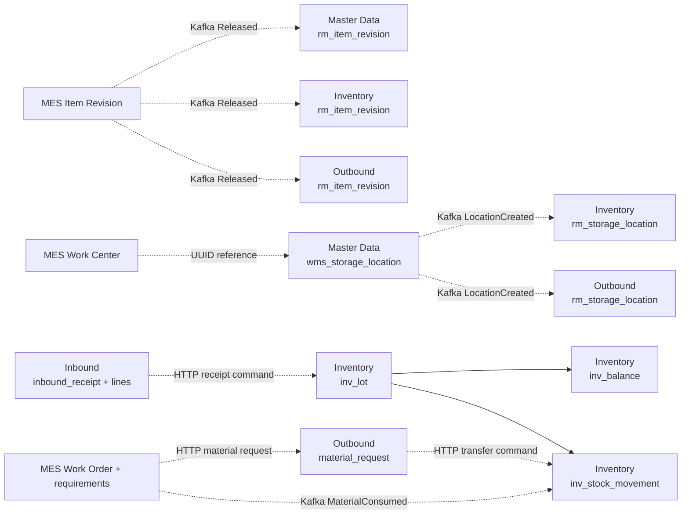
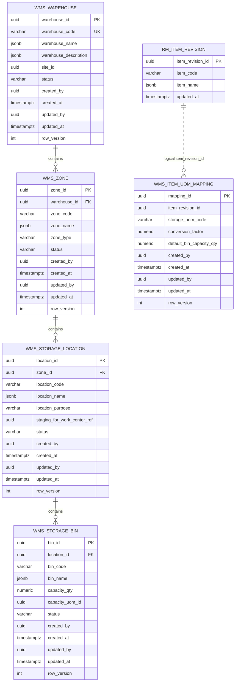
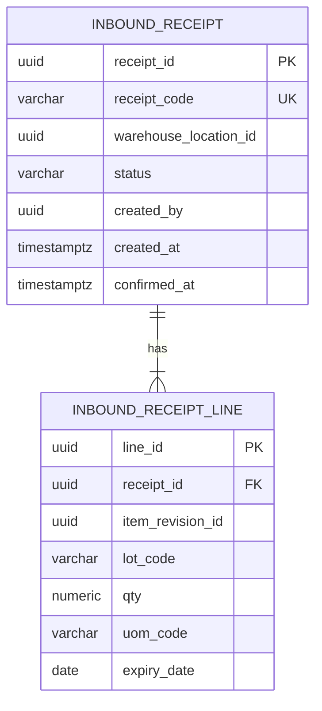
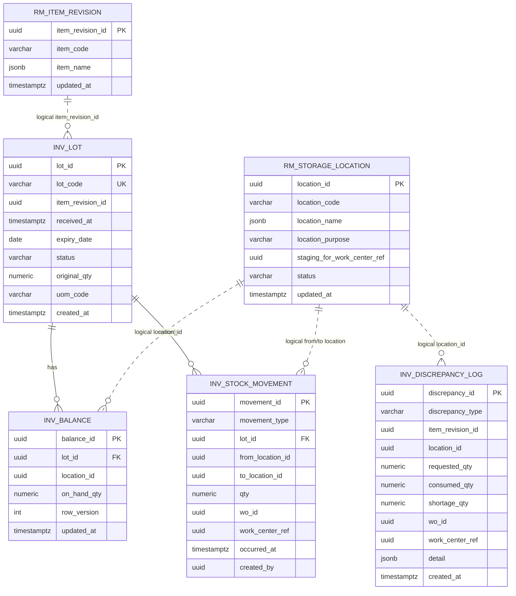
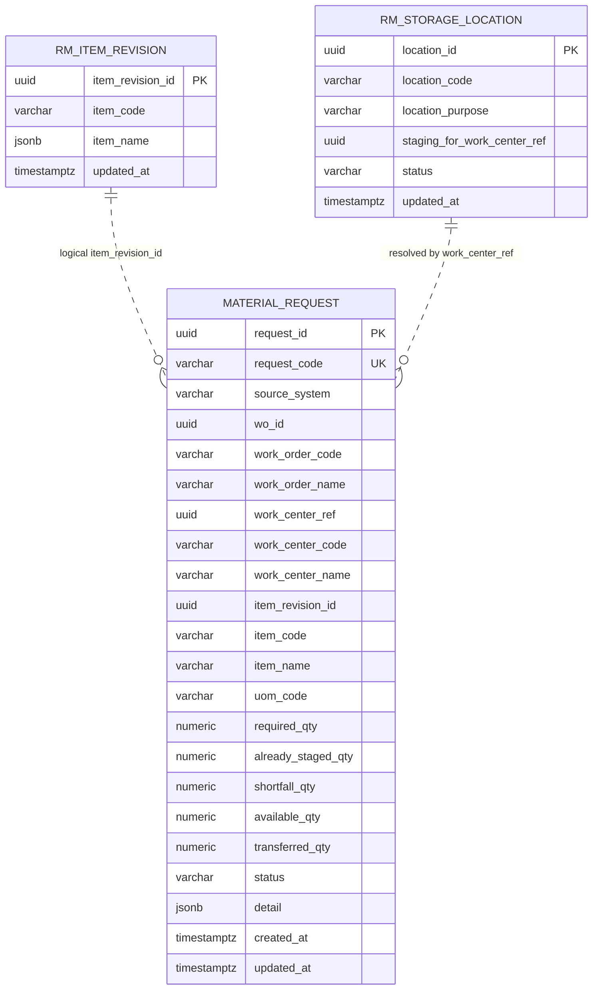

# Mô hình ERD WMS quản lý kho hiện tại

## 1. Cách đọc tài liệu

WMS dùng database-per-service. Vì vậy ERD được chia theo bounded context:

- đường quan hệ liền: foreign key thật trong cùng database;
- quan hệ ghi chú “logical reference”: chỉ dùng chung UUID, không có foreign key;
- bảng `rm_*`: local read model được đồng bộ bằng Kafka;
- các bảng kỹ thuật `schema_migrations` và `outbox_events` được mô tả riêng, không làm rối sơ đồ nghiệp vụ.

ERD phản ánh migration/code hiện tại, không suy diễn mô hình mục tiêu.

## 2. ERD tổng quan xuyên service

Không có foreign key xuyên các khối trên.

## 3. WMS Master Data database

### Ràng buộc chính

| Bảng | Unique/check quan trọng |
|---|---|
| `wms_warehouse` | `warehouse_code` unique; status `Active/Inactive` |
| `wms_zone` | `(warehouse_id, zone_code)` unique; zone type thuộc 5 giá trị định nghĩa |
| `wms_storage_location` | `(zone_id, location_code)` unique; một staging location/Work Center; purpose và staging ref phải khớp |
| `wms_storage_bin` | `(location_id, bin_code)` unique; capacity không âm |
| `wms_item_uom_mapping` | `(item_revision_id, storage_uom_code)` unique; conversion factor dương |

`wms_item_uom_mapping.item_revision_id`, `wms_storage_location.staging_for_work_center_ref`, `wms_warehouse.site_id` và `wms_storage_bin.capacity_uom_id` là logical reference, không có FK tới hệ thống nguồn.

## 4. WMS Inbound database

### Ràng buộc và logical reference

- `(receipt_id, lot_code)` unique.
- `qty > 0`.
- Receipt status: `Draft`, `Confirmed`, `Cancelled`.
- `warehouse_location_id` tham chiếu logic tới Master Data location.
- `item_revision_id` tham chiếu logic tới MES Item Revision; Inbound không có `rm_item_revision`.
- Schema có `Cancelled`, nhưng code chưa có command chuyển trạng thái này.

## 5. WMS Inventory database

### Ràng buộc chính

| Bảng | Ràng buộc |
|---|---|
| `inv_lot` | `lot_code` unique; original quantity dương; status thuộc `Active/Expired/Quarantined/Consumed` |
| `inv_balance` | `(lot_id, location_id)` unique; on-hand không âm |
| `inv_stock_movement` | quantity dương; type thuộc `RECEIPT/TRANSFER_TO_STAGING/CONSUMPTION/ADJUSTMENT` |
| `rm_storage_location` | purpose thuộc `Storage/WorkCenterStaging` |

`inv_balance.location_id`, các location trên movement và mọi UUID MES (`item_revision_id`, `wo_id`, `work_center_ref`) không có FK. Inventory không lưu `warehouse_id`, `zone_id` hoặc `bin_id`.

## 6. WMS Outbound database

### Ràng buộc chính

- `request_code` unique.
- Business identity unique: `(wo_id, work_center_ref, item_revision_id, required_qty)`.
- `required_qty > 0`.
- Status chỉ có `Staged` hoặc `Shortage`.
- `material_request` lưu snapshot tên/mã/UOM và số lượng tại thời điểm xử lý.
- Không có FK từ material request tới hai read model; việc join Item Revision chỉ phục vụ fallback hiển thị.

## 7. Quan hệ với MES Execution

Các trường liên kết chính:

| WMS | MES | Ý nghĩa |
|---|---|---|
| `material_request.wo_id` | `wo_header.wo_id` | WO yêu cầu vật tư |
| `material_request.item_revision_id` | `wo_material_requirement.component_item_revision_id` | vật tư cần cấp |
| `material_request.work_center_ref` | `wo_operation.work_center_id` | nơi nhận staging |
| `inv_stock_movement.wo_id` | `wo_header.wo_id` | truy vết transfer/consumption theo WO |
| `inv_stock_movement.work_center_ref` | MES Work Center | truy vết theo điểm staging |
| `inv_discrepancy_log.*` | WO, Work Center, Item Revision | sai lệch tiêu hao |

MES lưu kết quả WMS trở lại:

- `wo_material_requirement.stock_check_status`: `NotChecked`, `Staged`, `Shortage`;
- `wo_material_requirement.stock_check_detail`: snapshot JSON response của Outbound.

Tất cả là quan hệ logic, không có FK xuyên database.

## 8. Bảng kỹ thuật

| Bounded context | Bảng kỹ thuật |
|---|---|
| Master Data | `schema_migrations`, `outbox_events` |
| Inbound | `schema_migrations` |
| Inventory | `schema_migrations` |
| Outbound | `schema_migrations`, `outbox_events` |

`outbox_events` bảo đảm dữ liệu nghiệp vụ và event được ghi cùng transaction tại Master Data/Outbound. Inbound gọi Inventory đồng bộ qua HTTP và hiện không có outbox riêng.

## 9. Các điểm mô hình chưa nối

1. Bin không nối với balance/movement; không thể biết tồn thực tế nằm ở bin nào.
2. UOM mapping không nối với lot/movement bằng FK và chưa được dùng để quy đổi.
3. Inbound không có FK/read model cho location hoặc Item Revision.
4. Inventory không lưu Warehouse/Zone nên truy vấn hierarchy phải ghép ở Console qua Master Data API.
5. Outbound read model location không có Zone/Warehouse; thuật toán cộng toàn bộ Storage balance của Item Revision, không giới hạn Warehouse/Site.
6. Update master data không có event tương ứng, tạo nguy cơ read model lệch trạng thái nguồn.
7. `inv_discrepancy_log` có dữ liệu nhưng chưa có query API/UI hoàn chỉnh.

