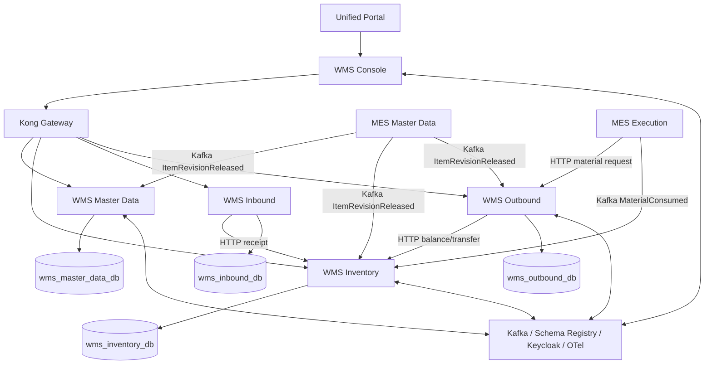
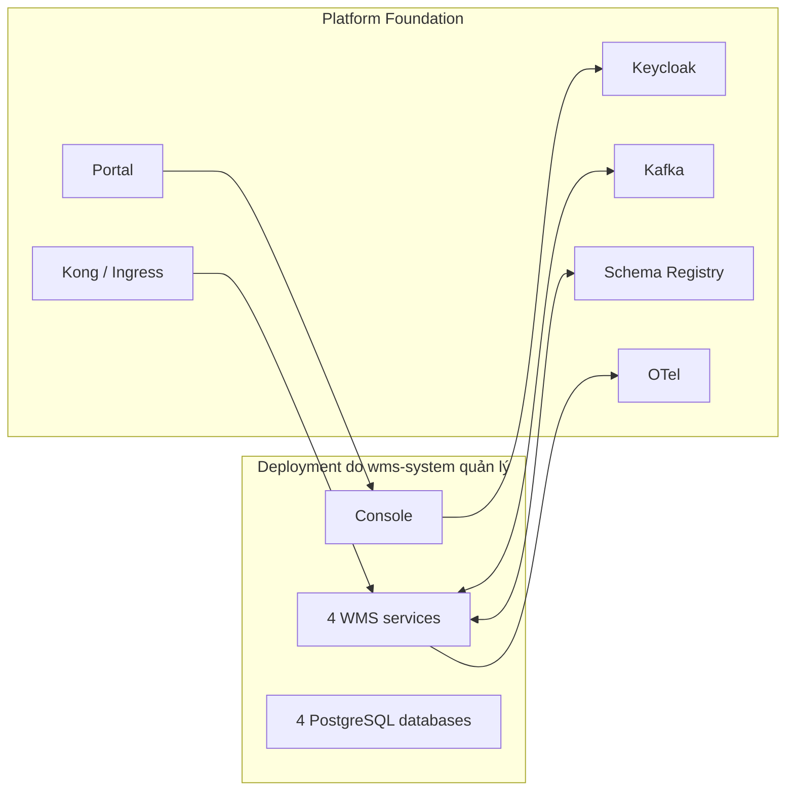

# Kế hoạch tách toàn bộ WMS sang source code mới

## 1. Mục tiêu

Tách Cluster WMS khỏi monorepo `mes-ricoh-system` thành một repository có thể:

- build, test và release độc lập;
- triển khai độc lập với MES/QMS;
- sở hữu bốn database WMS và toàn bộ migration tương ứng;
- tiếp tục dùng SSO, Kafka, Schema Registry, API Gateway và observability của platform;
- giữ nguyên luồng MES → WMS cấp vật tư và MES → WMS tiêu hao;
- cho phép rollback về deployment WMS cũ mà không mất dữ liệu.

Tên minh họa của repository mới trong tài liệu là `wms-system`. Tên Git remote, registry và domain thực tế phải được chốt trước khi triển khai.

Tài liệu này là kế hoạch thực hiện. Nó không tự động di chuyển file hoặc database.

## 2. Kiến trúc hiện tại

### 2.1 Topology



### 2.2 Thành phần WMS đang nằm trong monorepo

| Thành phần                | Công nghệ          | Port nội bộ | Port host hiện tại |
| ------------------------- | ------------------ | ----------: | -----------------: |
| `wms-master-data-service` | Node.js/TypeScript |        3060 |              13060 |
| `wms-inventory-service`   | Go                 |        3070 |              13070 |
| `wms-inbound-service`     | Node.js/TypeScript |        3080 |              13080 |
| `wms-outbound-service`    | Go                 |        3090 |              13090 |
| `wms-console`             | React/Vite/Nginx   |        3091 |              13091 |
| Master Data PostgreSQL    | PostgreSQL         |        5432 |              15438 |
| Inventory PostgreSQL      | PostgreSQL         |        5432 |              15439 |
| Inbound PostgreSQL        | PostgreSQL         |        5432 |              15440 |
| Outbound PostgreSQL       | PostgreSQL         |        5432 |              15441 |

WMS không sở hữu Kafka, Schema Registry, Keycloak, Kong hoặc observability. Các thành phần này đang thuộc Platform Foundation và cần được xem là external dependencies sau khi tách.

## 3. Nguyên tắc ranh giới source mới

### 3.1 WMS repository mới sở hữu

- toàn bộ source của năm application WMS;
- migration và database bootstrap của bốn database;
- WMS-specific deployment manifests;
- WMS-specific event schemas do WMS publish;
- client contract nội bộ giữa Inbound/Outbound và Inventory;
- seed/demo/test chỉ phục vụ WMS;
- tài liệu nghiệp vụ, ERD, runbook và ADR của WMS;
- CI/CD, image build và versioning của WMS.

### 3.2 Repository MOM/MES hiện tại tiếp tục sở hữu

- MES Master Data và event `MES.MasterData.ItemRevisionReleased.v2`;
- MES Execution, endpoint `stage-materials` và WMS outbound client;
- event `MES.Execution.MaterialConsumed.v1`;
- các cột `stock_check_status`, `stock_check_detail` trong MES;
- Unified Portal, trừ khi Portal được tách thành platform repo riêng;
- Keycloak realm cấp platform;
- Kong/ingress cấp platform;
- Kafka, Schema Registry và observability cấp platform;
- QMS và Print Station.

### 3.3 Không được tạo shared database

Sau khi tách:

- WMS không truy cập trực tiếp database MES;
- MES không truy cập trực tiếp database WMS;
- các UUID MES trong WMS vẫn là opaque/logical reference;
- đồng bộ Item Revision và consumption tiếp tục qua Kafka;
- material staging tiếp tục qua HTTP contract có version.

Script demo hiện tại có truy cập trực tiếp cả MES DB và bốn WMS DB. Script này chỉ phù hợp môi trường dev/demo và phải được thay đổi trước khi coi hai repository độc lập hoàn toàn.

## 4. Ma trận file và ownership

### 4.1 Phải move sang repository mới

| Source hiện tại                                 | Đích đề xuất                        | Ghi chú                                    |
| ----------------------------------------------- | ----------------------------------- | ------------------------------------------ |
| `services/wms-master-data-service/`             | `services/master-data/`             | Giữ history                                |
| `services/wms-inventory-service/`               | `services/inventory/`               | Giữ migrations                             |
| `services/wms-inbound-service/`                 | `services/inbound/`                 | Giữ test circuit breaker                   |
| `services/wms-outbound-service/`                | `services/outbound/`                | Giữ realtime hub, outbox                   |
| `services/wms-console/`                         | `apps/console/`                     | Sửa Docker build context                   |
| `infra/postgres/wms-*-init.sql`                 | `deploy/postgres/init/`             | Không giữ password hardcode cho production |
| phần WMS trong `infra/docker-compose.wms.yml`   | `deploy/compose/docker-compose.yml` | Tách external platform network             |
| `scripts/seed-wms-demo.ts`                      | `scripts/seed-demo.ts`              | Refactor bỏ MES DB direct access           |
| `scripts/test-mes-wms-material-request-flow.sh` | `tests/integration/`                | Chạy với endpoint cấu hình                 |
| tài liệu WMS trong `docs/`                      | `docs/`                             | Gồm business flow, ERD và tài liệu này     |
| implementation records WMS cần lưu              | `docs/history/`                     | Chỉ copy tài liệu có giá trị traceability  |

### 4.2 Phải copy/package hóa dependency dùng chung

| Dependency hiện tại           | Cách xử lý khuyến nghị                                                                                                 |
| ----------------------------- | ---------------------------------------------------------------------------------------------------------------------- |
| `libs/shared-kernel/`         | Tách thành package versioned nội bộ, ví dụ `@mom-platform/shared-kernel`, hoặc tạm vendor vào `packages/shared-kernel` |
| `libs/shared-kernel-go/`      | Tách thành Go module versioned; giai đoạn đầu có thể vendor tại `packages/shared-kernel-go`                            |
| `libs/i18n-ui-shared/`        | Tách thành package versioned hoặc vendor vào `packages/i18n-ui-shared`                                                 |
| EventEnvelope/outbox contract | Đóng version, bổ sung contract test giữa repo                                                                          |
| LocalizedText contract        | Đóng version và test compatibility                                                                                     |

Khuyến nghị theo hai bước:

1. **Extraction-safe:** vendor đúng phiên bản ba library vào repository WMS để build không phụ thuộc Git/package registry mới.
2. **Platform maturity:** publish các library lên registry nội bộ, pin semantic version và bỏ bản vendor sau khi pipeline ổn định.

Không dùng dependency `"*"` sau khi tách. Mọi package dùng chung phải được pin version hoặc workspace-local rõ ràng.

### 4.3 Phải giữ ở repository hiện tại

| File/module                                                                            | Lý do                                                                                       |
| -------------------------------------------------------------------------------------- | ------------------------------------------------------------------------------------------- |
| `services/mes-execution-service/internal/infrastructure/client/wms_outbound_client.go` | MES là caller của WMS                                                                       |
| `services/mes-execution-service/internal/application/usecase/stage_materials.go`       | Nghiệp vụ MES                                                                               |
| phần phát `MES.Execution.MaterialConsumed.v1`                                          | MES sở hữu sự kiện                                                                          |
| MES migration `000005_wms_stock_check_status...`                                       | Dữ liệu thuộc MES                                                                           |
| phần `WMS_OUTBOUND_SERVICE_URL` trong MES Compose                                      | MES cần địa chỉ WMS mới                                                                     |
| WMS app entry trong `portal/src/config/apps.ts`                                        | Portal cấp platform                                                                         |
| WMS Keycloak client/role trong realm                                                   | Identity cấp platform                                                                       |
| WMS routes trong Kong/ingress                                                          | Gateway cấp platform, có thể chuyển sang config deployment riêng nếu platform hỗ trợ GitOps |

### 4.4 Phải xóa khỏi repository cũ sau cutover

Chỉ xóa khi production đã qua stabilization window:

- `services/wms-*`;
- WMS-specific DB services/volumes trong Compose cũ;
- WMS init SQL đã được chuyển;
- root npm workspace/script chỉ còn phục vụ WMS;
- seed/test WMS đã chuyển;
- cấu hình build image WMS cũ.

Không xóa integration contract phía MES, Portal, Keycloak hoặc gateway.

## 5. Cấu trúc repository mới đề xuất

```text
wms-system/
├── apps/
│   └── console/
├── services/
│   ├── master-data/
│   ├── inventory/
│   ├── inbound/
│   └── outbound/
├── packages/
│   ├── shared-kernel/          # tạm vendor hoặc wrapper package
│   ├── shared-kernel-go/       # tạm vendor hoặc versioned module
│   ├── i18n-ui-shared/
│   └── contracts/
│       ├── asyncapi/
│       ├── events/
│       └── openapi/
├── deploy/
│   ├── compose/
│   ├── postgres/init/
│   ├── kubernetes/             # nếu có
│   └── gateway/
├── scripts/
│   ├── seed-demo.ts
│   ├── backup.sh
│   ├── restore.sh
│   └── verify-cutover.sh
├── tests/
│   ├── contract/
│   ├── integration/
│   └── e2e/
├── docs/
│   ├── architecture/
│   ├── operations/
│   └── history/
├── package.json
├── package-lock.json
├── go.work
├── .env.example
└── README.md
```

`go.work` nên liên kết hai service Go và shared kernel local trong giai đoạn vendor. Dockerfile phải dùng repository mới làm build context, không còn các đường dẫn `services/wms-*` hoặc `../../libs`.

## 6. Contract phải đóng băng trước khi move

### 6.1 HTTP inbound vào WMS

| Caller        | Contract                                   |
| ------------- | ------------------------------------------ |
| MES Execution | `POST /api/wms/outbound/material-requests` |
| WMS Console   | `/api/wms/master-data/*`                   |
| WMS Console   | `/api/wms/inventory/*`                     |
| WMS Console   | `/api/wms/inbound/*`                       |
| WMS Console   | `/api/wms/outbound/*`                      |

Trước extraction cần sinh và commit OpenAPI cho các endpoint trên. Contract phải ghi:

- request/response schema;
- error code và HTTP status;
- auth headers;
- timeout/retry policy;
- idempotency identity;
- decimal precision;
- compatibility/versioning policy.

### 6.2 HTTP nội bộ WMS

| Caller   | Callee    | Endpoint                                                |
| -------- | --------- | ------------------------------------------------------- |
| Inbound  | Inventory | `POST /api/wms/inventory/movements/receipt`             |
| Outbound | Inventory | `GET /api/wms/inventory/balances`                       |
| Outbound | Inventory | `POST /api/wms/inventory/movements/transfer-to-staging` |

Các endpoint nội bộ hiện dùng service DNS Docker. Sau khi tách deployment, địa chỉ phải qua biến môi trường và service discovery ổn định.

### 6.3 Event WMS consume

| Topic                                    | Producer owner  | WMS consumer                     |
| ---------------------------------------- | --------------- | -------------------------------- |
| `MES.MasterData.ItemRevisionReleased.v2` | MES Master Data | Master Data, Inventory, Outbound |
| `MES.Execution.MaterialConsumed.v1`      | MES Execution   | Inventory                        |
| `WMS.MasterData.LocationCreated.v1`      | WMS Master Data | Inventory, Outbound              |

### 6.4 Event WMS publish

| Topic                                      |
| ------------------------------------------ |
| `WMS.MasterData.WarehouseCreated.v1`       |
| `WMS.MasterData.ZoneCreated.v1`            |
| `WMS.MasterData.LocationCreated.v1`        |
| `WMS.MasterData.StorageBinCreated.v1`      |
| `WMS.MasterData.ItemUOMMappingCreated.v1`  |
| `WMS.Outbound.MaterialStaged.v1`           |
| `WMS.Outbound.MaterialShortageDeclared.v1` |

Event schema hiện một phần được tạo/đăng ký trong code. Khi tách cần đưa schema thành artifact rõ ràng trong `packages/contracts/events`, kiểm tra compatibility trong CI và để producer/consumer cùng pin version.

### 6.5 Consumer group

Phải giữ nguyên consumer group khi chuyển workload nếu muốn tiếp tục offset:

- `wms-master-data-item-revision-readmodel`;
- `wms-inventory-readmodel-group`;
- `wms-outbound-realtime-group-v2`.

Không chạy WMS cũ và mới cùng consumer group trong giai đoạn so sánh nếu cả hai cùng ghi vào database khác nhau mà kỳ vọng cả hai nhận đủ event. Khi shadow test, dùng group suffix riêng và rebuild read model từ `earliest`.

## 7. Thay đổi build bắt buộc

### 7.1 Node workspace

Tạo root `package.json` mới:

- workspaces: `apps/*`, `services/*`, `packages/*`;
- chỉ giữ script WMS;
- tạo lockfile riêng;
- pin Node `>=20` và npm `>=10`;
- bỏ toàn bộ workspace MES/QMS/Portal.

Sửa imports:

- `@mom-platform/shared-kernel`;
- `@mom-platform/i18n-ui-shared`.

Hai lựa chọn hợp lệ:

- workspace package local trong `packages/`;
- package registry với version cố định.

### 7.2 Go module

Hiện hai service có:

```text
replace github.com/mom-platform/shared-kernel-go => ../../libs/shared-kernel-go
```

Sau move phải đổi thành một trong:

- `replace ... => ../../packages/shared-kernel-go` trong giai đoạn vendor;
- bỏ `replace`, require tag chính thức từ private Go module.

Thêm `go.work` và chạy test từng module.

### 7.3 Docker

Dockerfile hiện copy từ root monorepo. Phải sửa theo layout mới và bảo đảm:

- build context là root `wms-system`;
- không copy file MES/QMS;
- production image chạy non-root nơi khả thi;
- migration được đóng gói đúng service;
- image tag là immutable, ví dụ Git SHA;
- SBOM/vulnerability scan trong CI;
- Console proxy không hardcode hostname `kong` nếu deploy khác network.

## 8. Hạ tầng sau khi tách

### 8.1 Mô hình khuyến nghị

WMS repo sở hữu workload và database; platform tiếp tục cung cấp external services:



### 8.2 Network

Nếu vẫn dùng Docker Compose trên cùng host:

- tạo external network có tên ổn định, ví dụ `mom-platform`;
- platform Compose tạo network;
- WMS Compose join external network;
- không dùng `depends_on` xuyên Compose project;
- dùng health/retry khi platform chưa sẵn sàng.

Nếu chạy khác host:

- thay Docker DNS bằng DNS/TLS endpoint thực;
- Kafka `advertised.listeners` phải truy cập được từ WMS host;
- OTel, Schema Registry, Keycloak và gateway phải có TLS;
- firewall chỉ mở port cần thiết;
- không expose trực tiếp PostgreSQL ra mạng công cộng.

### 8.3 Gateway và Console

Hiện WMS Console proxy `/api/` tới `http://kong:8000`. Sau tách nên chọn một trong:

1. Console gọi public API base URL qua `VITE_API_BASE_URL`.
2. Nginx Console proxy tới gateway URL cấu hình lúc deploy.

Không giữ hostname `kong` cứng trong production image.

Kong phải cập nhật upstream của bốn API sang deployment mới. Path public nên giữ nguyên để MES và Console không đổi contract:

- `/api/wms/master-data`
- `/api/wms/inventory`
- `/api/wms/inbound`
- `/api/wms/outbound`

## 9. Identity, authorization và secrets

### 9.1 Giữ ở platform

- realm `wonsealtech`;
- client `wms-client`;
- role `WAREHOUSE_STAFF`;
- người dùng/role mapping;
- JWT issuer/public key mà Kong dùng.

### 9.2 Phải loại bỏ khỏi source/deployment production

Compose/init SQL hiện chứa credential mặc định. Repository mới cần:

- `.env.example` chỉ chứa tên biến;
- secret manager hoặc CI secret;
- password riêng theo môi trường;
- migration owner và runtime user tách biệt;
- không commit access token, database dump hoặc private key.

### 9.3 Service-to-service

Hiện Kong xác thực user-facing WMS request, nhưng HTTP nội bộ giữa WMS services và MES → WMS phụ thuộc network/header forwarding. Trước khi triển khai khác host cần chốt:

- mTLS hoặc OAuth2 client credentials cho service-to-service;
- actor propagation riêng với authentication của calling service;
- không tin trực tiếp `X-User-ID` từ public network;
- websocket realtime cũng phải dùng token/issuer phù hợp.

## 10. Chiến lược dữ liệu

### 10.1 Mục tiêu

Di chuyển nguyên vẹn:

- schema và migration history;
- master data;
- lot và balance;
- append-only stock movement;
- discrepancy;
- inbound receipt;
- material request;
- outbox pending/published state;
- read model và Kafka offset strategy.

### 10.2 Phương án ưu tiên: giữ nguyên database, chỉ chuyển application ownership

Nếu deployment mới truy cập được bốn PostgreSQL hiện tại:

1. backup;
2. dừng WMS writers cũ;
3. cấu hình WMS mới trỏ cùng database;
4. smoke test;
5. chuyển gateway;
6. giữ workload cũ ở trạng thái stopped để rollback.

Ưu điểm: không copy dữ liệu, ít rủi ro ledger lệch. Nhược điểm: cần network và quyền truy cập DB từ deployment mới.

### 10.3 Phương án thay thế: migrate database sang hạ tầng mới

1. Chạy thử restore từ backup gần nhất.
2. Kiểm tra extension, owner, grant và migration table.
3. Đặt maintenance/read-only window.
4. Dừng toàn bộ WMS writer và outbox relay cũ.
5. Chụp final backup nhất quán của cả bốn DB.
6. Restore sang DB mới.
7. Đối chiếu checksum/count.
8. Khởi động WMS mới với consumer/relay được kiểm soát.
9. Chuyển gateway.

Không dùng dual-write giữa hai cụm WMS. Inventory ledger và material request idempotency không được thiết kế cho active-active xuyên database.

### 10.4 Đối soát bắt buộc

| Database    | Đối soát                                                                                       |
| ----------- | ---------------------------------------------------------------------------------------------- |
| Master Data | count theo bảng; code/UUID; hierarchy; UOM mapping; outbox                                     |
| Inventory   | count lot; tổng original qty; tổng on-hand theo item/location; movement count/sum; discrepancy |
| Inbound     | count theo status; header-line count; receipt code                                             |
| Outbound    | count theo status; business identity; quantity fields; outbox                                  |

Kiểm tra invariant Inventory:

```text
on_hand_qty >= 0
sum(RECEIPT) - sum(TRANSFER ra) + sum(TRANSFER vào) - sum(CONSUMPTION)
= balance theo lot/location
```

Phải tính đúng chiều movement và bỏ qua loại chưa triển khai nếu chưa có dữ liệu.

### 10.5 Read model

`rm_item_revision` và `rm_storage_location` có thể:

- restore cùng DB để cutover nhanh;
- sau đó cung cấp command rebuild từ Kafka hoặc API snapshot.

Do code hiện chỉ consume event Created/Released, không nên xóa read model rồi kỳ vọng tự tái tạo đúng trạng thái update hiện tại.

## 11. Kế hoạch thực hiện theo phase

### Phase 0 — Baseline và freeze

- Chốt Git SHA nguồn.
- Chạy build/test hiện tại.
- Ghi image digest, schema version, Kafka topics/group offsets.
- Backup bốn database và thử restore.
- Chốt owner, repo name, registry, domain và môi trường.
- Tạm freeze thay đổi WMS hoặc yêu cầu mọi commit WMS được cherry-pick sang cả hai repo.

**Exit criteria:** baseline xanh và backup restore được.

### Phase 1 — Tạo repository mới có history

Khuyến nghị dùng `git filter-repo` hoặc `git subtree split` để giữ history các thư mục WMS, sau đó thêm layout mới bằng commit riêng.

Không dùng copy thủ công rồi mất lịch sử nếu repository sẽ được bảo trì lâu dài.

Các bước logic:

1. clone/mirror repo nguồn vào thư mục tạm;
2. filter các path WMS và dependency được duyệt;
3. push vào remote mới;
4. rename thư mục trong commit mới;
5. thêm README, ownership và branch protection.

Không chạy lệnh filter trực tiếp trên working copy chính.

**Exit criteria:** repo mới có history truy vết và không chứa source MES/QMS ngoài phần contract/tài liệu đã duyệt.

### Phase 2 — Làm repo mới build độc lập

- Tạo root npm workspace/lockfile.
- Tạo `go.work`.
- Vendor hoặc pin shared packages.
- Sửa Dockerfile/build context.
- Tách Compose.
- Thêm `.env.example`.
- Chuyển seed/test WMS.
- Xóa mọi relative path quay về monorepo cũ.

**Exit criteria:** clone sạch repo mới có thể typecheck, test và build đủ năm image mà không cần checkout repo MES.

### Phase 3 — Contract và integration hardening

- Commit OpenAPI/Event schemas.
- Thêm contract tests MES ↔ WMS.
- Thêm test event compatibility.
- Cấu hình external platform endpoints.
- Cấu hình service authentication.
- Thêm health/readiness cho Kafka, DB và dependency.
- Thêm dashboards/alerts theo service mới.

**Exit criteria:** WMS mới chạy với platform dev/staging và hoàn thành luồng item sync → receipt → staging → consumption.

### Phase 4 — Staging rehearsal

- Restore bản sao production-like DB.
- Rebuild/deploy WMS từ repo mới.
- Dùng shadow consumer group nếu cần replay event.
- Chạy bộ verify:
  - SSO Console;
  - CRUD hierarchy;
  - receipt;
  - balance/movement;
  - MES stage materials;
  - shortage;
  - MaterialConsumed;
  - realtime.
- Đo timeout, retry, duplicate và consumer lag.

**Exit criteria:** test end-to-end xanh và có biên bản đối soát dữ liệu.

### Phase 5 — Production cutover

Trình tự đề xuất:

1. Thông báo maintenance window.
2. Chặn command ghi WMS từ Console/MES.
3. Dừng WMS cũ và outbox relay/consumer cũ.
4. Ghi lại Kafka offsets và DB timestamp.
5. Final backup hoặc restore nếu chuyển DB.
6. Khởi động database/migration mới.
7. Khởi động theo thứ tự:
   - Master Data;
   - Inventory;
   - Inbound;
   - Outbound;
   - Console.
8. Kiểm tra health và consumer lag.
9. Chuyển Kong upstream/DNS.
10. Chạy smoke test read-only rồi một giao dịch kiểm soát.
11. Mở lại MES staging và Console writes.
12. Theo dõi stabilization window.

**Exit criteria:** không có duplicate movement/request, consumer lag ổn định, dữ liệu đối soát đúng.

### Phase 6 — Cleanup repo cũ

- Tạo commit xóa source WMS khỏi monorepo.
- Gỡ WMS image build và DB workload cũ.
- Giữ MES client/event producer/Portal/gateway integration.
- Sửa README, AI context và ownership link sang repo mới.
- Đặt link deprecation cho tài liệu lịch sử.
- Không xóa backup/volume cũ cho tới hết retention window.

**Exit criteria:** repo cũ build/test xanh khi không còn WMS workspace.

## 12. CI/CD tối thiểu cho repository mới

### Pull request

- Node install từ lockfile;
- typecheck/build/test Master Data, Inbound, Console;
- `go test ./...` cho Inventory, Outbound và shared kernel;
- lint;
- i18n hardcoded-string scan cho Console;
- OpenAPI/Event schema validation;
- migration smoke test trên PostgreSQL sạch;
- Docker build đủ năm image;
- secret scan và dependency scan.

### Main/tag

- build image immutable;
- ký image/SBOM;
- push registry;
- deploy dev;
- integration/E2E;
- manual approval staging/production;
- migration backup gate;
- post-deploy smoke test và rollback automation.

Version application và contract phải tách biệt. Event breaking change phải tạo topic/schema version mới, không sửa ngầm payload đang có consumer.

## 13. Verification checklist

### Build

- [ ] Clone sạch chỉ repository WMS.
- [ ] `npm ci` thành công.
- [ ] Ba workspace Node/UI build và test thành công.
- [ ] Hai Go service test/build thành công.
- [ ] Năm Docker image build từ root mới.

### Runtime

- [ ] Bốn database migrate từ empty.
- [ ] Bốn database restore từ production-like backup.
- [ ] Health/readiness xanh.
- [ ] Console login bằng `wms-client`.
- [ ] Kong route đúng upstream mới.
- [ ] OTel trace đi qua gateway → service → DB.

### Contract

- [ ] Item Revision Released đồng bộ đủ ba read model.
- [ ] Location Created đồng bộ Inventory/Outbound.
- [ ] MES stage-materials tạo đúng một material request.
- [ ] Retry không tạo duplicate transfer.
- [ ] Shortage không tạo partial transfer.
- [ ] MaterialConsumed trừ đúng Work Center staging.
- [ ] WebSocket/realtime nhận staged/shortage.

### Data

- [ ] UUID/code/count khớp.
- [ ] Tổng on-hand khớp trước/sau.
- [ ] Movement ledger không thiếu/trùng.
- [ ] Outbox pending được publish đúng một cách an toàn.
- [ ] Consumer lag và offset được ghi nhận.

### Security

- [ ] Không có secret thật trong Git.
- [ ] Runtime DB user không có DELETE ngoài phạm vi thiết kế.
- [ ] Service-to-service được xác thực.
- [ ] Public request không thể giả `X-User-ID`.
- [ ] DB không public internet.

## 14. Rollback

### Điều kiện kích hoạt

- sai lệch balance/ledger;
- duplicate material request hoặc movement;
- consumer không bắt kịp/không consume;
- MES không stage được vật tư;
- authentication/gateway lỗi diện rộng;
- migration không tương thích.

### Quy trình

1. Chặn WMS writes.
2. Ghi lại thời điểm và giao dịch đã phát sinh trên WMS mới.
3. Chuyển Kong/DNS về upstream cũ.
4. Nếu dùng cùng database, khởi động binary/image cũ chỉ khi schema vẫn backward compatible.
5. Nếu dùng database mới, không tự động quay về DB cũ sau khi đã có write mới; phải reconcile hoặc replay các giao dịch phát sinh.
6. Khôi phục consumer group/offset theo runbook đã ghi.
7. Xác minh balance, movement và material request trước khi mở write.

Rollback application dễ hơn rollback dữ liệu. Vì vậy cutover nên giữ cùng database nếu có thể, và mọi migration trong đợt extraction phải additive/backward compatible.

## 15. Rủi ro hiện tại cần xử lý trong extraction

| Rủi ro                                               | Ảnh hưởng                      | Biện pháp                                         |
| ---------------------------------------------------- | ------------------------------ | ------------------------------------------------- |
| Shared libs đang là relative workspace/path          | Repo mới không build           | Vendor trước, package hóa sau                     |
| Dockerfile phụ thuộc root monorepo                   | Image build lỗi                | Viết lại build context                            |
| Console hardcode `kong:8000`                         | Không chạy khác network        | API/gateway URL cấu hình                          |
| Seed WMS đọc trực tiếp MES DB                        | Phá ranh giới repo/service     | Dùng API/event fixture                            |
| Credential mặc định trong Compose/init               | Rò rỉ/quản trị yếu             | Secret manager và rotate                          |
| Location update không phát event                     | Read model lệch                | Thêm event/rebuild trước hoặc ngay sau extraction |
| Receipt confirm có thể partial commit                | Cutover/retry gây nhập trùng   | Idempotency key theo receipt line                 |
| Consumer chưa thể hiện inbox dedupe                  | Replay có nguy cơ tác động lặp | Inbox/event-id dedupe                             |
| WMS/MES HTTP chưa có contract artifact               | Thay đổi chéo repo dễ vỡ       | OpenAPI + consumer contract test                  |
| Inventory cộng Storage không giới hạn warehouse/site | Cấp từ sai phạm vi             | Chốt scope trước mở rộng deployment               |
| Không có CI hiện hữu trong repo                      | Không có quality gate          | Tạo pipeline ngay Phase 2                         |

Các rủi ro nghiệp vụ này không nhất thiết chặn việc tạo repository mới, nhưng idempotency, contract và secret handling phải hoàn tất trước production cutover.

## 16. Definition of Done

Việc tách WMS chỉ được coi là hoàn tất khi:

1. Repository WMS mới build/test/deploy độc lập từ clone sạch.
2. Không còn dependency filesystem tới monorepo MES.
3. Bốn database và migration thuộc pipeline WMS mới.
4. MES ↔ WMS HTTP/Event contract có artifact và test tự động.
5. SSO, Portal, gateway, Kafka và observability hoạt động qua endpoint deployment mới.
6. Dữ liệu production được đối soát, không thiếu/trùng ledger.
7. Cutover và rollback đã rehearsal.
8. Monorepo cũ không còn source/build/deployment WMS, nhưng vẫn giữ integration phía MES/Platform.
9. Runbook, ownership, on-call và release policy được bàn giao.
10. Có stabilization window thành công trước khi xóa workload/volume cũ.

## 17. Quyết định cần chốt trước khi bắt đầu

- Tên và Git remote của repository mới.
- Có giữ Git history bằng `filter-repo` hay không.
- Shared kernel được vendor hay publish registry ngay.
- WMS deployment cùng host/network hay khác hạ tầng.
- Giữ bốn database hiện tại hay migrate sang server mới.
- Public domain/API gateway URL của WMS.
- Service-to-service authentication.
- CI/CD và container registry.
- Maintenance window, retention và rollback owner.

Nếu chưa chốt, mặc định an toàn là: giữ history, vendor shared libraries, giữ nguyên database, giữ path API công khai, dùng platform Kafka/Keycloak/Kong hiện tại và chỉ chuyển application workload trước.
