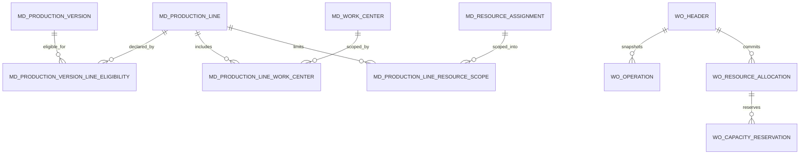
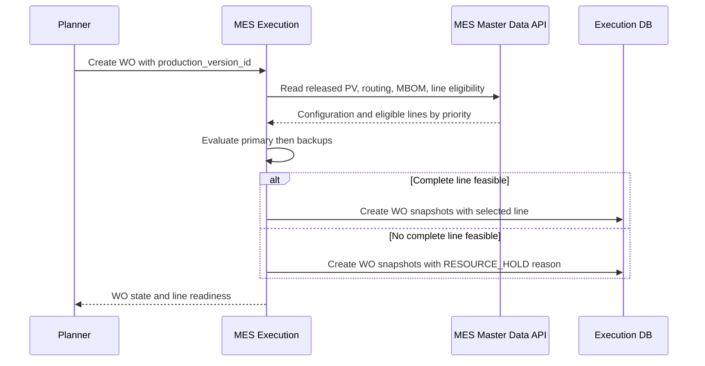
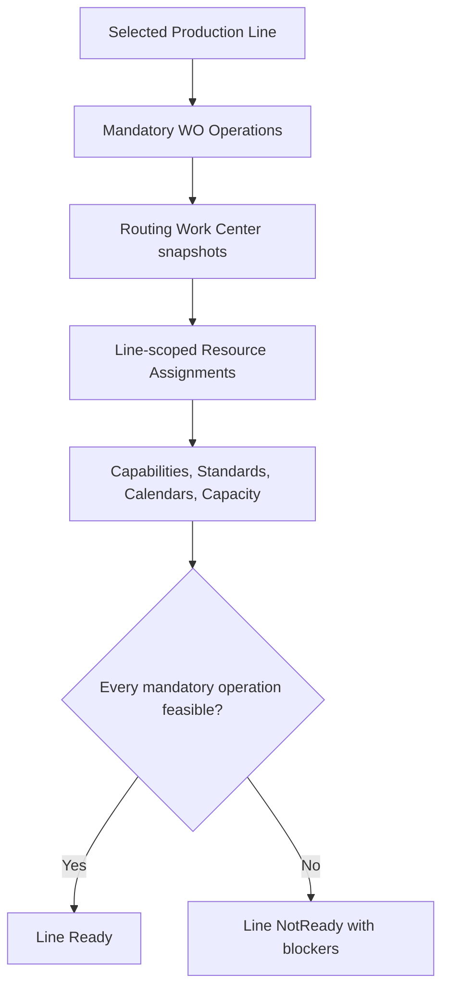
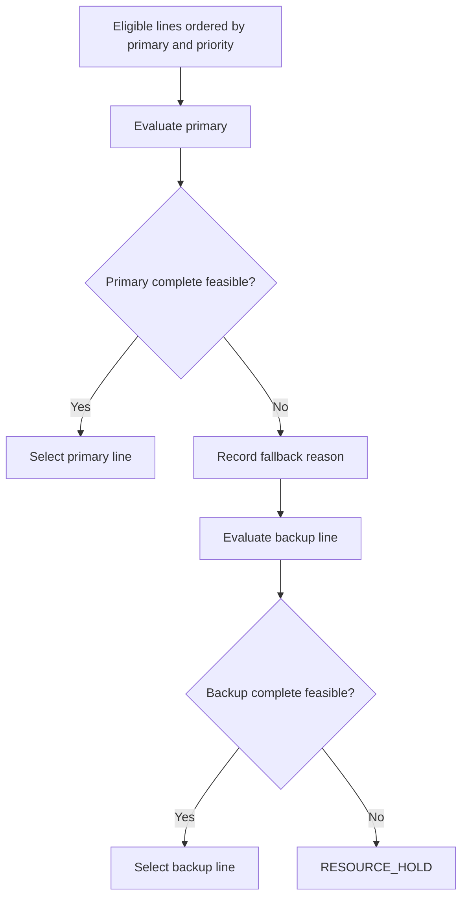
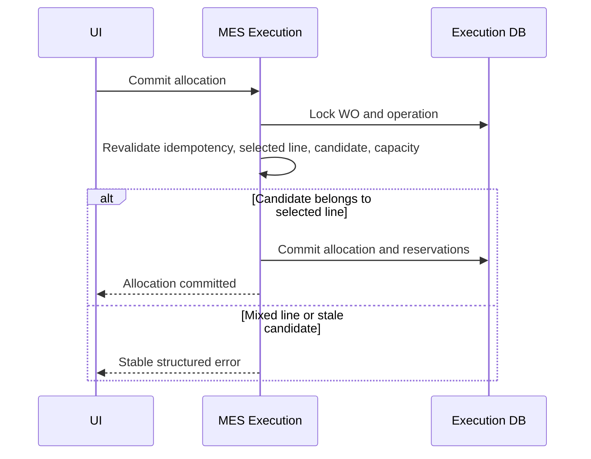
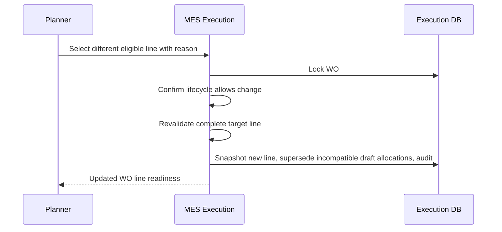
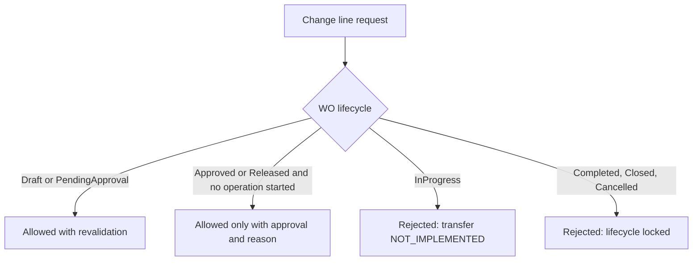

# ADR-009: Two Production Line Selection and Resource Planning

Date: 2026-08-01
Status: PARTIALLY_IMPLEMENTED

## Context

The current MES model already separates product definition, process definition, master-data resources, and execution allocations:

- Production Version is the Work Order creation authority for one Item Revision, one MBOM, and one Routing.
- Routing Operation selects the logical Work Center and must not be duplicated only because physical lines, Workstations, or Equipment differ.
- `md_resource_assignment` is the master-data authority for Work Center, Workstation, Equipment, Machine Group, and Machine Unit assignment/effectivity.
- `wo_operation` is the execution-owned runtime operation snapshot.
- `wo_resource_allocation` and `wo_capacity_reservation` are execution-owned runtime commitments.

Phase 5 designed the canonical two-line model. Phase 6 implemented master-data ownership. Phase 7 implemented MES Execution line selection, `ResourceHold`, audited pre-start replan, and mixed-line rejection.

## Problem

One released Production Version must be eligible for two equivalent Production Lines while still using one Item Revision, one MBOM, and one Routing. A Work Order must select one complete line, evaluate the primary line first, choose a backup line only when the whole backup line is feasible, and enter `RESOURCE_HOLD` when no complete line is feasible.

The design must not create a second owner for Workstation/Equipment assignment and must not create per-operation line selection.

## Considered Options

### Option A: Duplicate Routing per physical line

Rejected. This violates the product-definition invariant that Routing changes only when the technical process changes. It also creates duplicate process baselines for equivalent lines.

### Option B: Add line columns directly to Routing Operations

Rejected. This binds a process definition to execution scope and still encourages routing duplication when physical resources change.

### Option C: Let each Work Order Operation choose its own line

Rejected. This violates the one-Work-Order-one-Line invariant and makes complete-line readiness impossible to enforce consistently.

### Option D: Add Production Line as a resource scope and Production Version Line Eligibility

Selected. Production Line becomes a master-data execution scope. Production Version Line Eligibility declares which lines may run the released configuration and in which priority. Existing resource assignments remain the authority for physical resources. Execution snapshots the selected line on the Work Order and rejects allocations outside that selected line.

## Selected Design

### Aggregate Ownership

| Concept | Owner | Status | Design |
|---|---|---|---|
| Production Line | MES Master Data | IMPLEMENTED_AND_VERIFIED | Site-scoped execution scope with code, localized name, lifecycle, effectivity, and policy metadata. |
| Work Center to Production Line ownership | MES Master Data | IMPLEMENTED_AND_VERIFIED | Additive line-scoping relationship for existing Work Centers and Resource Assignments. It does not replace `md_resource_assignment`. |
| Production Version Line Eligibility | MES Master Data | IMPLEMENTED_AND_VERIFIED | Released PV to eligible Production Lines with priority, primary flag, selection mode, effectivity, and release lifecycle. |
| Line readiness result | MES Execution | NOT_IMPLEMENTED | Deterministic evaluation result computed from PV snapshot, WO operations, line-scoped resources, calendars, capacity, and assignments. |
| Line score | MES Execution | NOT_IMPLEMENTED | Advisory score used only after readiness is known. It never overrides feasibility or primary-first policy. |
| Selected line snapshot | MES Execution | IMPLEMENTED_AND_VERIFIED | Immutable Work Order header snapshot of selected line identity, readiness result, fallback reason, blockers, and lock timestamp. |
| Line lock | MES Execution | IMPLEMENTED_AND_VERIFIED | Creation locks the selected line; audited pre-start replan is implemented; in-place replan after start is rejected. |
| Resource allocation | MES Execution | IMPLEMENTED_NOT_FULLY_VERIFIED | Existing allocation aggregate remains runtime commitment owner; later phases add selected-line enforcement. |

### Proposed Master Data Tables

These are design targets for later migrations:

- `md_production_line`
  - `master_id`, `code`, `name`, `site_id`, optional `area_id`/`shopfloor_id`, `line_type`, `lifecycle_status`, `effective_from`, `effective_to`, `active_flag`.
  - Unique active code per site.

- `md_production_line_work_center`
  - `line_work_center_id`, `production_line_id`, `work_center_id`, `sequence_no`, `mandatory_flag`, `effective_from`, `effective_to`, `active_flag`.
  - Declares that a logical Work Center participates in a line. It does not assign machines.

- `md_production_line_resource_scope`
  - `scope_id`, `production_line_id`, `resource_assignment_id`, `work_center_id`, optional `workstation_id`, optional `equipment_id`, optional `machine_group_id`, optional `machine_unit_id`, `effective_from`, `effective_to`, `active_flag`.
  - Scopes existing `md_resource_assignment` rows into a Production Line. It must mirror assignment IDs and relevant resource IDs for validation, but `md_resource_assignment` remains the resource-assignment owner.

- `md_production_version_line_eligibility`
  - `eligibility_id`, `production_version_id`, `production_line_id`, `priority_no`, `is_primary`, `selection_mode`, `selection_policy`, `lifecycle_status`, `effective_from`, `effective_to`, `active_flag`.
  - Constraints: one current primary per Production Version; unique current priority per Production Version; line site must match Production Version site.

### Proposed Execution Tables and Columns

These are design targets for later migrations:

- `wo_header`
  - `selected_production_line_id`
  - `selected_production_line_code`
  - `selected_production_line_name`
  - `line_selection_status`: `NotEvaluated`, `Selected`, `ResourceHold`, `LegacyNoLine`
  - `line_selection_mode`
  - `line_selection_policy`
  - `line_selection_snapshot`
  - `fallback_reason`
  - `resource_hold_reason`
  - `line_locked_at`

- `wo_resource_allocation`
  - `planned_production_line_id`
  - `line_scope_snapshot`
  - Validation requires `planned_production_line_id = wo_header.selected_production_line_id` for active allocations.

- `wo_capacity_reservation`
  - `production_line_id`
  - Reservations remain tied to actual resource IDs and add line scope for conflict analysis and audit.

### Line Selection Mode and Policy

Modes:

- `AutoPrimaryThenBackup`: backend evaluates primary first, then backups by priority.
- `ManualBeforeRelease`: authorized planner may choose an eligible line before release; commit revalidates complete-line feasibility.
- `PrimaryOnly`: no fallback allowed; infeasible primary enters `RESOURCE_HOLD`.

Policies:

- Candidate APIs are advisory.
- Commit APIs revalidate.
- Backup line is selected only when every mandatory WO Operation has feasible line-scoped resources.
- Scores are advisory tie-breakers inside the same policy tier; they do not permit mixed-line selection.

### Readiness and Score

Line readiness result:

- `Ready`: every mandatory operation has a valid line-scoped resource plan for the planned window.
- `ReadyWithWarnings`: mandatory operations are feasible but non-blocking warnings exist.
- `NotReady`: at least one mandatory operation is infeasible.

Readiness blockers include operation, Work Center, Workstation, Resource Assignment, Machine Unit, calendar, capacity, labor, material dependency, and stale snapshot categories.

Line score may include capacity slack, setup efficiency, priority, warning count, and planner preference. A line with blockers has no selectable score.

### Fallback and RESOURCE_HOLD

Primary-to-backup fallback reason examples:

- `PRIMARY_CAPACITY_CONFLICT`
- `PRIMARY_RESOURCE_UNAVAILABLE`
- `PRIMARY_CALENDAR_BLOCKED`
- `PRIMARY_INCOMPLETE_ASSIGNMENT`
- `POLICY_MANUAL_BACKUP_SELECTED`

`RESOURCE_HOLD` reason examples:

- `NO_ELIGIBLE_LINE`
- `NO_COMPLETE_FEASIBLE_LINE`
- `LINE_SELECTION_STALE`
- `MANDATORY_OPERATION_WITHOUT_LINE_RESOURCE`

### Replan and Change-Line Policy

- Draft/PendingApproval: authorized change-line is allowed only through a backend command that revalidates the complete target line, writes audit, supersedes incompatible draft allocations, and refreshes readiness.
- Approved/Released: line change requires explicit approval, reason, and no started operation.
- InProgress: line transfer is NOT_IMPLEMENTED. Partial transfer requires a future Execution Segment or Child Work Order design.
- Completed/Closed/Cancelled: line change is forbidden.

## API Changes

Status: NOT_IMPLEMENTED.

Master Data:

- `GET /api/mes/master-data/production-lines`
- `POST /api/mes/master-data/production-lines`
- `GET /api/mes/master-data/production-versions/:id/line-eligibility`
- `PUT /api/mes/master-data/production-versions/:id/line-eligibility`
- `POST /api/mes/master-data/production-versions/:id/line-readiness-preview`

Execution:

- Work Order creation evaluates eligible lines and snapshots the selected line or `RESOURCE_HOLD`.
- `GET /api/mes/execution/work-orders/:id/line-candidates`
- `POST /api/mes/execution/work-orders/:id/select-line`
- Resource candidate APIs return candidates only for the selected line after selection.
- Allocation/reallocation commit rejects mixed-line requests with stable errors.

Stable error codes:

- `WO_LINE_SELECTION_REQUIRED`
- `WO_LINE_RESOURCE_HOLD`
- `WO_LINE_NOT_ELIGIBLE`
- `WO_LINE_NOT_READY`
- `WO_LINE_MIXED_ALLOCATION_REJECTED`
- `WO_LINE_LOCKED`
- `WO_LINE_IDEMPOTENCY_MISMATCH`

## Event Changes

Status: NOT_IMPLEMENTED.

New facts require versioned event names and outbox persistence when implemented:

- `MES.MasterData.ProductionLineReleased.v1`
- `MES.MasterData.ProductionVersionLineEligibilityReleased.v1`
- `MES.Execution.WOLineSelected.v1`
- `MES.Execution.WOResourceHoldDeclared.v1`
- `MES.Execution.WOLineChanged.v1`

Preview/candidate reads do not publish events.

## UI Changes

Status: NOT_IMPLEMENTED.

- Work Order creation remains Production-Version-authoritative and must not expose independent MBOM/Routing selection.
- Production Version detail shows line eligibility with primary/backup priority.
- Work Order detail shows selected line, readiness, fallback reason, blockers, and line lock state.
- Candidate/resource panels must render backend statuses and blockers only; they must not calculate readiness in the browser.
- Pre-release line change uses confirmation, impact explanation, reason, and server refetch after mutation.
- Post-start line transfer is hidden or disabled with a translated `NOT_IMPLEMENTED` explanation.

## Diagrams

### Aggregate Relationships

### Work Order Creation and Line Selection

### Line-Wide Resource Planning

### Primary-to-Backup Fallback

### Allocation Commit

### Pre-Release Line Change

### Post-Release Restrictions

## Consequences

- Production Line is a new master-data aggregate, but it scopes existing Work Centers and Resource Assignments instead of replacing them.
- Work Order line selection becomes an execution-owned snapshot and audit concern.
- Routing remains reusable across equivalent lines.
- Mixed-line allocation can be blocked transactionally inside MES Execution because selected line and allocation commits are in the same service database.
- Cross-service integration still uses APIs/events/projections, not cross-database reads.

## Migration Strategy

Later phases should use additive migrations:

1. Add Master Data line tables and constraints.
2. Seed a deterministic primary and backup line for the target Production Version.
3. Add execution read models/projections for released line eligibility if asynchronous projection is implemented.
4. Add nullable selected-line snapshot columns to `wo_header`.
5. Add nullable line scope columns to allocation/reservation tables.
6. Backfill only unambiguous new fixture data. Existing historical Work Orders remain `LegacyNoLine` or null until explicitly replanned under approved policy.
7. Do not assign old Work Centers to arbitrary lines.

Operational recovery: if a migration adds line eligibility incorrectly, end-date or deactivate the eligibility/scope rows. Do not rewrite existing Work Order snapshots.

## Backward Compatibility

- Existing Work Orders without selected-line snapshots remain readable.
- Existing allocation APIs continue to work until the enforcement phase switches strict line validation on.
- New line fields are nullable during migration.
- UI must tolerate `LegacyNoLine` and `NotEvaluated` statuses.

## Unresolved Product Decisions

- Whether planner manual line choice is allowed by default or only behind production-manager approval.
- Final score formula and tie-breakers.
- Whether line eligibility is released with Production Version or has its own release workflow.
- Whether labor readiness must be line-wide in the first implementation or deferred behind machine/capacity readiness.
- Final lifecycle naming for `RESOURCE_HOLD` versus Work Order `status` enum extension or planning-status column.
