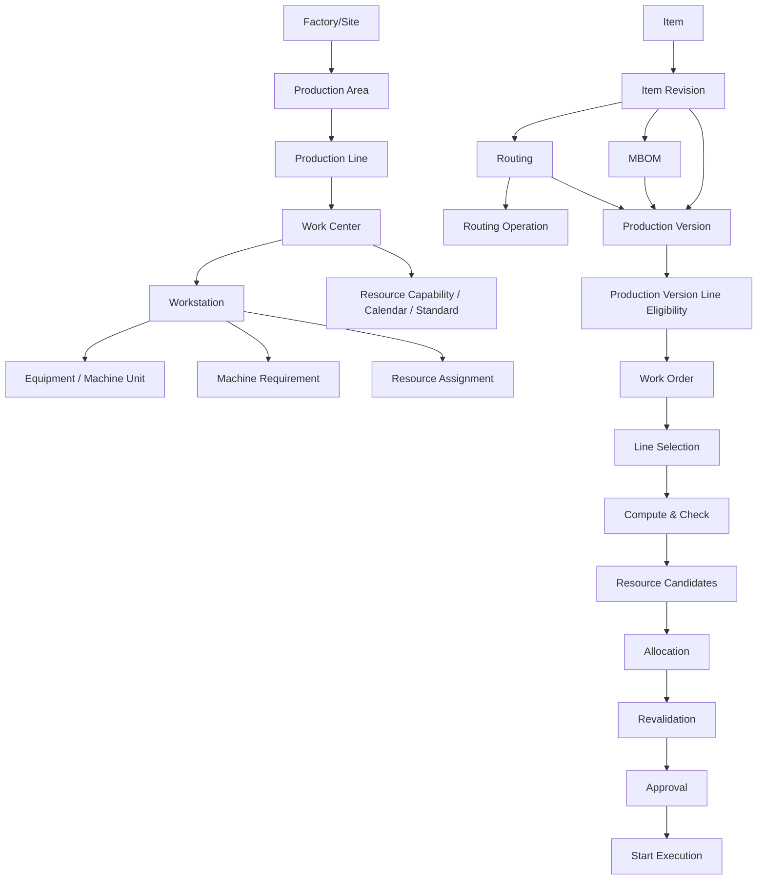

# MES Console - Hướng dẫn tính năng và kịch bản UAT đầy đủ cho mô hình hai dây chuyền

Tài liệu này được lập theo mã nguồn hiện tại của `services/mes-console`, các API trong `mes-master-data-service` và `mes-execution-service`, seed canonical mới nhất, và kết quả verify ngày 2026-08-02. Tài liệu dùng cho tester UAT, BA, QA automation và kỹ sư vận hành muốn kiểm thử đầy đủ luồng:

```text
Hiểu feature -> hiểu business object -> hiểu dependency -> chuẩn bị dữ liệu -> thao tác UI
-> quan sát API/backend result -> xác nhận expected behavior -> ghi evidence -> kết luận PASS/FAIL
```

Các nội dung liên quan Print Station hoặc hệ thống thứ ba được đánh dấu rõ. Theo verification hiện tại, strict print-station/third-party dispatch được bỏ qua theo yêu cầu; không được coi là đã pass UAT end-to-end với thiết bị vật lý.

## 1. Mục đích tài liệu

Tài liệu này vừa là hướng dẫn sử dụng MES Console, vừa là bộ kịch bản UAT thủ công cho mô hình một Work Order chọn đúng một Production Line. Hướng dẫn tính năng giải thích từng màn hình, object, field, nút, trạng thái và backend API. Kịch bản UAT chỉ ra tester phải thao tác theo thứ tự nào, nhập dữ liệu nào, kỳ vọng UI/API/database ra sao, evidence phải chụp gì và điều kiện PASS/FAIL.

Phạm vi MES Console hiện có gồm Work Order planning/execution preparation, master data sản phẩm, master data nhà máy/tài nguyên, labor/skill, planning constraints, print-station master data và i18n review. Các hệ thống tích hợp như WMS, QMS, physical printer adapter, Keycloak, Kong, Kafka nằm trong phạm vi quan sát hoặc prerequisite; không được sửa trực tiếp qua UAT trừ khi có hướng dẫn môi trường riêng.

Dữ liệu được coi là sẵn sàng khi `npm run reset:seed:verify:mes:canonical` pass, artifact verification có `40/40` checks pass, không có orphan, worker skill read model có đủ 4 nhân sự, và execution read model có `rm_labor_candidate_gaps = 0`. Work Order được coi là sẵn sàng khi có selected line, line status Ready, Compute & Check không có labor shortages/capacity blocker, mọi operation có allocation Committed/Valid, revalidation pass, và backend cho phép approval/start.

## 2. Bản đồ tính năng MES Console

| STT | Nhóm chức năng | Tên màn hình | Route | Business object | Công dụng | Vai trò trong full flow | Quyền truy cập | Trạng thái |
|---:|---|---|---|---|---|---|---|---|
| 1 | Operations | Work Orders | `/work-orders` | `wo_header` | Danh sách WO, lọc trạng thái, mở detail | Bắt đầu/quan sát flow WO | Keycloak user, header role qua gateway | IMPLEMENTED_AND_VERIFIED |
| 2 | Operations | Create Work Order | `/work-orders/new` | `wo_creation_workflow`, `wo_header` | Tạo WO từ Production Version Ready | Tạo snapshot, chọn line, tạo operation/material | PLANT_MANAGER/PROD_MANAGER style role | IMPLEMENTED_AND_VERIFIED |
| 3 | Operations | Work Order Detail | `/work-orders/:id` | `wo_header`, `wo_operation`, allocation, reservation | Compute, candidate, allocation, revalidate, approve, reject, start, replan | Trung tâm UAT | Role có quyền mutate WO | IMPLEMENTED_AND_VERIFIED, print start PARTIALLY_IMPLEMENTED |
| 4 | Product | Items / Item Revisions | `/master-data/items` | `md_item`, `md_item_revision` | Định danh sản phẩm và revision hiệu lực | Prerequisite cho MBOM; PV suy ra từ MBOM | Master Data role | IMPLEMENTED_AND_VERIFIED |
| 5 | Product | UOM | `/master-data/uoms` | `md_uom` | Đơn vị tính, decimal/fraction validation | Dùng cho item, MBOM, quantity WO | Master Data role | IMPLEMENTED_AND_VERIFIED |
| 6 | Product | Material Groups | `/master-data/material-groups` | `md_material_group` | Nhóm vật tư/sản phẩm | Phân loại item | Master Data role | IMPLEMENTED_AND_VERIFIED |
| 8 | Product | MBOM | `/master-data/mboms` | `md_mbom_header`, `md_mbom_line` | Manufacturing BOM | Authority cho material snapshot | Master Data role | IMPLEMENTED_AND_VERIFIED |
| 9 | Product | Routing | `/master-data/routings` | `md_routing_header` | Quy trình công nghệ | Authority cho operation snapshot | Master Data role | IMPLEMENTED_AND_VERIFIED |
| 10 | Product | Routing Operations | `/master-data/routings/:id/operations` | `md_routing_operation` | Sequence, Work Center, timing, label flags | Ràng buộc operation cho line evaluation | Master Data role | IMPLEMENTED_AND_VERIFIED |
| 11 | Product | Operation Catalog | `/master-data/operations` | `md_operation` | Danh mục operation | Operation master dùng trong Routing | Master Data role | IMPLEMENTED_AND_VERIFIED |
| 12 | Product | Production Version | `/master-data/production-versions` | `md_production_version` | Chọn MBOM + Routing; suy ra Revision/Site | Input duy nhất để tạo WO | Master Data role | IMPLEMENTED_AND_VERIFIED |
| 13 | Product | Production Version CRUD | `/master-data/production-versions/new`, `/:id/edit` | `md_production_version_line_eligibility` | Sửa PV và line eligibility | Xác định Primary/Backup | Master Data role | IMPLEMENTED_AND_VERIFIED |
| 14 | Factory | Factories/Sites | `/master-data/factories` | `md_site` | Site factory | Root của hierarchy | Master Data role | IMPLEMENTED_AND_VERIFIED |
| 15 | Factory | Shopfloors | `/master-data/shopfloors` | `md_shopfloor` | Shopfloor thuộc Site | Grouping cho area/line/resource | Master Data role | IMPLEMENTED_AND_VERIFIED |
| 16 | Factory | Production Areas | `/master-data/production-areas` | `md_production_area` | Khu vực sản xuất | Parent cho line/work center | Master Data role | IMPLEMENTED_AND_VERIFIED |
| 17 | Factory | Production Lines | `/master-data/production-lines` | `md_production_line`, `md_production_line_work_center` | Dây chuyền thực thi | Backend chọn một line hoàn chỉnh | Master Data role | IMPLEMENTED_AND_VERIFIED |
| 18 | Resource | Work Centers | `/master-data/work-centers` | `md_work_center` | Capability logic/capacity | Routing và line readiness | Master Data role | IMPLEMENTED_AND_VERIFIED |
| 19 | Resource | Workstations | `/master-data/workstations` | `md_workstation`, machine requirements | Điểm thao tác | Candidate resolution | Master Data role | IMPLEMENTED_AND_VERIFIED |
| 20 | Resource | Equipment/Machines | `/master-data/machines`, `/master-data/equipment` | `md_equipment`, `md_machine_unit` | Machine definition và physical unit | Allocation/capacity/reservation | Master Data role | IMPLEMENTED_AND_VERIFIED |
| 21 | Resource | Resource Assignments | `/master-data/resource-assignments` | `md_resource_assignment` | Quan hệ effective WC-WS-machine-unit | Candidate readiness | Master Data role | IMPLEMENTED_AND_VERIFIED |
| 22 | Planning | Resource Capabilities | `/master-data/resource-capabilities` | `md_resource_capability` | Operation compatibility | Candidate/line readiness | Master Data role | IMPLEMENTED_AND_VERIFIED |
| 23 | Planning | Resource Calendars | `/master-data/resource-calendars` | `md_resource_calendar` | Availability/capacity theo ngày | Capacity check | Master Data role | IMPLEMENTED_AND_VERIFIED |
| 24 | Planning | Production Standards | `/master-data/production-standards` | `md_production_standard` | Setup/cycle/yield/labor | Duration/capacity/compute | Master Data role | IMPLEMENTED_AND_VERIFIED |
| 25 | Planning | Operation Skill Requirements | `/master-data/operation-skill-requirements` | `md_operation_skill_requirement` | Skill bắt buộc theo operation | Labor readiness | Master Data role | IMPLEMENTED_AND_VERIFIED |
| 26 | Labor | Employees | `/employees` | `md_employee` | Nhân sự | Compute & Check labor assignment | Master Data role | IMPLEMENTED_AND_VERIFIED |
| 27 | Labor | Shifts | `/shifts` | `md_shift` | Ca làm việc | WO create và readiness | Master Data role | IMPLEMENTED_AND_VERIFIED |
| 28 | Labor | Work Calendar | `/work-calendar` | `md_employee_shift_schedule` | Lịch nhân sự | Worker candidate | Master Data role | IMPLEMENTED_AND_VERIFIED |
| 29 | Labor | Skills / Worker Skills | `/master-data/skills`, `/master-data/skills/workers` | `md_skill`, `md_employee_skill` | Kỹ năng và gán kỹ năng | Labor readiness | Master Data role | IMPLEMENTED_AND_VERIFIED |
| 30 | Admin | Reason Codes | `/master-data/reason-codes` | `md_reason_code` | Lý do reject/QC | Execution/QC future flow | Master Data role | IMPLEMENTED_NOT_FULLY_VERIFIED |
| 31 | Print | Print Stations | `/master-data/print-stations` | `md_print_station`, bindings | Bind Workstation với print station | Print readiness/dispatch | Master Data role | PARTIALLY_IMPLEMENTED |
| 32 | Admin | i18n Review | `/console/mes/i18n-review` | `i18n_data_quality_flag` | Kiểm tra label/error dịch | TC-27 | Admin/MD role | IMPLEMENTED_NOT_FULLY_VERIFIED |

## 3. Luồng nghiệp vụ tổng thể qua các màn hình



Site bắt buộc trước Area/Line/Work Center vì mọi resource phải cùng site. Production Line bắt buộc trước line eligibility vì backend chỉ chọn line Released, active, effective. Work Center bắt buộc trước Routing Operation, Resource Capability, Calendar và Standard; thiếu Work Center hoặc Work Center không thuộc line gây `LINE_MISSING_WORK_CENTER`. Workstation và Machine Requirement tạo execution point và điều kiện máy; thiếu assignment hoặc machine unit gây candidate Blocked. Item Revision là version sản phẩm; MBOM tạo material requirements; Routing tạo operation snapshot; Production Version kết hợp revision, MBOM, routing và line eligibility để tạo WO. Work Order create không cho browser tự chọn MBOM/Routing riêng lẻ. EBOM thuộc SAP và không có màn hình, API hoặc dữ liệu trong MES hiện tại.

## 4. Khái niệm quan trọng

| Khái niệm | Định nghĩa | Owner | Màn hình liên quan | Vai trò trong flow | Sai lầm thường gặp |
|---|---|---|---|---|---|
| Item | Định danh sản phẩm ổn định | Master Data | Items | Parent của revision | Dùng Item thay cho Revision khi tạo WO |
| Item Revision | Version/effectivity/UOM của Item | Master Data | Items | PV tham chiếu revision Released | Tạo WO bằng revision chưa Released |
| MBOM | BOM sản xuất | Master Data | MBOM | Tạo material snapshot | Sửa MBOM sau WO rồi kỳ vọng WO cũ đổi |
| Routing | Quy trình công nghệ | Master Data | Routing | Snapshot operation | Tạo routing riêng chỉ vì line khác |
| Routing Operation | Operation theo sequence và Work Center | Master Data | Routing Operations | Line readiness map từng operation | Gán WC không thuộc line |
| Production Version | Cấu hình sản xuất Released | Master Data | Production Versions | Input tạo WO | Chọn MBOM/Routing rời rạc trên UI |
| Production Line | Scope thực thi đầy đủ | Master Data | Production Lines | Backend chọn một line cho toàn WO | Mixed operation-line fallback |
| Primary/Backup | Ưu tiên line trong eligibility | Master Data | Production Version edit | Primary thử trước, backup khi primary blocked | Có nhiều primary |
| Work Center | Capability/capacity logic | Master Data/Execution read model | Work Centers | Routing và readiness | Nhầm với Workstation |
| Workstation | Điểm thao tác/operator | Master Data | Workstations | Candidate allocation | Nhầm requirement với assignment |
| Machine Definition | Loại/định nghĩa equipment | Master Data | Machines/Equipment | Candidate resource | Không có physical unit |
| Physical Machine Unit | Máy vật lý có serial/identity | Master Data | Machines | Reservation chống trùng | Gán unit OutOfService |
| Machine Requirement | Máy bắt buộc tại Workstation | Master Data | Workstations detail | Candidate readiness | Tạo assignment nhưng thiếu requirement |
| Resource Assignment | Quan hệ effective WS-WC-equipment-unit | Master Data | Resource Assignments | Candidate authority | Overwrite lịch sử thay vì end effectivity |
| Resource Capability | Operation compatibility | Master Data | Resource Capabilities | Chặn operation không tương thích | Capability sai product/site |
| Resource Calendar | Availability/capacity window | Master Data | Resource Calendars | Chặn unavailable/holiday/capacity | Calendar không phủ target date |
| Production Standard | Setup/cycle/yield/labor | Master Data/Execution read model | Production Standards | Duration, labor, capacity | Thiếu standard làm readiness Blocked |
| Candidate | Đề xuất resource advisory | Execution gọi Master Data | WO Detail | User chọn để commit | Tin candidate cũ sau refresh |
| Allocation | Cam kết runtime | Execution | WO Detail | Phải cover mọi operation | Allocation khác selected line |
| Capacity Reservation | Reservation chống overlap | Execution | Read-only evidence | Chặn WO cạnh tranh | Xóa DB thủ công |
| Snapshot | Bản sao tại WO creation | Execution | WO Detail | Bảo toàn lịch sử | Kỳ vọng master-data đổi WO cũ |
| Compute & Check | Tính duration/material/labor/capacity | Execution | WO Detail | Kiểm tra trước allocate/approve | Frontend tự tính readiness |
| Approval revalidation | Recheck allocation trước Release | Execution | WO Detail | Strict gate | Bỏ qua revalidate khi resource đổi |
| RESOURCE_HOLD | Không line nào complete feasible | Execution | WO Detail | Chặn allocation/approval/start | Cố allocate từng operation sang line khác |
| Replan | Đánh giá lại line trước start | Execution | WO Detail | Có audit, supersede allocations | Replan sau start |
| Lifecycle/effectivity | Released/Draft/Inactive + thời gian hiệu lực | Master Data | Hầu hết master data | Filter dữ liệu hợp lệ | Sửa Released in-place không version |
| Row version | Version optimistic lock | Execution | WO Detail | Replan/allocation stale detection | Submit tab cũ |
| Idempotency | Chống duplicate mutation | Execution | WO create/allocation | Retry an toàn | Dùng cùng key payload khác |

## 5. Quy tắc chung cho mọi màn hình

Mọi màn hình sử dụng tên đa ngôn ngữ làm thông tin chính, mã nghiệp vụ làm thông tin phụ; UUID không phải identity cho tester. Backend là authority cho readiness, validation, status và quyền mutate. Sau mọi Save/Release/Compute/Commit/Revalidate/Approve/Start, tester phải Refresh hoặc mở lại detail để chứng minh trạng thái persisted. Các màn hình master data dùng API base `/api/mes/master-data`; Work Order dùng `/api/mes/execution`. Header thực tế từ Console là `X-User-ID` và `X-Role-Code`; Keycloak token được quản lý bởi `AuthContext`.

## 6. Chi tiết các màn hình chính

### WO-01 - Work Order List

Mục đích: xem danh sách WO, lọc trạng thái `Draft`, `Approved`, `InProgress`, `Completed`, `Rejected`, mở modal detail hoặc detail page. Object: `wo_header`. API: `GET /api/mes/execution/work-orders?limit=50`, `GET /api/mes/execution/work-orders/:id`. Cột: WO code, Item, Quantity/UOM, Target Date, Status, Actions. Nút: Refresh tải lại danh sách; Create mở `/work-orders/new`; Detail mở modal và cho phép mở full page. Evidence: screenshot danh sách có WO code, status, selected line nếu detail mở được. Known limitation: list chưa phải bảng phân tích đầy đủ allocation/audit.

### WO-02 - Work Order Create

Mục đích: tạo WO bằng Production Version Ready. Object: `wo_creation_workflow`, `wo_header`, `wo_operation`, `wo_material_requirement`, line selection snapshot. API: `GET /production-ready-versions`, `POST /resource-planning/shift-candidates` (backend tự resolve), `GET /work-order-code-preview`, `POST /work-order-creation-workflows`, WebSocket `GET /ws/work-order-creation`, snapshot `GET /work-order-creation-workflows/:id`. Field bắt buộc: Production Version, Quantity, Target Date. Field read-only/backend sinh: WO preview code, workflow id, created WO code, Shift. Field phụ thuộc: đổi Target Date reload Production Version readiness; backend resolve Shift theo Production Version, Production Line, Work Center calendar và ngày mục tiêu. Expected: workflow đi qua request validation, master data readiness, create transaction, outbox queued; khi succeeded mở WO detail. Error thường gặp: Production Version không visible, `WORK_ORDER_SHIFT_NOT_RESOLVED` khi ngày mục tiêu không có shift/resource calendar hiệu lực, quantity ngoài min/max, workflow timeout.

### WO-03 - Work Order Detail

Mục đích: kiểm tra snapshot, line selection, Compute & Check, resource candidate, allocation, revalidate, approval, rejection, start execution, line replan. API: `GET /work-orders/:id`, `POST /compute-check`, `GET /operations/:opId/resource-candidates`, `POST /resource-allocation`, `POST /reallocate`, `DELETE /resource-allocation`, `POST /resource-allocations/revalidate`, `POST /approve`, `POST /reject`, `POST /start-execution`, `POST /line-replan`. Section: summary; production line planning; compute result; resource planning; operations; material requirements; reject modal; line replan modal. Field quan trọng: status, row_version, selected_production_line_code, line_selection_status, fallback_reason, evaluated_line_results, resource_allocation.validation_status. Control: Compute & Check, Approve, Reject, Replan line, Revalidate allocations, Start Execution, Select candidate, Reallocate, Cancel allocation. Expected: frontend không tự đổi readiness; mọi hành động lấy response backend.

### MD-01 - Product Definition group

Bao gồm Items, UOM, Material Groups, MBOM, Routing, Routing Operations, Operation Catalog, Production Versions. Owner: MES Master Data. Các màn hình dùng CRUD generic hoặc màn hình riêng (`ItemsScreen`, `MbomScreen`, `RoutingOperationsScreen`, `ProductionVersionScreen`). API chính: `GET/POST/PUT/DELETE /api/mes/master-data/<resource>`, release endpoints, MBOM validate/replace lines/substitutes và Production Version line eligibility. Vai trò: tạo cấu hình Released để `production-ready-versions` trả về dữ liệu Ready. Evidence: screenshot từng object Released, code, revision/effectivity, MBOM lines, Routing operations, PV eligibility.

### MD-02 - Factory and Resource group

Bao gồm Factories, Shopfloors, Production Areas, Production Lines, Work Centers, Workstations, Machines/Equipment, Resource Assignments. Owner: MES Master Data. API chính: CRUD resource foundation, `POST /production-lines/aggregate`, `GET /production-lines/:id`, `PUT /production-lines/:id/work-centers`, `PUT /production-lines/:id/resource-scopes`, `GET /work-centers/:id/headcount`, machine/unit detail, assignment history. Khi tạo Production Line mới, user thực hiện trên một form: chọn hierarchy, thêm Work Center, rồi thêm Workstation thuộc các Work Center đã chọn. Backend tạo Draft line, memberships và derived resource scopes trong cùng một transaction; lỗi bất kỳ phải rollback toàn bộ. `md_resource_assignment` vẫn là nguồn dữ liệu kỹ thuật để sinh scope, không phải một bước UI riêng. Vai trò: xác định line scope và resource thực tế. Với two-line UAT, mỗi line phải có đủ 4 Work Centers, 4 Workstations, 4 Equipment, 4 Machine Units, 4 Assignments. Evidence: detail của từng line hiển thị Work Centers; Workstation detail hiển thị machine readiness, requirements, assigned resources.

### MD-03 - Planning Constraints group

Bao gồm Resource Capability, Resource Calendar, Production Standard, Operation Skill Requirement. Owner: MES Master Data; một phần được project sang MES Execution. API: CRUD `/resource-capabilities`, `/resource-calendars`, `/production-standards`, `/operation-skill-requirements`. Vai trò: Compute & Check và candidate readiness dùng các record này. Missing capability gây `NO_EFFECTIVE_CAPABILITY`; missing calendar gây `CALENDAR_NOT_CONFIGURED` hoặc `CALENDAR_UNAVAILABLE`; missing standard gây `NO_EFFECTIVE_PRODUCTION_STANDARD`; missing worker skill gây `WORKER_CAPACITY_INSUFFICIENT`.

### MD-04 - Labor and Skills

Bao gồm Employees, Skills/Worker Skills, shift set riêng theo Work Center, Shifts và Work Calendar. Lệnh `npm run reset:seed:mes:wo-line-scenarios` tạo `WST-SEED-SK-PRODUCTION-OPERATOR`, 8 worker `WST-SEED-EMP-L1-01..04` và `WST-SEED-EMP-L2-01..04`, 8 shift set/assignment cho 8 WST Work Center và schedule `SHIFT-A` vào ngày target. Projection trong Execution là `rm_employee`, `rm_employee_skill`, `rm_employee_shift_schedule`, `rm_skill`; seed cũng tạo 12 operation skill requirements cho ba routing scenario. Vai trò: Compute & Check và line readiness phải nhận diện worker đúng Work Center, skill Active và schedule đúng ngày. Nếu UI hiển thị worker shortage khi target date là ngày seed, UAT FAIL.

### MD-05 - Print Stations

Mục đích: quản lý print station master và binding Workstation. API: `/print-stations`, `/print-stations/:id/workstations`, `/print-stations/:id/workstation-candidates`. Vai trò: một số operation base `PV-FG-WS-CM01-R1` có `requires_output_label=true`, print status Pending. Trạng thái: PARTIALLY_IMPLEMENTED vì physical printer runtime/third-party adapter không thuộc seed MES và đã được skip trong verification hiện tại. Tester chỉ xác nhận master binding; không kết luận printer physical dispatch pass.

## 7. Control/action matrix tóm tắt

| Control | Vị trí | Công dụng | Điều kiện enable | API/action | Kết quả mong đợi | Evidence |
|---|---|---|---|---|---|---|
| Create | Work Order List | Mở create WO | User authenticated | Navigate `/work-orders/new` | Form tạo WO | Screenshot form |
| Submit | WO Create | Tạo workflow | PV, quantity, target date, shift hợp lệ | `POST /work-order-creation-workflows` | Workflow accepted/succeeded | Network + workflow |
| Refresh | List/Detail | Tải lại backend state | Luôn có | `GET` detail/list | State persisted | Before/after screenshot |
| Compute & Check | WO Detail | Tính duration/material/labor/capacity | WO detail loaded | `POST /compute-check` | Labor shortages 0, assignments 4 với seed base | Response JSON |
| Select Candidate | Candidate panel | Commit allocation | Candidate Ready, no conflict | `POST /resource-allocation` | Allocation Committed | Candidate + allocation |
| Reallocate | Candidate panel | Supersede allocation cũ | Operation đã có allocation | `POST /reallocate` | Old Superseded, new Committed | Audit/history |
| Cancel Allocation | Operation card | Hủy allocation | Có allocation | `DELETE /resource-allocation` | Reservation released, audit giữ | Detail refreshed |
| Revalidate | Resource Planning | Recheck allocation | Có allocation | `POST /resource-allocations/revalidate` | valid true hoặc blocker rõ | Network response |
| Approve | Detail header | Release WO | Draft/Approved candidate coverage | `POST /approve` | Status Released | Approval log |
| Reject | Detail header | Reject WO | WO chưa terminal | `POST /reject` | Status Rejected | Modal reason |
| Start Execution | Resource Planning | Bắt đầu execution | Released/InProgress và guards pass | `POST /start-execution` | InProgress/queued ops | Response/outbox |
| Replan line | Line panel | Đánh giá lại line | Trước InProgress | `POST /line-replan` | Audit, allocations superseded/cancelled | Reason + response |

## 8. Field dependency matrix

| Parent field | Dependent field | Expected reset/filter behavior | Relevant screen |
|---|---|---|---|
| Target Date | Production Version list | Reload readiness by `planned_date`; PV không Ready biến mất | WO Create |
| Production Version | Target Date | Backend resolve Shift từ line eligibility và Work Center resource calendar | WO Create |
| Site | Area/Shopfloor/Line/WC | Options phải cùng site | Resource Foundation |
| Production Area | Production Line/Work Center | Line/WC phải cùng area khi field có trong form | Resource Foundation |
| Production Line | Work Centers | Detail line chỉ hiển thị effective active WCs | Production Lines |
| Routing Header | Routing Operations | Operations thuộc routing, ordered by sequence | Routing Operations |
| Item Revision | MBOM/PV | MBOM sở hữu Released/effective revision; PV suy ra revision từ MBOM | Product screens |
| Workstation | Machine Requirement/Assignment | Candidate chỉ Ready khi requirement và assignment khớp | Workstations, WO Detail |
| Operation | Capability/Standard/Skill Requirement | Missing record block readiness | Planning Constraints |

## 9. State dictionary

| Raw value | Nhãn VI/UI | Ý nghĩa | Action allowed | Action blocked | Next state |
|---|---|---|---|---|---|
| Draft | Nháp | Dữ liệu chưa release hoặc WO chưa approve | Edit, compute, allocate, reject, approve nếu đủ điều kiện | Start execution | Released/Rejected |
| Released | Đã release | Master data/WO đã được phê duyệt | Với WO: start execution; với MD: dùng cho planning | Sửa in-place nếu referenced | InProgress |
| InProgress | Đang thực thi | WO đã start | Operation execution | Replan line trực tiếp | Completed |
| Completed | Hoàn tất | Execution xong | Read-only | Replan/start/approve | Closed |
| Rejected | Bị từ chối | WO bị reject | Read-only/cleanup fixture | Start/approve | N/A |
| READY | Ready | Line complete feasible | Create/allocate/approve | N/A | Allocation |
| RESOURCE_HOLD | Resource Hold | Không line nào complete | Replan sau fix data | Allocate/approve/start | READY sau replan |
| Ready | Candidate Ready | Có thể commit | Select Candidate | N/A | Committed allocation |
| ReadyWithWarnings | Ready có cảnh báo | Có thể commit tùy policy | Select Candidate | Approval có thể strict check | Committed/Blocked |
| Blocked | Bị chặn | Missing capability/calendar/assignment/capacity | Fix MD/reload | Commit | Ready |
| Committed | Đã cam kết | Allocation active | Revalidate, cancel, reallocate | Duplicate mixed-line | Valid/Invalid/Superseded |
| Valid | Hợp lệ | Allocation revalidated | Approve | N/A | Released |
| Invalid | Không hợp lệ | Allocation stale | Reallocate/cancel | Approve/start | Valid |
| Superseded | Đã thay thế | Allocation cũ bị reallocate | Read-only evidence | Reuse directly | N/A |
| Cancelled | Đã hủy | Allocation/reservation released | Reallocate | Approve nếu thiếu coverage | Committed |

## 10. Canonical test data

Latest artifacts: seed `artifacts/mes-canonical-reset/2026-08-02T09-59-14-659Z/seed-result.json`, verification `artifacts/mes-canonical-reset/2026-08-02T09-59-22-109Z/verification-result.json`, full flow `artifacts/mes-canonical-reset/2026-08-02T09-59-26-515Z/full-flow-result.json`.

| Loại dữ liệu | Code |
|---|---|
| Site | `SITE-KZ3` |
| Areas | `AREA-RUBBER`, `AREA-MOLDING` |
| Base PV dùng Work Order UI full flow | `PV-FG-WS-CM01-R1` |
| Base line | `LINE-BASE-1` |
| Two-line PV | `WST-SEED-PV-SEAL-ASM-01` |
| Two-line primary | `WST-SEED-LINE-1` |
| Two-line backup | `WST-SEED-LINE-2` |
| Target date | `2026-08-03` |
| Shift | `SHIFT-A` |
| Workers | `EMP-MIX-001`, `EMP-VULCAN-001`, `EMP-VULCAN-002`, `EMP-QC-001` |

| Line | Work Centers |
|---|---|
| `LINE-BASE-1` | `WC-MIXING`, `WC-VULCAN-MOLD`, `WC-CUTTING`, `WC-QC` |
| `WST-SEED-LINE-1` | `WST-SEED-WC-L1-BINDING`, `WST-SEED-WC-L1-TEST5IN1`, `WST-SEED-WC-L1-AIRTEST` |
| `WST-SEED-LINE-2` | `WST-SEED-WC-L2-BINDING`, `WST-SEED-WC-L2-TEST5IN1`, `WST-SEED-WC-L2-AIRTEST` |

| Routing | Sequence | Operation | Work Center | Output label |
|---|---:|---|---|---|
| `RT-FG-WS-CM01-R1` | 10 | `OP-MIX` | `WC-MIXING` | true |
| `RT-FG-WS-CM01-R1` | 20 | `OP-PREP` | `WC-VULCAN-MOLD` | false |
| `RT-FG-WS-CM01-R1` | 30 | `OP-CUT` | `WC-CUTTING` | true |
| `RT-FG-WS-CM01-R1` | 40 | `OP-MOLD` | `WC-VULCAN-MOLD` | true |
| `RT-FG-WS-CM01-R1` | 50 | `OP-TRIM` | `WC-VULCAN-MOLD` | false |
| `RT-FG-WS-CM01-R1` | 60 | `OP-QC` | `WC-QC` | true |
| `WST-SEED-ROUTING-SEAL-ASM-01` | 10 | `WST-SEED-OP-BINDING` | `WST-SEED-WC-L1-BINDING` | false |
| `WST-SEED-ROUTING-SEAL-ASM-01` | 20 | `WST-SEED-OP-TEST5IN1` | `WST-SEED-WC-L1-TEST5IN1` | false |
| `WST-SEED-ROUTING-SEAL-ASM-01` | 30 | `WST-SEED-OP-AIRTEST` | `WST-SEED-WC-L1-AIRTEST` | false |
| `WST-SEED-ROUTING-SEAL-ASM-01` | - | Print operation omitted in default `no-print` seed | - | - |

| Worker | Work Center | Skill | Level | Schedule |
|---|---|---|---|---|
| `EMP-MIX-001` | `WC-MIXING` | `SK-WC-MIX-MASTER` | L3 | `2026-08-03 Scheduled` |
| `EMP-VULCAN-001` | `WC-VULCAN-MOLD` | `SK-WC-VULCAN-OPERATOR` | L2 | `2026-08-03 Scheduled` |
| `EMP-VULCAN-002` | `WC-VULCAN-MOLD` | `SK-WC-VULCAN-OPERATOR` | L2 | `2026-08-03 Scheduled` |
| `EMP-QC-001` | `WC-QC` | `SK-WC-INSPECTION` | L2 | `2026-08-03 Scheduled` |

## 11. Thứ tự UAT bắt buộc

1. Login và xác minh role.
2. Verify factory hierarchy.
3. Verify both Production Lines.
4. Verify resources for Line 1.
5. Verify resources for Line 2.
6. Verify product definition.
7. Verify Production Version.
8. Verify line eligibility.
9. Create WO.
10. Verify line selection.
11. Compute & Check.
12. Inspect every operation.
13. Commit every allocation.
14. Refresh.
15. Revalidate.
16. Approve.
17. Start Execution, bỏ qua phần physical print/third-party nếu môi trường không có.
18. Logout/login.
19. Verify persistence.
20. Cleanup bằng script exact cleanup hoặc reset canonical.

## 12. Kịch bản UAT TC-01 đến TC-29

Mỗi test case phải ghi Environment, Git commit, seed run ID, user role, screen, WO code nếu có, PV code, selected line, screenshot, API path/status, trace ID, response fields, read-only DB evidence, cleanup evidence và kết quả cuối.

### TC-01 - Xác minh toàn bộ Master Data của hai line

Mục tiêu: chứng minh `WST-SEED-LINE-1` và `WST-SEED-LINE-2` đều Released, active, có đủ 4 Work Centers, 4 Workstations, 4 Equipment/Machine Units, 4 Assignments, 4 Capabilities, 4 Calendars, 4 Standards. Screens: Production Lines, Work Centers, Workstations, Machines, Resource Assignments, Capabilities, Calendars, Standards. Expected: Line 1 primary, Line 2 backup; mọi row Released/Available/Identified. PASS khi UI và verification artifact khớp; FAIL nếu thiếu bất kỳ resource hoặc line có inactive row.

### TC-02 - Xác minh Item, Revision, MBOM, Routing và Production Version

Mục tiêu: chứng minh product definition đủ tạo WO. Dữ liệu: `WST-SEED-FG-SEAL-ASM-01-A`, `WST-SEED-MBOM-SEAL-ASM-01`, `WST-SEED-ROUTING-SEAL-ASM-01`, `WST-SEED-PV-SEAL-ASM-01`. Expected: MBOM có line `WST-SEED-MBOM-L01`; Routing có 4 operations; PV Released. Evidence: screenshot từng màn hình và API `/production-ready-versions`.

### TC-03 - Xác minh Production Version Line Eligibility

Mục tiêu: kiểm tra one-primary rule. Mở Production Versions, chọn `WST-SEED-PV-SEAL-ASM-01`, xem line eligibility. Expected: `WST-SEED-LINE-1` primary priority 1; `WST-SEED-LINE-2` backup priority 2; cả hai active/effective. Backend API: `GET /production-versions/:id/line-eligibility`. FAIL nếu có 0 hoặc >1 primary.

### TC-04 - Tạo WO khi Primary Line sẵn sàng

Bước: mở `/work-orders/new`; chọn `PV-FG-WS-CM01-R1` hoặc `WST-SEED-PV-SEAL-ASM-01` theo scope đang test; nhập quantity hợp lệ, target date `2026-08-03`, Shift `SHIFT-A`; submit. Expected API: `POST /work-order-creation-workflows` 2xx, workflow succeeded, WO detail mở. Với WST two-line, selected line phải là `WST-SEED-LINE-1`. Với base full-flow, selected line là `LINE-BASE-1`. Evidence: workflow steps, WO code, line selection panel.

### TC-05 - Compute & Check trên Primary Line

Bước: trong WO detail click Compute & Check. Expected: response có operations, material requirements, capacity warnings không blocking, `labor_shortages=[]`, base seed có 4 labor assignments. Evidence: panel compute result, network response `POST /compute-check`. FAIL nếu frontend hiển thị Ready nhưng response có blocker.

### TC-06 - Commit allocations cho toàn bộ operations của Primary Line

Bước: trong Resource Planning chọn từng operation, mở candidates, chọn candidate Ready, click Select Candidate. Expected API: `POST /operations/:opId/resource-allocation` hoặc `reallocate`, allocation status `Committed`, validation `Valid`, planned_production_line_id bằng selected line. Evidence: từng operation có allocation, reservation read-only, không có mixed-line.

### TC-07 - Approve và Start Execution trên Primary Line

Bước: click Revalidate, click Approve, sau Released click Start Execution. Expected: approval strict revalidates allocations và ghi event `MES.Execution.WOApproved.v1`; start chạy `POST /start-execution`. Limitation: với operation có print dependency, physical print-station/third-party dispatch được đánh dấu PARTIALLY_IMPLEMENTED/SKIPPED nếu môi trường không có adapter. PASS cho non-print gates; BLOCKED cho physical printer nếu chưa provision.

### TC-08 - Primary Line hết capacity, fallback sang Backup Line

Chuẩn bị bằng fixture/API tự động, không chỉnh DB thủ công. Tạo reservation/capacity conflict trên primary. Tạo WO WST. Expected: line panel hiển thị Primary Blocked, Backup Ready, selected `WST-SEED-LINE-2`, fallback reason `BACKUP_LINE_READY` hoặc primary blocked reason. PASS khi mọi operation thuộc backup; FAIL nếu mixed-line.

### TC-09 - Primary Machine Maintenance, fallback sang Backup Line

Chuẩn bị primary machine/unit maintenance/outage bằng màn hình Machines nếu action có exposed, nếu không dùng fixture tự động và đánh dấu API_ONLY. Expected: primary blocked bởi equipment/machine unit unavailable; backup selected. Sau test restore machine Available. Evidence: machine status before/after, WO line selection.

### TC-10 - Primary Line thiếu mandatory resource

Chuẩn bị thiếu assignment/capability/calendar/standard ở primary bằng fixture. Expected: backup selected nếu complete; nếu backup cũng thiếu thì RESOURCE_HOLD. PASS khi backend không chọn từng operation sang line khác.

### TC-11 - Both Lines Blocked

Chuẩn bị primary và backup đều thiếu mandatory resource/capacity. Expected: WO `line_selection_status=RESOURCE_HOLD`, candidate panel blocked, approval/start rejected. Evidence: line blockers và backend error `NO_COMPLETE_FEASIBLE_LINE` hoặc resource hold reason.

### TC-12 - Mixed-Line allocation rejection

UI phải lọc candidate theo selected line. Backend có trigger/migration bảo vệ `WO_LINE_MIXED_ALLOCATION_REJECTED`. Thử bằng API negative hoặc automation, không sửa DB trực tiếp. PASS khi backend từ chối mixed allocation/reservation.

### TC-13 - Stale candidate before commit

Mở candidate, thay đổi resource state bằng fixture, commit candidate cũ. Expected: `RESOURCE_CANDIDATE_STALE` hoặc validation conflict; UI yêu cầu refresh. PASS nếu stale không commit thành công.

### TC-14 - Resource becomes invalid after allocation before approval

Commit allocation, làm resource unavailable, click Revalidate hoặc Approve. Expected: revalidate invalid, approval reject `WO_RESOURCE_ALLOCATION_INVALID` hoặc blocker tương ứng. Restore fixture.

### TC-15 - Execution start without complete valid allocations

Tạo WO nhưng không allocate đủ hoặc cancel một allocation; click Start Execution nếu button có/hoặc API. Expected: backend reject, không chuyển InProgress. PASS khi UI/backend guard thống nhất.

### TC-16 - Cancel allocation

Commit allocation, click Cancel Allocation, confirm. Expected: allocation `Cancelled`, reservation released, audit/history giữ lại, operation cần allocation lại. Evidence: operation card và read-only DB evidence.

### TC-17 - Reallocate resource

Operation đã có allocation; mở candidates, chọn candidate khác Ready, click Reallocate. Expected: allocation cũ `Superseded`, allocation mới `Committed`, reservation mới, change reason recorded.

### TC-18 - Replan or change line before Release

Trước InProgress, click Replan line, nhập reason. Expected: API `POST /line-replan`, row_version checked, current allocations superseded/cancelled, line selection updated/audited. PASS nếu reason bắt buộc và stale row rejected.

### TC-19 - Change line after Release before Start

Policy implemented: replan Released trước start được audit và invalidates current allocations. Expected: UI modal hiển thị impact Released; backend accepts only before InProgress. PASS nếu snapshot/audit rõ.

### TC-20 - Reject line change after Start

Sau Start/InProgress, Replan line bị blocked hoặc API trả `WO_LINE_REPLAN_AFTER_START_REQUIRES_EXECUTION_SEGMENT`. PASS nếu snapshot line không đổi.

### TC-21 - Idempotency and duplicate-submit protection

WO create dùng `Idempotency-Key`; allocation dùng key theo endpoint/WO/op/resource/start. Duplicate same payload không tạo duplicate; same key payload khác phải fail. Evidence: network replay/API automation.

### TC-22 - Concurrent Work Orders

Tạo hai WO cùng resource/time. Expected: reservation conflict khiến WO sau fallback backup hoặc ResourceHold; không có double booking MachineUnit. Evidence: reservations và selected line.

### TC-23 - Persistence after refresh, browser restart, logout/login

Sau create/compute/allocation/approval, refresh browser, logout/login, mở lại WO. Expected: dữ liệu persisted từ backend; không mất selected line/allocation/status.

### TC-24 - Snapshot stability after new master-data version

Tạo WO, sau đó tạo version mới master data hoặc sửa effective future. Expected: WO cũ giữ snapshot; WO mới dùng config mới nếu effective. PASS nếu WO cũ không bị rewrite.

### TC-25 - Authorization matrix

Kiểm thử real Keycloak users theo môi trường. Current source dùng Keycloak roles và headers `X-Role-Code`; danh sách user thật cần xác nhận runtime. PASS khi unauthorized role không commit allocation/approve; nếu thiếu user fixture đánh dấu BLOCKED_ENVIRONMENT.

### TC-26 - Cross-site access denial

Nếu có multi-site user/resource fixture, thử truy cập/tạo dữ liệu khác site. Expected backend reject và UI hiển thị error dịch. Nếu seed chỉ có `SITE-KZ3`, đánh dấu NOT_COVERED cho environment này.

### TC-27 - Vietnamese translation and error rendering

Chuyển locale VI, gây các lỗi đã biết như stale candidate, capacity conflict, line resource hold. Expected không hiển thị `[object Object]`, raw UUID làm identity chính, hoặc enum raw không dịch ở critical path. Evidence: screenshot error.

### TC-28 - Async workflow and reconnect

Trong WO Create, submit rồi ngắt/reload khi workflow đang chạy. Expected WebSocket reconnect hoặc HTTP snapshot khôi phục events; không tạo duplicate WO. Evidence: workflow id, event sequence.

### TC-29 - Exact cleanup and rerun

Chạy cleanup/reset canonical bằng `npm run reset:seed:verify:mes:canonical`. Expected artifacts pass, `wo_header=0`, seed verification 40/40. Không cleanup bằng prefix lỏng hoặc chỉnh DB thủ công.

### TC-30 - Production Line aggregate and WO regression rerun (2026-08-08)

Đã chạy lại sau khi hợp nhất form tạo Production Line và cập nhật contract scope theo Workstation:

```bash
npm run test:e2e:resource-planning:phase6
```

Kết quả: `6 passed`, `0 failed`. Bộ test bao phủ form tạo, ràng buộc Site/Shopfloor/Area, loại dây chuyền, tạo aggregate Work Center + Workstation atomic, rollback Workstation không hợp lệ, accordion navigation, readiness/resource scope của line Released và selector Resource Calendar.

Sau đó reset/seed/verify canonical dataset bằng `npm run reset:seed:verify:mes:canonical`, rồi chạy flow tạo WO:

```bash
MES_TWO_LINE_UAT_DIR=/tmp/mes-phase7-final-20260808 npm run test:mes:two-line-resource-planning:phase7
```

Kết quả Phase 7: `PASS`, 4/4 scenario gồm primary-ready, primary-alternative-ready, backup-fallback và resource-hold. Cleanup xác nhận `0` Work Order, `0` reservation và `0` allocation còn lại.

Lưu ý kiến trúc: UI gửi Workstation scope; backend derive các `md_resource_assignment` đang hiệu lực trong cùng transaction. Không yêu cầu người dùng tạo resource assignment riêng trong flow Production Line.

## 13. Page-to-flow traceability

| Feature | Business purpose | Required before WO? | Used planning? | Used execution? | Test cases | Failure impact |
|---|---|---:|---:|---:|---|---|
| Production Version | Authoritative manufacturing config | Yes | Yes | Yes | TC-02, TC-04 | WO cannot be created |
| Line Eligibility | Primary/backup decision input | Yes | Yes | No | TC-03, TC-08 | RESOURCE_HOLD or wrong line |
| Resource Calendar | Time availability | Yes | Yes | Yes | TC-01, TC-08, TC-14 | Candidate blocked |
| Production Standard | Setup/cycle/labor/yield | Yes | Yes | Yes | TC-01, TC-05 | Compute invalid |
| Worker Skills | Labor readiness | Yes for labor check | Yes | No | TC-05, TC-27 | Labor shortages |
| Allocation | Runtime commitment | No | Yes | Yes | TC-06, TC-16 | Approval/start rejected |
| Revalidation | Freshness gate | No | Yes | Yes | TC-14 | Stale allocation passes only if bug |

## 14. UI action-to-API matrix

| UI action | Screen | API | Method | Expected status | Persistence effect | Error codes |
|---|---|---|---|---|---|---|
| Load ready PV | WO Create | `/api/mes/master-data/production-ready-versions` | GET | 200 | None | `WORK_ORDER_MASTER_DATA_INCOMPLETE` |
| Submit WO | WO Create | `/api/mes/execution/work-order-creation-workflows` | POST | 202/200 | Creates workflow and WO | `PRODUCTION_VERSION_REQUIRED`, `WORKFLOW_START_FAILED` |
| Compute | WO Detail | `/work-orders/:id/compute-check` | POST | 200 | Updates compute result/operation fields | `WO_ROUTING_SNAPSHOT_MISSING`, `WO_WORKER_READINESS_QUERY_FAILED` |
| Get candidates | WO Detail | `/work-orders/:id/operations/:opId/resource-candidates` | GET | 200 | None | `WO_LINE_RESOURCE_HOLD`, `SHIFT_REQUIRED` |
| Commit allocation | WO Detail | `/resource-allocation` | POST | 200 | Allocation, reservation, audit/outbox | `RESOURCE_CANDIDATE_STALE`, `RESOURCE_CAPACITY_CONFLICT` |
| Revalidate | WO Detail | `/resource-allocations/revalidate` | POST | 200 | Updates validation status | `WO_LINE_MIXED_ALLOCATION_REJECTED` |
| Approve | WO Detail | `/approve` | POST | 200 | WO Released, approval log, outbox | `WO_RESOURCE_ALLOCATION_INVALID` |
| Reject | WO Detail | `/reject` | POST | 200 | WO Rejected, approval log | `WO_NOT_FOUND` |
| Start execution | WO Detail | `/start-execution` | POST | 200 | WO InProgress / dispatch outbox | `WO_OPERATION_ALLOCATION_MISSING` |
| Replan | WO Detail | `/line-replan` | POST | 200 | Audit, line reselection, allocations superseded | `WO_LINE_REPLAN_VERSION_CONFLICT` |

## 15. UI-to-database evidence matrix

| UI state | Owning service | Table/read model | Read-only evidence |
|---|---|---|---|
| PV visible as Ready | Master Data | `md_production_version`, `md_production_version_line_eligibility` | Query count and `/production-ready-versions` |
| Selected line displayed | Execution | `wo_header.selected_production_line_code` | WO detail API |
| Operation line stable | Execution | `wo_operation.production_line_code` | WO detail operations |
| Allocation committed | Execution | `wo_resource_allocation` | WO detail operation allocation |
| Reservation exists | Execution | `wo_capacity_reservation` | Read-only DB query |
| Labor assignments | Execution | `wo_operation_labor_assignment`, `rm_employee*` | Compute response |
| Approval log | Execution | `wo_approval_log` | WO detail/API/DB evidence |

## 16. Manual UAT to Playwright coverage

| Manual UAT | Existing Playwright spec | Coverage | Missing automation |
|---|---|---|---|
| TC-01/TC-03 two-line master data | `e2e/resource-planning/phase6-production-lines.spec.ts`, `phase8-two-line-console.spec.ts` | PARTIALLY_AUTOMATED | Full screenshot evidence |
| TC-02 product definition | `phase4-product-definition.spec.ts` | PARTIALLY_AUTOMATED | MBOM/Routing/PV UI deep evidence |
| TC-04-TC-07 WO flow | `resource-planning-flow.spec.ts`, `phase3-resource-planning.spec.ts` | PARTIALLY_AUTOMATED | Physical print station |
| TC-08-TC-12 fallback/blocked/mixed-line | `phase8-two-line-console.spec.ts` | PARTIALLY_AUTOMATED | Manual UI fixture toggles |
| TC-21-TC-22 idempotency/concurrency | `work-order/numbering.spec.ts`, `concurrency/resource-planning-concurrency.spec.ts` | PARTIALLY_AUTOMATED | Multi-browser role matrix |
| TC-25-TC-26 auth/cross-site | none confirmed | NOT_COVERED | Real Keycloak/site fixtures |
| TC-29 cleanup/rerun | reset/seed/verify scripts | FULLY_AUTOMATED | None |

## 17. Troubleshooting

### Seed theo trạng thái Print Station

Mỗi lệnh dưới đây đều reset và seed lại dữ liệu MES test:

- `npm run reset:seed:mes:wo-line-scenarios:no-print`: mặc định cho UAT WO, routing có 3 công đoạn và không tạo Print Station operation.
- `npm run reset:seed:mes:wo-line-scenarios:with-print`: kiểm thử riêng integration print, routing có thêm công đoạn Packing.

Hai chế độ không dùng chung dữ liệu runtime; hãy chạy lại đúng chế độ trước mỗi bộ test.

Production Version không visible: kiểm tra lifecycle Released, effectivity, MBOM/Routing/line eligibility, API `/production-ready-versions`, seed verification. Line Eligibility không visible: mở PV edit, gọi `/production-versions/:id/line-eligibility`, kiểm tra one-primary. No line selected: kiểm tra `line_selection_status`, blockers `NO_RELEASED_EFFECTIVE_LINE_ELIGIBILITY`, `NO_COMPLETE_FEASIBLE_LINE`. No Ready candidate: kiểm tra Workstation, Machine Requirement, Assignment, Capability, Calendar, Standard, Shift. Machine Unit unavailable: mở Machines, kiểm tra execution_status, active, physical_identity_status, planning flag. Calendar unavailable: kiểm tra Resource Calendar cho target date/shift. Stale candidate: refresh WO, mở lại candidate. Capacity conflict: kiểm tra reservations và concurrent WO. Approval rejected: chạy Revalidate và đọc `WO_RESOURCE_ALLOCATION_INVALID`. Execution rejected: kiểm tra Released status, allocation coverage, selected line consistency, print dispatch limitation. Untranslated error/raw UUID: ghi TC-27 bug với screenshot và response.

DevTools: mở Network, lọc `/api/mes`, click request, ghi method/path/status, request payload, response error/code, `Idempotency-Key`, `X-Trace-ID` nếu có. Không lưu token trong evidence; redact Authorization/Keycloak token khi export HAR.

## 18. Acceptance

PASS tổng thể chỉ khi mọi Critical scenario pass, không có mandatory skipped scenario trừ phần đã phân loại rõ là third-party/physical print skipped, UI/backend thống nhất, không có mixed-line allocation, fallback deterministic, both-line blocked an toàn, refresh/login persistence pass, authorization pass trong môi trường có user fixture, cleanup pass, canonical seed vẫn valid 40/40, regression hiện có green.

FAIL hoặc BLOCKED nếu tester không xác định được cách dùng màn hình bắt buộc, required controls thiếu tài liệu, UI báo Ready nhưng backend Blocked, mixed-line allocation persist, fallback chọn line không complete, stale resource vẫn approve/start, authorization fail, hoặc không có fixture môi trường cho scenario bắt buộc.

## 19. Transport của pipeline tạo WO

MES Console đọc trạng thái pipeline bằng HTTP snapshot `GET /work-order-creation-workflows/:id` theo chu kỳ ngắn và backoff khi gateway tạm thời không đọc được. UI không phụ thuộc vào WebSocket/WSS cho workflow tạo WO, vì pipeline này là tiến trình ngắn, trạng thái đã được lưu bền vững trong execution database và HTTP đi qua Kong/Cloudflare ổn định hơn.

Endpoint WebSocket backend vẫn được giữ để tương thích với các client khác, nhưng không phải transport chính của MES Console. Nếu pipeline thất bại, snapshot HTTP vẫn là nguồn sự thật và UI hiển thị step lỗi, mã lỗi, chi tiết kỹ thuật và mã tham chiếu.

Lộ trình tạo dữ liệu từ database trống đến WO nằm tại `docs/testing/MES-CONSOLE-FROM-EMPTY-DATABASE-TO-WO-UAT-VI.md`.
