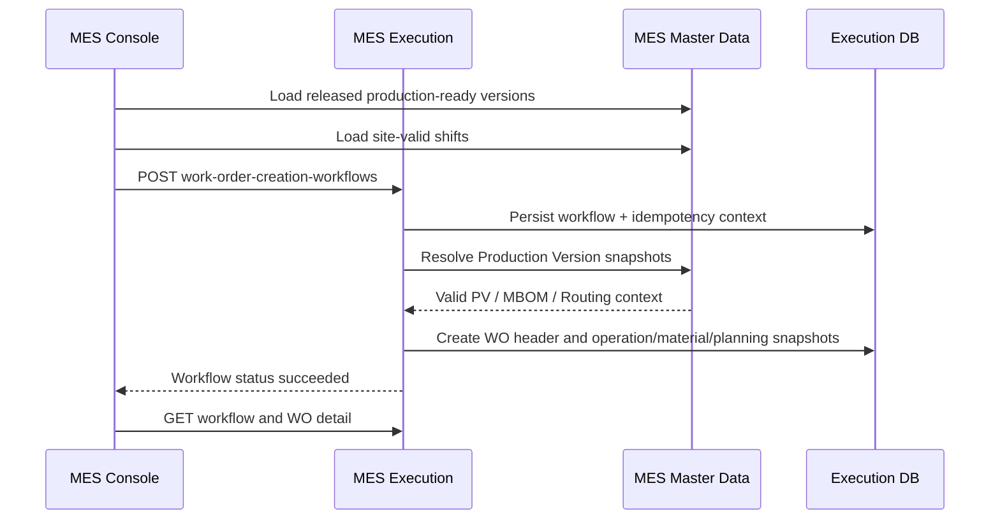
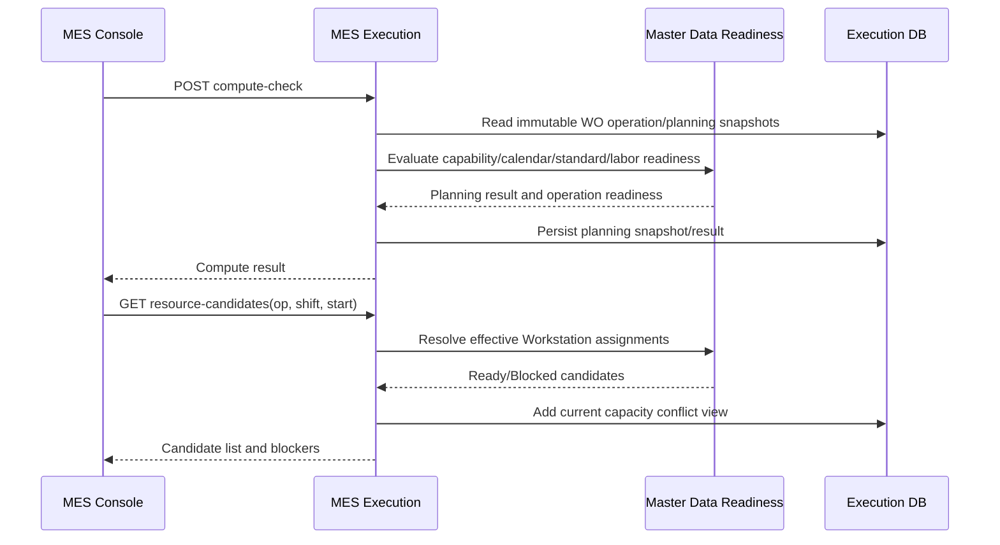
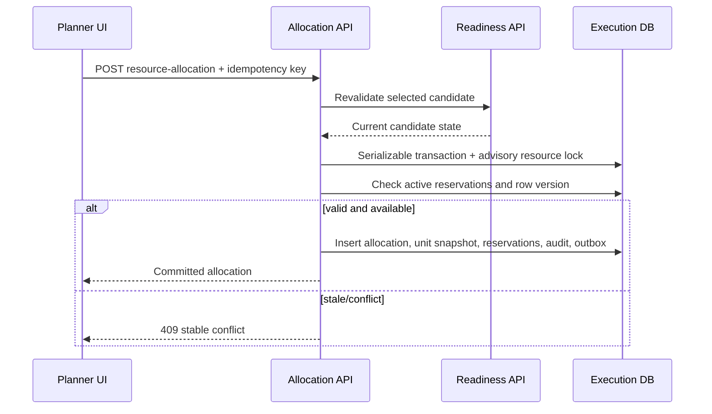
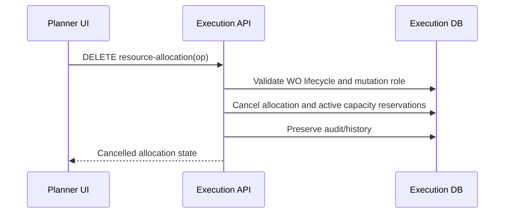
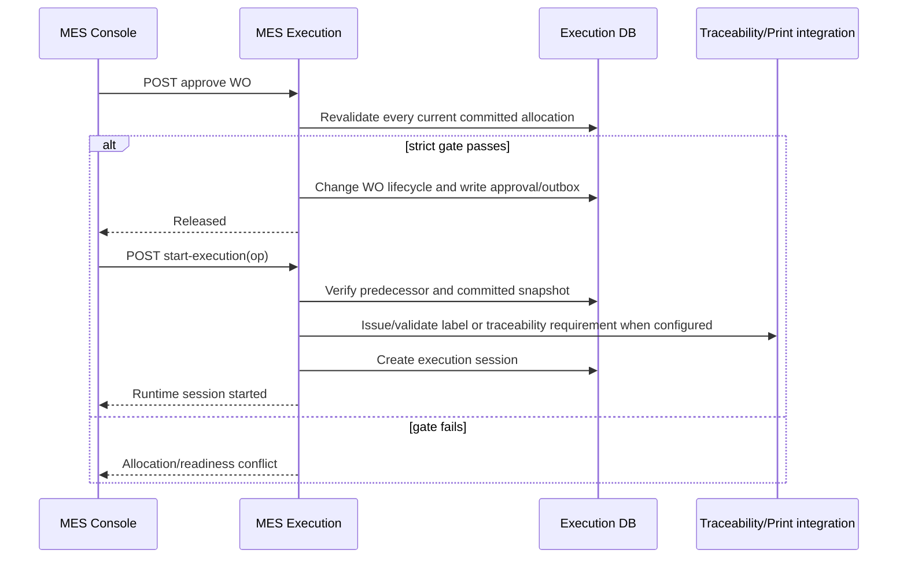

# Resource Planning Design Verification

## Executive Summary

The repository already contains the Phase 2 readiness service and the Phase 3 Work Order resource-allocation flow. The running development stack exposes the readiness, candidate, allocation, revalidation, and execution routes. The current implementation is therefore **partially implemented and runtime-proven at API level**, but it did not have one maintained full-flow validation script or a browser E2E covering Work Order creation through committed allocation.

The authoritative flow remains manual planning: a released Production Version creates a Work Order, each Work Order operation resolves its snapshotted Work Center, the backend returns Ready/Blocked candidates, a planner selects a Ready candidate, and a transactional allocation persists the Workstation, Equipment, exact machine-unit snapshot, reservations, audit, and outbox event.

## Current Running Architecture

- MES Console: `http://100.68.50.41:13052`.
- MES Master Data: `http://100.68.50.41:13020`, readiness owned by `POST /api/mes/master-data/resource-planning/readiness`.
- MES Execution: `http://100.68.50.41:13030`, Work Order and allocation lifecycle owned by `mes-execution-service`.
- Routing selects the Work Center. Work Order planning resolves Workstations under that Work Center; runtime allocation remains separate from master Resource Assignment.
- Workstation requirements describe required machine type/role/quantity. `md_resource_assignment` resolves effective physical assignments. `wo_resource_allocation` records the resource committed to a Work Order operation.
- No APS, scoring, automatic scheduling, or optimization is part of this flow.

## Existing Entities and Tables

- Master data: `md_routing_header`, `md_routing_operation`, `md_work_center`, `md_workstation`, machine requirement/group tables, `md_resource_assignment`, physical machine unit tables, capability/calendar/production-standard/skill requirement tables.
- Execution: `wo_header`, `wo_operation`, `wo_material_requirement`, `wo_resource_allocation`, `wo_capacity_reservation`, `wo_resource_allocation_audit`, `wo_resource_allocation_idempotency`, Work Order creation workflow/outbox tables.
- Allocation rows are historical: replacement supersedes the prior allocation and reservations are cancelled; the current row is not overwritten without audit.

## Existing APIs

- `POST /api/mes/execution/work-order-creation-workflows` creates a Work Order asynchronously from `production_version_id` and `shift_id`.
- `GET /api/mes/execution/work-orders/{id}` returns Work Order operation snapshots and current allocation projection.
- `POST /api/mes/execution/work-orders/{id}/compute-check` calculates operation planning and labor results.
- `GET /api/mes/execution/work-orders/{id}/operations/{opId}/resource-candidates` returns readiness and capacity-classified candidates.
- `POST /api/mes/execution/work-orders/{id}/operations/{opId}/resource-allocation` performs transactional candidate revalidation and commit with idempotency.
- `POST /api/mes/execution/work-orders/{id}/resource-allocations/revalidate` verifies all current committed allocations.
- `POST /api/mes/execution/work-orders/{id}/approve` calls allocation revalidation and blocks release if the strict gate is not satisfied.
- `DELETE /api/mes/execution/work-orders/{id}/operations/{opId}/resource-allocation` cancels an editable allocation while preserving audit/history.

## Existing UI

`WOCreateScreen` loads only released, effective Production Versions and site-valid shifts. `WODetailScreen` already displays Compute & Check, operation planning, candidate cards, readiness/blocking reasons, and Select and Commit. The resource-planning area currently uses page-local markup and lacked stable selectors for browser verification; those selectors are added as a testability-only refinement.

## Existing Scripts and Tests

- `scripts/seed-mes-wo-complete-dataset.mjs` owns a deterministic released Product/Revision/EBOM/MBOM/Routing/Production Version and Draft WO fixture, including capability, standards, calendars, skills, WMS stock, and print prerequisites.
- `scripts/reset-mes-wo-test-data.mjs` is the destructive, guarded Work Order cleanup owner.
- Machine browser E2E is maintained at `e2e/machine/machine-flow.spec.ts` and remains separate.
- Before this change there was no single `scripts/test-mes-resource-planning-flow.mjs` or `e2e/resource-planning` suite.

## Confirmed Working Parts

- Production-ready API returns the current released fixture with matching Item Revision, MBOM, Routing, Site, and UOM.
- Master readiness and candidate resolution are implemented with structured blocking/warning data.
- Allocation uses serializable transaction, advisory resource locks, current readiness revalidation, capacity reservations, audit, outbox, and idempotency.
- Compute & Check and Work Order creation already persist planning snapshots and shift context.
- Existing Go tests, MES Console build, machine browser E2E, machine flow API verification, and machine data verification pass in the current workspace.

## Missing Parts

- A maintained resource-planning API flow script with explicit safety guard, Ready/Blocked assertions, persistence assertions, idempotency assertion, and cleanup.
- A browser E2E that creates a Work Order through the real Console, opens the detail page, observes candidate states, commits each operation, refreshes, and verifies the allocation projection.
- Stable test selectors and a documented browser run command.

## Architectural Inconsistencies

- Candidate response uses both `Ready`/`ReadyWithWarnings` and `Eligible` in different layers; the UI must treat only `Blocked` as non-selectable and preserve the backend readiness value for display.
- The Work Order detail UI still contains the old manual material-staging action for non-demo WOs. This is outside resource planning and is not changed here.
- The browser UI does not expose exact unit selection as a separate control; the selected candidate's authoritative primary/supporting machine-unit mapping is committed by the backend. The E2E verifies the persisted unit snapshot instead of inventing a client-side allocation model.

## Data Integrity Risks

- A stale candidate can become invalid between GET and POST; allocation therefore must continue revalidating in the transaction.
- Shared demo WOs can hold reservations and make a candidate appear Blocked. Disposable browser runs must be identified and cleaned by exact Work Order ID.
- Historical Released WOs are not rewritten by the test flow.

## Implementation Risks

- Browser login requires Keycloak credentials and a reachable Console/API origin.
- Cloudflare URLs are not required for local server E2E; the configured LAN Console URL and gateway API are preferred.
- A physical printer or WMS is not required to verify resource planning allocation, but the independent print flow must not be changed by this work.

## Recommended Minimal Design

Keep the existing readiness and allocation services as the only ownership model. Add only verification tooling, stable UI selectors, and focused tests. Do not add a new planner entity, duplicate machine relationship, score, scheduler, or alternate allocation endpoint.

## Step-by-Step Implementation Plan

1. Add this source-of-truth audit report.
2. Add one guarded API verification script that uses the current Work Order creation endpoint, checks Ready and Blocked candidate behavior, allocates through the real API, verifies persistence/idempotency, and cleans only its own Work Order.
3. Add stable resource-planning selectors to the existing Work Order Console screens.
4. Add a serial Playwright flow using the real Console and Keycloak login; use the API only for assertions and exact cleanup.
5. Add the use-case catalog and browser run guide.
6. Rebuild MES Execution and Console, run Go/frontend/API tests, then run browser E2E against the LAN URL.

## Blockers

No source-level blocker was found. Runtime browser execution is conditional on `MES_E2E_USERNAME`, `MES_E2E_PASSWORD`, and `ALLOW_E2E_MUTATION=true`; without those credentials the API/build verification can run but the browser mutation test must be reported as skipped.

## Final Initial Assessment

The minimal target architecture is already present and should be preserved. The gap is verification completeness and browser observability, not a need for a new resource-planning subsystem. Implementation proceeds with additive test tooling and selectors only.

---

# Enterprise Design Verification Addendum

This addendum extends the original architecture inventory. It records ownership and verification boundaries without replacing the original findings.

## 1. Domain Boundaries

| Domain | Responsibilities | Owned entities / state | Owned APIs | Explicitly not owned |
|---|---|---|---|---|
| Master Data | Define effective manufacturing resources and product configuration used by planning. | Item Revision, MBOM, Routing, Production Version, Work Center, Workstation, Machine Definition, Physical Machine Unit, Machine Requirement, Resource Assignment, Capability, Calendar, Production Standard, Shift, Skill. | `/api/mes/master-data/*`, including readiness and production-ready configuration APIs. | WO lifecycle, committed WO allocations, runtime sessions, inventory ledger, quality results. |
| Machine Flow | Maintain machine definitions, physical units, requirements, assignments, lifecycle and readiness facts. | Equipment/Machine Definition, Machine Unit, Machine Requirement Group/Line, effective `md_resource_assignment`, assignment history. | Machine, unit, workstation, requirement, assignment, and readiness routes under Master Data. | Choosing a resource for a particular WO operation; execution sessions. |
| Resource Planning | Resolve candidates and commit/cancel/revalidate resources for a WO operation and time window. | Candidate response, `wo_resource_allocation`, `wo_capacity_reservation`, allocation audit, allocation idempotency, allocation snapshots. | Candidate GET, allocation POST, reallocate POST, cancel DELETE, revalidate POST under Execution. | Editing Master Data assignments, changing Routing, changing physical machine state, starting execution. |
| Execution | Own WO creation workflow, snapshots, lifecycle, approval gate, operation execution and dispatch. | `wo_header`, `wo_operation`, material snapshots, planning snapshots, creation workflow, execution session, confirmations, execution outbox. | WO creation workflow, detail, Compute & Check, approve, start/confirm/abort, print retry. | Master-data definitions, WMS stock truth, QMS disposition, physical printer driver state. |
| Material | Own inventory truth, availability, reservation/staging decisions and MES material status integration. | WMS inventory ledger/read model, outbound material request parent/lines, staging and fulfilment state. | WMS inventory/outbound APIs and integration events. | Resource candidate readiness, machine assignment, operation timing, WO resource allocation. |
| Quality | Own inspection plans/results, nonconformance and disposition. | QMS inspection and nonconformance aggregates. | QMS inspection/nonconformance APIs. | Machine readiness, capacity reservations, MBOM ownership, WO resource selection. |
| Traceability | Own labels, genealogy, serial/lot trace and label output integrations. | Label instances, genealogy records, print/traceability state. | Traceability client APIs called by Execution and Print Station integration. | Resource capacity, WMS inventory truth, Workstation assignment. |

## 2. Ownership Matrix

| Entity | Owner | Mutable | Historical |
|---|---|---:|---:|
| Machine Definition | Master Data / Machine Flow | Yes while lifecycle permits | Lifecycle/audit retained |
| Physical Machine Unit | Master Data / Machine Flow | Yes through controlled state transitions | Yes |
| Workstation Machine Requirement | Master Data / Machine Flow | Yes before lifecycle lock | Effective history where applicable |
| Resource Assignment | Master Data / Machine Flow | End/replacement, not arbitrary historical overwrite | Yes |
| Candidate | Execution Resource Planning projection | No durable business ownership; recalculated | No, request-time result |
| Resource Allocation | Execution Resource Planning | Current allocation can be superseded/cancelled under policy | Yes, audit and prior rows retained |
| Capacity Reservation | Execution Resource Planning | Status changes with allocation lifecycle | Reservation history follows allocation |
| Allocation Snapshot | Execution / Work Order | No after commit/release | Yes, immutable WO evidence |
| Work Order Header | Execution | Lifecycle-controlled | Yes |
| Work Order Operation Snapshot | Execution | No after snapshot except execution state | Yes |
| Execution Runtime Session | Execution | State transitions only | Yes |
| Production Version | Master Data | Draft/editable; Released is lifecycle-controlled | Yes |
| MBOM | Master Data | Draft/editable; Released is immutable by policy | Yes |
| Routing | Master Data | Draft/InReview editable; Released protected | Yes |
| Inventory Ledger | WMS Material | Append/movement controlled | Yes |
| Inspection Result | QMS Quality | Controlled workflow | Yes |
| Label/Genealogy Record | Traceability | Append/workflow controlled | Yes |

## 3. Business Invariants

The following invariants are evidenced by the current schema/use cases and are required for any future change:

1. A Work Order is created from an authoritative `production_version_id`; its operation/material/planning configuration is snapshotted.
2. Production Version, MBOM, Routing, and Item Revision ownership must match before the production configuration is usable.
3. `md_resource_assignment` is the effective Workstation-to-equipment/unit relationship; Work Order allocation must not mutate it.
4. A candidate is advisory until the allocation transaction revalidates it against current Master Data and capacity state.
5. A committed allocation must contain the selected Workstation/Equipment context and the exact primary/supporting machine-unit snapshot returned by readiness.
6. Exclusive overlapping reservations cannot coexist for the same resource; the losing transaction returns a controlled conflict.
7. Allocation idempotency replay with the same user/key/request hash returns the same logical result; the same key with a different request is a conflict.
8. Reallocation supersedes/cancels the previous current allocation and reservation rather than silently overwriting history.
9. Execution approval/revalidation must not treat a stale or missing committed allocation as valid.
10. Execution uses the committed WO allocation snapshot, not a newly resolved Master Data assignment.
11. Historical Released Work Orders are not repaired or rewritten when current Master Data changes.
12. Destructive E2E cleanup uses exact UUIDs and must leave no target Work Order or allocation rows.
13. Viewer/unauthorized roles cannot create, reallocate, or cancel resource allocations; the API returns HTTP 403.
14. PostgreSQL serialization conflicts are exposed as the stable `RESOURCE_CAPACITY_CONFLICT` business error, not internal SQL text.

## 4. Runtime Sequence Diagrams

### Work Order Creation



### Compute & Check and Candidate Resolution



### Allocation Commit



### Allocation Cancellation



### Approval and Execution Startup



## 5. Event Flow

| Transition | Boundary | Current behavior |
|---|---|---|
| Released Production Version -> Work Order | UI to Execution, then Execution to Master Data/DB | Synchronous request starts an asynchronous creation workflow; snapshots are persisted before success. |
| Work Order -> Compute & Check | UI to Execution | Synchronous calculation and persistence of planning/labor result. |
| Planning -> Candidate | UI to Execution to Master Data | Synchronous readiness query; capacity is augmented from Execution reservations. |
| Candidate -> Allocation | UI to Execution DB | Synchronous serializable transaction; allocation audit and an Execution outbox event are written atomically. |
| Allocation -> projection/integration | Execution outbox -> platform event transport | Asynchronous boundary; consumers must be idempotent. |
| Allocation -> Approval | UI to Execution DB | Synchronous current revalidation; strict approval blocks missing/invalid allocations. |
| Approval -> Execution | Execution lifecycle/outbox -> runtime consumers | Approval audit/outbox is durable; execution starts only after snapshot guards pass. |
| Execution -> Traceability/Print | Execution to Traceability/Print integration | Synchronous client calls and/or asynchronous print events depending on configured operation; printer runtime remains outside Resource Planning ownership. |
| Material status -> operation readiness | WMS events -> MES projection | Asynchronous integration; material readiness must remain operation-specific and must not block material-free operations. |

## 6. Complete Business Use-Case Inventory

### Machine Flow

| ID | Description | Preconditions | Expected result | Current implementation | Browser E2E |
|---|---|---|---|---|---|
| M-001 | Create Machine Definition | Active Site and Work Center | Definition appears with generated code | Implemented | Passed |
| M-002 | Required-field validation | Create form open | Empty save remains on form | Implemented | Passed |
| M-003 | Edit Definition | Existing draft/editable machine | Values hydrate and update | Implemented in UI | Missing |
| M-004 | Delete/deactivate protection | References may exist | Dependency rule prevents unsafe action | Implemented API/UI | Missing |
| M-005 | Duplicate code/name/invalid data | Existing fixture | Stable validation, no duplicate | API partial | Missing |
| M-010 | Create Physical Unit | Machine Definition exists | Unit persists and refreshes | Implemented | Passed |
| M-011 | Duplicate serial/asset | Existing unit identity | 409 validation, one row | Serial implemented | Passed serial |
| M-012 | Edit/delete unit | No protected history for success path | Safe update/delete or dependency error | API partial | Missing |
| M-013 | Unit state transitions | Unit exists | Maintenance/out-of-service/planning rules apply | Implemented API | Partial |
| M-020 | Machine requirement | Workstation create/edit | Requirement persists with role/quantity | Implemented | Passed |
| M-021 | Effective assignment end | Assignment exists | Ended row retained; readiness changes | Implemented | Passed |
| M-022 | Invalid/overlap assignment | Conflicting resource/effectivity | Request rejected transactionally | API implemented | Missing |
| M-030 | Requirement quantity/duplicate | Requirement editor open | Quantity and duplicate rules enforced | UI/API partial | Partial |
| M-040 | Ready readiness | Effective assignment and eligible unit | Ready with quantity summary | Implemented | Passed |
| M-041 | Blocked readiness variants | Missing/maintenance/OOS/non-planning unit | Block reason is shown | Implemented API | Partial |
| M-050 | Exact cleanup/deletion protection | Disposable namespace | Children removed, references protected | Implemented | Passed |

### Resource Planning

| ID | Description | Preconditions | Expected result | Current implementation | Browser E2E |
|---|---|---|---|---|---|
| RP-001 | Create WO from Released PV | Released PV and shift | WO snapshots are created | Implemented | Passed |
| RP-002 | Invalid quantity/date/shift/PV | Create form | UI/API rejects invalid input | Partial | Quantity passed |
| RP-003 | Duplicate submit/idempotency | Same request key | One logical workflow/WO | API implemented | Partial |
| RP-010 | Ready candidate | Complete resource chain | Ready candidate selectable | Implemented | Passed |
| RP-011 | Blocked/no candidate | Missing readiness dependency | Meaningful empty/block reason | Implemented API | Partial |
| RP-012 | Wrong/inactive/missing Workstation | Invalid routing/resource relation | Backend rejects candidate | Implemented API | Missing |
| RP-020 | Machine readiness variants | Requirement state mutation | Candidate blocked with stable reason | Implemented API | Partial |
| RP-030 | Compute/validate/commit/refresh | Ready candidates | Committed snapshot survives refresh | Implemented | Passed |
| RP-031 | Cancel/replan | Editable allocation | Reservation ends; replacement reason enforced | Implemented API | Missing |
| RP-040 | Capacity windows | Multiple time windows | Boundary/non-overlap rules are correct | Partial | Partial |
| RP-050 | Simultaneous commit | Two WOs share exclusive unit | One succeeds, one 409 | Implemented | Passed |
| RP-051 | Stale candidate/assignment/workstation | Mutate after candidate GET | Commit rejects stale state | Implemented API | Missing |
| RP-060 | Execution with committed snapshot | Valid allocation | Runtime uses exact snapshot | Implemented | Missing |
| RP-061 | Execution without/cancelled allocation | Missing/cancelled allocation | Start is blocked | Implemented API | Missing |
| RP-070 | Planner mutation authorization | Planner role | Allocation mutation allowed | Implemented API | Partial |
| RP-071 | Viewer/operator/cross-site denial | Restricted role/scope | 403 and no mutation | API guard implemented | Skipped Viewer browser |
| RP-080 | Sequential numbering | Valid PV/shift | Unique WO business code | Implemented | Passed |
| RP-081 | Concurrent numbering | Two creation requests | Unique WO business codes | Implemented | Passed |
| RP-090 | Cleanup/retry/no orphan | Disposable IDs | Zero target rows after cleanup | Implemented | Passed |

## 7. Validation Matrix

| Validation | UI | API | Database | Browser E2E |
|---|---|---|---|---|
| Invalid/zero quantity | Disabled/visible validation | Creation workflow rejects | No WO snapshot committed | Passed zero quantity |
| Duplicate machine serial | Form error | 409 stable error | Unique identity constraint | Passed |
| Missing machine assignment | Blocked readiness card | Candidate/approval rejects | No valid allocation snapshot | Partial |
| Inactive Workstation | Candidate filtered/blocked | Readiness rejects | Lifecycle/effective state remains unchanged | Missing browser |
| Capacity conflict | Candidate shows conflict | 409 `RESOURCE_CAPACITY_CONFLICT` | Reservation uniqueness/transaction lock | Passed concurrent case |
| Duplicate allocation replay | UI idempotent action | Same response for same key/hash | Idempotency row prevents duplicate | API/smoke evidence |
| Stale candidate | Refresh/error state expected | Transaction revalidation rejects | No invalid allocation row | Missing browser |
| Invalid shift/site | Select only site-valid shifts | Backend validates shift/site | No invalid WO context | Partial |
| Unauthorized allocation | Controls should be hidden/disabled | HTTP 403 `RESOURCE_ALLOCATION_FORBIDDEN` | No allocation/reservation row | API probe; browser skipped |
| Cancelled allocation execution | Action state reflects cancellation | Start guard rejects | Reservation cancelled, audit retained | Missing browser |

## 8. Edge Case Matrix

| Edge case | Current protection | Browser status |
|---|---|---|
| Stale readiness | Candidate is revalidated inside allocation transaction | Missing |
| Stale Workstation/assignment | Master readiness is queried again before insert | Missing |
| Concurrent allocation | Serializable transaction plus advisory resource lock | Passed |
| Concurrent WO creation | Database-backed numbering/idempotent workflow | Passed |
| Browser refresh after commit | Detail refetch shows committed state | Passed |
| Logout/login persistence | Backend persists allocation; UI rehydration case not isolated | Missing |
| Cleanup retry | Exact-ID cleanup transaction; multi-ID output and zero-row assertion | API/script verified |
| Shared fixture reservation | Disposable WOs are cleaned by exact UUID | Passed |
| PostgreSQL serialization failure | Mapped to stable 409 business error | Passed |
| Missing Viewer account | Test skips before mutation with explicit reason | Skipped |

## 9. Current Browser E2E Coverage

The current executable declarations are seven tests: two Machine tests and five Resource Planning tests. The latest verified run is:

```text
Declared: 7
Executed: 6
Passed: 6
Failed: 0
Skipped: 1
```

The skipped test is Viewer authorization because the required Keycloak account is not configured. It is not counted as covered.

The current business inventory contains 35 tracked machine/resource use-case rows in this report. Fifteen are implemented and executed as passing browser declarations or verified grouped flows; one authorization declaration is skipped; the remainder are partial or missing. Based on the tracked inventory, current browser coverage is approximately 43% of inventoried use-case rows. Based on executable declarations, the run pass rate is 100% of executed tests, but this must not be confused with full business coverage.

Detailed matrices:

- `docs/testing/browser-e2e-usecase-inventory.md`
- `docs/testing/browser-e2e-coverage-matrix.md`
- `docs/testing/mes-resource-planning-e2e-matrix.md`

## 10. Recommended Enterprise Playwright Structure

```text
e2e/
  common/
    auth/
    fixtures/
    pages/
    helpers/
    cleanup/
    api/
    selectors/
  machine/
    definition/
    unit/
    assignment/
    requirement/
    readiness/
    deletion/
    ui/
  resource-planning/
    work-order/
    candidate/
    readiness/
    allocation/
    capacity/
    concurrency/
    execution/
    authorization/
    ui/
    cleanup/
  execution/
  regression/
    smoke/
    full/
```

The current suite has begun this structure with focused Machine UI, Resource Planning concurrency, and Work Order numbering specs. Shared auth/page-object extraction should follow once the missing state fixtures are available; duplicating helpers prematurely would make test setup harder to audit.

## 11. Traceability Matrix

| Business rule | Backend API / owner | Frontend screen | Browser E2E |
|---|---|---|---|
| Only released effective PV can create WO | Master Data production-ready API + Execution workflow | `WOCreateScreen` | RP-001 smoke |
| WO contains immutable operation/resource context | Execution workflow/detail | `WODetailScreen` | RP-001/030 smoke |
| Machine unit identity is unique | Master Data machine unit API/DB | Machine detail form | M-010/M-011 |
| Requirement and effective assignment are distinct | Master Data workstation/assignment APIs | Workstation create/detail | M-020/M-021 |
| Candidate must be Ready before selection | Master Data readiness + Execution candidates | WO Resource Planning tab | RP-010/020 smoke |
| Allocation revalidates current candidate | Execution resource-allocation POST | Select and Commit action | RP-030 and RP-050 |
| Exclusive overlapping resource cannot be double-allocated | Execution transaction/reservation | Candidate/commit UI | RP-050 concurrency |
| Idempotency prevents duplicate allocation | Execution allocation idempotency table/API | Commit action | RP-030 API/smoke evidence |
| Allocation persists exact unit snapshot | Execution allocation/detail API | Allocation status/detail | RP-030 smoke |
| Authorization blocks Viewer mutation | Execution allocation API | Resource Planning controls | RP-071 API probe; browser skipped |
| Work Order numbering is unique | Execution numbering transaction | WO creation | RP-080/RP-081 numbering |
| Cleanup must not delete shared data | Exact-ID cleanup scripts/DB | Test harness | RP-090 cleanup output |
| Execution requires committed allocation | Execution start API | WO operation execution UI | RP-060/RP-061 missing browser |

## 12. Final Assessment

| Dimension | Assessment |
|---|---|
| Architecture completeness | Strong for the current manual planning scope. Ownership boundaries, snapshots, reservations, locks, idempotency, and lifecycle separation are present. |
| Business completeness | Partial. Stale-state, cancellation/replan, execution, material readiness, and full role/scope behavior require more fixtures and verification. |
| Browser E2E completeness | Partial. Six of seven executable declarations pass; one authorization case is skipped, and many inventory cases are not yet implemented. |
| Runtime/API verification | Strong for the verified happy path, idempotency, numbering, capacity conflict, cleanup, and mutation guard. |
| Remaining implementation gaps | Viewer/Operator/Cross-Site fixture provisioning, cancellation/replan browser path, execution guard browser path, stale resource mutations, material integration completion. |
| Remaining verification gaps | Full Machine CRUD edge matrix, Resource Planning state matrix, logout/login persistence, capacity boundaries, and CI execution with isolated accounts/databases. |

Resource Planning is **not fully verified**. The architecture is suitable for the current manual planner model, but the browser E2E coverage does not yet match the complete documented business-use-case inventory.
