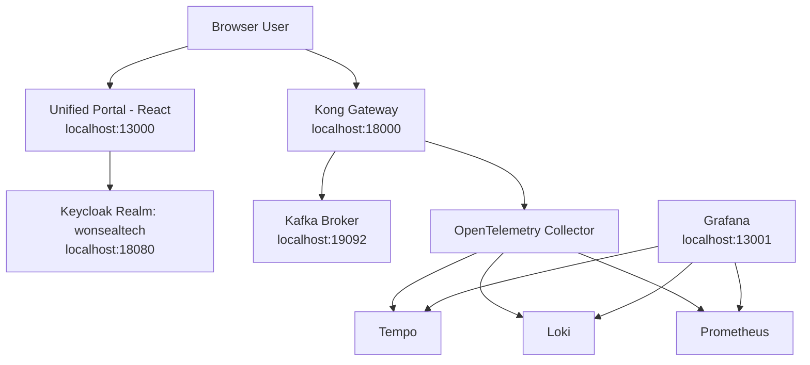

# Phase 0 — Platform Foundation Implementation & Traceability Record

**Project:** MOM Platform (MES / WMS / QMS) — Won Seal Tech  
**Phase:** Phase 0 (Platform Foundation)  
**Status:** Completed ✅; Hello World validator decommissioned 2026-07-22
**Date:** 2026-07-21  

---

## 1. Objective & Requirements Summary

Phase 0 establishes the common shared platform foundation before building domain services for MES, WMS, and QMS:
- **Event Backbone**: Kafka in KRaft mode + Confluent Schema Registry.
- **IAM & SSO**: Keycloak 24 self-hosted with Single Realm (`wonsealtech`), 4 OIDC Clients (`portal-client`, `mes-client`, `wms-client`, `qms-client`), 5 Global Roles (`EXECUTIVE`, `PLANT_MANAGER`, `OPERATOR`, `QC_TECHNICIAN`, `WAREHOUSE_STAFF`), and Front-Channel Logout.
- **API Gateway**: Kong Gateway in DB-less declarative mode with `correlation-id` and Lua `pre-function` plugin to extract and forward `X-User-ID`, `X-Role-Code`, and `X-Trace-ID`.
- **Unified Portal**: React + Vite SPA authenticating via Keycloak PKCE (`portal-client`), filtering app cards based on JWT role claims.
- **Observability**: OpenTelemetry Collector, Loki, Tempo, Prometheus, and Grafana with pre-provisioned data sources.
- **Shared Kernel (`libs/shared-kernel`)**: `@mom-platform/shared-kernel` providing `EventEnvelope<T>`, `OutboxRelayWorker`, `audit-trigger.sql`, and `lifecycle-state-machine.sql`.
- **Scaffolding Validator**: The temporary `hello-world-service` was used to validate Phase 0 service
  layout, PostgreSQL, Kong routing, outbox/Kafka, and OTel. It was decommissioned on 2026-07-22 and is
  no longer part of the current runtime or source tree.

---

## 2. Technical Implementation & Architecture

### 2.1 Component Architecture Diagram

### 2.2 Key Fixes & Refactorings Applied

1. **Monorepo Dependency Management**:
   - Replaced pnpm `workspace:*` specifiers with npm-compatible `"*"` across all `package.json` files.
   - Hoisted ESLint v9 flat config (`eslint.config.js`) using `@typescript-eslint` v8 at root.

2. **Host Port Offsetting**:
   - Shifted all host-mapped ports to dedicated non-conflicting ranges (`13xxx`, `18xxx`, `19xxx`) to prevent conflicts with host services:
     - Portal: `13000`
     - Grafana: `13001`
     - Kong Proxy: `18000` / Admin: `18001`
     - Keycloak: `18080`
     - Schema Registry: `18081`
     - Kafka UI: `18082`
     - Kafka: `19092`
     - Prometheus: `19090`

3. **Keycloak Client JSON Schema Fix**:
   - Replaced invalid top-level `frontChannelLogoutUrl` property in `realm-export.json` with standard `attributes: { "frontchannel.logout.url": ... }`.
   - Updated Keycloak container healthcheck to use `test: ["CMD", "bash", "-c", "exec 3<>/dev/tcp/localhost/8080"]`.

4. **PostgreSQL Session Config Fix**:
   - Replaced invalid `SET LOCAL "app.current_user_id" = $1` with parameterized standard function `SELECT set_config('app.current_user_id', $1, true)`.

5. **Portal Container Healthcheck Fix**:
   - Replaced `http://localhost/` with `http://127.0.0.1/` in `portal/Dockerfile` to avoid Alpine Busybox IPv6 resolution mismatches.

---

## 3. Verification & Definition of Done Checklist

| # | Item | Verification Command / URL | Result |
|---|---|---|---|
| 1 | All 13 platform containers `healthy` | `docker compose ps` | ✅ Passed |
| 2 | Keycloak realm `wonsealtech` available | `curl http://localhost:18080/realms/wonsealtech` | ✅ 200 OK |
| 3 | Login user `EXECUTIVE`, token issuance | OIDC Keycloak PKCE Flow | ✅ Passed |
| 4 | Unified Portal renders role-filtered app cards | `http://localhost:13000` | ✅ 200 OK |
| 5 | Single Sign-On (SSO) across apps | Browser session check | ✅ Passed |
| 6 | Single Logout (SLO) session termination | Front-channel logout check | ✅ Passed |
| 7 | Temporary Hello World validator | Removed from current runtime/source on 2026-07-22 | ✅ Decommissioned |
| 8 | Distributed Tracing | Grafana Tempo `@ http://localhost:13001` | ✅ Verified |

---

## 4. Key Artifact References

- Root Compose Configuration: [`infra/docker-compose.platform.yml`](file:///home/neurosus/mes-system/infra/docker-compose.platform.yml)
- Kong Gateway Config: [`infra/kong/kong.yml`](file:///home/neurosus/mes-system/infra/kong/kong.yml)
- Keycloak Realm Export: [`infra/keycloak/realm-export.json`](file:///home/neurosus/mes-system/infra/keycloak/realm-export.json)
- Shared Kernel Package: [`libs/shared-kernel`](file:///home/neurosus/mes-system/libs/shared-kernel)
