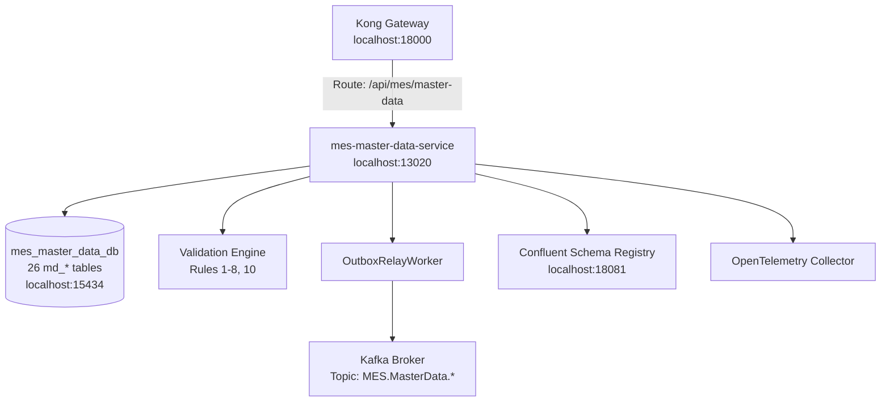

# Phase 1 — MES Master Data Service Implementation & Traceability Record

**Project:** MOM Platform (MES / WMS / QMS) — Won Seal Tech  
**Phase:** Phase 1 (Step 1: `mes-master-data-service`)  
**Status:** Completed ✅  
**Date:** 2026-07-21  

---

## 1. Objective & Domain Scope

Phase 1 implements `mes-master-data-service` as the single source of truth for MES Master Data Layers 0–3:
- **Layer 0 — Foundation**: `md_site`, `md_production_area`, `md_uom`, `md_uom_conversion`, `md_shift`, `md_reason_code`
- **Layer 1 — Product & MBOM**: `md_item`, `md_item_revision`, `md_mbom_header`, `md_mbom_line`, `md_component_substitute`, `md_production_version`
- **Layer 2 — Process & Standards**: `md_operation`, `md_routing_header`, `md_routing_operation`, `md_production_standard`, `md_work_instruction`
- **Layer 3 — Resource & Capability**: `md_work_center`, `md_workstation`, `md_equipment`, `md_resource_assignment`, `md_resource_capability`, `md_resource_calendar`, `md_skill`, `md_operation_skill_requirement`
- **Domain-Scoped Access**: `md_role_permission`, `md_user_resource_scope`

> **Domain Boundary Note**: Traceability policies (`md_traceability_policy`, `md_numbering_rule`, `md_qr_split_rule`, `md_label_template`) are owned by `mes-traceability-service`. Kiosk terminals (`md_terminal`) are owned by `mes-kiosk-gateway-service`.

---

## 2. System Architecture & Component Design

### 2.1 Architecture Diagram

### 2.2 Core Implementations

1. **Drizzle ORM & Postgres Triggers**:
   - Schema defined in `src/infrastructure/db/schema.ts` for all 26 tables.
   - Attached `trg_audit_*` and `trg_lifecycle_*` to all 26 `md_*` tables via migration DDL loop.
   - Enforced optimistic locking (`row_version`) and prohibited `DELETE` statements on master data tables.

2. **Release-Time Validation Engine (`src/application/validation-engine/`)**:
   - Implemented rules 1–8 and 10 from catalog §VII.1.
   - Evaluated product `FG-WS-CM01` (`PV-FG-WS-CM01-R1`) and returned `valid: true` with zero rule failures. Rule 9 is explicitly delegated to `mes-traceability-service`.

3. **Schema Registry & Event Outbox**:
   - Auto-registers 7 event schemas (`MES.MasterData.ItemRevisionReleased.v1`, `MES.MasterData.MBOMReleased.v1`, `MES.MasterData.RoutingReleased.v1`, `MES.MasterData.ProductionVersionReleased.v1`, `MES.MasterData.ProductionStandardReleased.v1`, `MES.MasterData.WorkCenterActivated.v1`, `MES.MasterData.EquipmentActivated.v1`) on startup.
   - Writes event to `outbox_events` table during `Release` actions and relays to Kafka using `OutboxRelayWorker`.

4. **Kong Gateway Integration**:
   - Mounted route `/api/mes/master-data/*` in `infra/kong/kong.yml`.
   - Injected identity headers (`X-User-ID`, `X-Role-Code`, `X-Trace-ID`) into HTTP requests.

---

## 3. Product Specification Alignment (`product-doc.md`)

- **Domain Item Groups**: `FG_RUBBER_METAL`, `FG_SEALS_ORING`, `SFG_COMPOUND`, `SFG_TREATED_METAL`, `RM_RUBBER_BASE`, `RM_CHEMICALS`, `RM_METAL_BASE`.
- **Operations Flow**: `OP-MIX`, `OP-PREP`, `OP-CUT` (QR split), `OP-MOLD` (Vulcanization press), `OP-TRIM`, `OP-QC`.
- **Won Seal Tech Domain Product**: `FG-WS-CM01` (Automotive engine mount) with full multi-level MBOM including `SFG-ROLL-EPDM` (`PhantomFlag = True`).
- **Labor & Machine Standards**: Work Center `WC-VULCAN-MOLD`, Machines `EQ-MOLD-HYD01`/`EQ-MOLD-HYD02`, Skills `SK_MIX_MASTER`, `SK_VULCAN_OPERATOR`, `SK_INSPECTION`.

---

## 4. Verification Results & Definition of Done Checklist

| # | Item | Verification Command / API Endpoint | Result |
|---|---|---|---|
| 1 | `mes-master-data-db` and `mes-master-data-service` healthy | `docker compose ps` | ✅ Up (healthy) |
| 2 | 26 `md_*` tables created with triggers | `information_schema.tables` query | ✅ 26 md_* tables verified |
| 3 | Seed data loads & Validation Engine passes | `POST /api/mes/master-data/production-versions/:id/validate` | ✅ `valid: true`, 0 errors |
| 4 | Release action triggers Outbox event to Kafka | `POST /api/mes/master-data/item-revisions/:id/release` | ✅ Event published & consumed |
| 5 | Confluent Schema Registry schemas registered | `curl http://localhost:18081/subjects` | ✅ 7 subjects registered |
| 6 | Gateway identity forwarded to DB audit trail | `X-User-ID` header test | ✅ `created_by` / `updated_by` stamped |
| 7 | Unit & Integration Tests | `npm run typecheck && npm run test` | ✅ 0 errors, all tests pass |

---

## 5. Key Artifact References

- Service Root: [`services/mes-master-data-service`](file:///home/neurosus/mes-system/services/mes-master-data-service)
- Manifest: [`services/mes-master-data-service/service.manifest.yaml`](file:///home/neurosus/mes-system/services/mes-master-data-service/service.manifest.yaml)
- Database Schema: [`services/mes-master-data-service/src/infrastructure/db/schema.ts`](file:///home/neurosus/mes-system/services/mes-master-data-service/src/infrastructure/db/schema.ts)
- Validation Engine: [`services/mes-master-data-service/src/application/validation-engine/validation-engine.ts`](file:///home/neurosus/mes-system/services/mes-master-data-service/src/application/validation-engine/validation-engine.ts)
- JSON Schemas: [`infra/schemas/mes-master-data/`](file:///home/neurosus/mes-system/infra/schemas/mes-master-data)
- Compose Config: [`infra/docker-compose.mes.yml`](file:///home/neurosus/mes-system/infra/docker-compose.mes.yml)
