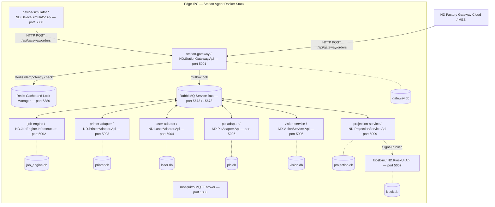
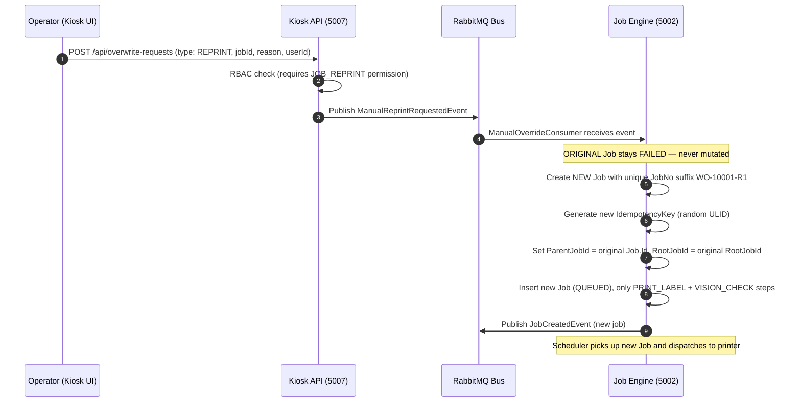
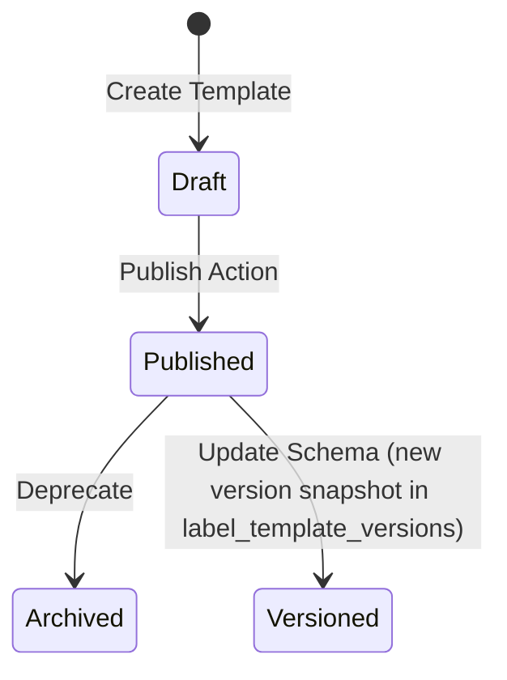

# AI_CONTEXT.md - Canonical Full Context for AI Agents (Print Marking Station Agent)

Last updated: 2026-07-26
Repository: `/Users/hoabui/Desktop/mes-ricoh-system/print-marking/station-agent`
Project: ND Station Agent — Industrial Edge Print & Marking Platform
Audience: AI agents, engineers, architects, and maintainers continuing this codebase.

This is the first file to read before making changes in this repository. It consolidates:

- Product demand and domain descriptions from `print-marking/` documentation directory.
- Current workload, roadmap, and process prompts from `print-marking/project_audit_progress_report.md`.
- Strategy and tech-stack decisions from `print-marking/ANTIGRAVITY.md` and `print-marking/CLAUDE.md`.
- Current implementation records from `print-marking/` markdown files.
- Runtime topology, services, ports, event contracts, and engineering rules.

This document is intentionally long. It is designed to let a new AI agent understand the system without
needing to rediscover the whole repository from scratch.

---

## 0. Source Of Truth Rules

Do not treat any single prompt as current truth by itself.

Use this precedence order exactly:

1. Running source code (C# .NET 9, React/Vite/TypeScript).
2. Service manifests and `docker-compose.yml` in `station-agent/`.
3. `docker-compose.yml` and environment variable configuration files.
4. SQLite database schemas via EF Core migrations in each service.
5. Automated and integration tests if present.
6. API controllers, domain handlers, RabbitMQ consumers, and producers.
7. Implementation records in `print-marking/*.md` files.
8. Current progress tracker: `print-marking/project_audit_progress_report.md`.
9. This `AI_CONTEXT.md`.
10. Domain description and design notes in `print-marking/` documentation.

Prompt files describe intended work at a point in time. Implementation records and source code describe
what actually exists. Some design docs are deliberately historical and may still mention
older planned structures or pre-refactor behavior.

### Evidence status vocabulary

Every new claim added to this context must be classified with one of these statuses. Do not convert a
product requirement or process instruction into an implemented fact without evidence:

- `IMPLEMENTED_AND_VERIFIED`: source exists and a repeatable build, test, runtime, API, or database check passed.
- `IMPLEMENTED_BUT_NOT_TESTED`: source exists but verification is still missing.
- `PARTIALLY_IMPLEMENTED`: some required behavior exists, but a documented part is absent or incomplete.
- `DOCUMENTED_INTENT_ONLY`: only product/process documentation describes the behavior.
- `PLANNED`: explicitly scheduled but not implemented.
- `MISSING`: searched source, manifests, migrations, and tests do not contain the behavior.
- `AMBIGUOUS`: evidence exists but the contract or ownership is unclear.
- `CONFLICTING_SOURCES`: code and documentation disagree; code wins for current behavior and the discrepancy must be recorded.
- `DEPRECATED`: historical behavior or artifact no longer belongs to the active runtime.
- `DEMO_ONLY`: implemented for seeded/demo workflows and not proven as production-grade behavior.

For each important claim record the evidence path, owning service, verification command/result, confidence,
and any discrepancy. When evidence is insufficient, use this exact form:

```text
Status: MISSING_OR_UNVERIFIED
Expected behavior: <documented or requested behavior>
Evidence searched: <paths, handlers, migrations, tests, runtime checks>
Gap: <what cannot be proven>
Recommended clarification: <specific next question or test>
```

---

## 1. Current Executive Summary

The **ND Station Agent** is an Industrial Edge Computing Platform deployed directly at the factory floor
between the **Factory Gateway** (cloud/central MES) and physical hardware devices (label printers, laser
markers, vision cameras, PLCs). It is a fully self-contained Docker-based system that operates
offline-first, orchestrating all physical marking and print operations locally.

Current implementation state:

- Core print workflow (ZPL label printing via CUPS/TCP): `IMPLEMENTED_AND_VERIFIED`.
- Laser marking workflow: `IMPLEMENTED_AND_VERIFIED`.
- Vision inspection/OCR workflow: `IMPLEMENTED_AND_VERIFIED`.
- PLC reject/conveyor control workflow: `IMPLEMENTED_AND_VERIFIED`.
- Device heartbeat monitoring: `IMPLEMENTED_AND_VERIFIED`.
- Real-time SignalR push to Kiosk UI: `IMPLEMENTED_AND_VERIFIED`.
- Production projection read model: `IMPLEMENTED_AND_VERIFIED`.
- Manual Reprint/Relaser workflow (new-job-per-retry model): `IMPLEMENTED_AND_VERIFIED`.
- RBAC/authentication in Kiosk UI: `IMPLEMENTED_AND_VERIFIED`.
- Label Template system (JSON to ZPL rendering, multi-up): `IMPLEMENTED_AND_VERIFIED`.
- Device Simulator (end-to-end smoke test tool): `IMPLEMENTED_AND_VERIFIED`.
- Alarm center improved architecture (active-only alarm deduplication): `DOCUMENTED_INTENT_ONLY` per `improve-alarm-center-architecture.md`.
- Supervisor approval bypass flow for `FORCE_PASS`: `PARTIALLY_IMPLEMENTED`.
- Centralized ReasonCode sync from MES: `PLANNED`.
- Full Docker image publishing pipeline: `IMPLEMENTED_AND_VERIFIED` (images on Docker Hub `vanhoadotbui2628/*`).

Overall build status: `0 Warning(s), 0 Error(s)` — all services compile and start cleanly.
Overall completeness: ~95%. Remaining: alarm architecture refinement, integration load tests.

Current active task after project audit:

- Implement improved Alarm Center architecture per `improve-alarm-center-architecture.md`.
- Continue physical Zebra printer integration per `integrate-physical-zebra.md`.
- Smoke test at production scale (50 labels/second sustained load) on real factory hardware.

---

## 2. Business Context

The **Print Marking Station** (Station Agent) is an edge industrial software system deployed on the
factory floor, typically on Industrial PCs or edge gateways. It orchestrates and automates physical
marking tasks for manufactured items:

- **ZPL-based label printing** via Zebra/Honeywell printers (CUPS or direct TCP/IP port 9100).
- **Laser engraving/marking** via TCP/IP or manufacturer SDK interfaces.
- **Vision inspection** via AI cameras (barcode/QR scan, OCR validation, defect detection).
- **PLC conveyor/robot control** via Modbus TCP.

Every manufactured physical item (rubber sheets, automotive parts, packaging) must be marked with a
unique, high-contrast identifier (barcode, QR code, serial number) for quality assurance and genealogy
tracking. The Station Agent bridges:

- The corporate MES/ERP cloud system (Factory Gateway sends HTTP POST to Station Gateway on port 5001).
- Physical hardware devices on the factory floor.

### 2.1 Key Operational Traits

- **Offline-First Resilience:** Network outages buffer jobs locally in SQLite. Auto-resumes on reconnect.
- **Strict Idempotency (No Duplicates):** Duplicate serial/barcode prints are critical failures. Deduplication
  enforced at REST entry point, scheduler, and database levels using Redis locks and `IdempotencyKey` columns.
- **Full Traceability and Audit Trail:** Every manual intervention (reprint, laser bypass, force-complete)
  requires operator authentication and is written to an immutable `job_engine_job_history` record.
- **Historical Data Immutability:** Failed job records (`FAILED` status) are never overwritten. New
  attempts create new Job records with `ParentJobId`/`RootJobId` linkage, preserving OEE and audit data.

---

## 3. High-Level Architecture and Systems Topology

The Station Agent is built around an **Event-Driven Architecture (EDA)** using **RabbitMQ** as the
primary local service bus. Services are deployed as isolated **Docker containers** communicating over
a bridge network (`station-net`).

### 3.1 Complete Architectural Flow



### 3.2 Core Architectural Principles

1. **Database per Service:** Every service owns its own SQLite database file. There are **no physical
   foreign keys or shared schema references** across service boundaries. Cross-service references are
   purely logical ULIDs/UUIDs.

2. **Outbox Pattern:** Services write outbound messages to a local `outbox_events` table within the
   same DB transaction as the domain write. A background `OutboxProcessorWorker` polls and publishes
   pending events to RabbitMQ, guaranteeing at-least-once delivery even after crashes.

3. **CQRS and Projection Model:** `job-engine` owns transactional writes. `projection-service` consumes
   all domain events and maintains a normalized read-only schema (`projection.db`) optimized for
   real-time SignalR feeds and Kiosk UI queries.

4. **Device Adapter Abstraction:** Hardware integration services expose generic, protocol-agnostic
   message interfaces. The `printer-adapter` supports `simulation`, `tcp`, and `cups` drivers without
   altering the job orchestration loop.

5. **State Machine Integrity:** Job state transitions are enforced by a strict state machine. `FAILED`
   jobs cannot be re-transitioned to `PROCESSING`. Manual retry creates a **new Job** with a new ID,
   preserving historical immutability.

6. **ProductionRecord Lifecycle Ownership:** `ProductionRecord` rows in `projection.db` are owned
   exclusively by `job.created` events — one record per real Job. The `HandleMqttEventAsync` handler
   in `ProjectionEventConsumer` must NOT create `ProductionRecord` rows for batch production orders
   (`plannedQty > 1`). Violating this causes ghost phantom rows (N items appear as 2N in Kiosk UI).

---

## 4. End-to-End Business Workflow

### 4.1 Production Order Print Execution Flow


### 4.2 Manual Reprint / Relaser Workflow (Audit-Safe)



---

## 5. Service Breakdown

### 5.1 Station Gateway (`ND.StationGateway.Api`) — Port 5001

- **Purpose:** HTTP entry point for incoming production orders from Factory Gateway cloud.
- **Key Responsibilities:**
  - Validates incoming `UnifiedEvent` payload (JSON schema validation + FluentValidation).
  - Performs idempotency check using Redis distributed lock key `idempotency:msg:{MessageId}` (24h TTL).
  - Records validated message in `gateway_requests` table (`gateway.db`).
  - Writes outbound event to `gateway_outbox_events` table inside same DB transaction.
  - `OutboxProcessorWorker` background thread polls outbox every 5 seconds (batch size 10) and publishes to RabbitMQ exchange `station.events`.
- **Database:** `gateway.db`.
- **Key Config:**
  - `Gateway__OutboxBatchSize=10`
  - `Gateway__OutboxIntervalSeconds=5`
  - `REDIS_CONNECTION_STRING=redis:6379,password=...`
  - `RabbitMq__DefaultExchange=station.events`

### 5.2 Job Engine (`ND.JobEngine.Infrastructure`) — Port 5002

- **Purpose:** Core orchestrator managing the entire lifecycle of production jobs.
- **Key Responsibilities:**
  - Maintains `job_engine_jobs` state machine: `CREATED → QUEUED → PREPARING → PROCESSING → COMPLETED/FAILED/WAIT_REWORK`.
  - Maps production items to attempts and individual process steps: `PRINT_LABEL → LASER_MARK → VISION_CHECK → PLC_REJECT`.
  - `JobQueueScheduler`: Polls pending QUEUED jobs every 1.5 seconds, calls `GET /api/printers/active` on printer-adapter, aggregates by Production Order, sends batch print commands.
  - Processes manual rework requests: `REPRINT`, `RELASER`, `FORCE_PASS`, `FORCE_COMPLETE` via new-job model.
  - Writes full audit history to `job_engine_job_history` and state transitions to `job_engine_state_transitions`.
- **Database:** `job_engine.db`.
- **Background Workers:**
  - `JobQueueScheduler`: Dispatches batches every 1.5s.
  - `MqttMessageReceivedConsumer`: Creates new jobs from incoming order events.
  - `PrinterBatchPrintedConsumer` / `PrinterPrintedConsumer`: Updates job status from printer events.
  - `JobEngineOutboxProcessorWorker`: Resolves transactional outbox events.
  - `ManualOverrideConsumer`: Handles operator reprint/relaser/force-pass requests.
- **Key Config:**
  - `SIMULATOR_HOST=device-simulator` / `SIMULATOR_PORT=8080` (dev/sim mode printer target).
  - Redis for distributed lock preventing race conditions on concurrent job events.

### 5.3 Printer Adapter (`ND.PrinterAdapter.Api`) — Port 5003

- **Purpose:** Manages printer registry, ZPL template rendering pipeline, and physical print execution.
- **Key Responsibilities:**
  - Manages printer statuses (`ONLINE`, `OFFLINE`, `ERROR`) via `PrinterHealthService` polling every 3 seconds.
  - Manages label templates (JSON layout spec + versioning via `label_template_versions`).
  - Renders `TemplateJson + RuntimeData → ZPL string` in memory using `ZplRenderer`.
  - Multi-up grid rendering: offsets X/Y coordinates per column/row with gap formula.
  - Three driver implementations:
    - **cups:** `lpr -P {CupsQueueName} -o raw` to host CUPS daemon on `host.docker.internal:8631`.
    - **tcp:** Raw ZPL over TCP socket to Zebra network card on port `9100`.
    - **simulation:** ZPL strings to virtual socket listener on `device-simulator:9100`.
  - CUPS health aggregation via IPP HTTP API: parses `media-empty-report`, `cover-open-report`, `offline-report`.
- **Database:** `printer.db`.
- **Background Workers:**
  - `JobProcessingConsumer`: Single-label print commands (`command.printer.print`).
  - `BatchPrintConsumer`: Multi-up batch commands (`command.printer.print.batch`).
  - `PrinterHealthService` / `HeartbeatHostedService`: Polls printer connectivity every 3 seconds.
- **Key Config:**
  - `CUPS_HEALTH_HOST=host.docker.internal` / `CUPS_HEALTH_PORT=8631`.
  - `extra_hosts: - "host.docker.internal:host-gateway"` required in Docker compose.

### 5.4 Laser Adapter (`ND.LaserAdapter.Api`) — Port 5004

- **Purpose:** Connects to physical laser engraving hardware.
- **Key Responsibilities:**
  - Manages laser marking templates.
  - Triggers marking sequences via custom TCP/IP sockets, REST, or manufacturer SDK.
  - Publishes `laser.marked` events on completion.
- **Database:** `laser.db`.
- **Key Config:** `Laser__Host=device-simulator` / `Laser__Port=8901` (simulator mode).

### 5.5 Vision Service (`ND.VisionService.Api`) — Port 5005

- **Purpose:** Integrates with inspection cameras to verify print/laser marking quality.
- **Key Responsibilities:**
  - Triggers cameras to capture product QR/barcode/serial.
  - Returns `PASS` or `FAIL` with defect code (`QR_MISSING`, `SERIAL_BLUR`, `OCR_ERROR`).
  - Stores high-resolution inspection images to `/storage/vision` paths.
- **Database:** `vision.db`.
- **Key Config:** `VISION_IMAGE_STORAGE_PATH=/storage/vision`. Volume: `vision-storage:/storage`.

### 5.6 PLC Adapter (`ND.PlcAdapter.Api`) — Port 5006

- **Purpose:** Interface for conveyor belts, robot arms, and signal tower actuators.
- **Key Responsibilities:**
  - Reads/writes Modbus TCP or OPC-UA registers.
  - Listens to photoelectric product sensors and triggers conveyor kicks or robot eject paths on vision failure.
- **Database:** `plc.db`.

### 5.7 Kiosk UI (`ND.KioskUi.Api`) — Port 5007

- **Purpose:** Human-machine interface (HMI) dashboard for factory floor operators.
- **Key Responsibilities:**
  - Hosts React SPA (served from same ASP.NET Core host) and wraps SignalR hubs.
  - JWT-based authentication (`kiosk_sessions`) with role-based access control.
  - RBAC roles: `ADMIN`, `SUPERVISOR`, `OPERATOR`, `QA`.
  - Permissions: `JOB_VIEW`, `JOB_RETRY`, `JOB_FORCE_PASS`, `USER_MANAGE`, `JOB_REPRINT`, `JOB_RELASER`, `SYSTEM_ADMIN`.
  - Proxies alarm/printer-template requests to projection-service and printer-adapter.
  - Calls job-engine API for reprint/relaser/force-pass overwrite requests.
- **Database:** `kiosk.db`.
- **Key Config:**
  - `Jwt__Secret`, `Jwt__Issuer=nd-station-agent`, `Jwt__Audience=nd-kiosk`, `Jwt__ExpiryMinutes=480`.
  - `PROJECTION_SERVICE_URL=http://projection-service:5009`.
  - `JOB_ENGINE_HOST=job-engine` / `JOB_ENGINE_PORT=5002`.
  - `PRINTER_ADAPTER_HOST=printer-adapter` / `PRINTER_ADAPTER_PORT=5003`.

### 5.8 Projection Service (`ND.ProjectionService.Api`) — Port 5009

- **Purpose:** CQRS read model — normalizes domain events into dashboard-optimized views.
- **Key Responsibilities:**
  - Consumes all domain events from `station.events` RabbitMQ exchange.
  - Maintains `production_records`, `production_views`, `projection_alarms`, `activity_logs`.
  - Pushes real-time SignalR notifications to Kiosk UI on every state change.
  - Provides paginated REST APIs for Kiosk UI production history, alarm list, and activity feed.
- **Database:** `projection.db`.
- **SignalR Hub:** `http://projection-service:5009/hubs/production`.
- **SignalR Events:**
  - `OnProductionUpdate` — job state changes.
  - `OnProductionRecordUpdate` — full production record updates.
  - `OnActivityUpdate` — activity log additions.
  - `OnAlarmRaised` — new alarm created.
  - `OnAlarmAcknowledged` — alarm acknowledged.
- **Background Workers:**
  - `ProjectionEventConsumer`: Subscribes to `station.events` exchange, routing key `*.*.*`.

### 5.9 Device Simulator (`ND.DeviceSimulator.Api`) — Port 5008

- **Purpose:** Developer/QA tool simulating all physical devices for end-to-end testing.
- **Key Responsibilities:**
  - Emulates TCP printer socket (port 9100), laser TCP (port 8901), Modbus PLC, vision camera.
  - Provides web UI to send test production orders directly to Gateway API.
  - Forwards `send-print-job` inputs to `POST /api/gateway/orders` via internal HTTP client.
  - Reverse-proxies `/api/label-templates/{*path}` and `/api/print-history/{*path}` to `printer-adapter:5003`.
- **Key Config:**
  - `MES_BACKEND_URL=http://192.168.1.87:8080/api/v1` (MES integration endpoint).
  - Exposed to internet via Cloudflare Tunnel on `start-macos.sh`.

---

## 6. Domain Model and Business Rules

### 6.1 Business Domain Glossary

| Term | Meaning |
|---|---|
| `Production Order (JobNo)` | Work order containing items to be printed or marked. Unique ID like `WO-XXXXXX`. |
| `Job` | Orchestration unit for one item's complete processing sequence. Maps to a `JobType`. |
| `Attempt` | One execution cycle of a Job. Failures trigger new Attempt on retry. |
| `Step` | Individual hardware instruction within an Attempt. Executed sequentially. |
| `Label Template` | JSON schema with layout dimensions (DPI, width/height), element bindings, multi-up config. |
| `Printer Assignment` | Active binding of a printer to a label template (`ActiveTemplateId` on the Printer entity). |
| `Alarm` | Active fault event requiring operator intervention. Deduplication: one active alarm per device. |
| `Overwrite Request` | Supervisor-approved manual bypass (`REPRINT`, `RELASER`, `FORCE_PASS`, `FORCE_COMPLETE`). |

### 6.2 Job Types

| JobType | Steps Executed |
|---|---|
| `PRINT_ONLY` | `PRINT_LABEL` then `VISION_CHECK` |
| `LASER_ONLY` | `LASER_MARK` then `VISION_CHECK` |
| `FULL_PROCESS` | `PRINT_LABEL` then `LASER_MARK` then `VISION_CHECK` then `PLC_REJECT` |

### 6.3 Job State Machine

```text
CREATED → QUEUED → PREPARING → PROCESSING → COMPLETED
                                           ↘ FAILED → WAIT_REWORK
                              ↘ CANCELLED
```

- `FAILED` is a terminal state. No direct re-transition to `PROCESSING`.
- `WAIT_REWORK` is set when a failed job awaits operator intervention.
- Manual retry always creates a **new Job** with `ParentJobId` + `RootJobId` references.
- `IdempotencyKey` for reprint jobs is always a fresh random ULID (not the original order key).

### 6.4 Key Domain Relationships

- A **Production Order** contains 1 or many **Jobs**.
- A **Job** contains 1 or many **Attempts** (ordered by `AttemptNo`).
- An **Attempt** contains 1 or many **Steps** (sequential by `StepOrder`).
- A **Printer** has a single `ActiveTemplateId` configured via Kiosk HMI.
- When querying print targets, always check printer's `ActiveTemplateId` before falling back to defaults.

---

## 7. Database Dictionary

Station Agent uses **SQLite** for all services. Each database file is mounted from the host
directory `station-agent/sqlite-databases/` into all containers at `/data/`.

### 7.1 Database: `gateway.db`

Stores REST entry deduplication records and transactional outbox logs.

**`gateway_requests`** — Deduplication master log.

| Column | Type | Notes |
|---|---|---|
| `Id` | TEXT PK | ULID string. |
| `MessageId` | TEXT UNIQUE | Event UUID from MES/Gateway. Used for idempotency. |
| `Topic` | TEXT | Incoming endpoint path. |
| `PayloadJson` | TEXT | Raw input JSON string. |
| `Direction` | TEXT | `INBOUND` or `OUTBOUND`. |
| `Status` | TEXT | `RECEIVED`, `PROCESSED`, `FAILED`. |
| `ReceivedAt` | TEXT | ISO 8601 timestamp. |
| `ProcessedAt` | TEXT | Nullable. |
| `ErrorMessage` | TEXT | Nullable. |
| `CreatedAt` | TEXT | ISO 8601. |
| `UpdatedAt` | TEXT | ISO 8601. |

**`gateway_outbox_events`** — Transactional Outbox for RabbitMQ publishing.

| Column | Type | Notes |
|---|---|---|
| `Id` | TEXT PK | ULID identifier. |
| `AggregateType` | TEXT | Domain model name, e.g. `Job`. |
| `AggregateId` | TEXT | Specific UUID of the aggregate. |
| `EventType` | TEXT | Class name, e.g. `GatewayOrderReceivedEvent`. |
| `PayloadJson` | TEXT | Event payload JSON. |
| `RoutingKeyHint` | TEXT | Suggested RabbitMQ routing key. |
| `Status` | TEXT | `PENDING`, `PUBLISHED`, `FAILED`. |
| `RetryCount` | INTEGER | Retry attempts count. |
| `NextRetryAt` | TEXT | Nullable ISO 8601. |
| `PublishedAt` | TEXT | Nullable. |
| `CreatedAt` | TEXT | ISO 8601. |
| `UpdatedAt` | TEXT | ISO 8601. |

### 7.2 Database: `job_engine.db`

The most critical database. Stores all orchestration state and audit history.

**`job_engine_jobs`** — Core job master record.

| Column | Type | Notes |
|---|---|---|
| `Id` | TEXT PK | ULID string. |
| `JobNo` | TEXT UNIQUE | Production Order number, e.g. `WO-000001`. |
| `SourceSystem` | TEXT | `MES`, `MANUAL`. |
| `JobType` | TEXT | `PRINT_ONLY`, `LASER_ONLY`, `FULL_PROCESS`. |
| `CurrentStatus` | TEXT | State enum (see state machine above). |
| `ProductCode` | TEXT | Item/SKU code. |
| `ProductSerial` | TEXT | Nullable serial number. |
| `PayloadJson` | TEXT | Original order parameters. |
| `Priority` | INTEGER | Scheduling weight. |
| `IdempotencyKey` | TEXT UNIQUE | Prevents duplicate job runs. |
| `AssignedPrinter` | TEXT | Logical printer code. |
| `ParentJobId` | TEXT | Nullable. References original Job for reprint. |
| `RootJobId` | TEXT | Nullable. References original root job across retry chain. |
| `CreatedAt` | TEXT | ISO 8601. |
| `UpdatedAt` | TEXT | ISO 8601. |
| `CompletedAt` | TEXT | Nullable ISO 8601. |

**`job_engine_job_attempts`** — Execution attempt lifecycle.

| Column | Type | Notes |
|---|---|---|
| `Id` | TEXT PK | ULID. |
| `JobId` | TEXT | Logical reference to `job_engine_jobs.Id`. |
| `AttemptNo` | INTEGER | Index counter (1, 2, ...). |
| `TriggerType` | TEXT | `AUTO`, `MANUAL_RETRY`, `OVERWRITE`. |
| `TriggeredByUserId` | TEXT | Logical operator user reference. |
| `ResultStatus` | TEXT | `SUCCESS`, `FAILED`, `CANCELLED`. |
| `StartedAt` | TEXT | ISO 8601. |
| `FinishedAt` | TEXT | ISO 8601 nullable. |
| `ErrorMessage` | TEXT | Nullable error detail. |

**`job_engine_job_steps`** — Step-level execution log per attempt.

| Column | Type | Notes |
|---|---|---|
| `Id` | TEXT PK | ULID. |
| `AttemptId` | TEXT | Logical reference to `job_engine_job_attempts.Id`. |
| `StepName` | TEXT | `PRINT_LABEL`, `LASER_MARK`, `VISION_CHECK`, `PLC_REJECT`. |
| `StepOrder` | INTEGER | Sequence index. |
| `Status` | TEXT | `PENDING`, `RUNNING`, `COMPLETED`, `FAILED`, `SKIPPED`. |
| `ResultJson` | TEXT | Nullable step result payload. |
| `ErrorMessage` | TEXT | Nullable. |

**`job_engine_job_history`** — Immutable audit log of all status changes and actions.

| Column | Type | Notes |
|---|---|---|
| `Id` | TEXT PK | ULID. |
| `JobId` | TEXT | Parent job reference. |
| `OldStatus` | TEXT | Previous state. |
| `NewStatus` | TEXT | New state. |
| `ActionName` | TEXT | e.g. `START_JOB`, `LASER_FAILED`, `OPERATOR_REPRINT`. |
| `ActorUserId` | TEXT | Nullable; operator who performed the action. |
| `Comment` | TEXT | Nullable; operator reason/comment. |
| `CreatedAt` | TEXT | ISO 8601. |

**`job_engine_state_transitions`** — Analytical state machine transition history.

| Column | Type | Notes |
|---|---|---|
| `Id` | TEXT PK | ULID. |
| `JobId` | TEXT | Job reference. |
| `FromState` | TEXT | Transition source state. |
| `ToState` | TEXT | Transition target state. |
| `TransitionedAt` | TEXT | ISO 8601. |

**`job_engine_overwrite_requests`** — HMI bypass requests for supervisor approval.

| Column | Type | Notes |
|---|---|---|
| `Id` | TEXT PK | ULID. |
| `JobId` | TEXT | Reference to the job being overridden. |
| `OverwriteType` | TEXT | `FORCE_PASS`, `REPRINT`, `RELASER`, `FORCE_COMPLETE`. |
| `Reason` | TEXT | Operator-provided reason. |
| `ReasonCode` | TEXT | Structured reason code e.g. `PRINT_QUALITY`. |
| `RequestedBy` | TEXT | Operator UserId. |
| `ApprovedBy` | TEXT | Supervisor UserId (nullable until approved). |
| `Status` | TEXT | `PENDING`, `APPROVED`, `REJECTED`. |
| `CreatedAt` | TEXT | ISO 8601. |

### 7.3 Database: `printer.db`

**`printer_printers`** — Printer state registry.

| Column | Type | Notes |
|---|---|---|
| `Id` | TEXT PK | ULID. |
| `PrinterCode` | TEXT UNIQUE | Primary search key, e.g. `Zebra-GK420t-CUPS`. |
| `DisplayName` | TEXT | Human-readable name. |
| `IpAddress` | TEXT | Target endpoint IP. |
| `Port` | INTEGER | Destination port (9100 for TCP). |
| `Protocol` | TEXT | `ZPL`, `TSPL`. |
| `Vendor` | TEXT | `ZEBRA`, `HONEYWELL`. |
| `Status` | TEXT | `ONLINE`, `OFFLINE`, `ERROR`. |
| `GroupId` | TEXT | Failover target pool. |
| `LastHeartbeatAt` | TEXT | ISO 8601. |
| `DriverType` | TEXT | `simulation`, `tcp`, `cups`. |
| `CupsQueueName` | TEXT | CUPS printer queue name. |
| `IsActiveForWork` | INTEGER | `0` or `1` flag. |
| `ActiveTemplateId` | TEXT | Current label template UUID. |
| `ActiveTemplateName` | TEXT | Display title of active template. |
| `ActivatedAt` | TEXT | ISO 8601 when template was activated. |

**`label_templates`** — Structured label layout definitions.

| Column | Type | Notes |
|---|---|---|
| `Id` | TEXT PK | UUID. |
| `Name` | TEXT UNIQUE | Template display name. |
| `Description` | TEXT | Purpose description. |
| `Dpi` | INTEGER | Print density: `203`, `300`, `600`. |
| `LabelWidth` | REAL | Width in mm. |
| `LabelHeight` | REAL | Height in mm. |
| `TemplateJson` | TEXT | Raw JSON visual configuration. |
| `IsActive` | INTEGER | `0` or `1`. |
| `IsDefault` | INTEGER | `0` or `1`. |
| `Status` | TEXT | `draft`, `published`. |
| `LayoutType` | TEXT | `1UP`, `2UP`, `3UP`. |
| `SheetColumns` | INTEGER | Grid column count. |
| `SheetRows` | INTEGER | Grid row count. |
| `GapMm` | REAL | Inter-label gap in mm. |

**`label_template_versions`** — Immutable historical snapshots of templates.

| Column | Type | Notes |
|---|---|---|
| `Id` | TEXT PK | UUID. |
| `TemplateId` | TEXT | Logical reference to parent `label_templates`. |
| `Version` | INTEGER | Version counter. |
| `TemplateJson` | TEXT | Immutable JSON snapshot at this version. |
| `CreatedAt` | TEXT | ISO 8601. |

**`printer_jobs`** — Log of rendered label contents and print job status.

| Column | Type | Notes |
|---|---|---|
| `Id` | TEXT PK | UUID. |
| `AttemptId` | TEXT | Logical job attempt reference. |
| `LabelTemplate` | TEXT | Template name used. |
| `PrintStatus` | TEXT | `SUCCESS`, `FAILED`. |
| `CreatedAt` | TEXT | ISO 8601. |

**`printer_events`** — Device events (paper out, cover open, disconnect).

| Column | Type | Notes |
|---|---|---|
| `Id` | TEXT PK | UUID. |
| `PrinterCode` | TEXT | Printer reference. |
| `EventType` | TEXT | `PAPER_EMPTY`, `COVER_OPEN`, `PRINT_STARTED`, `PRINT_FINISHED`. |
| `OccurredAt` | TEXT | ISO 8601. |

**`print_history`** — Detailed audit trail for printed labels.

| Column | Type | Notes |
|---|---|---|
| `Id` | TEXT PK | UUID. |
| `TemplateId` | TEXT | Logical template reference. |
| `TemplateVersion` | INTEGER | Version snapshot reference. |
| `PrinterCode` | TEXT | Logical printer reference. |
| `Status` | TEXT | `SUCCESS` or `FAILED`. |
| `DurationMs` | INTEGER | Execution time in ms. |
| `TcpRequestHex` | TEXT | Raw ZPL hex dump sent. |
| `TcpResponseHex` | TEXT | TCP response hex dump. |
| `ExceptionMessage` | TEXT | Nullable error detail. |

### 7.4 Database: `laser.db`

**`laser_lasers`** — Registered laser machines and connection settings.

| Column | Notes |
|---|---|
| `Id` | ULID PK. |
| `LaserCode` | Unique code e.g. `LASER-01`. |
| `Host` | TCP endpoint. |
| `Port` | TCP port. |
| `Status` | `ONLINE`, `OFFLINE`, `ERROR`. |

**`laser_jobs`** — Marking job history.

| Column | Notes |
|---|---|
| `Id` | ULID PK. |
| `AttemptId` | Job attempt reference. |
| `TemplateName` | Marking template name. |
| `MarkStatus` | `SUCCESS`, `FAILED`. |
| `CreatedAt` | ISO 8601. |

**`laser_events`** — Diagnostic events from laser devices.

| Column | Notes |
|---|---|
| `EventType` | `LASER_READY`, `LASER_ERROR`, `MARK_START`, `MARK_FINISH`. |

### 7.5 Database: `vision.db`

**`vision_cameras`** — Inspection camera registry.

| Column | Notes |
|---|---|
| `Id` | ULID PK. |
| `CameraCode` | Unique code e.g. `CAM-01`. |
| `Protocol` | `USB`, `GigE`, `RTSP`. |
| `Status` | `ONLINE`, `OFFLINE`, `ERROR`. |

**`vision_results`** — Barcode/OCR validation outcomes.

| Column | Notes |
|---|---|
| `Id` | ULID PK. |
| `AttemptId` | Job attempt reference. |
| `InspectionResult` | `PASS` or `FAIL`. |
| `DefectCode` | `QR_MISSING`, `SERIAL_BLUR`, `OCR_ERROR`. Nullable. |
| `ImagePath` | Storage path, e.g. `/storage/vision/2026/06/job001.jpg`. |
| `InspectedAt` | ISO 8601. |

### 7.6 Database: `plc.db`

**`plc_devices`** — Connected PLC configurations (Modbus TCP, OPC UA).

**`plc_commands`** — Conveyor and robot arm control commands.

| Column | Notes |
|---|---|
| `CommandName` | `START_PICK`, `EJECT_PRODUCT`, `CONVEYOR_START`, `CONVEYOR_STOP`. |
| `CommandPayload` | JSON parameters e.g. `{"position":"A1"}`. |
| `ExecutionStatus` | `SUCCESS`, `FAILED`. |

**`plc_events`** — Signals captured from hardware.

| Column | Notes |
|---|---|
| `EventType` | `PICK_START`, `PICK_FINISH`, `CONVEYOR_RUNNING`, `CONVEYOR_STOP`. |

**`plc_robot_pick_events`** — Robot arm pick validation and positioning data.

| Column | Notes |
|---|---|
| `PickResult` | `SUCCESS`, `FAIL`. |

### 7.7 Database: `kiosk.db`

Authentication and Authorization center for Kiosk operators.

**`kiosk_users`** — Operator registry.

| Column | Notes |
|---|---|
| `Id` | ULID PK. |
| `Username` | Unique login name, e.g. `operator01`. |
| `PasswordHash` | BCrypt hash. |
| `FullName` | Display name. |
| `Status` | `Active`, `Inactive`. |

**`kiosk_roles`** — Role catalog: `ADMIN`, `SUPERVISOR`, `OPERATOR`, `QA`.

**`kiosk_permissions`** — Permission catalog:
`JOB_VIEW`, `JOB_RETRY`, `JOB_FORCE_PASS`, `JOB_REPRINT`, `JOB_RELASER`, `USER_MANAGE`, `SYSTEM_ADMIN`.

**`kiosk_user_roles`** — User to Role mapping.

**`kiosk_role_permissions`** — Role to Permission mapping.

**`kiosk_sessions`** — JWT session tokens and login tracking.

| Column | Notes |
|---|---|
| `Id` | ULID PK. |
| `UserId` | User reference. |
| `Token` | JWT string. |
| `LoginAt` | ISO 8601. |
| `ExpiresAt` | ISO 8601. |

**`kiosk_access_logs`** — Full audit of security events and manual overrides.

| Column | Notes |
|---|---|
| `ActionName` | `LOGIN`, `LOGOUT`, `RETRY_JOB`, `FORCE_PASS`, `REPRINT`, `RELASER`. |
| `TargetType` | `JOB`, `USER`. |
| `TargetId` | Referenced entity ID. |
| `ActorUserId` | Who performed action. |
| `OccurredAt` | ISO 8601. |

### 7.8 Database: `projection.db`

CQRS read model maintained by projection-service.

**`production_records`** — Denormalized real-time production view.

| Column | Notes |
|---|---|
| `Id` | ULID PK. |
| `JobId` | Real Job ID (must match `job_engine_jobs.Id`). |
| `JobNo` | Production order number. |
| `ProductCode` | Item code. |
| `ProductSerial` | Serial number. |
| `Status` | Current status mirroring job state. |
| `PlannedQty` | Total quantity in order. |
| `CompletedQty` | Completed items count. |
| `AssignedPrinter` | Printer code. |
| `CreatedAt` | ISO 8601. |
| `UpdatedAt` | ISO 8601. |

**`projection_alarms`** — Active alarm state with deduplication.

| Column | Notes |
|---|---|
| `Id` | ULID PK. |
| `DeviceCode` | Owning device code. |
| `AlarmType` | `HEARTBEAT_LOST`, `JOB_FAILED`, `VISION_FAILED`, etc. |
| `Severity` | `Info`, `Warning`, `Critical`. |
| `Status` | `Active`, `Acknowledged`, `Resolved`. |
| `Message` | Alarm description. |
| `AcknowledgedBy` | Nullable user reference. |
| `AcknowledgedAt` | Nullable ISO 8601. |
| `FirstOccurredAt` | ISO 8601. |
| `LastOccurredAt` | ISO 8601 — updated on repeat without inserting new row. |
| `RepeatCount` | Count of collapsed repeat events. |
| `ProductionOrderId` | Nullable; active production order context. |

**`activity_logs`** — All system activity event stream for dashboard.

**`production_views`** — Aggregated production summary per order.

---

## 8. Messaging Bus and Event Topology

All messaging flows through the `station.events` **RabbitMQ Topic Exchange**.

### 8.1 RabbitMQ Queue Bindings

| Queue | Routing Key Binding | Consumer Service |
|---|---|---|
| `job-engine.mqtt-messages` | `mqtt.MqttMessage.MqttMessageReceived` | `job-engine` |
| `job-engine.printer-printed-events` | `printer.printed` | `job-engine` |
| `job-engine.batch-printed-events` | `printer.batch.printed` | `job-engine` |
| `job-engine.laser-marked-events` | `laser.marked` | `job-engine` |
| `job-engine.vision-check-commands` | `command.vision.check` | `job-engine` |
| `job-engine.plc-reject-commands` | `command.plc.reject` | `job-engine` |
| `job-engine.manual-reprint-events` | `command.manual-reprint` | `job-engine` |
| `printer-adapter.job-events` | `command.printer.print` | `printer-adapter` |
| `printer-adapter.batch-print-commands` | `command.printer.print.batch` | `printer-adapter` |
| `projection-service.activity-log` | `*.*.*` (all events) | `projection-service` |

### 8.2 Event Message Schema Dictionary

#### `MqttMessageReceived` (Routing: `mqtt.MqttMessage.MqttMessageReceived`)
**Producer:** `station-gateway` | **Consumer:** `job-engine`
```json
{
  "MessageId": "msg-unique-uuid",
  "Topic": "nd/NMDDuongDuong/edge-ipc-l3-marking/command",
  "PayloadJson": "{\"Site\":\"...\",\"Data\":[{\"tag\":\"operation.type\",\"value\":\"PRINT_ONLY\"}]}",
  "Timestamp": "2026-07-20T06:55:21Z"
}
```

#### `JobCreatedEvent` (Routing: `job.created`)
**Producer:** `job-engine` | **Consumer:** `projection-service`
```json
{
  "JobId": "01J...",
  "JobNo": "WO-000001",
  "ProductCode": "NBR-70",
  "ProductSerial": "SN-001",
  "PlannedQty": 1,
  "JobType": "PRINT_ONLY",
  "CreatedAt": "2026-07-20T06:55:22Z"
}
```

#### `ProductionBatchPrintCommand` (Routing: `command.printer.print.batch`)
**Producer:** `job-engine` (Scheduler) | **Consumer:** `printer-adapter`
```json
{
  "ProductionOrderNo": "WO-XYZ",
  "ProductCode": "NBR-70",
  "TargetPrinter": "Zebra-GK420t-CUPS",
  "DispatchTarget": "simulation",
  "LabelItems": [
    { "JobId": "job-uuid-1", "ProductSerial": "SN-001", "Sequence": 1 },
    { "JobId": "job-uuid-2", "ProductSerial": "SN-002", "Sequence": 2 }
  ],
  "BatchSize": 100
}
```

#### `PrinterBatchPrintedEvent` (Routing: `printer.batch.printed`)
**Producer:** `printer-adapter` | **Consumer:** `job-engine`, `projection-service`
```json
{
  "ProductionOrderNo": "WO-XYZ",
  "PrinterCode": "Zebra-GK420t-CUPS",
  "SucceededJobIds": ["job-uuid-1", "job-uuid-2"],
  "FailedJobIds": [],
  "ErrorMessage": null,
  "Timestamp": "2026-07-20T06:57:18Z"
}
```

#### `ManualReprintRequestedEvent` (Routing: `command.manual-reprint`)
**Producer:** `kiosk-ui` | **Consumer:** `job-engine`
```json
{
  "OriginalJobId": "01J...",
  "RequestedByUserId": "operator01",
  "Reason": "Label smeared at OP-QC station",
  "ReasonCode": "PRINT_QUALITY",
  "Timestamp": "2026-07-20T10:00:00Z"
}
```

---

## 9. Hardware and Device Integration

### 9.1 CUPS USB Printing Architecture

1. **Host machine** (macOS/Linux Industrial PC) runs the local CUPS daemon. USB printer connected to host.
2. Docker stack uses `extra_hosts: - "host.docker.internal:host-gateway"` to reach host CUPS.
3. Host CUPS IPP endpoint tunneled to container via `socat` or SSH forward on port `8631`.
4. Printing raw ZPL: `lpr -P {CupsQueueName} -o raw` — bypasses rasterization, native vector barcodes.
5. CUPS health check parses IPP API response for:
   - `media-empty-report` → **Paper Out** alarm.
   - `cover-open-report` → **Cover Open** alarm.
   - `offline-report` → **Offline** status.
6. If `lpr` exits with code `1` (lock/network disconnect): sleep 200ms, retry up to 3 times, then publish print failure event.

### 9.2 ZPL Renderer Coordinate Calculations

Single-up templates place elements exactly as positioned in the layout JSON.
Multi-up layouts (2-Up, 3-Up) require the `ZplRenderer` to perform grid transformations in memory:

```text
+-----------------------------------------------------------+
|  Cell (col=0, row=0)         Cell (col=1, row=0)          |
|  x = original_x              x = original_x + OffsetX     |
|  y = original_y              y = original_y               |
|               <---- GapMm ---->                           |
+-----------------------------------------------------------+
```

Offset formula:

```
OffsetX = col × (cellWidthDots + gapDots)
OffsetY = row × (cellHeightDots + gapDots)

Where:
  cellWidthDots  = (LabelWidthMm  × Dpi) / 25.4
  cellHeightDots = (LabelHeightMm × Dpi) / 25.4
  gapDots        = (GapMm         × Dpi) / 25.4
```

### 9.3 Label Template Lifecycle



- **1-Up:** 1 label per print cycle (`SheetColumns=1`, `SheetRows=1`).
- **2-Up:** 2 side-by-side labels on single sheet (`SheetColumns=2`, `SheetRows=1`).
- **3-Up:** 3 side-by-side labels on single sheet (`SheetColumns=3`, `SheetRows=1`).
- Editing a published template creates an immutable snapshot in `label_template_versions`. Print history
  audits link to version snapshots so historical reprints generate exact copies.

---

## 10. Kiosk HMI UI and Real-Time Projections

### 10.1 Frontend Tech Stack

- **Framework:** React 18, Vite, TypeScript, TailwindCSS v4 with shadcn-style components.
- **State Management:** Zustand stores (`usePrinterStore`, `useAlarmStore`, `useProductionStore`).
- **Real-Time Feed:** ASP.NET SignalR client connecting to `http://projection-service:5009/hubs/production`.
- **UI Components:** Custom shadcn-style primitives (Button, Badge, Card, Table, Dialog, AlertDialog, Select).
- **Animations:** Manual CSS keyframe animation utilities defined in `@layer utilities` for Dialog/AlertDialog.

### 10.2 Zustand Store Synchronization

On page load, stores query normalized REST endpoints on `projection-service`. After connect, they
subscribe to SignalR events to process changes in memory:

| SignalR Event | Store Effect |
|---|---|
| `OnAlarmRaised` | Adds new alarm to state, pushes notification banner. |
| `OnAlarmAcknowledged` | Updates status in alarm rows. |
| `OnProductionOrderUpdate` | Increments `completedQty` on HMI progress dials. |
| `OnActivityUpdate` | Appends entry to activity log feed. |
| `OnProductionRecordUpdate` | Refreshes full production record including serial/product info. |

### 10.3 Alarm Center Architecture (Planned Improvement)

Per `improve-alarm-center-architecture.md` — `DOCUMENTED_INTENT_ONLY`:

- Only devices **actively assigned to a running Production Order** generate heartbeat alarms.
- Idle/online but unassigned devices: no alarm on heartbeat loss.
- One active alarm per device — repeat events update `last_occurred_at` + `repeat_count`, never insert new rows.
- New alarm created only after the previous alarm is acknowledged.
- Alarm UI: two tabs — **Device Connection** (heartbeat, disconnect) vs **Production Errors** (job failure, workflow exception).
- Alarm detail: reusable modal with event timeline.
- Server-side pagination (20 rows/page), sort newest first.
- Filters: date range, status, severity, device type, search text.
- Projection Service remains the single source of truth. Kiosk UI never implements alarm business logic.

---

## 11. Error Handling, Failures, and Reconnect Strategies

| Failure Scenario | Behavior |
|---|---|
| RabbitMQ down during outbox publish | Outbox marks `PENDING`, increments `RetryCount`, back-off retry on next poll. |
| `lpr` CUPS exits code 1 | Sleep 200ms, retry up to 3 times, then publish failure event to orchestrator. |
| Redis unavailable | Idempotency check may fail open. Planned: local MemoryLock fallback. |
| Vision check FAIL | Job transitions to `FAILED/WAIT_REWORK`. Operator must trigger `REPRINT`/`RELASER` manually. |
| Factory Gateway network outage | Jobs queue locally in SQLite. Auto-resume when Gateway reconnects. |
| SQLite WAL lock contention | Mitigated by WAL mode enabled. Risk at 50+ messages/sec (load stress test pending). |
| Duplicate incoming `MessageId` | Redis lock key `idempotency:msg:{MessageId}` blocks insertion. Returns 200 (already processed). |

---

## 12. Runtime Topology — Ports and Containers

### 12.1 Docker Compose Services Summary

| Container Name | Service | Host Port | Internal Port | Database | Key Dependencies |
|---|---|---|---|---|---|
| `station-redis` | Redis 7.4 | `6380` | `6379` | — | — |
| `station-rabbitmq` | RabbitMQ 3.13 | `5673` / `15673` | `5672` / `15672` | — | — |
| `station-mqtt-broker` | Eclipse Mosquitto 2.0 | `1883` | `1883` | — | — |
| `station-gateway` | Station Gateway | `5001` | `5001` | `gateway.db` | Redis, RabbitMQ |
| `station-job-engine` | Job Engine | `5002` | `5002` | `job_engine.db` | Redis, RabbitMQ |
| `station-printer-adapter` | Printer Adapter | `5003` | `5003` | `printer.db` | CUPS (host:8631), RabbitMQ |
| `station-laser-adapter` | Laser Adapter | `5004` | `5004` | `laser.db` | RabbitMQ |
| `station-vision-service` | Vision Service | `5005` | `5005` | `vision.db` | Redis |
| `station-plc-adapter` | PLC Adapter | `5006` | `5006` | `plc.db` | Redis |
| `station-kiosk-ui` | Kiosk UI | `5007` | `5007` | `kiosk.db` | projection-service, job-engine, printer-adapter, RabbitMQ |
| `station-device-simulator` | Device Simulator | `5008` | `8080` | `device-simulator.db` | Redis |
| `station-projection-service` | Projection Service | `5009` | `5009` | `projection.db` | RabbitMQ |

### 12.2 Network and Volumes

- All containers on `station-net` (bridge network, Docker-internal DNS by container name).
- All SQLite databases: `./sqlite-databases:/data` shared host path mount.
- Vision image storage: `vision-storage:/storage` dedicated Docker volume.
- Service logs: individual named volumes (`mqtt-logs`, `job-engine-logs`, etc.).

### 12.3 Deployment Configuration

| Key | Value |
|---|---|
| Private LAN IP | `192.168.1.87` |
| Tailscale VPN IP | `100.68.50.41` |
| Docker Hub registry | `vanhoadotbui2628/<service-name>:latest` |
| Cloudflare Tunnel | `cloudflared tunnel --url http://localhost:5008` (device simulator) |

Common commands:
```bash
cd station-agent
docker compose up -d --build
docker compose logs --tail=100 <service-name>
docker compose ps
```

---

## 13. Coding Conventions and Directory Structure

### 13.1 Project Directory Structure

All .NET backend services follow Clean Architecture:

```text
services/<service-name>/
├── src/
│   ├── ND.<Service>.Domain/           <- Entities, Value Objects, Enums, Domain Rules. Zero dependencies.
│   ├── ND.<Service>.Application/      <- Use cases, Commands, Queries, DTOs, Interfaces, FluentValidation.
│   ├── ND.<Service>.Infrastructure/   <- EF Core DbContexts, Migrations, Repositories, Device Drivers, Consumers.
│   └── ND.<Service>.Api/              <- Composition root, Controllers, Middleware, Startup, DI wireup.
├── docker/
│   └── Dockerfile
└── tests/ (if present)
```

### 13.2 Coding Standards

- **Naming:** `PascalCase` for classes/methods. Interfaces prefix `I` (e.g. `IPrinterDriver`). Private fields `_camelCase`.
- **Async:** Never use `.Result`, `.GetAwaiter().GetResult()`, or `.Wait()`. Always `await`. Append `Async` suffix to method names.
- **NuGet Packages:** Never add version numbers inside individual `.csproj` files. All package versions declared centrally in `station-agent/Directory.Packages.props`. Use `<PackageReference Include="PackageName" />` only.
- **SQLite path fallback:** Always verify write permissions to the SQLite DB target path. If `/data` is not writable, catch the error and fallback to `data/` within `ContentRootPath`.
- **Cancellation tokens:** Always propagate `CancellationToken` to EF Core calls and HTTP clients.

### 13.3 Frontend (Kiosk UI) Standards

- React 18 + Vite + TypeScript + TailwindCSS v4.
- Use `@theme` directive for color tokens; avoid arbitrary `hsl(var(...))` class chains.
- shadcn-style UI primitives written manually; `components.json` must be present.
- `tw-animate-css` or manual `@layer utilities` keyframes for Dialog/AlertDialog animation classes.
- Zustand for global state. TanStack Query for server data fetching.
- SignalR client subscribes after login; no polling for real-time data.
- No alarm business logic in Kiosk UI. Only triggers acknowledge calls to Projection Service API.

---

## 14. Key Enums Reference

### Job States
`CREATED`, `QUEUED`, `PREPARING`, `PROCESSING`, `WAIT_REWORK`, `COMPLETED`, `FAILED`, `CANCELLED`

### Job Types
`PRINT_ONLY`, `LASER_ONLY`, `FULL_PROCESS`

### Step Names
`PRINT_LABEL`, `LASER_MARK`, `VISION_CHECK`, `PLC_REJECT`

### Step Statuses
`PENDING`, `RUNNING`, `COMPLETED`, `FAILED`, `SKIPPED`

### Printer Statuses
`ONLINE`, `OFFLINE`, `ERROR`

### Alarm Severities
`Info`, `Warning`, `Critical`

### Alarm States
`Active`, `Acknowledged`, `Resolved`

### Overwrite Types
`REPRINT`, `RELASER`, `FORCE_PASS`, `FORCE_COMPLETE`

### Kiosk Roles
`ADMIN`, `SUPERVISOR`, `OPERATOR`, `QA`

---

## 15. AI Assistant Guidelines and Guardrails

When modifying, debugging, or extending the Station Agent system, AI assistants MUST respect:

1. **Maintain Database Separation:** Never introduce cross-database SQL queries or physical foreign keys.
   If data from another service is required, fetch it via HTTP API or consume its published events.

2. **Respect the Outbox Pattern:** All status updates or events published outside a service boundary
   must be written to the local service outbox table inside the DB transaction, never published directly.

3. **Do Not Block Async Calls:** Avoid `.Result`, `.GetAwaiter().GetResult()`, or `.Wait()`.
   Always propagate `CancellationToken` to EF Core and HTTP clients.

4. **Centralize NuGet Dependencies:** Do not add version numbers to individual `.csproj` files.
   All package versions managed in root `Directory.Packages.props`.

5. **Enforce Idempotency:** Always verify if a job or incoming message has already been processed
   using idempotency keys before executing database writes or hardware commands.

6. **Active Template Priority:** When querying template targets for print adapter commands, always
   check the printer's `ActiveTemplateId` on the `Printer` entity before general defaults.

7. **Never Mutate Historical Job Records:** If a job has reached `FAILED` or `COMPLETED`, never
   change its `CurrentStatus` back. Create a new Job with `ParentJobId` / `RootJobId` linkage.

8. **ProductionRecord Ownership:** Only `job.created` events create `ProductionRecord` rows in
   `projection.db`. Batch orders (`plannedQty > 1`) must NOT create records during `HandleMqttEventAsync`.

9. **Alarm Deduplication:** When implementing alarm logic in `projection-service`, check if an
   active unacknowledged alarm already exists for a device before inserting a new row. Update
   `last_occurred_at` and `repeat_count` instead of inserting duplicates.

10. **CUPS Printer Access:** The `printer-adapter` container requires `extra_hosts: host.docker.internal:host-gateway`
    in `docker-compose.yml` to reach the host CUPS daemon. Never remove this entry.

11. **SQLite WAL Mode:** All SQLite databases use WAL mode. Never disable this.
    For high-frequency writes, minimize transaction scope and avoid long-held write locks.

12. **ZPL Renderer Statelessness:** Multi-up ZPL rendering must remain stateless. Never cache partial
    ZPL buffers between label items. Each `Render()` call produces a complete self-contained ZPL document.

---

## 16. Feature Completion Matrix

| Feature | Status | Evidence Path |
|---|---|---|
| Print Workflow (ZPL via TCP/CUPS) | `IMPLEMENTED_AND_VERIFIED` | `printer-adapter`, `BatchPrintConsumer`, `ZplRenderer` |
| Laser Marking Workflow | `IMPLEMENTED_AND_VERIFIED` | `laser-adapter`, `laser.marked` event |
| Vision Inspection / OCR | `IMPLEMENTED_AND_VERIFIED` | `vision-service`, `vision_results` table |
| Device Heartbeat Monitoring | `IMPLEMENTED_AND_VERIFIED` | `PrinterHealthService`, heartbeat events |
| SignalR Real-Time Push | `IMPLEMENTED_AND_VERIFIED` | `projection-service` SignalR hub |
| Projection Read Model | `IMPLEMENTED_AND_VERIFIED` | `production_records`, `projection_alarms` tables |
| Manual Reprint (new-job model) | `IMPLEMENTED_AND_VERIFIED` | `ManualOverrideConsumer`, `ParentJobId` linkage |
| Audit Trail / Job History | `IMPLEMENTED_AND_VERIFIED` | `job_engine_job_history`, `kiosk_access_logs` |
| RBAC Authentication | `IMPLEMENTED_AND_VERIFIED` | `kiosk.db`, JWT, role/permission tables |
| Label Template System (JSON to ZPL) | `IMPLEMENTED_AND_VERIFIED` | `label_templates`, `ZplRenderer` |
| Multi-Up Label Grid Rendering | `IMPLEMENTED_AND_VERIFIED` | `ZplRenderer` offset formula, 1UP/2UP/3UP |
| Label Template Versioning | `IMPLEMENTED_AND_VERIFIED` | `label_template_versions` snapshots |
| Device Simulator (smoke test) | `IMPLEMENTED_AND_VERIFIED` | `device-simulator`, Cloudflare tunnel |
| CUPS Physical Printer Integration | `IMPLEMENTED_BUT_NOT_TESTED` | `CupsPrinterStateAggregator`, `lpr` driver |
| Alarm Center Architecture Refactor | `DOCUMENTED_INTENT_ONLY` | `improve-alarm-center-architecture.md` |
| Supervisor Approval Bypass | `PARTIALLY_IMPLEMENTED` | `job_engine_overwrite_requests.ApprovedBy` column |
| MES ReasonCode Sync | `PLANNED` | `improve-station-agent.md` |
| Production Load Test (50 msg/s) | `PLANNED` | `project_audit_progress_report.md` section 8 |
| Redis Fallback to MemoryLock | `PLANNED` | `project_audit_progress_report.md` section 8 |

### Critical Backup Priority for Database Tables

In case of disaster recovery, restore in this order:

1. `job_engine_jobs`
2. `job_engine_job_attempts`
3. `job_engine_job_history`
4. `job_engine_overwrite_requests`
5. `vision_results`
6. `printer_jobs`
7. `laser_jobs`
8. `plc_robot_pick_events`

These tables reconstruct the full production history, audit trail, QA traceability, and root cause analysis.

---

## 17. Roadmap

### Urgent Actions (1–3 days)

1. Implement Alarm Center architecture per `improve-alarm-center-architecture.md`:
   - Active-only device alarm deduplication in `projection-service`.
   - Two-tab Kiosk UI alarm view (Device Connection vs Production Errors).
   - Reusable alarm detail modal with event timeline.
2. Smoke test: Device Simulator continuous 12-hour run — monitor SQLite WAL and Redis memory.
3. Validate CUPS physical Zebra printer on factory hardware (`integrate-physical-zebra.md`).

### Short-term Actions (1–2 weeks)

1. SQLite concurrent-write load test at 50 messages/second sustained. Optimize WAL lock timeout.
2. Redis fallback: local `MemoryLock` when Redis container is unavailable to maintain idempotency.
3. Supervisor approval gate for `FORCE_PASS` overwrite requests (async approval flow).

### Mid-term Actions (2–4 weeks)

1. Centralized `ReasonCode` catalog synced from MES central system.
2. Shift production OEE dashboard and reprint rate reports per device/printer.
3. Supervisor digital-signature enforcement for sensitive overrides.
4. Alarm history modal with full event timeline (first/last occurrence, repeat count).

### Long-term Actions (1–3 months)

1. Full Docker image CI/CD pipeline (GitHub Actions → Docker Hub automated builds on merge).
2. PoC on actual production line: run Station Agent in parallel with legacy system on one designated line.
3. Evaluate k3s (lightweight Kubernetes) for multi-station edge cluster orchestration.
4. MQTT SSL/TLS hardening for Factory Gateway external connection security.
