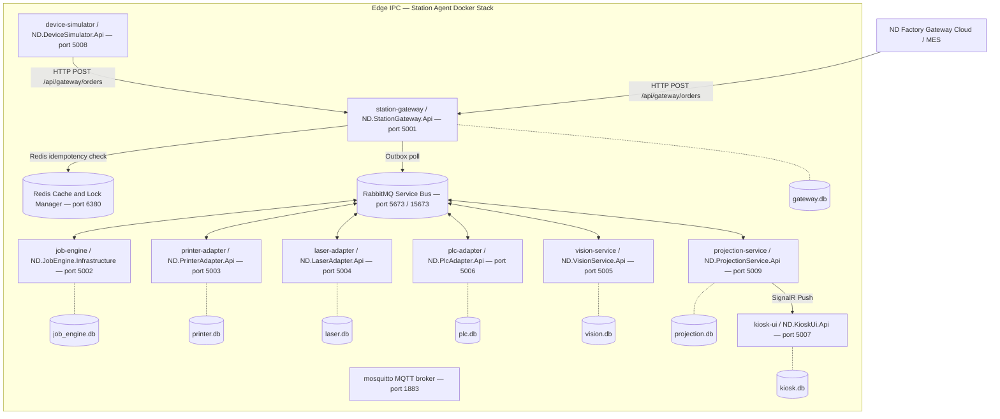
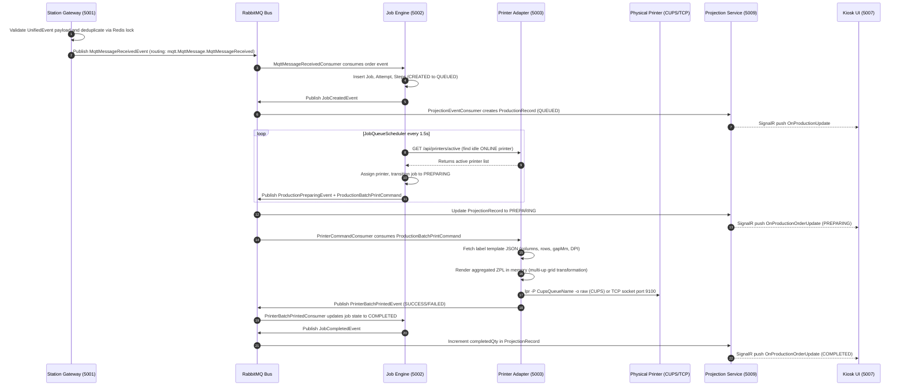
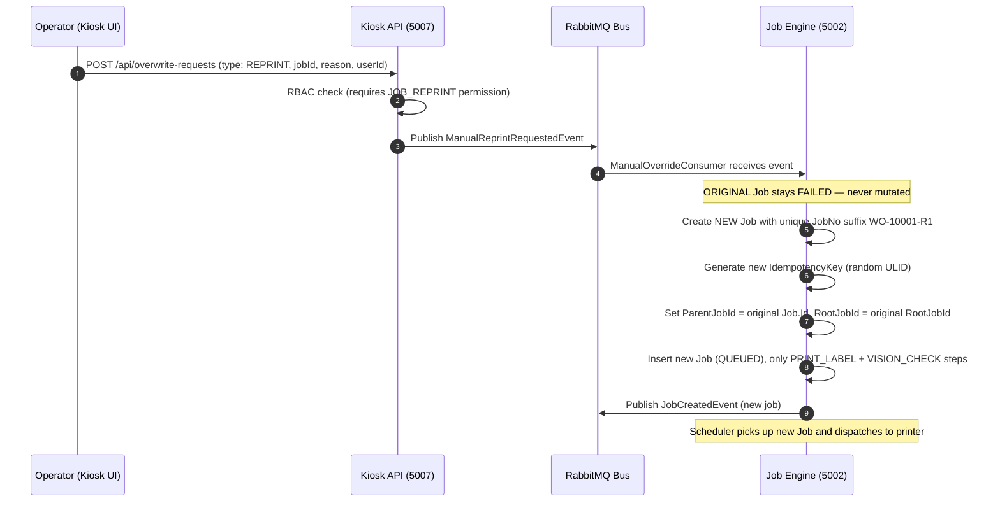
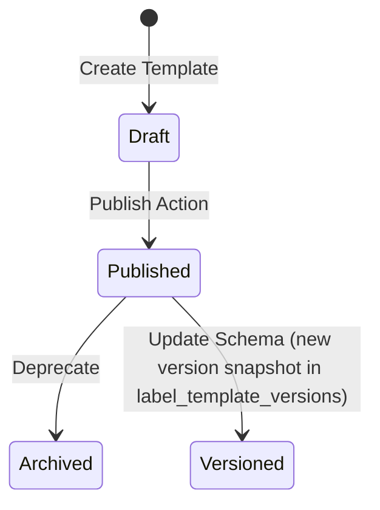

# AI_CONTEXT.md - Canonical Full Context for AI Agents (Print Marking Station Agent)

Last updated: 2026-07-26
Repository: `/home/neurosus/mes-system/print-marking/station-agent`
Project: ND Station Agent — Industrial Edge Print & Marking Platform
Audience: AI agents, engineers, architects, and maintainers continuing this codebase.

## Historical Runtime Snapshot (superseded 2026-07-27)

The following 2026-07-26 snapshot records the pre-Kafka-management state. The
authoritative Kafka-only runtime is documented in the final transport override
section of this file.

The current standalone Printer Adapter deployment is
`station-agent/docker-compose.printer-adapter.yml` using
`vanhoadotbui2628/printer-adapter:real-printers-no-simulator-20260726`
on the ARM64 Print Station host. It listens on `5003` and is the upstream for
Projection Service's `/api/projection/printers/active` and `/ready` routes.

The Kiosk active-printer 502 observed during cleanup was caused by the adapter
container being stopped, not by a missing API route. Once the adapter was
started, `GET http://localhost:5007/api/projection/printers/active` returned
HTTP 200 with `[]` because no printer was activated for production. A 502 from
this route means port `5003` is unreachable or the adapter is not running.

The local obsolete `printer-adapter:local-rabbitmq-amd64` container was stopped
and removed. Its `VirtualPrinterSimulator` was the source of the legacy
`PRINTER-01`, `PRINTER-02`, and `PRINTER-03` events. Do not run that image or a
second adapter beside the independent adapter.

Current local adapter health after startup: RabbitMQ `Connected`, CUPS
`Disconnected`, printer `Zebra-GK420t-CUPS` `OFFLINE`, overall `Degraded`.
This is an actual CUPS queue/connectivity condition, not an HTTP proxy error.

This is the first file to read before making changes in this repository. It consolidates:

- Product demand and domain descriptions from `print-marking/` documentation directory.
- Current workload, roadmap, and process prompts from `print-marking/project_audit_progress_report.md`.
- Strategy and tech-stack decisions from `print-marking/ANTIGRAVITY.md` and `print-marking/CLAUDE.md`.
- Current implementation records from `print-marking/` markdown files.
- Runtime topology, services, ports, event contracts, and engineering rules.

This document is intentionally long. It is designed to let a new AI agent understand the system without
needing to rediscover the whole repository from scratch.

## Current transport correction (2026-07-26)

This section supersedes older HTTP-only printer-adapter notes below. Transport
evidence is recorded in `implementation/printer-adapter-independent-rabbitmq-service.md`;
live runtime evidence is recorded in
`implementation/remote-printer-adapter-runtime-verification.md`.

- `IMPLEMENTED_AND_VERIFIED`: Job Engine production batch dispatch is written
  to its SQLite outbox and published with `command.printer.print.batch`; the
  scheduler no longer calls Printer Adapter `POST /api/print`.
- `IMPLEMENTED_AND_VERIFIED`: Independent Printer Adapter consumes
  `command.printer.print.batch` and `command.printer.print`, renders and sends
  through TCP/CUPS, and publishes `printer.batch.printed`. The legacy single
  label `JobProcessingEvent` payload is normalized into a one-label batch
  command while preserving its event ID, then returns `printer.printed`.
- `IMPLEMENTED_AND_VERIFIED`: `printer_command_executions.command_id` is a
  unique durable reservation created before physical I/O. Replaying the same
  command in the local RabbitMQ test produced no second physical print.
- `IMPLEMENTED_AND_VERIFIED`: Adapter publishes `printer.heartbeat` every
  configured interval and publishes `printer.status.changed` only on state
  transitions, plus `printer.error` for failed batch results.
- `IMPLEMENTED_AND_VERIFIED`: Projection Service binds the printer runtime
  event queue with one routing-key dispatcher and maps events to the existing
  device read model and SignalR; Kiosk listens to explicit printer
  heartbeat/status events as well.
- `IMPLEMENTED_AND_VERIFIED`: RabbitMQ connection settings support
  `RABBITMQ_HOST`, `RABBITMQ_PORT`, `RABBITMQ_USERNAME`, `RABBITMQ_PASSWORD`,
  `RABBITMQ_VHOST`, `RABBITMQ_USE_TLS`, and `RABBITMQ_CONNECTION_NAME`, with
  startup retry and automatic recovery.
- `IMPLEMENTED_BUT_NOT_TESTED`: `POST /api/print` remains only for manual or
  administrative requests carrying `X-Print-Source: MANUAL_TEST` or `ADMIN`.
- `IMPLEMENTED_AND_VERIFIED`: standalone deployment is
  `station-agent/docker-compose.printer-adapter.yml`; it contains no local
  RabbitMQ or Redis service and uses the shared broker over TCP/IP. The
  deployment file now uses direct demo settings and the real-printer ARM64
  image; production should replace `guest/guest` with a dedicated account.
- `IMPLEMENTED_AND_VERIFIED`: root `docker-compose.print-adapter.yml` uses
  direct current demo values `100.68.50.41:5673`, `/`, and `guest/guest`, with
  no `${...}` substitutions. Production must use a dedicated broker account.
- `IMPLEMENTED_AND_VERIFIED`: real-printer images were pushed to Docker Hub:
  `vanhoadotbui2628/printer-adapter:real-printers-no-simulator-20260726-amd64`
  digest `sha256:4d79756a9be13fff7b654a424e9171a0256db4de548aaf103a78aa55792c9a18`
  and
  `vanhoadotbui2628/printer-adapter:real-printers-no-simulator-20260726-arm64`
  digest `sha256:9587acf68d771d781d83cd4f47ff6da4bc548b05c3bf7266612ce85b1448af0e`.
  The older `rabbitmq-remote-20260727` image reference is historical.
- `PARTIALLY_VERIFIED`: Live station verification found RabbitMQ connections,
  queue bindings, projected Zebra state, advancing heartbeat timestamps, and
  Kiosk projection access. The configured physical CUPS queue is currently
  offline, so no physical label was sent.

## Label template editor and preview restoration (2026-07-27)

- `IMPLEMENTED_AND_VERIFIED`: Kiosk `LabelTemplatesTab` now maps camelCase and
  PascalCase adapter DTOs and displays name, description, dimensions, DPI,
  layout, version, status, and default state.
- `IMPLEMENTED_AND_VERIFIED`: Kiosk actions are restored for detail, edit with
  versioned PUT, publish, preview, printer activation, and physical print test.
- `IMPLEMENTED_AND_VERIFIED`: Kiosk preview calls the Kafka management boundary
  for `POST /api/label-templates/{id}/render-with-data`; the adapter uses the
  stored JSON and the same `ZplRenderer` as production printing.
- `IMPLEMENTED_AND_VERIFIED`: 2UP preview renders two cells side by side with
  the configured gap. The canonical demo codes are `ITEM-BARCODE-1UP`,
  `ITEM-BARCODE-2UP`, `ITEM-DETAIL-1UP`, and `ITEM-DETAIL-2UP`, using 203 DPI
  and a 50 x 30 mm cell.
- `IMPLEMENTED_BUT_NOT_TESTED`: the deployed remote adapter database still
  contains legacy active rows until the new image is deployed and startup
  seeding is rerun. The seeder archives obsolete rows and preserves template
  version history and print history.
- Evidence: `implementation/restore-kiosk-label-template-editor-preview-20260727.md`.

---

## 0. Source Of Truth Rules

Do not treat any single prompt as current truth by itself.

Use this precedence order exactly:

1. Running source code (C# .NET 10, React/Vite/TypeScript).
2. Service manifests and `docker-compose.yml` in `station-agent/`.
3. `docker-compose.yml` and environment variable configuration files.
4. SQLite database schemas via EF Core migrations in each service.
5. Automated and integration tests if present.
6. API controllers, domain handlers, RabbitMQ consumers, and producers.
7. Implementation records in `print-marking/*.md` files.
8. Current progress tracker: `print-marking/project_audit_progress_report.md`.
9. This `AI_CONTEXT.md`.
10. Domain description and design notes in `print-marking/` documentation.

Prompt files describe intended work at a point in time. Implementation records and source code describe
what actually exists. Some design docs are deliberately historical and may still mention
older planned structures or pre-refactor behavior.

### Evidence status vocabulary

Every new claim added to this context must be classified with one of these statuses. Do not convert a
product requirement or process instruction into an implemented fact without evidence:

- `IMPLEMENTED_AND_VERIFIED`: source exists and a repeatable build, test, runtime, API, or database check passed.
- `IMPLEMENTED_BUT_NOT_TESTED`: source exists but verification is still missing.
- `PARTIALLY_IMPLEMENTED`: some required behavior exists, but a documented part is absent or incomplete.
- `DOCUMENTED_INTENT_ONLY`: only product/process documentation describes the behavior.
- `PLANNED`: explicitly scheduled but not implemented.
- `MISSING`: searched source, manifests, migrations, and tests do not contain the behavior.
- `AMBIGUOUS`: evidence exists but the contract or ownership is unclear.
- `CONFLICTING_SOURCES`: code and documentation disagree; code wins for current behavior and the discrepancy must be recorded.
- `DEPRECATED`: historical behavior or artifact no longer belongs to the active runtime.
- `DEMO_ONLY`: implemented for seeded/demo workflows and not proven as production-grade behavior.

For each important claim record the evidence path, owning service, verification command/result, confidence,
and any discrepancy. When evidence is insufficient, use this exact form:

```text
Status: MISSING_OR_UNVERIFIED
Expected behavior: <documented or requested behavior>
Evidence searched: <paths, handlers, migrations, tests, runtime checks>
Gap: <what cannot be proven>
Recommended clarification: <specific next question or test>
```

---

## 1. Current Executive Summary

The **ND Station Agent** is an Industrial Edge Computing Platform deployed directly at the factory floor
between the **Factory Gateway** (cloud/central MES) and physical hardware devices (label printers, laser
markers, vision cameras, PLCs). It is a fully self-contained Docker-based system that operates
offline-first, orchestrating all physical marking and print operations locally.

Current implementation state:

- Core print workflow (ZPL label printing via CUPS/TCP): `IMPLEMENTED_AND_VERIFIED`.
- Laser marking workflow: `IMPLEMENTED_AND_VERIFIED`.
- Vision inspection/OCR workflow: `IMPLEMENTED_AND_VERIFIED`.
- PLC reject/conveyor control workflow: `IMPLEMENTED_AND_VERIFIED`.
- Device heartbeat monitoring: `IMPLEMENTED_AND_VERIFIED`.
- Real-time SignalR push to Kiosk UI: `IMPLEMENTED_AND_VERIFIED`.
- Production projection read model: `IMPLEMENTED_AND_VERIFIED`.
- Manual Reprint/Relaser workflow (new-job-per-retry model): `IMPLEMENTED_AND_VERIFIED`.
- RBAC/authentication in Kiosk UI: `IMPLEMENTED_AND_VERIFIED`.
- Label Template system (JSON to ZPL rendering, multi-up): `IMPLEMENTED_AND_VERIFIED`.
- Device Simulator (end-to-end smoke test tool): `IMPLEMENTED_AND_VERIFIED`.
- Alarm center improved architecture (active-only alarm deduplication): `DOCUMENTED_INTENT_ONLY` per `improve-alarm-center-architecture.md`.
- Supervisor approval bypass flow for `FORCE_PASS`: `PARTIALLY_IMPLEMENTED`.
- Centralized ReasonCode sync from MES: `PLANNED`.
- Full Docker image publishing pipeline: `IMPLEMENTED_AND_VERIFIED` (images on Docker Hub `vanhoadotbui2628/*`).

Overall build status: `0 Warning(s), 0 Error(s)` — all services compile and start cleanly.
Overall completeness: ~95%. Remaining: alarm architecture refinement, integration load tests.

Current active task after project audit:

- Implement improved Alarm Center architecture per `improve-alarm-center-architecture.md`.
- Continue physical Zebra printer integration per `integrate-physical-zebra.md`.
- Smoke test at production scale (50 labels/second sustained load) on real factory hardware.

---

## 2. Business Context

The **Print Marking Station** (Station Agent) is an edge industrial software system deployed on the
factory floor, typically on Industrial PCs or edge gateways. It orchestrates and automates physical
marking tasks for manufactured items:

- **ZPL-based label printing** via Zebra/Honeywell printers (CUPS or direct TCP/IP port 9100).
- **Laser engraving/marking** via TCP/IP or manufacturer SDK interfaces.
- **Vision inspection** via AI cameras (barcode/QR scan, OCR validation, defect detection).
- **PLC conveyor/robot control** via Modbus TCP.

Every manufactured physical item (rubber sheets, automotive parts, packaging) must be marked with a
unique, high-contrast identifier (barcode, QR code, serial number) for quality assurance and genealogy
tracking. The Station Agent bridges:

- The corporate MES/ERP cloud system (Factory Gateway sends HTTP POST to Station Gateway on port 5001).
- Physical hardware devices on the factory floor.

### 2.1 Key Operational Traits

- **Offline-First Resilience:** Network outages buffer jobs locally in SQLite. Auto-resumes on reconnect.
- **Strict Idempotency (No Duplicates):** Duplicate serial/barcode prints are critical failures. Deduplication
  enforced at REST entry point, scheduler, and database levels using Redis locks and `IdempotencyKey` columns.
- **Full Traceability and Audit Trail:** Every manual intervention (reprint, laser bypass, force-complete)
  requires operator authentication and is written to an immutable `job_engine_job_history` record.
- **Historical Data Immutability:** Failed job records (`FAILED` status) are never overwritten. New
  attempts create new Job records with `ParentJobId`/`RootJobId` linkage, preserving OEE and audit data.

---

## 3. High-Level Architecture and Systems Topology

The Station Agent is built around an **Event-Driven Architecture (EDA)** using **RabbitMQ** as the
primary local service bus. Services are deployed as isolated **Docker containers** communicating over
a bridge network (`station-net`).

### 3.1 Complete Architectural Flow



### 3.2 Core Architectural Principles

1. **Database per Service:** Every service owns its own SQLite database file. There are **no physical
   foreign keys or shared schema references** across service boundaries. Cross-service references are
   purely logical ULIDs/UUIDs.

2. **Outbox Pattern:** Services write outbound messages to a local `outbox_events` table within the
   same DB transaction as the domain write. A background `OutboxProcessorWorker` polls and publishes
   pending events to RabbitMQ, guaranteeing at-least-once delivery even after crashes.

3. **CQRS and Projection Model:** `job-engine` owns transactional writes. `projection-service` consumes
   all domain events and maintains a normalized read-only schema (`projection.db`) optimized for
   real-time SignalR feeds and Kiosk UI queries.

4. **Device Adapter Abstraction:** Hardware integration services expose generic, protocol-agnostic
   message interfaces. The `printer-adapter` supports `simulation`, `tcp`, and `cups` drivers without
   altering the job orchestration loop.

5. **State Machine Integrity:** Job state transitions are enforced by a strict state machine. `FAILED`
   jobs cannot be re-transitioned to `PROCESSING`. Manual retry creates a **new Job** with a new ID,
   preserving historical immutability.

6. **ProductionRecord Lifecycle Ownership:** `ProductionRecord` rows in `projection.db` are owned
   exclusively by `job.created` events — one record per real Job. The `HandleMqttEventAsync` handler
   in `ProjectionEventConsumer` must NOT create `ProductionRecord` rows for batch production orders
   (`plannedQty > 1`). Violating this causes ghost phantom rows (N items appear as 2N in Kiosk UI).

---

## 4. End-to-End Business Workflow

### 4.1 Production Order Print Execution Flow



### 4.2 Manual Reprint / Relaser Workflow (Audit-Safe)



---

## 5. Service Breakdown

### 5.1 Station Gateway (`ND.StationGateway.Api`) — Port 5001

- **Purpose:** HTTP entry point for incoming production orders from Factory Gateway cloud.
- **Key Responsibilities:**
  - Validates incoming `UnifiedEvent` payload (JSON schema validation + FluentValidation).
  - Performs idempotency check using Redis distributed lock key `idempotency:msg:{MessageId}` (24h TTL).
  - Records validated message in `gateway_requests` table (`gateway.db`).
  - Writes outbound event to `gateway_outbox_events` table inside same DB transaction.
  - `OutboxProcessorWorker` background thread polls outbox every 5 seconds (batch size 10) and publishes to RabbitMQ exchange `station.events`.
- **Database:** `gateway.db`.
- **Key Config:**
  - `Gateway__OutboxBatchSize=10`
  - `Gateway__OutboxIntervalSeconds=5`
  - `REDIS_CONNECTION_STRING=redis:6379,password=...`
  - `RabbitMq__DefaultExchange=station.events`

### 5.2 Job Engine (`ND.JobEngine.Infrastructure`) — Port 5002

- **Purpose:** Core orchestrator managing the entire lifecycle of production jobs.
- **Key Responsibilities:**
  - Maintains `job_engine_jobs` state machine: `CREATED → QUEUED → PREPARING → PROCESSING → COMPLETED/FAILED/WAIT_REWORK`.
  - Maps production items to attempts and individual process steps: `PRINT_LABEL → LASER_MARK → VISION_CHECK → PLC_REJECT`.
  - `JobQueueScheduler`: Polls pending QUEUED jobs every 1.5 seconds, calls `GET /api/printers/active` on printer-adapter for selection, aggregates by Production Order, and writes the batch print command to the Job Engine outbox. Production dispatch is asynchronous through RabbitMQ; it does not call `POST /api/print`.
  - Processes manual rework requests: `REPRINT`, `RELASER`, `FORCE_PASS`, `FORCE_COMPLETE` via new-job model.
  - Writes full audit history to `job_engine_job_history` and state transitions to `job_engine_state_transitions`.
- **Database:** `job_engine.db`.
- **Background Workers:**
  - `JobQueueScheduler`: Dispatches batches every 1.5s.
  - `MqttMessageReceivedConsumer`: Creates new jobs from incoming order events.
  - `PrinterBatchPrintedConsumer` / `PrinterPrintedConsumer`: Updates job status from printer events.
  - `JobEngineOutboxProcessorWorker`: Resolves transactional outbox events.
  - `ManualOverrideConsumer`: Handles operator reprint/relaser/force-pass requests.
- **Key Config:**
  - `SIMULATOR_HOST=device-simulator` / `SIMULATOR_PORT=8080` (dev/sim mode printer target).
  - Redis for distributed lock preventing race conditions on concurrent job events.

### 5.3 Printer Adapter (`ND.PrinterAdapter.Api`) — Port 5003

- **Purpose:** Manages printer registry, ZPL template rendering pipeline, and physical print execution.
- **Key Responsibilities:**
  - Manages printer statuses (`ONLINE`, `OFFLINE`, `ERROR`) via `PrinterHealthService` polling every 3 seconds.
  - Manages label templates (JSON layout spec + versioning via `label_template_versions`).
  - Renders `TemplateJson + RuntimeData → ZPL string` in memory using `ZplRenderer`.
  - Multi-up grid rendering: offsets X/Y coordinates per column/row with gap formula.
  - Three driver implementations:
    - **cups:** `lpr -P {CupsQueueName} -o raw` to the Mac CUPS daemon at the configured `CUPS_SERVER` endpoint.
    - **tcp:** Raw ZPL over TCP socket to Zebra network card on port `9100`.
    - The production deployment has no printer simulator; only real CUPS/TCP printers are registered.
  - CUPS health aggregation via IPP HTTP API: parses `media-empty-report`, `cover-open-report`, `offline-report`.
- **Database:** `printer.db`.
- **Background Workers:**
  - `PrinterCommandConsumer`: Durable RabbitMQ consumer for `command.printer.print` and `command.printer.print.batch`; it supports both the current batch contract and the legacy single-label `JobProcessingEvent` contract.
  - `PrinterHealthService` / `HeartbeatHostedService`: Polls printer connectivity every 3 seconds.
- **Messaging:** Publishes `printer.printed`, `printer.batch.printed`, `printer.status.changed`, `printer.heartbeat`, and `printer.error` to the `station.events` exchange.
- **Idempotency:** `printer_command_executions.command_id` is unique and reserved before printer I/O. Redelivered commands are acknowledged without a second print.
- **Key Config:**
  - Mac Docker Desktop: `CUPS_HEALTH_HOST=192.168.2.31`, `CUPS_HEALTH_PORT=631`, `CUPS_SERVER=192.168.2.31:631`, and `CUPS_USER=hoabui`.
  - Do not use the legacy `host.docker.internal:8631` proxy or `host-gateway` mapping for the Mac deployment.

### 5.4 Laser Adapter (`ND.LaserAdapter.Api`) — Port 5004

- **Purpose:** Connects to physical laser engraving hardware.
- **Key Responsibilities:**
  - Manages laser marking templates.
  - Triggers marking sequences via custom TCP/IP sockets, REST, or manufacturer SDK.
  - Publishes `laser.marked` events on completion.
- **Database:** `laser.db`.
- **Key Config:** `Laser__Host=device-simulator` / `Laser__Port=8901` (simulator mode).

### 5.5 Vision Service (`ND.VisionService.Api`) — Port 5005

- **Purpose:** Integrates with inspection cameras to verify print/laser marking quality.
- **Key Responsibilities:**
  - Triggers cameras to capture product QR/barcode/serial.
  - Returns `PASS` or `FAIL` with defect code (`QR_MISSING`, `SERIAL_BLUR`, `OCR_ERROR`).
  - Stores high-resolution inspection images to `/storage/vision` paths.
- **Database:** `vision.db`.
- **Key Config:** `VISION_IMAGE_STORAGE_PATH=/storage/vision`. Volume: `vision-storage:/storage`.

### 5.6 PLC Adapter (`ND.PlcAdapter.Api`) — Port 5006

- **Purpose:** Interface for conveyor belts, robot arms, and signal tower actuators.
- **Key Responsibilities:**
  - Reads/writes Modbus TCP or OPC-UA registers.
  - Listens to photoelectric product sensors and triggers conveyor kicks or robot eject paths on vision failure.
- **Database:** `plc.db`.

### 5.7 Kiosk UI (`ND.KioskUi.Api`) — Port 5007

- **Purpose:** Human-machine interface (HMI) dashboard for factory floor operators.
- **Key Responsibilities:**
  - Hosts React SPA (served from same ASP.NET Core host) and wraps SignalR hubs.
  - JWT-based authentication (`kiosk_sessions`) with role-based access control.
  - RBAC roles: `ADMIN`, `SUPERVISOR`, `OPERATOR`, `QA`.
  - Permissions: `JOB_VIEW`, `JOB_RETRY`, `JOB_FORCE_PASS`, `USER_MANAGE`, `JOB_REPRINT`, `JOB_RELASER`, `SYSTEM_ADMIN`.
  - Proxies alarm/printer-template requests to projection-service and printer-adapter.
  - Calls job-engine API for reprint/relaser/force-pass overwrite requests.
- **Database:** `kiosk.db`.
- **Key Config:**
  - `Jwt__Secret`, `Jwt__Issuer=nd-station-agent`, `Jwt__Audience=nd-kiosk`, `Jwt__ExpiryMinutes=480`.
  - `PROJECTION_SERVICE_URL=http://projection-service:5009`.
  - `JOB_ENGINE_HOST=job-engine` / `JOB_ENGINE_PORT=5002`.
  - `PRINTER_ADAPTER_HOST=printer-adapter` / `PRINTER_ADAPTER_PORT=5003`.

### 5.8 Projection Service (`ND.ProjectionService.Api`) — Port 5009

- **Purpose:** CQRS read model — normalizes domain events into dashboard-optimized views.
- **Key Responsibilities:**
  - Consumes all domain events from `station.events` RabbitMQ exchange.
  - Maintains `production_records`, `production_views`, `projection_alarms`, `activity_logs`.
  - Pushes real-time SignalR notifications to Kiosk UI on every state change.
  - Provides paginated REST APIs for Kiosk UI production history, alarm list, and activity feed.
- **Database:** `projection.db`.
- **SignalR Hub:** `http://projection-service:5009/hubs/production`.
- **SignalR Events:**
  - `OnProductionUpdate` — job state changes.
  - `OnProductionRecordUpdate` — full production record updates.
  - `OnActivityUpdate` — activity log additions.
  - `OnAlarmRaised` — new alarm created.
  - `OnAlarmAcknowledged` — alarm acknowledged.
- **Background Workers:**
  - `ProjectionEventConsumer`: Subscribes to `station.events` exchange, routing key `*.*.*`.

### 5.9 Device Simulator (`ND.DeviceSimulator.Api`) — Port 5008

- **Purpose:** Developer/QA tool simulating all physical devices for end-to-end testing.
- **Key Responsibilities:**
  - Emulates TCP printer socket (port 9100), laser TCP (port 8901), Modbus PLC, vision camera.
  - Provides web UI to send test production orders directly to Gateway API.
  - Forwards `send-print-job` inputs to `POST /api/gateway/orders` via internal HTTP client.
  - Reverse-proxies `/api/label-templates/{*path}` and `/api/print-history/{*path}` to `printer-adapter:5003`.
- **Key Config:**
  - `MES_BACKEND_URL=http://192.168.1.87:8080/api/v1` (MES integration endpoint).
  - Exposed to internet via Cloudflare Tunnel on `start-macos.sh`.

---

## 6. Domain Model and Business Rules

### 6.1 Business Domain Glossary

| Term | Meaning |
|---|---|
| `Production Order (JobNo)` | Work order containing items to be printed or marked. Unique ID like `WO-XXXXXX`. |
| `Job` | Orchestration unit for one item's complete processing sequence. Maps to a `JobType`. |
| `Attempt` | One execution cycle of a Job. Failures trigger new Attempt on retry. |
| `Step` | Individual hardware instruction within an Attempt. Executed sequentially. |
| `Label Template` | JSON schema with layout dimensions (DPI, width/height), element bindings, multi-up config. |
| `Printer Assignment` | Active binding of a printer to a label template (`ActiveTemplateId` on the Printer entity). |
| `Alarm` | Active fault event requiring operator intervention. Deduplication: one active alarm per device. |
| `Overwrite Request` | Supervisor-approved manual bypass (`REPRINT`, `RELASER`, `FORCE_PASS`, `FORCE_COMPLETE`). |

### 6.2 Job Types

| JobType | Steps Executed |
|---|---|
| `PRINT_ONLY` | `PRINT_LABEL` then `VISION_CHECK` |
| `LASER_ONLY` | `LASER_MARK` then `VISION_CHECK` |
| `FULL_PROCESS` | `PRINT_LABEL` then `LASER_MARK` then `VISION_CHECK` then `PLC_REJECT` |

### 6.3 Job State Machine

```text
CREATED → QUEUED → PREPARING → PROCESSING → COMPLETED
                                           ↘ FAILED → WAIT_REWORK
                              ↘ CANCELLED
```

- `FAILED` is a terminal state. No direct re-transition to `PROCESSING`.
- `WAIT_REWORK` is set when a failed job awaits operator intervention.
- Manual retry always creates a **new Job** with `ParentJobId` + `RootJobId` references.
- `IdempotencyKey` for reprint jobs is always a fresh random ULID (not the original order key).

### 6.4 Key Domain Relationships

- A **Production Order** contains 1 or many **Jobs**.
- A **Job** contains 1 or many **Attempts** (ordered by `AttemptNo`).
- An **Attempt** contains 1 or many **Steps** (sequential by `StepOrder`).
- A **Printer** has a single `ActiveTemplateId` configured via Kiosk HMI.
- When querying print targets, always check printer's `ActiveTemplateId` before falling back to defaults.

---

## 7. Database Dictionary

Station Agent uses **SQLite** for all services. Each database file is mounted from the host
directory `station-agent/sqlite-databases/` into all containers at `/data/`.

### 7.1 Database: `gateway.db`

Stores REST entry deduplication records and transactional outbox logs.

**`gateway_requests`** — Deduplication master log.

| Column | Type | Notes |
|---|---|---|
| `Id` | TEXT PK | ULID string. |
| `MessageId` | TEXT UNIQUE | Event UUID from MES/Gateway. Used for idempotency. |
| `Topic` | TEXT | Incoming endpoint path. |
| `PayloadJson` | TEXT | Raw input JSON string. |
| `Direction` | TEXT | `INBOUND` or `OUTBOUND`. |
| `Status` | TEXT | `RECEIVED`, `PROCESSED`, `FAILED`. |
| `ReceivedAt` | TEXT | ISO 8601 timestamp. |
| `ProcessedAt` | TEXT | Nullable. |
| `ErrorMessage` | TEXT | Nullable. |
| `CreatedAt` | TEXT | ISO 8601. |
| `UpdatedAt` | TEXT | ISO 8601. |

**`gateway_outbox_events`** — Transactional Outbox for RabbitMQ publishing.

| Column | Type | Notes |
|---|---|---|
| `Id` | TEXT PK | ULID identifier. |
| `AggregateType` | TEXT | Domain model name, e.g. `Job`. |
| `AggregateId` | TEXT | Specific UUID of the aggregate. |
| `EventType` | TEXT | Class name, e.g. `GatewayOrderReceivedEvent`. |
| `PayloadJson` | TEXT | Event payload JSON. |
| `RoutingKeyHint` | TEXT | Suggested RabbitMQ routing key. |
| `Status` | TEXT | `PENDING`, `PUBLISHED`, `FAILED`. |
| `RetryCount` | INTEGER | Retry attempts count. |
| `NextRetryAt` | TEXT | Nullable ISO 8601. |
| `PublishedAt` | TEXT | Nullable. |
| `CreatedAt` | TEXT | ISO 8601. |
| `UpdatedAt` | TEXT | ISO 8601. |

### 7.2 Database: `job_engine.db`

The most critical database. Stores all orchestration state and audit history.

**`job_engine_jobs`** — Core job master record.

| Column | Type | Notes |
|---|---|---|
| `Id` | TEXT PK | ULID string. |
| `JobNo` | TEXT UNIQUE | Production Order number, e.g. `WO-000001`. |
| `SourceSystem` | TEXT | `MES`, `MANUAL`. |
| `JobType` | TEXT | `PRINT_ONLY`, `LASER_ONLY`, `FULL_PROCESS`. |
| `CurrentStatus` | TEXT | State enum (see state machine above). |
| `ProductCode` | TEXT | Item/SKU code. |
| `ProductSerial` | TEXT | Nullable serial number. |
| `PayloadJson` | TEXT | Original order parameters. |
| `Priority` | INTEGER | Scheduling weight. |
| `IdempotencyKey` | TEXT UNIQUE | Prevents duplicate job runs. |
| `AssignedPrinter` | TEXT | Logical printer code. |
| `ParentJobId` | TEXT | Nullable. References original Job for reprint. |
| `RootJobId` | TEXT | Nullable. References original root job across retry chain. |
| `CreatedAt` | TEXT | ISO 8601. |
| `UpdatedAt` | TEXT | ISO 8601. |
| `CompletedAt` | TEXT | Nullable ISO 8601. |

**`job_engine_job_attempts`** — Execution attempt lifecycle.

| Column | Type | Notes |
|---|---|---|
| `Id` | TEXT PK | ULID. |
| `JobId` | TEXT | Logical reference to `job_engine_jobs.Id`. |
| `AttemptNo` | INTEGER | Index counter (1, 2, ...). |
| `TriggerType` | TEXT | `AUTO`, `MANUAL_RETRY`, `OVERWRITE`. |
| `TriggeredByUserId` | TEXT | Logical operator user reference. |
| `ResultStatus` | TEXT | `SUCCESS`, `FAILED`, `CANCELLED`. |
| `StartedAt` | TEXT | ISO 8601. |
| `FinishedAt` | TEXT | ISO 8601 nullable. |
| `ErrorMessage` | TEXT | Nullable error detail. |

**`job_engine_job_steps`** — Step-level execution log per attempt.

| Column | Type | Notes |
|---|---|---|
| `Id` | TEXT PK | ULID. |
| `AttemptId` | TEXT | Logical reference to `job_engine_job_attempts.Id`. |
| `StepName` | TEXT | `PRINT_LABEL`, `LASER_MARK`, `VISION_CHECK`, `PLC_REJECT`. |
| `StepOrder` | INTEGER | Sequence index. |
| `Status` | TEXT | `PENDING`, `RUNNING`, `COMPLETED`, `FAILED`, `SKIPPED`. |
| `ResultJson` | TEXT | Nullable step result payload. |
| `ErrorMessage` | TEXT | Nullable. |

**`job_engine_job_history`** — Immutable audit log of all status changes and actions.

| Column | Type | Notes |
|---|---|---|
| `Id` | TEXT PK | ULID. |
| `JobId` | TEXT | Parent job reference. |
| `OldStatus` | TEXT | Previous state. |
| `NewStatus` | TEXT | New state. |
| `ActionName` | TEXT | e.g. `START_JOB`, `LASER_FAILED`, `OPERATOR_REPRINT`. |
| `ActorUserId` | TEXT | Nullable; operator who performed the action. |
| `Comment` | TEXT | Nullable; operator reason/comment. |
| `CreatedAt` | TEXT | ISO 8601. |

**`job_engine_state_transitions`** — Analytical state machine transition history.

| Column | Type | Notes |
|---|---|---|
| `Id` | TEXT PK | ULID. |
| `JobId` | TEXT | Job reference. |
| `FromState` | TEXT | Transition source state. |
| `ToState` | TEXT | Transition target state. |
| `TransitionedAt` | TEXT | ISO 8601. |

**`job_engine_overwrite_requests`** — HMI bypass requests for supervisor approval.

| Column | Type | Notes |
|---|---|---|
| `Id` | TEXT PK | ULID. |
| `JobId` | TEXT | Reference to the job being overridden. |
| `OverwriteType` | TEXT | `FORCE_PASS`, `REPRINT`, `RELASER`, `FORCE_COMPLETE`. |
| `Reason` | TEXT | Operator-provided reason. |
| `ReasonCode` | TEXT | Structured reason code e.g. `PRINT_QUALITY`. |
| `RequestedBy` | TEXT | Operator UserId. |
| `ApprovedBy` | TEXT | Supervisor UserId (nullable until approved). |
| `Status` | TEXT | `PENDING`, `APPROVED`, `REJECTED`. |
| `CreatedAt` | TEXT | ISO 8601. |

### 7.3 Database: `printer.db`

**`printer_printers`** — Printer state registry.

| Column | Type | Notes |
|---|---|---|
| `Id` | TEXT PK | ULID. |
| `PrinterCode` | TEXT UNIQUE | Primary search key, e.g. `Zebra-GK420t-CUPS`. |
| `DisplayName` | TEXT | Human-readable name. |
| `IpAddress` | TEXT | Target endpoint IP. |
| `Port` | INTEGER | Destination port (9100 for TCP). |
| `Protocol` | TEXT | `ZPL`, `TSPL`. |
| `Vendor` | TEXT | `ZEBRA`, `HONEYWELL`. |
| `Status` | TEXT | `ONLINE`, `OFFLINE`, `ERROR`. |
| `GroupId` | TEXT | Failover target pool. |
| `LastHeartbeatAt` | TEXT | ISO 8601. |
| `DriverType` | TEXT | `simulation`, `tcp`, `cups`. |
| `CupsQueueName` | TEXT | CUPS printer queue name. |
| `IsActiveForWork` | INTEGER | `0` or `1` flag. |
| `ActiveTemplateId` | TEXT | Current label template UUID. |
| `ActiveTemplateName` | TEXT | Display title of active template. |
| `ActivatedAt` | TEXT | ISO 8601 when template was activated. |

**`label_templates`** — Structured label layout definitions.

| Column | Type | Notes |
|---|---|---|
| `Id` | TEXT PK | UUID. |
| `Name` | TEXT UNIQUE | Template display name. |
| `Description` | TEXT | Purpose description. |
| `Dpi` | INTEGER | Print density: `203`, `300`, `600`. |
| `LabelWidth` | REAL | Width in mm. |
| `LabelHeight` | REAL | Height in mm. |
| `TemplateJson` | TEXT | Raw JSON visual configuration. |
| `IsActive` | INTEGER | `0` or `1`. |
| `IsDefault` | INTEGER | `0` or `1`. |
| `Status` | TEXT | `draft`, `published`. |
| `LayoutType` | TEXT | `1UP`, `2UP`, `3UP`. |
| `SheetColumns` | INTEGER | Grid column count. |
| `SheetRows` | INTEGER | Grid row count. |
| `GapMm` | REAL | Inter-label gap in mm. |

**`label_template_versions`** — Immutable historical snapshots of templates.

| Column | Type | Notes |
|---|---|---|
| `Id` | TEXT PK | UUID. |
| `TemplateId` | TEXT | Logical reference to parent `label_templates`. |
| `Version` | INTEGER | Version counter. |
| `TemplateJson` | TEXT | Immutable JSON snapshot at this version. |
| `CreatedAt` | TEXT | ISO 8601. |

**`printer_jobs`** — Log of rendered label contents and print job status.

| Column | Type | Notes |
|---|---|---|
| `Id` | TEXT PK | UUID. |
| `AttemptId` | TEXT | Logical job attempt reference. |
| `LabelTemplate` | TEXT | Template name used. |
| `PrintStatus` | TEXT | `SUCCESS`, `FAILED`. |
| `CreatedAt` | TEXT | ISO 8601. |

**`printer_events`** — Device events (paper out, cover open, disconnect).

| Column | Type | Notes |
|---|---|---|
| `Id` | TEXT PK | UUID. |
| `PrinterCode` | TEXT | Printer reference. |
| `EventType` | TEXT | `PAPER_EMPTY`, `COVER_OPEN`, `PRINT_STARTED`, `PRINT_FINISHED`. |
| `OccurredAt` | TEXT | ISO 8601. |

**`print_history`** — Detailed audit trail for printed labels.

| Column | Type | Notes |
|---|---|---|
| `Id` | TEXT PK | UUID. |
| `TemplateId` | TEXT | Logical template reference. |
| `TemplateVersion` | INTEGER | Version snapshot reference. |
| `PrinterCode` | TEXT | Logical printer reference. |
| `Status` | TEXT | `SUCCESS` or `FAILED`. |
| `DurationMs` | INTEGER | Execution time in ms. |
| `TcpRequestHex` | TEXT | Raw ZPL hex dump sent. |
| `TcpResponseHex` | TEXT | TCP response hex dump. |
| `ExceptionMessage` | TEXT | Nullable error detail. |

### 7.4 Database: `laser.db`

**`laser_lasers`** — Registered laser machines and connection settings.

| Column | Notes |
|---|---|
| `Id` | ULID PK. |
| `LaserCode` | Unique code e.g. `LASER-01`. |
| `Host` | TCP endpoint. |
| `Port` | TCP port. |
| `Status` | `ONLINE`, `OFFLINE`, `ERROR`. |

**`laser_jobs`** — Marking job history.

| Column | Notes |
|---|---|
| `Id` | ULID PK. |
| `AttemptId` | Job attempt reference. |
| `TemplateName` | Marking template name. |
| `MarkStatus` | `SUCCESS`, `FAILED`. |
| `CreatedAt` | ISO 8601. |

**`laser_events`** — Diagnostic events from laser devices.

| Column | Notes |
|---|---|
| `EventType` | `LASER_READY`, `LASER_ERROR`, `MARK_START`, `MARK_FINISH`. |

### 7.5 Database: `vision.db`

**`vision_cameras`** — Inspection camera registry.

| Column | Notes |
|---|---|
| `Id` | ULID PK. |
| `CameraCode` | Unique code e.g. `CAM-01`. |
| `Protocol` | `USB`, `GigE`, `RTSP`. |
| `Status` | `ONLINE`, `OFFLINE`, `ERROR`. |

**`vision_results`** — Barcode/OCR validation outcomes.

| Column | Notes |
|---|---|
| `Id` | ULID PK. |
| `AttemptId` | Job attempt reference. |
| `InspectionResult` | `PASS` or `FAIL`. |
| `DefectCode` | `QR_MISSING`, `SERIAL_BLUR`, `OCR_ERROR`. Nullable. |
| `ImagePath` | Storage path, e.g. `/storage/vision/2026/06/job001.jpg`. |
| `InspectedAt` | ISO 8601. |

### 7.6 Database: `plc.db`

**`plc_devices`** — Connected PLC configurations (Modbus TCP, OPC UA).

**`plc_commands`** — Conveyor and robot arm control commands.

| Column | Notes |
|---|---|
| `CommandName` | `START_PICK`, `EJECT_PRODUCT`, `CONVEYOR_START`, `CONVEYOR_STOP`. |
| `CommandPayload` | JSON parameters e.g. `{"position":"A1"}`. |
| `ExecutionStatus` | `SUCCESS`, `FAILED`. |

**`plc_events`** — Signals captured from hardware.

| Column | Notes |
|---|---|
| `EventType` | `PICK_START`, `PICK_FINISH`, `CONVEYOR_RUNNING`, `CONVEYOR_STOP`. |

**`plc_robot_pick_events`** — Robot arm pick validation and positioning data.

| Column | Notes |
|---|---|
| `PickResult` | `SUCCESS`, `FAIL`. |

### 7.7 Database: `kiosk.db`

Authentication and Authorization center for Kiosk operators.

**`kiosk_users`** — Operator registry.

| Column | Notes |
|---|---|
| `Id` | ULID PK. |
| `Username` | Unique login name, e.g. `operator01`. |
| `PasswordHash` | BCrypt hash. |
| `FullName` | Display name. |
| `Status` | `Active`, `Inactive`. |

**`kiosk_roles`** — Role catalog: `ADMIN`, `SUPERVISOR`, `OPERATOR`, `QA`.

**`kiosk_permissions`** — Permission catalog:
`JOB_VIEW`, `JOB_RETRY`, `JOB_FORCE_PASS`, `JOB_REPRINT`, `JOB_RELASER`, `USER_MANAGE`, `SYSTEM_ADMIN`.

**`kiosk_user_roles`** — User to Role mapping.

**`kiosk_role_permissions`** — Role to Permission mapping.

**`kiosk_sessions`** — JWT session tokens and login tracking.

| Column | Notes |
|---|---|
| `Id` | ULID PK. |
| `UserId` | User reference. |
| `Token` | JWT string. |
| `LoginAt` | ISO 8601. |
| `ExpiresAt` | ISO 8601. |

**`kiosk_access_logs`** — Full audit of security events and manual overrides.

| Column | Notes |
|---|---|
| `ActionName` | `LOGIN`, `LOGOUT`, `RETRY_JOB`, `FORCE_PASS`, `REPRINT`, `RELASER`. |
| `TargetType` | `JOB`, `USER`. |
| `TargetId` | Referenced entity ID. |
| `ActorUserId` | Who performed action. |
| `OccurredAt` | ISO 8601. |

### 7.8 Database: `projection.db`

CQRS read model maintained by projection-service.

**`production_records`** — Denormalized real-time production view.

| Column | Notes |
|---|---|
| `Id` | ULID PK. |
| `JobId` | Real Job ID (must match `job_engine_jobs.Id`). |
| `JobNo` | Production order number. |
| `ProductCode` | Item code. |
| `ProductSerial` | Serial number. |
| `Status` | Current status mirroring job state. |
| `PlannedQty` | Total quantity in order. |
| `CompletedQty` | Completed items count. |
| `AssignedPrinter` | Printer code. |
| `CreatedAt` | ISO 8601. |
| `UpdatedAt` | ISO 8601. |

**`projection_alarms`** — Active alarm state with deduplication.

| Column | Notes |
|---|---|
| `Id` | ULID PK. |
| `DeviceCode` | Owning device code. |
| `AlarmType` | `HEARTBEAT_LOST`, `JOB_FAILED`, `VISION_FAILED`, etc. |
| `Severity` | `Info`, `Warning`, `Critical`. |
| `Status` | `Active`, `Acknowledged`, `Resolved`. |
| `Message` | Alarm description. |
| `AcknowledgedBy` | Nullable user reference. |
| `AcknowledgedAt` | Nullable ISO 8601. |
| `FirstOccurredAt` | ISO 8601. |
| `LastOccurredAt` | ISO 8601 — updated on repeat without inserting new row. |
| `RepeatCount` | Count of collapsed repeat events. |
| `ProductionOrderId` | Nullable; active production order context. |

**`activity_logs`** — All system activity event stream for dashboard.

**`production_views`** — Aggregated production summary per order.

---

## 8. Messaging Bus and Event Topology

All messaging flows through the `station.events` **RabbitMQ Topic Exchange**.

### 8.1 RabbitMQ Queue Bindings

| Queue | Routing Key Binding | Consumer Service |
|---|---|---|
| `job-engine.mqtt-messages` | `mqtt.MqttMessage.MqttMessageReceived` | `job-engine` |
| `job-engine.printer-printed-events` | `printer.printed` | `job-engine` |
| `job-engine.batch-printed-events` | `printer.batch.printed` | `job-engine` |
| `job-engine.laser-marked-events` | `laser.marked` | `job-engine` |
| `job-engine.vision-check-commands` | `command.vision.check` | `job-engine` |
| `job-engine.plc-reject-commands` | `command.plc.reject` | `job-engine` |
| `job-engine.manual-reprint-events` | `command.manual-reprint` | `job-engine` |
| `printer-adapter.print-commands` | `command.printer.print` | `printer-adapter` |
| `printer-adapter.print-commands` | `command.printer.print.batch` | `printer-adapter` |
| `projection-service.activity-log` | `*.*.*` (all events) | `projection-service` |

### 8.2 Event Message Schema Dictionary

#### `MqttMessageReceived` (Routing: `mqtt.MqttMessage.MqttMessageReceived`)
**Producer:** `station-gateway` | **Consumer:** `job-engine`
```json
{
  "MessageId": "msg-unique-uuid",
  "Topic": "nd/NMDDuongDuong/edge-ipc-l3-marking/command",
  "PayloadJson": "{\"Site\":\"...\",\"Data\":[{\"tag\":\"operation.type\",\"value\":\"PRINT_ONLY\"}]}",
  "Timestamp": "2026-07-20T06:55:21Z"
}
```

#### `JobCreatedEvent` (Routing: `job.created`)
**Producer:** `job-engine` | **Consumer:** `projection-service`
```json
{
  "JobId": "01J...",
  "JobNo": "WO-000001",
  "ProductCode": "NBR-70",
  "ProductSerial": "SN-001",
  "PlannedQty": 1,
  "JobType": "PRINT_ONLY",
  "CreatedAt": "2026-07-20T06:55:22Z"
}
```

#### `ProductionBatchPrintCommand` (Routing: `command.printer.print.batch`)
**Producer:** `job-engine` (Scheduler) | **Consumer:** `printer-adapter`
```json
{
  "ProductionOrderNo": "WO-XYZ",
  "ProductCode": "NBR-70",
  "TargetPrinter": "Zebra-GK420t-CUPS",
  "DispatchTarget": "simulation",
  "LabelItems": [
    { "JobId": "job-uuid-1", "ProductSerial": "SN-001", "Sequence": 1 },
    { "JobId": "job-uuid-2", "ProductSerial": "SN-002", "Sequence": 2 }
  ],
  "BatchSize": 100
}
```

#### `PrinterBatchPrintedEvent` (Routing: `printer.batch.printed`)
**Producer:** `printer-adapter` | **Consumer:** `job-engine`, `projection-service`
```json
{
  "ProductionOrderNo": "WO-XYZ",
  "PrinterCode": "Zebra-GK420t-CUPS",
  "SucceededJobIds": ["job-uuid-1", "job-uuid-2"],
  "FailedJobIds": [],
  "ErrorMessage": null,
  "Timestamp": "2026-07-20T06:57:18Z"
}
```

#### `ManualReprintRequestedEvent` (Routing: `command.manual-reprint`)
**Producer:** `kiosk-ui` | **Consumer:** `job-engine`
```json
{
  "OriginalJobId": "01J...",
  "RequestedByUserId": "operator01",
  "Reason": "Label smeared at OP-QC station",
  "ReasonCode": "PRINT_QUALITY",
  "Timestamp": "2026-07-20T10:00:00Z"
}
```

---

## 9. Hardware and Device Integration

### 9.1 CUPS USB Printing Architecture

1. **Host machine** (macOS/Linux Industrial PC) runs the local CUPS daemon. USB printer connected to host.
2. Docker stack uses `extra_hosts: - "host.docker.internal:host-gateway"` to reach host CUPS.
3. Host CUPS IPP endpoint tunneled to container via `socat` or SSH forward on port `8631`.
4. Printing raw ZPL: `lpr -P {CupsQueueName} -o raw` — bypasses rasterization, native vector barcodes.
5. CUPS health check parses IPP API response for:
   - `media-empty-report` → **Paper Out** alarm.
   - `cover-open-report` → **Cover Open** alarm.
   - `offline-report` → **Offline** status.
6. If `lpr` exits with code `1` (lock/network disconnect): sleep 200ms, retry up to 3 times, then publish print failure event.

### 9.2 ZPL Renderer Coordinate Calculations

Single-up templates place elements exactly as positioned in the layout JSON.
Multi-up layouts (2-Up, 3-Up) require the `ZplRenderer` to perform grid transformations in memory:

```text
+-----------------------------------------------------------+
|  Cell (col=0, row=0)         Cell (col=1, row=0)          |
|  x = original_x              x = original_x + OffsetX     |
|  y = original_y              y = original_y               |
|               <---- GapMm ---->                           |
+-----------------------------------------------------------+
```

Offset formula:

```
OffsetX = col × (cellWidthDots + gapDots)
OffsetY = row × (cellHeightDots + gapDots)

Where:
  cellWidthDots  = (LabelWidthMm  × Dpi) / 25.4
  cellHeightDots = (LabelHeightMm × Dpi) / 25.4
  gapDots        = (GapMm         × Dpi) / 25.4
```

### 9.3 Label Template Lifecycle



- **1-Up:** 1 label per print cycle (`SheetColumns=1`, `SheetRows=1`).
- **2-Up:** 2 side-by-side labels on single sheet (`SheetColumns=2`, `SheetRows=1`).
- **3-Up:** 3 side-by-side labels on single sheet (`SheetColumns=3`, `SheetRows=1`).
- Editing a published template creates an immutable snapshot in `label_template_versions`. Print history
  audits link to version snapshots so historical reprints generate exact copies.

---

## 10. Kiosk HMI UI and Real-Time Projections

### 10.1 Frontend Tech Stack

- **Framework:** React 18, Vite, TypeScript, TailwindCSS v4 with shadcn-style components.
- **State Management:** Zustand stores (`usePrinterStore`, `useAlarmStore`, `useProductionStore`).
- **Real-Time Feed:** ASP.NET SignalR client connecting to `http://projection-service:5009/hubs/production`.
- **UI Components:** Custom shadcn-style primitives (Button, Badge, Card, Table, Dialog, AlertDialog, Select).
- **Animations:** Manual CSS keyframe animation utilities defined in `@layer utilities` for Dialog/AlertDialog.

### 10.2 Zustand Store Synchronization

On page load, stores query normalized REST endpoints on `projection-service`. After connect, they
subscribe to SignalR events to process changes in memory:

| SignalR Event | Store Effect |
|---|---|
| `OnAlarmRaised` | Adds new alarm to state, pushes notification banner. |
| `OnAlarmAcknowledged` | Updates status in alarm rows. |
| `OnProductionOrderUpdate` | Increments `completedQty` on HMI progress dials. |
| `OnActivityUpdate` | Appends entry to activity log feed. |
| `OnProductionRecordUpdate` | Refreshes full production record including serial/product info. |

### 10.3 Alarm Center Architecture (Planned Improvement)

Per `improve-alarm-center-architecture.md` — `DOCUMENTED_INTENT_ONLY`:

- Only devices **actively assigned to a running Production Order** generate heartbeat alarms.
- Idle/online but unassigned devices: no alarm on heartbeat loss.
- One active alarm per device — repeat events update `last_occurred_at` + `repeat_count`, never insert new rows.
- New alarm created only after the previous alarm is acknowledged.
- Alarm UI: two tabs — **Device Connection** (heartbeat, disconnect) vs **Production Errors** (job failure, workflow exception).
- Alarm detail: reusable modal with event timeline.
- Server-side pagination (20 rows/page), sort newest first.
- Filters: date range, status, severity, device type, search text.
- Projection Service remains the single source of truth. Kiosk UI never implements alarm business logic.

---

## 11. Error Handling, Failures, and Reconnect Strategies

| Failure Scenario | Behavior |
|---|---|
| RabbitMQ down during outbox publish | Outbox marks `PENDING`, increments `RetryCount`, back-off retry on next poll. |
| `lpr` CUPS exits code 1 | Sleep 200ms, retry up to 3 times, then publish failure event to orchestrator. |
| Redis unavailable | Idempotency check may fail open. Planned: local MemoryLock fallback. |
| Vision check FAIL | Job transitions to `FAILED/WAIT_REWORK`. Operator must trigger `REPRINT`/`RELASER` manually. |
| Factory Gateway network outage | Jobs queue locally in SQLite. Auto-resume when Gateway reconnects. |
| SQLite WAL lock contention | Mitigated by WAL mode enabled. Risk at 50+ messages/sec (load stress test pending). |
| Duplicate incoming `MessageId` | Redis lock key `idempotency:msg:{MessageId}` blocks insertion. Returns 200 (already processed). |

---

## 12. Runtime Topology — Ports and Containers

### 12.1 Docker Compose Services Summary

| Container Name | Service | Host Port | Internal Port | Database | Key Dependencies |
|---|---|---|---|---|---|
| `station-redis` | Redis 7.4 | `6380` | `6379` | — | — |
| `station-rabbitmq` | RabbitMQ 3.13 | `5673` / `15673` | `5672` / `15672` | — | — |
| `station-mqtt-broker` | Eclipse Mosquitto 2.0 | `1883` | `1883` | — | — |
| `station-gateway` | Station Gateway | `5001` | `5001` | `gateway.db` | Redis, RabbitMQ |
| `station-job-engine` | Job Engine | `5002` | `5002` | `job_engine.db` | Redis, RabbitMQ |
| `station-printer-adapter` | Printer Adapter | `5003` | `5003` | `printer.db` | CUPS (host:8631), RabbitMQ |
| `station-laser-adapter` | Laser Adapter | `5004` | `5004` | `laser.db` | RabbitMQ |
| `station-vision-service` | Vision Service | `5005` | `5005` | `vision.db` | Redis |
| `station-plc-adapter` | PLC Adapter | `5006` | `5006` | `plc.db` | Redis |
| `station-kiosk-ui` | Kiosk UI | `5007` | `5007` | `kiosk.db` | projection-service, job-engine, printer-adapter, RabbitMQ |
| `station-device-simulator` | Device Simulator | `5008` | `8080` | `device-simulator.db` | Redis |
| `station-projection-service` | Projection Service | `5009` | `5009` | `projection.db` | RabbitMQ |

### 12.2 Network and Volumes

- All containers on `station-net` (bridge network, Docker-internal DNS by container name).
- All SQLite databases: `./sqlite-databases:/data` shared host path mount.
- Vision image storage: `vision-storage:/storage` dedicated Docker volume.
- Service logs: individual named volumes (`mqtt-logs`, `job-engine-logs`, etc.).

### 12.3 Deployment Configuration

| Key | Value |
|---|---|
| Private LAN IP | `192.168.1.87` |
| Tailscale VPN IP | `100.68.50.41` |
| Docker Hub registry | `vanhoadotbui2628/<service-name>:latest` |
| Cloudflare Tunnel | `cloudflared tunnel --url http://localhost:5008` (device simulator) |

Common commands:
```bash
cd station-agent
docker compose up -d --build
docker compose logs --tail=100 <service-name>
docker compose ps
```

---

## 13. Coding Conventions and Directory Structure

### 13.1 Project Directory Structure

All .NET backend services follow Clean Architecture:

```text
services/<service-name>/
├── src/
│   ├── ND.<Service>.Domain/           <- Entities, Value Objects, Enums, Domain Rules. Zero dependencies.
│   ├── ND.<Service>.Application/      <- Use cases, Commands, Queries, DTOs, Interfaces, FluentValidation.
│   ├── ND.<Service>.Infrastructure/   <- EF Core DbContexts, Migrations, Repositories, Device Drivers, Consumers.
│   └── ND.<Service>.Api/              <- Composition root, Controllers, Middleware, Startup, DI wireup.
├── docker/
│   └── Dockerfile
└── tests/ (if present)
```

### 13.2 Coding Standards

- **Naming:** `PascalCase` for classes/methods. Interfaces prefix `I` (e.g. `IPrinterDriver`). Private fields `_camelCase`.
- **Async:** Never use `.Result`, `.GetAwaiter().GetResult()`, or `.Wait()`. Always `await`. Append `Async` suffix to method names.
- **NuGet Packages:** Never add version numbers inside individual `.csproj` files. All package versions declared centrally in `station-agent/Directory.Packages.props`. Use `<PackageReference Include="PackageName" />` only.
- **SQLite path fallback:** Always verify write permissions to the SQLite DB target path. If `/data` is not writable, catch the error and fallback to `data/` within `ContentRootPath`.
- **Cancellation tokens:** Always propagate `CancellationToken` to EF Core calls and HTTP clients.

### 13.3 Frontend (Kiosk UI) Standards

- React 18 + Vite + TypeScript + TailwindCSS v4.
- Use `@theme` directive for color tokens; avoid arbitrary `hsl(var(...))` class chains.
- shadcn-style UI primitives written manually; `components.json` must be present.
- `tw-animate-css` or manual `@layer utilities` keyframes for Dialog/AlertDialog animation classes.
- Zustand for global state. TanStack Query for server data fetching.
- SignalR client subscribes after login; no polling for real-time data.
- No alarm business logic in Kiosk UI. Only triggers acknowledge calls to Projection Service API.

---

## 14. Key Enums Reference

### Job States
`CREATED`, `QUEUED`, `PREPARING`, `PROCESSING`, `WAIT_REWORK`, `COMPLETED`, `FAILED`, `CANCELLED`

### Job Types
`PRINT_ONLY`, `LASER_ONLY`, `FULL_PROCESS`

### Step Names
`PRINT_LABEL`, `LASER_MARK`, `VISION_CHECK`, `PLC_REJECT`

### Step Statuses
`PENDING`, `RUNNING`, `COMPLETED`, `FAILED`, `SKIPPED`

### Printer Statuses
`ONLINE`, `OFFLINE`, `ERROR`

### Alarm Severities
`Info`, `Warning`, `Critical`

### Alarm States
`Active`, `Acknowledged`, `Resolved`

### Overwrite Types
`REPRINT`, `RELASER`, `FORCE_PASS`, `FORCE_COMPLETE`

### Kiosk Roles
`ADMIN`, `SUPERVISOR`, `OPERATOR`, `QA`

---

## 15. AI Assistant Guidelines and Guardrails

When modifying, debugging, or extending the Station Agent system, AI assistants MUST respect:

1. **Maintain Database Separation:** Never introduce cross-database SQL queries or physical foreign keys.
   If data from another service is required, fetch it via HTTP API or consume its published events.

2. **Respect the Outbox Pattern:** All status updates or events published outside a service boundary
   must be written to the local service outbox table inside the DB transaction, never published directly.

3. **Do Not Block Async Calls:** Avoid `.Result`, `.GetAwaiter().GetResult()`, or `.Wait()`.
   Always propagate `CancellationToken` to EF Core and HTTP clients.

4. **Centralize NuGet Dependencies:** Do not add version numbers to individual `.csproj` files.
   All package versions managed in root `Directory.Packages.props`.

5. **Enforce Idempotency:** Always verify if a job or incoming message has already been processed
   using idempotency keys before executing database writes or hardware commands.

6. **Active Template Priority:** When querying template targets for print adapter commands, always
   check the printer's `ActiveTemplateId` on the `Printer` entity before general defaults.

7. **Never Mutate Historical Job Records:** If a job has reached `FAILED` or `COMPLETED`, never
   change its `CurrentStatus` back. Create a new Job with `ParentJobId` / `RootJobId` linkage.

8. **ProductionRecord Ownership:** Only `job.created` events create `ProductionRecord` rows in
   `projection.db`. Batch orders (`plannedQty > 1`) must NOT create records during `HandleMqttEventAsync`.

9. **Alarm Deduplication:** When implementing alarm logic in `projection-service`, check if an
   active unacknowledged alarm already exists for a device before inserting a new row. Update
   `last_occurred_at` and `repeat_count` instead of inserting duplicates.

10. **CUPS Printer Access:** The `printer-adapter` container requires `extra_hosts: host.docker.internal:host-gateway`
    in `docker-compose.yml` to reach the host CUPS daemon. Never remove this entry.

11. **SQLite WAL Mode:** All SQLite databases use WAL mode. Never disable this.
    For high-frequency writes, minimize transaction scope and avoid long-held write locks.

12. **ZPL Renderer Statelessness:** Multi-up ZPL rendering must remain stateless. Never cache partial
    ZPL buffers between label items. Each `Render()` call produces a complete self-contained ZPL document.

---

## 16. Feature Completion Matrix

| Feature | Status | Evidence Path |
|---|---|---|
| Print Workflow (ZPL via TCP/CUPS) | `IMPLEMENTED_AND_VERIFIED` | `printer-adapter`, `BatchPrintConsumer`, `ZplRenderer` |
| Laser Marking Workflow | `IMPLEMENTED_AND_VERIFIED` | `laser-adapter`, `laser.marked` event |
| Vision Inspection / OCR | `IMPLEMENTED_AND_VERIFIED` | `vision-service`, `vision_results` table |
| Device Heartbeat Monitoring | `IMPLEMENTED_AND_VERIFIED` | `PrinterHealthService`, heartbeat events |
| SignalR Real-Time Push | `IMPLEMENTED_AND_VERIFIED` | `projection-service` SignalR hub |
| Projection Read Model | `IMPLEMENTED_AND_VERIFIED` | `production_records`, `projection_alarms` tables |
| Manual Reprint (new-job model) | `IMPLEMENTED_AND_VERIFIED` | `ManualOverrideConsumer`, `ParentJobId` linkage |
| Audit Trail / Job History | `IMPLEMENTED_AND_VERIFIED` | `job_engine_job_history`, `kiosk_access_logs` |
| RBAC Authentication | `IMPLEMENTED_AND_VERIFIED` | `kiosk.db`, JWT, role/permission tables |
| Label Template System (JSON to ZPL) | `IMPLEMENTED_AND_VERIFIED` | `label_templates`, `ZplRenderer` |
| Multi-Up Label Grid Rendering | `IMPLEMENTED_AND_VERIFIED` | `ZplRenderer` offset formula, 1UP/2UP/3UP |
| Label Template Versioning | `IMPLEMENTED_AND_VERIFIED` | `label_template_versions` snapshots |
| Device Simulator (smoke test) | `IMPLEMENTED_AND_VERIFIED` | `device-simulator`, Cloudflare tunnel |
| CUPS Physical Printer Integration | `IMPLEMENTED_BUT_NOT_TESTED` | `CupsPrinterStateAggregator`, `lpr` driver |
| Alarm Center Architecture Refactor | `DOCUMENTED_INTENT_ONLY` | `improve-alarm-center-architecture.md` |
| Supervisor Approval Bypass | `PARTIALLY_IMPLEMENTED` | `job_engine_overwrite_requests.ApprovedBy` column |
| MES ReasonCode Sync | `PLANNED` | `improve-station-agent.md` |
| Production Load Test (50 msg/s) | `PLANNED` | `project_audit_progress_report.md` section 8 |
| Redis Fallback to MemoryLock | `PLANNED` | `project_audit_progress_report.md` section 8 |

### Critical Backup Priority for Database Tables

In case of disaster recovery, restore in this order:

1. `job_engine_jobs`
2. `job_engine_job_attempts`
3. `job_engine_job_history`
4. `job_engine_overwrite_requests`
5. `vision_results`
6. `printer_jobs`
7. `laser_jobs`
8. `plc_robot_pick_events`

These tables reconstruct the full production history, audit trail, QA traceability, and root cause analysis.

---

## 17. Roadmap

### Urgent Actions (1–3 days)

1. Implement Alarm Center architecture per `improve-alarm-center-architecture.md`:
   - Active-only device alarm deduplication in `projection-service`.
   - Two-tab Kiosk UI alarm view (Device Connection vs Production Errors).
   - Reusable alarm detail modal with event timeline.
2. Smoke test: Device Simulator continuous 12-hour run — monitor SQLite WAL and Redis memory.
3. Validate CUPS physical Zebra printer on factory hardware (`integrate-physical-zebra.md`).

### Short-term Actions (1–2 weeks)

1. SQLite concurrent-write load test at 50 messages/second sustained. Optimize WAL lock timeout.
2. Redis fallback: local `MemoryLock` when Redis container is unavailable to maintain idempotency.
3. Supervisor approval gate for `FORCE_PASS` overwrite requests (async approval flow).

### Mid-term Actions (2–4 weeks)

1. Centralized `ReasonCode` catalog synced from MES central system.
2. Shift production OEE dashboard and reprint rate reports per device/printer.
3. Supervisor digital-signature enforcement for sensitive overrides.
4. Alarm history modal with full event timeline (first/last occurrence, repeat count).

### Long-term Actions (1–3 months)

1. Full Docker image CI/CD pipeline (GitHub Actions → Docker Hub automated builds on merge).
2. PoC on actual production line: run Station Agent in parallel with legacy system on one designated line.
3. Evaluate k3s (lightweight Kubernetes) for multi-station edge cluster orchestration.
4. MQTT SSL/TLS hardening for Factory Gateway external connection security.
## Current implementation override: Remote RabbitMQ Printer Adapter (2026-07-26)

This section is the authoritative correction to the historical HTTP extraction
notes. The active code is `print-marking/station-agent`; the removed duplicate
trees `print-marking/mes-frontend` and `print-marking/mes-platform` must not be
recreated or used as implementation references. Detailed transport evidence is
in `implementation/printer-adapter-independent-rabbitmq-service.md`; live
runtime evidence is in `implementation/remote-printer-adapter-runtime-verification.md`.

### Active production transport

1. Job Engine selects an idle printer through the management API, transitions
   the job, and writes a `ProductionBatchPrintCommand` to its transactional
   outbox.
2. The outbox publishes to the `station.events` topic exchange with
   `command.printer.print.batch`.
3. Printer Adapter consumes the durable queue
   `printer-adapter.print-commands`, validates and reserves the command in
   `printer_command_executions`, renders ZPL, and prints through TCP/CUPS.
4. It publishes `printer.batch.printed`; Job Engine consumes the result and
   advances job state. Projection Service consumes the resulting domain event.
5. Legacy single-label `command.printer.print` messages are also supported.
   When their payload is `JobProcessingEvent`, the adapter normalizes it into a
   one-label batch internally and publishes the compatible `printer.printed`
   result. This prevents a second HTTP execution path.

The adapter also publishes `printer.status.changed` only on status transitions,
periodic `printer.heartbeat`, and `printer.error` on failed execution. The
Projection Service consumes the printer runtime queue with one dispatcher and forwards status,
heartbeat, error, and completion updates to Kiosk through SignalR. Kiosk does
not poll the adapter for continuous printer state.

The adapter health endpoint reports authenticated RabbitMQ state, CUPS queue
state, and printer counts. A reachable CUPS proxy is not sufficient for
`Healthy`; IPP must identify the configured physical queue. When the queue is
unavailable, health is `Degraded` and Docker health remains unhealthy.

### Remote deployment configuration

The independent deployment file is
`print-marking/station-agent/docker-compose.printer-adapter.yml`. It has no
RabbitMQ or Redis container. It is intended to connect to a broker on another
server using configurable `RABBITMQ_HOST`, `RABBITMQ_PORT`,
`RABBITMQ_USERNAME`, `RABBITMQ_PASSWORD`, `RABBITMQ_VHOST`,
`RABBITMQ_USE_TLS`, and `RABBITMQ_CONNECTION_NAME` values.

The root demo file `docker-compose.print-adapter.yml` intentionally contains
direct current values for the working private demo broker:

```yaml
RABBITMQ_HOST: 100.68.50.41
RABBITMQ_PORT: 5673
RABBITMQ_USERNAME: guest
RABBITMQ_PASSWORD: guest
RABBITMQ_VHOST: /
RABBITMQ_USE_TLS: "false"
RABBITMQ_CONNECTION_NAME: PRINT-ADAPTER-01
```

This direct `guest/guest` configuration is demo-only. For a remote production
server use a dedicated least-privilege RabbitMQ account, private firewall
allow-listing, a dedicated vhost where appropriate, and TLS. Never expose the
broker anonymously to the public internet and never use the default guest
account for production.

### HTTP role and health

HTTP remains available for health, printer/template management, history, and
diagnostics. `POST /api/print` is restricted to explicit
`X-Print-Source: MANUAL_TEST` or `ADMIN` requests and is not the Job Engine
production path. The adapter health endpoint reports RabbitMQ connectivity,
Redis state (`NotConfigured` in the independent adapter), and online/offline/
error printer counts. It reports `Degraded` when RabbitMQ is disconnected,
fallback dependencies are unavailable, or all printers are offline.

### Verification status

The following passed: Docker Compose validation, AMD64 compile builds for local
checks, Job Engine/Projection/Kiosk compile builds, isolated private-broker
command flow, simulated single-label and batch execution, duplicate replay
without a second physical print, live remote RabbitMQ connection/bindings,
Projection heartbeat projection, Kiosk projection access, and ARM64 Docker Hub
publication. The current ARM64 image is
`vanhoadotbui2628/printer-adapter:real-printers-no-simulator-20260726-arm64`.
The older `rabbitmq-remote-20260727` image is retained only as historical
transport documentation.

### Simulator and hardcoded-runtime cleanup (2026-07-26)

The Device Simulator is no longer part of the default station runtime. Its
Compose service is available only under the explicit `simulator` profile and
the running `station-device-simulator` container was removed. Job Engine no
longer receives simulator printer settings; Projection diagnostics report
laser/PLC as `Unconfigured` instead of probing `device-simulator`; and the
Projection simulator configuration endpoints return `404` because simulator
configuration is not a production feature.

Station identity is configuration-driven. `STATION_ID` is required by the
station Compose stacks, and the Kiosk reads `VITE_STATION_ID` when supplied.
When no station is configured, the Kiosk does not request a production view and
the Projection API returns `204 No Content` rather than a misleading
`STATION-01` 404. The printer adapter URL is also required configuration in
the station services; no source fallback to `100.68.50.41:5003` remains.

RabbitMQ port meanings must not be mixed: the local root demo Compose stack
maps its local `station-rabbitmq` container to host port `5673`, while the
independent Print Station deployment uses the shared broker at port `5672`.
Both values are deployment settings, not code defaults. The log line
`Connecting RabbitMQ ...:5673` is expected only for the local root demo stack.
Detailed change record: `implementation-runtime-simulator-hardcode-cleanup-20260726.md`.

Not proven yet: physical printer output, real cross-server TLS credentials,
live RabbitMQ outage/reconnect, and a complete MES-originated production job
through the deployed remote station. Do not report those as verified.

The former HTTP-only report remains historical documentation only:
`implementation-printer-adapter-http-refactor.md`.

### Kiosk printer-tab defensive data handling (2026-07-26)

The Kiosk `Kết nối mạng` / `Thiết bị in` tab treats Projection Service REST
rows and SignalR printer events as untrusted runtime payloads. Printer rows
without `printerCode` and projected device rows without `deviceId` are skipped.
Lifecycle, status, protocol, and driver fields are normalized with safe
defaults before rendering or case-insensitive lookup. Missing SignalR printer
codes are ignored, while missing status/timestamps use `UNKNOWN` and the
current timestamp. This prevents a transient incomplete projection row from
crashing the tab through direct `toLowerCase()`/`toUpperCase()` calls.

Implementation report:
`implementation-kiosk-printer-tab-undefined-status-fix.md`.

### Real-printer-only runtime cleanup (2026-07-26)

Printer simulation is no longer an active runtime capability. The independent
Printer Adapter now supports real CUPS and raw TCP drivers only. Startup
removes legacy simulation/demo printer rows before ensuring the physical
`Zebra-GK420t-CUPS` record. `VirtualPrinterSimulator`, the simulation driver,
and simulation control endpoints are removed. Kiosk no longer renders
`Thiết bị mô phỏng` or requests simulation printers; Projection Service exposes
only the real printer-ready contract. Device Simulator remains only for other
non-printer station simulation paths.

The CUPS heartbeat default is 15 seconds, with three 200 ms status-probe
retries. A one-second ONLINE/OFFLINE loop is not explained by the current
default cadence; investigate remote image version, overridden heartbeat
interval, duplicate adapter processes, and CUPS IPP logs on the Print Station.
See `implementation-real-printer-only-cleanup-20260726.md` for the audit and
deployment verification steps.

### Legacy simulator projection cleanup and printer probe telemetry (2026-07-26)

Projection device rows are persisted in SQLite. Removing simulator code does
not remove old Kiosk rows by itself. `ProjectionDbSeeder` no longer adds
`printer-01`, startup deletes `printer-01/02/03` case-insensitively, and
`ProjectionEventConsumer` rejects those codes and printer events with a
`simulation` driver marker. Local restart verification showed only
`Zebra-GK420t-CUPS` in `/api/projection/devices`; logs confirmed old simulator
heartbeats were ignored.

The Printer Adapter now emits structured console telemetry for each heartbeat:
adapter/process identity, interval, cycle/probe duration, printer code, driver,
host/port, previous and normalized status, CUPS IPP URL/state/reasons/jobs,
retry/fallback details, and published events. The default is 15 seconds with
three 200 ms CUPS retries. Diagnose a 1-2 second ONLINE/OFFLINE loop remotely
by checking for duplicate process IDs, an overridden interval, and repeated
`[CUPS-IPP]` failures. Credentials are never logged.

Pushed images:

- `vanhoadotbui2628/printer-adapter:real-printers-no-simulator-20260726-amd64`
  digest `sha256:4d79756a9be13fff7b654a424e9171a0256db4de548aaf103a78aa55792c9a18`
- `vanhoadotbui2628/printer-adapter:real-printers-no-simulator-20260726-arm64`
  digest `sha256:9587acf68d771d781d83cd4f47ff6da4bc548b05c3bf7266612ce85b1448af0e`

The remote adapter was not restarted from this workspace because its RabbitMQ
credentials and server access are unavailable. After deploying the ARM64 tag,
run `docker logs -f station-printer-adapter` and inspect `[PRINTER-PROBE]` and
`[CUPS-IPP]` records before attributing the flapping to the physical printer.

### Printer Adapter Monitoring UI (2026-07-26)

`printer-adapter-ui` is an independent read-only ASP.NET Core + React/Vite
service under `station-agent/services/printer-adapter-ui`. It listens on
`5010`, serves a five-second polling dashboard, and exposes monitoring APIs
under `/api/monitoring`. It queries the Printer Adapter HTTP API, Projection
Service read APIs, and RabbitMQ Management API server-side. The browser never
receives RabbitMQ credentials, opens AMQP, consumes print commands, publishes
events, or mounts adapter SQLite.

The UI monitors adapter state, RabbitMQ connection and queue topology, CUPS,
TCP printers, registered printers, heartbeat freshness, print history, and
read-only error summaries. `Healthy` requires a reachable adapter, connected
RabbitMQ, and at least one online printer. Reachable-but-degraded dependencies
produce `Degraded`; unreachable adapter produces `Offline`. Temporary dependency
failures return safe degraded/empty models instead of crashing the dashboard.

Deployment files:

- `print-marking/station-agent/docker-compose.printer-adapter-ui.yml` for a
  standalone UI container using remote adapter/projection/broker endpoints.
- Root `docker-compose.print-adapter.yml` now starts the real printer adapter
  and monitoring UI together, exposing UI port `5010`.

In the root same-stack Compose file, the UI must use
`PRINTER_ADAPTER_URL=http://printer-adapter:5003`. `localhost` inside the UI
container points to itself and causes adapter monitoring requests to fail.
The standalone UI compose uses `100.68.50.41:5003` because its adapter is in a
different Compose project/server.

The UI image is `vanhoadotbui2628/printer-adapter-ui:lastest` to match the
requested process tag. Compose currently uses direct private-network demo
values (`100.68.50.41`, ports `5003`, `5009`, `15673`/`5673`, `guest/guest`).
Production must replace these with a dedicated RabbitMQ user, restricted
firewall rules, TLS where required, and an authenticated gateway for the UI.
Do not expose RabbitMQ management publicly. Full implementation and runtime
verification are recorded in
`print-marking/implementation/printer-adapter-monitoring-ui.md`.

The ARM64 image was pushed successfully on 2026-07-26. Manifest digest:
`sha256:60a06204cb78a2aa62d263c9d4c2427e0c1b320faab2f76ebeade9b36518bd36`.

The blank dashboard issue was caused by `frontend/src/main.tsx` exporting the
React `App` component without calling `createRoot(...).render(<App />)`. The
health endpoint and static index still worked, but React never mounted. The
fix is included in the current `lastest` image; the generated JS bundle is now
approximately 199 KB instead of the previous 1.6 KB.

The UI now renders default operational values immediately during API cold start
or dependency failure (`Starting`, `Not connected`, `Not checked`, `Waiting`)
instead of leaving an empty background. The latest ARM64 manifest digest is
`sha256:c9bc31d295e943828f213d79a52bf642ccabdfac3dcea02919845bc6f5c2f3e3`.

Local runtime audit also found an obsolete container named `printer-adapter`
using `printer-adapter:local-rabbitmq-amd64`. Its logs explicitly showed
`VirtualPrinterSimulator` printing `Printer-01/02/03`; it was stopped and
removed. After one heartbeat interval no new simulator events arrived. Do not
run a second local adapter alongside the independent remote adapter; this can
duplicate RabbitMQ events and make the projected status appear unstable.

### Kiosk active-printer proxy (2026-07-26)

`GET /api/projection/printers/active` is served by Projection Service and
proxies to the independent adapter's `GET /api/printers/active` at
`http://100.68.50.41:5003`. A 502 with `Printer adapter unreachable` means no
adapter is listening on port 5003 or the network path is blocked; it is not a
missing route. The standalone deployment file
`print-marking/station-agent/docker-compose.printer-adapter.yml` now uses
`vanhoadotbui2628/printer-adapter:real-printers-no-simulator-20260726-arm64`
with explicit RabbitMQ, CUPS, and 15-second heartbeat settings. After the
adapter is running, the endpoint returns HTTP 200 and an empty array when no
printer is activated, or active printer records when activation exists.

### Printer activation list source-of-truth fix (2026-07-26)

The Kiosk Network page previously read runtime state from Projection's
`/api/projection/devices`, while Printer Management called Projection proxy
endpoints that directly returned the Printer Adapter's `/api/printers/ready`
and `/active` results. A stale adapter probe could therefore make a printer
visible in Device Network but absent from activation.

Projection Service now composes the canonical printer read model: adapter
configuration/activation metadata plus Projection `projection_device_status`
runtime state. `/api/projection/printers/ready` and `/active` apply filters at
that single boundary, and Kiosk continues to call Projection only. The adapter
remains the owner of activation writes. No hardcoded printer or manual database
row was added.

The local rebuilt Projection Service was verified with a real RabbitMQ printer
heartbeat: ready returned one Zebra printer; activation moved it to active;
deactivation returned it to ready. Full report:
`implementation-fix/Root-Cause-Investigation-Printer-Activation-List.md`.

### Direct MES connection status in Kiosk (2026-07-26)

The Kiosk Device Network view must not use the synthetic `gateway-01` device as
the factory or MES connection status. The actual order intake path is the HTTP
Station Gateway endpoint `POST /api/gateway/orders`, which persists requests in
the existing `gateway_requests` SQLite audit table and publishes the outbox to
RabbitMQ. The old Factory Gateway/MQTT banner was replaced with a direct MES
status banner.

Station Gateway now exposes the sanitized read-only endpoint
`GET /api/gateway/connection-status`. It reports `RECENTLY_ACTIVE`, `IDLE`,
`DEGRADED`, or `OFFLINE`, Station Gateway readiness, HTTP protocol, last
successful MES request, 24-hour request counts, and dependency state for the
database, Redis, and RabbitMQ. It never returns request payloads or credentials.
Sources containing `simulator`, `manual`, or `device-sim` are excluded from MES
telemetry. A reachable HTTP integration with no traffic is `IDLE`, not Offline.

Projection is the Kiosk-facing source of truth at
`GET /api/projection/integrations/mes`. It polls the Station Gateway status
endpoint every 15 seconds and broadcasts `OnMesConnectionStatusChanged` to the
station SignalR group only when meaningful status/dependency/request changes
occur. The compose network setting is
`STATION_GATEWAY_URL=http://station-gateway:5001`.

Kiosk fetches the Projection endpoint during initial load and subscribes to the
SignalR event. Physical device counters remain derived only from real device
records and no longer include the MES integration. Implementation report:
`implementation/direct-mes-kiosk-connection-status.md`.

The shared RabbitMQ publisher now exposes an idle-safe connection warmup, and
Station Gateway's outbox worker calls it before polling. This prevents a false
`rabbitMq=DISCONNECTED` result when the broker is healthy but no event has yet
created an outbox row. A live idle station therefore reports `IDLE` plus
`stationGateway=READY` and `rabbitMq=CONNECTED`.

### RabbitMQ to Kafka migration and MES Edge Print Station runtime (2026-07-27)

This section is authoritative for the current runtime; earlier RabbitMQ
sections in this file are historical implementation records.

The current Station Agent source is Kafka-based. Do not restore the deleted
RabbitMQ client types or add a second asynchronous production path. Shared
transport files are `shared/ND.Infrastructure/Messaging/KafkaPublisher.cs`,
`KafkaConsumer.cs`, `KafkaOptions.cs`, `KafkaTopicMap.cs`, `IEventPublisher.cs`,
and `IEventConsumer.cs`. Logical printer routing keys remain compatible:
`command.printer.print`, `command.printer.print.batch`, `printer.printed`,
`printer.batch.printed`, `printer.heartbeat`, `printer.status.changed`, and
`printer.error`.

Kafka topics are `station.commands.printer`, `station.events.printer`,
`station.events.jobs`, `station.events.devices`, `station.events.production`,
`station.events.integration`, and `station.dlq`. The .NET envelope currently
serializes PascalCase metadata; consumers must accept PascalCase and camelCase
metadata and must unwrap both `Payload` and `payload`. Do not assume a raw
printer payload arrives from Kafka. Producer keys preserve station/printer/job
ordering, acks are all, idempotence is enabled, and consumers commit after
processing. Physical print commands are reserved in the Printer Adapter SQLite
`printer_command_executions` table before execution, so redelivery cannot print
twice. The Printer Adapter rejects production print requests without an
explicit physical printer target; simulator fallback IDs are not valid.

Platform Kafka is `platform-kafka` on external Docker network `platform-net`.
Internal services use `kafka:29092`; remote Edge Print Station deployment uses
`100.68.50.41:19092`, which is advertised by
`infra/docker-compose.platform.yml`. Station Agent Compose files no longer
declare a local RabbitMQ or Kafka broker and attach Kafka clients to
`platform-net`. The standalone deployment is
`print-marking/station-agent/docker-compose.printer-adapter.yml` and contains
direct `KAFKA_BOOTSTRAP_SERVERS`, `KAFKA_CLIENT_ID`, `PRINT_STATION_ID`, and
`PRINTER_ADAPTER_ID` settings. RabbitMQ station containers were stopped and
removed on 2026-07-27; named volumes remain. Do not remove `mes-rabbitmq`
without auditing its separate legacy stack.

The Printer Adapter monitoring UI obtains Kafka state from
`GET /api/health`; RabbitMQ Management API endpoints are not valid Kafka
monitoring APIs and are no longer used. It continues to show real printer
health, CUPS/TCP diagnostics, and print history.

MES Print Station master data remains separate from Workstations and physical
Machines. Migration `0035_print_stations_and_workstation_bindings` owns master
data and one-to-one active bindings. Migration
`0036_print_station_runtime_projection` adds
`md_print_station_runtime_projection` and
`md_print_station_runtime_events`. The MES Master Data service consumes
`station.events.printer` with group
`mes-master-data-print-station-runtime`, deduplicates event IDs transactionally,
and projects adapter/printer status, heartbeat, counts, and snapshots. APIs:
`GET /api/mes/master-data/print-stations/:id/runtime` and
`GET /api/mes/master-data/workstations/:id/print-station-readiness`.
Resolved Print Station responses include runtime state and warnings for
lifecycle, runtime, Kafka, or printer readiness. The MES Console route remains
`/master-data/print-stations`.

Runtime verification on 2026-07-27: platform Kafka became healthy with the
remote advertised listener; all documented Kafka topics were created; Station
Gateway, Job Engine, Laser Adapter, Kiosk, and Projection containers started
healthy; MES migration 0036 applied and its consumer joined Kafka; the real
`Zebra-GK420t-CUPS` heartbeat reached MES and the runtime API reported
`kafka_status=CONNECTED`, `printer_count=1`, adapter `PRINT-ADAPTER-01`, and
`runtime_status=OFFLINE`. Offline is expected on this development host because
the CUPS queue is not reachable. A real physical print exactly-once flow,
cross-server TLS/ACLs, and broker outage recovery remain deployment-host gates;
do not report the final process as fully verified until those are tested.

Full implementation report:
`implementation/print-station-rabbitmq-to-kafka-and-mes-edge-integration.md`.

The root standalone compose is Kafka-aligned with Print Station
`PRINT-STATION-01` and adapter `PRINT-ADAPTER-01`; it uses
`100.68.50.41:19092`, and MES Master Data remains the owner of Workstation
binding.

Monitoring UI runtime note: Mac deployment uses `5010:5010` and image
`printer-adapter-ui:kafka-monitoring-20260727`. Temporary verification on this
development host used `5015:5010` because ports `5010` through `5014` are
occupied. The UI calls the separately deployed adapter at
`http://100.68.50.41:5003`; its live summary, printer, and Kafka endpoints
were verified with HTTP 200.

For the root co-located Mac Compose deployment, the Monitoring UI calls the
adapter through Compose DNS at `http://printer-adapter:5003`. The adapter uses
`host.docker.internal:631` for the Mac CUPS daemon. A separate UI-only Compose
deployment may use the published adapter host instead. `Degraded` with
`Zebra-GK420t-CUPS` offline is expected until the Mac CUPS listener and the
`Zebra_Technologies_ZTC_GK420t` queue are reachable.

## MES Work Order lifecycle and Print Station boundaries (2026-07-27)

This section describes the current MES execution contract that a future AI or
operator must follow when connecting MES production execution to an Edge Print
Station. It is intentionally explicit about validation ownership. A label
printer is not a substitute for MES master-data readiness, resource allocation,
material traceability, or operation confirmation.

### A. Master-data prerequisites before a Work Order exists

The MES Console Work Order form does not allow arbitrary product configuration.
It loads `GET /api/mes/master-data/production-ready-item-revisions` using the
selected planned date. Each option is a production configuration containing the
Item Revision, Production Version, MBOM, Routing, base UOM, and Site IDs/codes.
The visible business name is primary; business codes are secondary. UUIDs are
transport values only and must not be shown as user-facing labels.

The backend readiness chain is:

1. Item Revision must exist in the execution read model with
   `lifecycle_status = Released`.
2. A Production Version for the Item Revision and Site must be `Released`.
3. The Production Version must point to a released MBOM header.
4. The Production Version must point to a released Routing header.
5. Routing operations must be present and valid for scheduling. Current
   operation planning data is owned by the Routing-scoped Production Standard;
   engineering defaults are inherited from the Operation Catalog when a
   Routing operation is created.
6. The Site, UOM, Item Revision, Production Version, MBOM, and Routing IDs in
   the submitted request must describe the same selected configuration.

Print Station readiness is a separate resource/runtime concern. A Workstation
can have an active Print Station binding, allocated printer quantity, Kafka
runtime projection, and ready-printer count, but these fields are not part of
the initial `production-ready-item-revisions` product selector. A missing or
offline printer must not be silently represented as a released product being
unavailable. It is checked at Print Station/Workstation runtime and resource
allocation boundaries.

### B. Work Order creation request and validation

The normal UI path is:

```text
MES Console
  -> POST /api/mes/execution/work-order-creation-workflows
  -> workflow event stream / WebSocket
  -> MES Execution transaction
  -> WOCreated outbox event
```

The request carries `item_revision_id`, `production_version_id` when selected,
`item_code`, localized `item_name`, `quantity`, `uom_id`, `site_id`, and a
target date. The request uses an `Idempotency-Key`; the same user and key with
a different request hash is rejected as `IDEMPOTENCY_KEY_PAYLOAD_CONFLICT`.

The creation workflow has four persisted, observable steps:

| Step | Validation and effect | Failure meaning |
|---|---|---|
| `request_validation` | Required revision/site/UOM IDs, quantity greater than zero, RFC3339 start/end, and end after start. | `ERR-WO-REQUEST-001`; no WO transaction is created. |
| `master_data_readiness` | Released Item Revision, Production Version, MBOM, and Routing are rechecked in the execution read model. | `ERR-WO-READINESS-001`; missing prerequisites are returned; retry after master data is released/synchronized. |
| `create_transaction` | Atomic WO header, exploded MBOM material requirements, routing operation snapshots, and code allocation. | `ERR-WO-CREATE-001`; transaction rolls back. |
| `outbox_queued` | `MES.Execution.WOCreated.v1` is committed to the execution outbox in the same transaction. | The UI must not claim event publication unless this step succeeds. |

The WO number is backend-owned and concurrency-safe through daily numbering:
`WO-YYYYMMDD-0001`. The preview shown in the form is advisory. The authoritative
number is returned after the transaction commits.

Creation snapshots the selected production configuration. It explodes MBOM
lines into `wo_material_requirement`, including quantity, UOM, scrap rate,
issue operation, backflush, and phantom behavior. It snapshots Routing
operations into `wo_operation`, including sequence, predecessor, operation
code/name, Work Center, setup/cycle/efficiency, base quantity, standard yield,
required workers, and the calculation version/planning snapshot. Later changes
to master data must not rewrite an existing WO snapshot.

### C. Draft Work Order review and Compute & Check

After creation the WO is `Draft`. The detail route can call:

```text
POST /api/mes/execution/work-orders/{wo_id}/compute-check
```

Compute & Check reads only the WO snapshot and the current execution planning
read models. For each operation it calculates approximately:

```text
run minutes = cycle_time_sec / 60
              * (WO quantity / base_quantity)
              / standard_yield
              / efficiency_factor
duration = setup + run + queue + move
```

It checks Work Center calendar coverage for the calculated window and resolves
mandatory/optional worker skill requirements against active employees scheduled
on the planned date. Missing calendar coverage becomes a capacity warning;
missing mandatory workers becomes a labor shortage and the endpoint returns
HTTP 409. The UI must show warnings and shortages, not downgrade them to a
successful readiness state.

### D. Resource candidate and allocation validation

For each operation, MES can request:

```text
GET  /api/mes/execution/work-orders/{wo_id}/operations/{op_id}/resource-candidates
POST /api/mes/execution/work-orders/{wo_id}/operations/{op_id}/resource-allocation
POST /api/mes/execution/work-orders/{wo_id}/resource-allocations/revalidate
```

Candidate resolution is delegated to the MES resource-planning contract using
Site, Item Revision, Routing Operation, Work Center, quantity, planned date,
and Shift. A candidate must match the selected Workstation, Equipment, and
Machine Group IDs and must have no blocking errors. The allocation validator
also requires a planned start and Shift, checks WO row-version conflicts,
rejects stale candidates, rejects overlapping capacity reservations, and uses
serializable transaction/advisory locks for physical resources. Reallocation
requires a change reason. Idempotency replay returns the previous response and
must not create a second reservation.

The allocation is lifecycle-locked after the WO leaves `Draft` or
`PendingApproval`. Every operation must have a valid committed allocation before
approval. The final revalidation marks stale allocations and returns
`WO_OPERATION_ALLOCATION_MISSING` or candidate/resource errors instead of
allowing an unsafe approval.

Print Station validation belongs here when an operation requires physical
printing: the selected Workstation must resolve to an active binding, the
Print Station must be lifecycle-ready, its Kafka projection must be connected,
its runtime must be online, and allocated/ready printer capacity must cover the
requested production use. Current MES APIs expose this through the Workstation
Print Station readiness and runtime projection endpoints; do not invent a
direct browser-to-printer call.

### E. Approval, rejection, and WMS staging

Approval is:

```text
POST /api/mes/execution/work-orders/{wo_id}/approve
```

Before changing status, the backend revalidates all resource allocations and
performs a circuit-breaker-guarded freshness check against MES Master Data to
ensure the Production Version is still `Released`. Only `EXECUTIVE`,
`PLANT_MANAGER`, or `PROD_MANAGER` roles may approve. The WO must still be
`Draft` or `PendingApproval`; otherwise the action returns a conflict. On
success it becomes `Released`, writes an approval audit row, and queues
`MES.Execution.WOApproved.v1` with material requirements.

Rejection is a separate controlled action with a required business comment in
the Console. It changes the WO to `Cancelled` and records the approval log; it
does not mean the physical print station rejected a label.

Material staging is explicit and WMS-backed:

```text
POST /api/mes/execution/work-orders/{wo_id}/stage-materials
```

It is allowed only for `Released` or `InProgress` WOs. Non-phantom, positive,
not-yet-staged requirements are grouped by Item Revision and Work Center, then
sent to the WMS Material Request API. Results are persisted as `Staged`,
`Shortage`, or `NotChecked`. WMS outage is a dependency failure; shortage is a
business conflict. A failed staging call must not be presented as available
material.

### F. Operation execution and traceability validation

An operation starts through:

```text
POST /api/mes/execution/work-orders/{wo_id}/operations/{op_id}/start
```

The WO must be `Released` or `InProgress`. Starting the first operation moves
the WO to `InProgress`. A predecessor must be `Finished` before its successor
can start. The backend creates one `execution_session` and changes the
operation to `InProgress` in one transaction, then queues
`MES.Execution.OperationStarted.v1`.

Confirmation is:

```text
POST /api/mes/execution/work-orders/{wo_id}/operations/{op_id}/confirm
```

The operation must be `Pending` or `InProgress`. The confirmation rules are
data-driven by operation code in the current execution domain:

| Operation | Current validation and traceability behavior |
|---|---|
| `OP-MIX` | Material scan required; good output can issue a mother label when output-label behavior is enabled. |
| `OP-PREP` | Material scan required; quantity-only confirmation; no output label by default. |
| `OP-CUT` | Material scan required; splits the scanned parent label into child labels. |
| `OP-MOLD` | Material scan required; consumes the input label and can issue an output label. |
| `OP-TRIM` | Quantity-only confirmation; records good/scrap behavior; no label by default. |
| `OP-QC` | Good PASS can issue a PASS label; scrap/fail requires `reason_code`. |

Material scan rules require either `scanned_label_id` or
`scanned_material_code` when configured. Backflush material creates
`material_consumption` rows based on good quantity; non-backflush material
creates manual-scan consumption records. Traceability failures are dependency
failures and the confirmation transaction must not be treated as complete.
The confirmation records good/scrap quantities, reason, input/output labels,
closes the session, marks the operation `Finished`, and queues
`MES.Execution.OperationFinished.v1`. The idempotency attempt is part of the
operation confirmation idempotency key and must be preserved on retries.

When every WO operation is `Finished` and no execution session remains
`IN_PROGRESS`, MES changes the WO from `InProgress` to `Completed` and queues
`MES.Execution.WOCompleted.v1`.

### G. Print Station integration boundary for MES Work Orders

The current integrated architecture has two related but distinct flows:

```text
MES master data
  -> Workstation Print Station binding
  -> Kafka runtime projection in MES
  -> resource/readiness validation

Station Agent production print flow
  -> Job Engine creates/dispatches ProductionBatchPrintCommand
  -> Kafka station.commands.printer
  -> remote Printer Adapter
  -> real CUPS/TCP printer
  -> Kafka printer.batch.printed / printer.printed / printer.error
  -> Job Engine and Projection Service
  -> Kiosk SignalR/read model
```

The Printer Adapter does not read the MES PostgreSQL database, and the browser
does not call it for continuous status. MES owns Print Station master data and
Workstation binding; the Edge Station owns printer registry, templates, driver
execution, physical health, and print idempotency. Kafka event envelopes must
preserve `print_station_id`, `workstation_id`, `adapter_id`, printer code,
work-order/job references, idempotency/event ID, timestamp, and error details
where the contract supports them.

At the current code boundary, MES `ConfirmOperation` issues/consumes
traceability labels and publishes MES execution events; it does not itself
publish `command.printer.print` to the Edge Printer Adapter. Do not document a
direct MES confirmation-to-printer call as implemented. A future end-to-end
label-print feature must define the authoritative producer, correlate the
MES WO/operation with the Station Agent job, select the bound Print Station,
and preserve exactly-once command reservation before physical printing.

For any future implementation, the safe order is:

1. Confirm the WO and operation snapshot are valid and the operation requires
   an output label.
2. Resolve the Workstation and active Print Station binding from MES; reject
   missing/ambiguous bindings and insufficient ready printer capacity.
3. Create one idempotent print job with WO ID, operation ID, label/output ID,
   Print Station ID, target printer, template/version, and correlation ID.
4. Publish one Kafka print command to `station.commands.printer`; never send
   both HTTP and Kafka commands for the same production action.
5. Let Printer Adapter reserve the event/command ID in SQLite before calling
   CUPS/TCP. Redelivery must acknowledge without a second physical print.
6. Consume `printer.printed`, `printer.batch.printed`, or `printer.error`,
   correlate the result, and update the owning job/read model.
7. Project status to Kiosk through Projection Service/SignalR. Kiosk may use
   REST for initial data and diagnostics but must not poll the adapter for
   continuous status.

### H. Manual troubleshooting checklist

When a Work Order or print action appears blocked, inspect in this order:

1. MES product selector response: released Item Revision, PV, MBOM, Routing,
   Site, UOM, and IDs are present and consistent.
2. Creation workflow snapshot: all four steps, failure code, sequence, and
   `MES.Execution.WOCreated.v1` outbox record.
3. WO detail: status, operation snapshots, material requirements, and current
   allocations.
4. Compute & Check: duration, calendar warnings, labor shortages, and stale
   planning data.
5. Allocation: candidate readiness, capacity conflicts, Shift, row version,
   reservation, and `validation_status`.
6. Approval: role, PV freshness, allocation revalidation, and WO lifecycle.
7. WMS staging: outbound request, shortage/not-checked result, and WMS
   correlation ID.
8. Operation execution: predecessor status, session status, scan/label data,
   traceability response, and confirmation idempotency attempt.
9. Print Station: MES binding/readiness endpoint, Kafka status, runtime
   projection timestamp, ready/active printer counts, adapter health, and
   physical CUPS queue.
10. Kafka: topic, producer/consumer group, envelope casing, event ID, offset,
    DLQ, and whether the command was delivered once or redelivered.

Do not “fix” a blocked step by weakening validation, inserting simulator
printers, bypassing Workstation binding, or calling the Printer Adapter
directly from the browser. Fix the owning service or the missing business data.

## Remote MacOS Adapter topology re-audit (2026-07-27)

The Printer Adapter is an independent remote edge service. Do not run a second
Adapter on the MES host and do not require MES-host CUPS. The MES runtime
projection currently receives `PRINT-ADAPTER-01` heartbeats for
`PRINT-STATION-01` and printer `Zebra-GK420t-CUPS`; MES readiness reports one
registered, ready, and active-for-work printer.

Projection active-printer reads now fall back to Kafka-projected runtime facts
when the remote Adapter management API is unavailable. Adapter-owned mutation
routes still require the configured remote Adapter URL. Projection stale
heartbeat timeout is configurable with `DEVICE_HEARTBEAT_STALE_SECONDS` and
defaults to 45 seconds for the Adapter's 15-second heartbeat interval.

The remote E2E verifier requires `PRINTER_ADAPTER_BASE_URL`; it must not use
`localhost:5003` from the MES host. See
`implementation-fix/re-audit-remote-macos-printer-adapter-e2e-verification.md`.

## MacOS CUPS endpoint rule (2026-07-27)

In Docker Desktop for macOS, do not use `host.docker.internal` for the real
Mac CUPS daemon. Use the Mac LAN IP in the independent Adapter Compose file:

```yaml
CUPS_HEALTH_HOST: 192.168.2.31
CUPS_HEALTH_PORT: "631"
CUPS_SERVER: 192.168.2.31:631
CUPS_USER: hoabui
CUPS_QUEUE: Zebra_Technologies_ZTC_GK420t
```

Run `cupsctl WebInterface=yes` on the Mac. The Adapter health check and
`lpr` execution must target the same endpoint. If the DHCP address changes,
update the Compose file and recreate the Adapter. The MES host must keep its
local Adapter stopped. The corrected multi-platform image is
`vanhoadotbui2628/printer-adapter:real-printers-no-simulator-20260727-cups-remote-fix`
with digest
`sha256:993d869d17b8f73f6bcd50c83c5c6f7f2d97f65192b48fd5bfd0258f5e8a20d6`.
Remote health and MES readiness were verified healthy after deployment.
The remote Adapter also passed a physical `print-test`; the Zebra label was
accepted and completed by the host CUPS queue. `CUPS_USER` must match the
authorized macOS account, and the host's unauthenticated LAN print policy
must be protected by firewall allow-listing.

## Canonical Print Station deployment update (2026-07-27)

The MES-host Print Station control plane is now defined by the repository root
`infra/docker-compose.print-station.yml`; it runs Redis, Projection, and Kiosk
on `platform-net` with Kafka supplied by `infra/docker-compose.platform.yml`.
The physical Printer Adapter remains remote and is not duplicated locally.
Use `npm run rebuild:print-station`, `npm run restart:print-station`,
`npm run verify:print-station`, and `npm run logs:print-station`.

Projection consumes MES execution envelopes from `station.events.integration`
using `MES.Execution.#`, projects them into SQLite, and broadcasts production
and activity changes through SignalR `/hubs/production` to Kiosk. Event IDs are
deduplicated transactionally and status ordering handles late messages.
`OperationFinished` is in progress; `WOCompleted` is complete. Kiosk no longer
supports simulation dispatch or seeded simulator devices. Adapter management
requests use `PRINTER_ADAPTER_URL`; an unreachable edge Adapter returns a
structured 503. The latest local verification passed the control-plane and
Kafka-to-Projection path, but the configured remote Adapter was unreachable,
so physical CUPS printing remains an external deployment check.
## Authoritative runtime override: Kafka-only Printer Adapter transport (2026-07-27)

The remote Printer Adapter is deployed independently on the macOS printer
server by `docker-compose.print-adapter.yml`. It is not a service dependency
of the MES host and no MES, Kiosk, Projection, Job Engine, or monitoring
runtime path may call `PRINTER_ADAPTER_URL` or `printer-adapter:5003`.

Production commands use Kafka topics `command.printer.print` and
`command.printer.print.batch`; results and runtime state use the existing
`printer.printed`, `printer.batch.printed`, `printer.status.changed`,
`printer.heartbeat`, and `printer.error` event keys.

Management/query requests use Kafka request/reply on
`command.printer.management` and `printer.management.response`, correlated by
`request_id`. Kiosk label templates/printer actions, Projection canonical
printer and activation routes, Job Engine active-printer selection, and
Printer Adapter Monitoring all use this channel. HTTP adapter endpoints are
local liveness/diagnostic compatibility endpoints only.

Current ARM64 images are:

- `vanhoadotbui2628/printer-adapter:real-printers-no-simulator-kafka-management-20260727-v2-arm64`
- `vanhoadotbui2628/printer-adapter-ui:kafka-monitoring-kafka-management-20260727-v2-arm64`

See `implementation/print-adapter-kafka-only-runtime-20260727.md` for the
transport audit, release digests, and verification. The canonical MES
deployment is `infra/docker-compose.print-station.yml`; legacy compose files
containing `PRINTER_ADAPTER_URL` are historical and must not be used for the
production runtime.

## Kiosk connectivity screen simplification (2026-07-27)

The Kiosk `Kết nối mạng` menu is now a single operator-facing page with no
sub-tabs. It displays the direct MES connection status and one `Thiết bị in`
section. The device list filters to real printer records only (`PRINTER` or
`PRINT`); PLC, camera, laser, gateway, and simulator records are intentionally
excluded from this screen. MES 24-hour success/failure/request KPI cards were
removed. The separate `Chẩn đoán hệ thống` page and central configuration
page were removed from the menu and no longer fetch their APIs. The left menu
can be collapsed or expanded with the shadcn icon button in the sidebar header;
the state is persisted locally for the kiosk operator. Details are in
`implementation/kiosk-print-station-connectivity-simplification-20260727.md`.

The same single page retains the existing `PrinterManagementTab` workspace. It
loads ready printers and active production printers, requires a published
label template when adding a printer to production, and supports changing the
template of an already active printer through the confirmed `Đổi mẫu` action.

## Realtime WO print dashboard projection (2026-07-29)

The canonical Kiosk dashboard path is now:

`MES WO/outbox` -> Kafka `command.printer.print.batch` -> Projection Service
`projection_print_dashboard` -> SignalR `OnPrintDashboardUpdate` -> Kiosk.

The Projection Service also consumes `MES.Execution.#` for WO lifecycle and
operation context, and `printer.batch.printed` for physical result counts. The
new `PrintDashboardView` is deliberately separate from the legacy per-label
tables (`projection_production_records`, `projection_production_view`, and
`projection_production_orders`). It is a current-state read model, keyed by
`station_id + work_order_id`, and contains work-order status, product,
operation, workstation/print-station/printer, requested quantity, required and
printed label counts, failure/remaining counts, print job status, batch
progress, and the last Kafka/printer event metadata. It does not calculate
business status in the browser.

The read endpoint is:

`GET /api/projection/print-dashboard?stationId=PRINT-STATION-01`

The service creates the additive SQLite table at startup, claims Kafka event
IDs in `projection_event_dedup`, writes the dashboard update transactionally,
then broadcasts `OnPrintDashboardUpdate` to the station SignalR group. Duplicate
command/result deliveries are ignored by event ID. The Kiosk fetches the
projection on startup, subscribes to `OnPrintDashboardUpdate`, deduplicates by
Kafka event ID, and refetches the authoritative projection after SignalR
reconnect. It shows the compact current product summary and opens the existing
product detail modal for secondary information.

Runtime verification for this change: the projection and kiosk containers were
rebuilt and recreated with Docker; both `/health` endpoints returned healthy;
the projection logs showed active consumers for `command.printer.print.#` and
`printer.batch.printed`; and the dashboard endpoint returned a completed
record with WO quantity 20, required/total labels 20, printed labels 20,
failed labels 0, remaining labels 0, printer `Zebra-GK420t-CUPS`, and a
`ProductionBatchPrinted` event. A fresh external physical print was not
claimed in this local verification.
