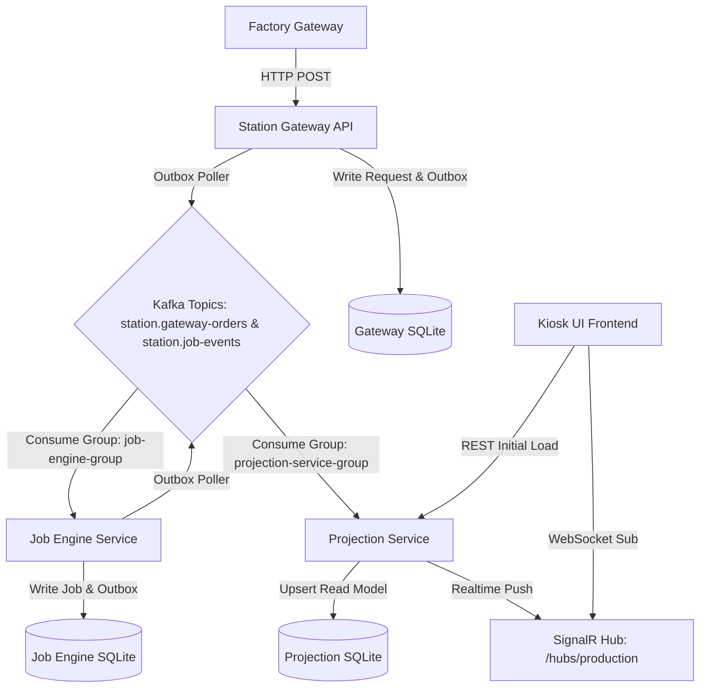

# Realtime Kiosk Architecture — Overview

This document outlines the event-driven real-time architecture implemented for the Print & Marking Station Agent.

## Architecture Diagram

## Service Responsibilities

### 1. Station Gateway (HTTP API)
- Binds to HTTP Port 5001.
- Exposes REST endpoint `POST /api/gateway/orders` for Factory Gateway to submit production orders (via `UnifiedEvent` payload).
- Implements 24-hour Redis-based idempotency checks to avoid double-processing orders.
- Uses a transactional Unit of Work to write raw payloads into the local `gateway_requests` database table and a pending outbox event to the `gateway_outbox_events` table.
- A background worker polls the outbox and publishes the gateway events to the `station.gateway-orders` Kafka topic.

### 2. Job Engine Service
- Consumes events from the `station.gateway-orders` Kafka topic using consumer group `job-engine-group`.
- Creates a new `Job` record and starts processing it.
- Writes corresponding outbox events (`JobCreated`, `JobProcessing`, `JobCompleted`, and `JobFailed`) to the local `job_engine_outbox_events` table.
- A background worker polls the outbox and publishes these lifecycle updates to the `station.job-events` Kafka topic.

### 3. Projection Service (Read Model)
- A standalone service that listens to `station.gateway-orders`, `station.job-events`, and `station.device-heartbeats` Kafka topics using consumer group `projection-service-group`.
- Computes and maintains a materialized view of:
  - `production_view`: The current active job SKU, work order number, serial number, status, and update timestamp at the station.
  - `activity_log`: A list of the latest 10 production events (Gateway request received, job queued, job processing started, job completed/failed).
  - `device_status`: The connection status of PLC, Printer, Laser, and Vision Camera.
- Exposes REST endpoints for fast initial Kiosk UI load.
- Exposes a SignalR Hub (`/hubs/production`) for pushing sub-second state changes to subscribers.

### 4. Kiosk UI (Frontend)
- Connects directly to the Projection Service's SignalR Hub on startup.
- Displays real-time station metrics, device connectivity, and a live scrollable activity stream.
- Satisfies CQRS: does not poll or directly query multiple microservices.
