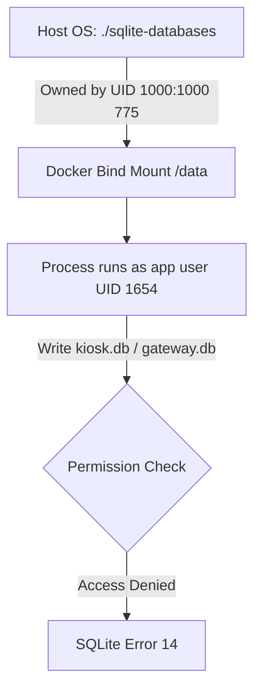

# Troubleshooting & Deployment Guide: SQLite Bind-Mount Permissions in Docker

This guide details the root cause, analysis, and solutions for SQLite file-locking and database creation errors (specifically **SQLite Error 14: unable to open database file**) when running C# .NET services under non-root Docker environments.

---

## 1. Problem Description

During database initialization inside the container (e.g., when calling EF Core's `EnsureCreatedAsync` or running migrations), the application throws:
```text
Unhandled exception. Microsoft.Data.Sqlite.SqliteException (0x80004005): SQLite Error 14: 'unable to open database file'.
   at Microsoft.Data.Sqlite.SqliteConnection.Open()
   at Microsoft.EntityFrameworkCore.Storage.RelationalDatabaseCreator.EnsureCreatedAsync()
```

---

## 2. Root Cause Analysis

The error occurs because the containerized processes execute under a non-root **`app`** user (UID `1654`, GID `1654`) while host directories are mounted under standard user contexts (e.g., UID `1000`).



### Key Behaviors:
1. **Low-Privilege User (`USER app`)**: Microsoft's .NET runtime images run as `app` (UID `1654`).
2. **Bind-Mount Ownership**: Mounting a folder (`./sqlite-databases:/data`) copies host permission values. If owned by `1000:1000` with `775` permissions, UID `1654` falls into the "others" category and lacks write rights.
3. **SQLite Journaling File Creation**: SQLite needs directory write access to create, modify, and delete rollback journal files (`db-wal` and `db-shm`) inside the **parent directory** `/data` when transaction locks are acquired. It is not sufficient to make the database file alone writable; **the directory must be writable**.

---

## 3. Recommended Solutions

### Option A: Set Writable Directory Ownership (Best for Production)
Adjust the host directory ownership to match the container user context UID `1654`:
```bash
sudo chown -R 1654:1654 ./sqlite-databases
```

### Option B: Set Unrestricted Directory Write Permissions (Best for Local Dev)
Grant read/write/execute permissions to all contexts:
```bash
chmod 777 ./sqlite-databases
```

### Option C: Use Docker Named Volumes (Recommended Best Practice)
For non-host-inspected data, define a Docker volume. Docker auto-configures the permissions context for the non-root container process:
```yaml
services:
  station-gateway:
    ...
    volumes:
      - sqlite-data:/data

volumes:
  sqlite-data:
```
