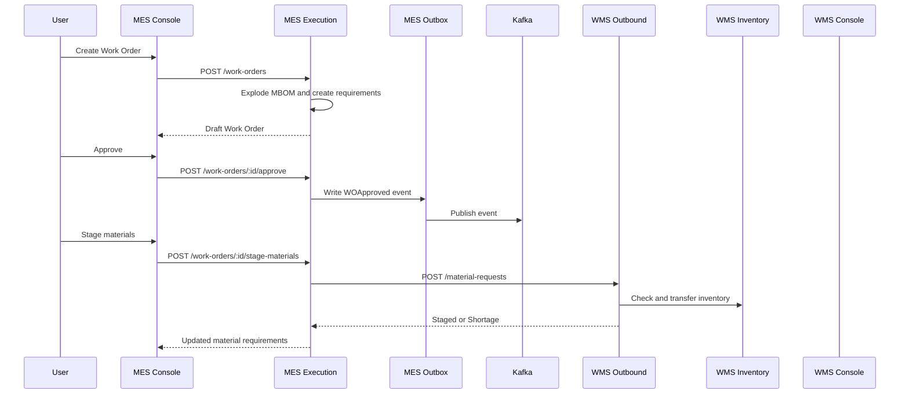

# Audit and Fix the MES-to-WMS Material Request Flow

## Context

Read `AI_CONTEXT.md` first, then inspect the actual running source code, service manifests, database migrations, API handlers, frontend code, tests, Docker Compose files, Kafka contracts, and runtime logs.

The system is an MES/WMS microservice platform.

Relevant services include:

* `mes-execution-service`
* `mes-console`
* `wms-outbound-service`
* `wms-inventory-service`
* `wms-console`
* `mes-kiosk-gateway-service`
* Kafka and the transactional outbox infrastructure

The current documented flow indicates that:

* Creating a Work Order explodes the MBOM and creates MES material requirements.
* Approving a Work Order transitions it to `Released` and publishes `MES.Execution.WOApproved.v1`.
* WMS does not currently consume `MES.Execution.WOApproved.v1`.
* Material staging is initiated through:

```http
POST /api/mes/execution/work-orders/:id/stage-materials
```

* `mes-execution-service` then sends one or more requests to:

```http
POST /api/wms/outbound/material-requests
```

* WMS uses an idempotency key based on:

```text
wo_id + work_center_ref + item_revision_id + required_qty
```

* `wms-outbound-service` uses a PostgreSQL advisory transaction lock to prevent duplicate stock transfers.
* The documented WebSocket hub belongs to `mes-kiosk-gateway-service`; it is not yet proven that WMS uses WebSocket for realtime material-request updates.

Do not assume the documentation is fully correct. Running source code is the highest-priority source of truth.

---

## Problem

When a Work Order is created, approved, and its materials are staged, many HTTP requests are sent to WMS.

It is unclear whether:

1. The number of requests is expected because there is one request per material requirement or Work Center.
2. The frontend is unintentionally triggering the same command multiple times.
3. React rerenders, effects, retries, or query invalidation are producing duplicate calls.
4. MES is calling WMS repeatedly for already staged requirements.
5. Both approval and a separate staging action are initiating material requests.
6. Retry logic is incorrectly retrying business responses such as shortages.
7. WMS idempotency prevents duplicate stock movement but still creates excessive HTTP traffic.
8. Repeated requests return the same WMS request records or create duplicate records.
9. The WMS Console receives realtime updates through WebSocket, Server-Sent Events, Kafka-backed push, or only polling/refetching.
10. The current architecture provides an acceptable realtime experience.

Perform a complete investigation and implement the necessary fixes.

---

# Objectives

## 1. Reconstruct the Current End-to-End Flow

Trace the complete flow starting from the MES Console.

Cover at least these actions:

1. Open the Work Order creation screen.
2. Create a Work Order.
3. MES explodes the MBOM.
4. MES creates Work Order material requirements.
5. User runs compute/check, if applicable.
6. User approves the Work Order.
7. Work Order transitions to `Released`.
8. MES writes `MES.Execution.WOApproved.v1` to its transactional outbox.
9. User or frontend triggers material staging.
10. MES groups or iterates material requirements.
11. MES calls `wms-outbound-service`.
12. WMS checks existing Work Center staging stock.
13. WMS checks warehouse storage stock.
14. WMS transfers the shortfall to Work Center staging or declares a shortage.
15. WMS stores the material request.
16. MES persists the returned WMS request ID, request code, status, and details.
17. MES Console and WMS Console refresh their displayed state.

Create a Mermaid sequence diagram showing the actual implementation.

Example structure:



Modify this diagram to exactly match the source code.

---

## 2. Audit Every Request Sent to WMS

Instrument and document every request from MES to WMS during:

* Work Order creation
* Work Order approval
* Material staging
* Page refresh
* Work Order detail loading
* WMS request list loading
* Retry after dependency failure
* Repeated button clicks
* React development mode
* React Strict Mode
* TanStack Query refetching
* Browser focus refetch
* Automatic retry
* WebSocket reconnect, if present

For each request, capture:

```text
Timestamp
Trace ID
Frontend action
MES Work Order ID
MES Work Order code
Material requirement ID
Item revision ID
Item code
Work Center ID
Required quantity
HTTP method
Target URL
Idempotency key
Retry attempt
Response status
WMS request ID
WMS request code
WMS business status
```

Create a request matrix:

| User action | MES endpoint | WMS endpoint | Expected call count | Actual call count | Duplicate? | Root cause |
| ----------- | ------------ | ------------ | ------------------: | ----------------: | ---------- | ---------- |

Do not label requests as duplicates only because there are many of them.

A separate request can be valid when it represents a unique combination of:

```text
Work Order
Work Center
Material requirement
Item revision
Required quantity
```

However, repeated requests for the same logical material demand must be investigated.

---

## 3. Define the Correct Request Cardinality

Determine the intended unit of a WMS material request.

Verify whether WMS should receive:

* One request per Work Order
* One request per Work Center
* One request per material requirement
* One request per Work Center and item
* One request containing multiple request lines

Compare this with the current database schema and implementation.

Document the expected formula.

For example:

```text
Expected request count =
count of non-phantom material requirements
grouped by Work Order + Work Center + Item Revision
```

Verify whether requirements with the same item and Work Center should be aggregated.

Check these cases:

* Multiple MBOM lines using the same item.
* Same item required by different operations.
* Same item required at different Work Centers.
* Phantom components.
* Optional materials.
* Zero required quantity.
* Backflush materials.
* Already staged materials.
* Requirements previously returned as `Shortage`.
* Work Order quantity changes.
* Work Order rejection or cancellation.
* Work Order reapproval.
* Partial staging.
* Repeated staging.

Make the grouping and cardinality rules explicit and enforce them in code.

---

## 4. Audit Frontend Duplicate Triggers

Inspect the MES Console implementation for:

* Multiple `onClick` handlers.
* Button events bubbling to parent rows.
* Form `onSubmit` plus button `onClick` calling the same mutation.
* Missing `type="button"`.
* React Strict Mode behavior.
* `useEffect` calling staging commands.
* Mutation calls inside query functions.
* Automatic retries for mutations.
* Multiple query invalidations triggering commands instead of reads.
* Double-clicks.
* Buttons remaining enabled while a mutation is pending.
* Recreated mutation objects.
* Route loaders or detail modals triggering write operations.
* Approval handlers automatically calling staging while the UI also calls staging.
* Optimistic UI accidentally resubmitting commands.

Mutating requests must only occur after an explicit business command.

Implement, where appropriate:

* Disable the action while the request is pending.
* Prevent double submission.
* Ensure staging is called from exactly one handler.
* Ensure query/refetch functions perform only reads.
* Set mutation retry behavior explicitly.
* Use a stable client-generated command or idempotency identifier where useful.
* Show the current action status to the user.
* Keep the UI pessimistic: do not report success before backend confirmation.

---

## 5. Audit Backend Duplicate Triggers

Inspect `mes-execution-service` for:

* Whether approval automatically invokes staging.
* Whether `POST /stage-materials` loops over every material row.
* Whether rows are grouped before calling WMS.
* Whether already staged rows are skipped.
* Whether shortage rows are retried automatically.
* Whether phantom requirements are excluded.
* Whether concurrent requests can run for the same Work Order.
* Whether the MES transaction can partially update material requirements.
* Whether WMS responses are persisted before the next retry.
* Whether retry logic retries HTTP 4xx or business shortages.
* Whether circuit-breaker behavior causes duplicate attempts.
* Whether timeouts can lead to an unknown outcome and a duplicate retry.
* Whether the same request can be processed concurrently by multiple MES instances.

Add command-level concurrency control for staging a Work Order if it is currently missing.

Possible approaches include:

* PostgreSQL advisory lock by Work Order ID.
* A unique staging-command table.
* A command idempotency key.
* A durable processing state.
* Compare-and-set status transitions.

Do not rely only on frontend button disabling.

---

## 6. Verify WMS Idempotency

Inspect the actual implementation of:

```text
wo_id + work_center_ref + item_revision_id + required_qty
```

Verify:

* The key is generated consistently.
* Decimal quantities use canonical formatting.
* Work Center identifiers cannot change between retries.
* The key is protected by a database constraint or equivalent durable guarantee.
* The advisory lock is acquired inside the correct transaction.
* The existing row is checked while the lock is held.
* Repeated requests return the same material request.
* Repeated requests do not transfer inventory twice.
* Concurrent requests do not create duplicate records.
* Concurrent requests do not create duplicate inventory movements.
* Timeout-after-commit retries return the original result.
* Two legitimate requirements are not incorrectly merged.

Add automated tests for:

```text
Sequential duplicate requests
Concurrent duplicate requests
Timeout followed by retry
Same fields with different quantity
Same item with different Work Center
Same Work Order with different material requirement
Already staged inventory
Warehouse transfer required
Shortage
Inventory service unavailable
```

Where possible, add a unique database index supporting the business identity in addition to advisory locking.

---

## 7. Verify the Approval-to-Staging Contract

The documented design currently separates:

```text
Approve Work Order
```

from:

```text
Stage Work Order materials
```

Verify whether this separation is intentional.

Determine whether the desired business behavior is:

### Option A: Explicit staging command

```text
Approve Work Order
→ Work Order becomes Released
→ User explicitly clicks Stage Materials
→ MES sends requests to WMS
```

### Option B: Automatic asynchronous staging

```text
Approve Work Order
→ MES publishes WOApproved
→ WMS or an integration consumer creates material requests asynchronously
```

### Option C: MES-owned asynchronous command

```text
Approve Work Order
→ MES writes WOApproved and MaterialStagingRequested to its outbox
→ MES/WMS consumer processes the request
```

Do not implement two independent creators.

There must be exactly one canonical owner responsible for creating WMS material demand.

If explicit staging remains the canonical design:

* Approval must not also create WMS requests.
* Kafka consumers must not independently create the same requests.
* The UI must clearly expose the Stage Materials action.
* Repeated staging must remain safe.

If automatic staging is selected:

* Remove the second automatic/manual creation path or make it a retry command for the same durable request.
* Use transactional outbox publishing.
* Add an idempotent consumer.
* Persist processing status.
* Add reconciliation for failed or delayed events.
* Keep the HTTP endpoint only as a safe retry/reconciliation command, not as a second creator.

Record the decision in an ADR.

---

# Realtime and WebSocket Audit

## 8. Determine the Current Realtime Mechanism

Search the complete repository for:

```text
WebSocket
websocket
ws://
wss://
Socket.IO
EventSource
SSE
subscribe
publish
TanStack Query refetchInterval
polling
setInterval
invalidateQueries
MaterialStaged
MaterialShortageDeclared
material-request
```

Inspect:

* `wms-console`
* `wms-outbound-service`
* `wms-inventory-service`
* `mes-console`
* `mes-kiosk-gateway-service`
* Kong configuration
* Docker Compose
* service manifests
* Kafka consumers and producers

Answer these questions with source evidence:

1. Does `wms-outbound-service` expose a WebSocket endpoint?
2. Does `wms-console` open a WebSocket connection?
3. Does WMS use Server-Sent Events?
4. Does WMS Console use polling?
5. Does it update only after mutation success and query invalidation?
6. Does it require a manual page refresh?
7. Are `WMS.Outbound.MaterialStaged.v1` and `WMS.Outbound.MaterialShortageDeclared.v1` consumed by a realtime gateway?
8. Can the existing MES kiosk WebSocket gateway safely serve WMS users?
9. Should WMS have a separate gateway or notification service?
10. Does Kong support and correctly route the WebSocket upgrade?

Produce an evidence table:

| Capability                     | Status                             | Evidence        | Gap         |
| ------------------------------ | ---------------------------------- | --------------- | ----------- |
| WMS backend WebSocket endpoint | Implemented / Missing / Unverified | Path and symbol | Description |
| WMS Console WebSocket client   | Implemented / Missing / Unverified | Path and symbol | Description |
| Kafka-to-WebSocket bridge      | Implemented / Missing / Unverified | Path and symbol | Description |
| Reconnect and backoff          | Implemented / Missing / Unverified | Path and symbol | Description |
| Authentication                 | Implemented / Missing / Unverified | Path and symbol | Description |
| Missed-event recovery          | Implemented / Missing / Unverified | Path and symbol | Description |

Use the project’s evidence vocabulary:

```text
IMPLEMENTED_AND_VERIFIED
IMPLEMENTED_BUT_NOT_TESTED
PARTIALLY_IMPLEMENTED
DOCUMENTED_INTENT_ONLY
PLANNED
MISSING
AMBIGUOUS
CONFLICTING_SOURCES
```

---

## 9. Implement WMS Realtime Updates if Missing

If WMS does not currently provide realtime material-request updates, implement it.

Do not use WebSocket as the transport for the MES-to-WMS business command itself.

The durable business flow must remain:

```text
MES command/event
→ WMS transaction
→ WMS database commit
→ transactional outbox
→ Kafka event
```

WebSocket is only the final UI notification transport:

```text
WMS transactional outbox
→ Kafka
→ realtime gateway
→ authenticated WMS Console clients
```

### Recommended architecture

Prefer a dedicated WMS realtime gateway unless the existing kiosk gateway is explicitly designed and secured as a shared cross-cluster notification gateway.

Possible service:

```text
wms-realtime-gateway-service
```

Responsibilities:

* Authenticate WebSocket connections with Keycloak access tokens.
* Authorize users by site, warehouse, role, and resource scope.
* Subscribe to WMS Kafka events.
* Deliver realtime notifications to relevant WMS Console clients.
* Maintain heartbeat/ping-pong.
* Handle reconnects.
* Apply bounded exponential backoff.
* Avoid unbounded in-memory queues.
* Expose metrics for connections and delivery failures.
* Never become the source of truth.
* Never modify inventory or material-request state.

Suggested event types:

```text
WMS.Outbound.MaterialRequestCreated.v1
WMS.Outbound.MaterialStaged.v1
WMS.Outbound.MaterialShortageDeclared.v1
WMS.Outbound.MaterialRequestUpdated.v1
```

If `MaterialRequestCreated` and `MaterialRequestUpdated` do not exist, add them through the transactional outbox.

Suggested WebSocket messages:

```json
{
  "message_id": "uuid",
  "event_id": "uuid",
  "event_type": "WMS.Outbound.MaterialRequestUpdated.v1",
  "occurred_at": "2026-07-24T08:00:00Z",
  "trace_id": "uuid",
  "payload": {
    "material_request_id": "uuid",
    "request_code": "MR-XXXXXXXX",
    "work_order_id": "uuid",
    "work_order_code": "WO-1004",
    "work_center_id": "uuid",
    "work_center_code": "WC-MOLD-01",
    "item_revision_id": "uuid",
    "item_code": "RM-STL-05",
    "required_qty": "101.000000",
    "uom_code": "PCS",
    "status": "Staged"
  }
}
```

### WebSocket endpoint

An example contract:

```text
GET /api/wms/realtime/ws
Authorization: Bearer <access-token>
```

If browser WebSocket limitations make the Authorization header impractical, use a secure short-lived ticket endpoint:

```http
POST /api/wms/realtime/tickets
Authorization: Bearer <access-token>
```

Then connect using:

```text
wss://host/api/wms/realtime/ws?ticket=<single-use-short-lived-ticket>
```

Do not place a long-lived Keycloak access token directly in URLs or logs.

---

## 10. WMS Console Integration

Implement a reusable realtime client for `wms-console`.

Required behavior:

* Connect only after authentication is initialized.
* Use secure `wss://` in production.
* Reconnect with exponential backoff and jitter.
* Stop reconnecting after logout.
* Send or respond to heartbeat messages.
* Prevent duplicate active connections.
* Clean up connections when providers unmount.
* Handle access-token refresh.
* Display connection state.
* Do not trust WebSocket data as the sole source of truth.

On receiving a valid event:

* Validate the message shape.
* Deduplicate by `event_id`.
* Update the relevant TanStack Query cache or invalidate only the affected query.
* Avoid invalidating the entire application.
* Refresh material-request detail only when necessary.
* Show a localized notification for important status transitions.
* Preserve VI/EN/JA/KO localization.
* Keep the table’s current pagination and filters.

Example query invalidation:

```ts
queryClient.invalidateQueries({
  queryKey: ["wms", "outbound", "material-requests"],
});
```

Prefer targeted cache updates when the complete updated record is present.

---

# Observability

## 11. Add Distributed Tracing

Ensure one trace can follow:

```text
MES Console
→ MES Execution
→ WMS Outbound
→ WMS Inventory
→ WMS Outbox
→ Kafka
→ WMS Realtime Gateway
→ WMS Console
```

Propagate:

```text
traceparent
tracestate
x-request-id
x-correlation-id
```

The event envelope must preserve `trace_id`.

Add spans such as:

```text
mes.work_order.create
mes.work_order.approve
mes.material_staging.command
mes.wms.material_request
wms.material_request.create
wms.material_request.idempotency_check
wms.inventory.staging_balance_check
wms.inventory.transfer_to_staging
wms.outbox.publish
wms.realtime.event.consume
wms.websocket.deliver
```

Add attributes:

```text
work_order_id
work_order_code
material_requirement_id
material_request_id
request_code
item_revision_id
item_code
work_center_id
required_qty
idempotency_key_hash
retry_attempt
business_status
```

Never log access tokens, credentials, or sensitive payloads.

---

## 12. Add Metrics

Add or verify metrics for:

```text
mes_wms_material_request_attempts_total
mes_wms_material_request_retries_total
mes_wms_material_request_duplicate_responses_total
wms_material_requests_created_total
wms_material_requests_idempotent_replays_total
wms_material_requests_shortage_total
wms_inventory_transfers_to_staging_total
wms_realtime_connections_active
wms_realtime_messages_sent_total
wms_realtime_delivery_failures_total
wms_realtime_kafka_lag
```

Include useful labels, but do not use high-cardinality IDs as metric labels.

---

# Testing Requirements

## 13. Backend Tests

Add unit, integration, contract, concurrency, and failure tests.

At minimum test:

1. One Work Order with one material requirement.
2. One Work Order with multiple unique requirements.
3. Duplicate MBOM lines for the same item and Work Center.
4. Same item used by different Work Centers.
5. Phantom requirements are excluded.
6. Already staged requirement is not unnecessarily recreated.
7. Repeated staging returns the same WMS request.
8. Two concurrent staging commands do not double-transfer inventory.
9. WMS shortage is preserved as a business result.
10. Inventory service `503` remains retryable.
11. Business `4xx` responses are not retried automatically.
12. Timeout after WMS commit is recovered through idempotency.
13. Approval does not create requests when explicit staging is canonical.
14. Automatic staging creates exactly one logical demand when event-driven staging is canonical.
15. Kafka redelivery does not create duplicates.
16. WebSocket clients receive created/staged/shortage events.
17. Unauthorized WebSocket connections are rejected.
18. Reconnected clients recover state through REST refetch.
19. Slow WebSocket clients cannot exhaust gateway memory.
20. Multiple gateway instances do not corrupt delivery semantics.

---

## 14. Frontend Tests

Add tests for:

* Single click sends one mutation.
* Double click sends one mutation.
* Pending button is disabled.
* Form submit does not duplicate button click.
* Approval and staging remain separate when required.
* Mutation retry is configured correctly.
* React Strict Mode does not duplicate write requests.
* WebSocket connects once.
* WebSocket reconnects after a network interruption.
* Duplicate event IDs are ignored.
* The affected query cache is updated.
* Manual page refresh is not required.
* Connection state is visible.
* Localized notifications work in VI/EN/JA/KO.

---

## 15. Runtime Verification

Run the real stack and verify the flow using a new Work Order.

Do not rely only on mocks.

Record:

```text
Work Order ID
Work Order code
Number of non-phantom MES requirements
Expected WMS request count
Actual MES-to-WMS HTTP call count
Number of unique WMS requests
Number of WMS inventory transfers
Number of idempotent replay responses
Number of realtime events
Number of WebSocket messages received
Final status of every material requirement
Final WMS staging balances
```

Test the following runtime scenarios:

```text
Normal staging
Repeated staging
Rapid double click
Two concurrent API calls
Browser refresh
WMS Outbound restart
WMS Inventory temporary failure
Kafka temporary unavailability
Realtime gateway restart
WebSocket disconnect and reconnect
Shortage
Existing WorkCenterStaging stock
```

Use Grafana, Tempo, Loki, Prometheus, Kafka UI, database queries, and service logs as evidence where useful.

---

# Required Deliverables

## 1. Current Flow Report

Create:

```text
implementation-fix/mes-wms-material-request-flow-audit.md
```

Include:

* Actual end-to-end flow.
* Mermaid sequence diagram.
* Request cardinality.
* Every duplicate trigger found.
* Current realtime mechanism.
* WebSocket evidence.
* Risks and gaps.
* Source paths and symbols.
* Runtime verification results.

## 2. Architecture Decision Record

Create an ADR deciding:

* Explicit versus automatic material staging.
* The single canonical material-demand creator.
* HTTP/Kafka ownership.
* WebSocket gateway ownership.
* Eventual-consistency behavior.
* Retry and reconciliation policy.

## 3. Code Changes

Implement all fixes required to:

* Eliminate unintended duplicate requests.
* Preserve valid per-material requests.
* Strengthen command-level idempotency.
* Prevent duplicate stock transfers.
* Provide realtime WMS Console updates if currently missing.
* Preserve circuit-breaker behavior.
* Preserve transactional outbox rules.
* Preserve service database ownership boundaries.

## 4. Tests

Add repeatable automated tests for:

* Request cardinality.
* Idempotency.
* Concurrency.
* Retry behavior.
* Failure handling.
* Kafka redelivery.
* WebSocket authentication.
* Reconnection.
* UI single-submit behavior.

## 5. Implementation Record

Update `AI_CONTEXT.md` only after the implementation has been verified.

Classify every conclusion using the project evidence vocabulary.

---

# Acceptance Criteria

The task is complete only when all of the following are true:

* [ ] The full create → approve → stage → WMS flow is documented from source code.
* [ ] The expected number of WMS calls is formally defined.
* [ ] Every actual WMS call can be traced to one logical material demand.
* [ ] A single UI action cannot accidentally send the same command multiple times.
* [ ] Concurrent staging commands cannot double-transfer stock.
* [ ] Repeated logical requests return the original WMS material request.
* [ ] Phantom material requirements are not sent to WMS.
* [ ] Already completed staging is not processed unnecessarily.
* [ ] Shortage remains a business result and is not treated as a transport failure.
* [ ] There is exactly one canonical creator of WMS material demand.
* [ ] Approval and material staging cannot independently create duplicate demand.
* [ ] The current WMS realtime mechanism is proven with source evidence.
* [ ] If WMS WebSocket support was missing, a secure Kafka-to-WebSocket notification path is implemented.
* [ ] WMS Console receives material-request updates without manual refresh.
* [ ] WebSocket reconnect and missed-event recovery are implemented.
* [ ] REST remains the source of truth after reconnect.
* [ ] Authentication and authorization are enforced for realtime clients.
* [ ] Distributed traces cover MES through WMS and realtime delivery.
* [ ] Automated concurrency and failure tests pass.
* [ ] Real runtime verification proves that no duplicate inventory transfer occurs.
* [ ] Documentation accurately distinguishes implemented, tested, missing, and planned behavior.

---

# Engineering Constraints

* Do not share databases between services.
* Do not create WMS records directly from MES database access.
* Do not use WebSocket as the durable MES-to-WMS command channel.
* Do not create two independent material-request creators.
* Do not remove idempotency or advisory-lock protections.
* Do not retry business validation errors.
* Do not treat `Shortage` as a transport failure.
* Do not report success before backend confirmation.
* Do not update `AI_CONTEXT.md` with unverified claims.
* Preserve the existing circuit-breaker baseline.
* Use transactional outbox for meaningful state changes.
* Use Kafka for durable cross-service event delivery.
* Use WebSocket only for authenticated, realtime client notification.
* Running code and runtime evidence take precedence over historical documentation.

---

# Final Response Format

Return the final result using this structure:

```markdown
# MES-to-WMS Material Request Audit Result

## Executive Summary

## Current Implemented Flow

## Request Cardinality

## Duplicate Requests Found

## Root Causes

## Approval and Staging Ownership Decision

## WMS Idempotency Verification

## Current Realtime/WebSocket Status

## Realtime Architecture Implemented

## Files Changed

## Database Migrations

## Event Contracts

## Tests Added

## Runtime Verification

## Remaining Risks

## Evidence Classification

## Final Acceptance Checklist
```

Do not claim that a behavior is implemented or fixed without source evidence and a repeatable test or runtime verification result.
