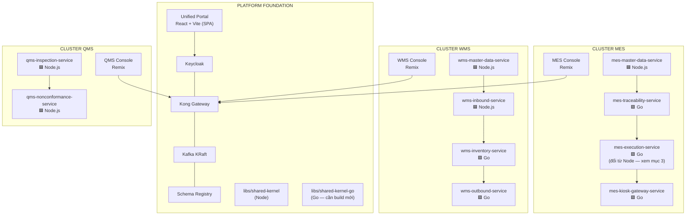

# TECH STACK DECISION — Node.js vs Go per Service (Polyglot có chọn lọc)
**Cập nhật so với file trước:** vì team đã thạo cả Node.js và Go, và frontend thạo cả React lẫn Remix,
tiêu chí "tốc độ phát triển" không còn là lý do chọn Node mặc định nữa. Quyết định dưới đây **chỉ dựa
trên đặc tính workload** (CRUD/read-heavy vs connection-heavy vs CPU-bound), đúng khung tiêu chí đã đặt
ra ở mục 0 của file gốc.

---

## 1. Khung tiêu chí quyết định (dùng lại cho mọi service tương lai, kể cả WMS/QMS chưa xây)

| Tiêu chí | → Chọn Node.js | → Chọn Go |
|---|---|---|
| Loại workload chủ đạo | CRUD request/response, đọc nhiều hơn ghi, business rule validation | Ghi liên tục tần suất cao, hoặc nhiều kết nối đồng thời dài hạn |
| Concurrency pressure | Thấp — write hiếm, không lo race condition | Cao — nhiều client ghi/kết nối cùng lúc, cần đúng dưới tải |
| Tính toán trong 1 request | Nhẹ (query + validate) | Nặng (duyệt cây MBOM/Routing, tính lịch trình, thuật toán) |
| Yêu cầu tail-latency dưới tải cao | Không khắt khe | Khắt khe — phải ổn định khi traffic tăng đột biến |
| Bản chất kết nối | Ngắn hạn, request/response | Dài hạn đồng thời (WebSocket/MQTT) hoặc throughput ghi rất cao |
| Dev velocity | ~~Ưu tiên~~ **Trung lập** — team thạo cả 2 | **Trung lập** — team thạo cả 2 |

Vì dev velocity giờ trung lập, bảng quyết định bên dưới sẽ **thuần workload-driven** — đây là cách chọn đúng cho 1 kiến trúc microservices thật (mỗi service tự do chọn ngôn ngữ, chỉ ràng buộc bởi event contract chung).

---

## 2. Ma trận quyết định ngôn ngữ — toàn bộ service, 3 cluster

| Service | Workload thực tế | Ngôn ngữ chọn | Lý do quyết định |
|---|---|---|---|
| `hello-world-service` (scaffold validator) | Không có workload thật, chỉ để verify hạ tầng | **Node.js** | Giữ nguyên, không có lý do đổi cho 1 service test |
| `mes-master-data-service` | Release MBOM/Routing vài lần/tuần, bị đọc liên tục nhưng mỗi read chỉ là query đơn giản, không có concurrency-write pressure | **Node.js** | CRUD/read-heavy thuần túy — đúng sở trường Node, không có lý do kỹ thuật để dùng Go ở đây |
| `mes-traceability-service` | Atomic numbering + QR split dưới **nhiều kiosk quét đồng thời tại xưởng** — đúng định nghĩa "concurrency pressure cao" | **Go** | Cần đúng tuyệt đối dưới race condition, tail-latency thấp ổn định khi nhiều công nhân quét cùng lúc — goroutine + channel xử lý tốt hơn hẳn 1 event loop đơn luồng |
| `mes-execution-service` | **Xem cảnh báo riêng ở mục 3** — service này gộp cả CRUD nhẹ (Stage A: tạo/duyệt WO) lẫn workload nặng (Stage B: Start/Finish real-time, backflush, tính lịch trình CPU-bound) | **Go** | Chọn theo phần nặng nhất của **cùng 1 service**, không theo phần nhẹ nhất — xem lý do chi tiết ở mục 3 |
| `mes-kiosk-gateway-service` | Nhiều kết nối WebSocket/MQTT dài hạn đồng thời từ nhiều kiosk, cần buffer/reconnect ổn định | **Go** | Đây là bài toán goroutine sinh ra để giải — mỗi connection = 1 goroutine cực nhẹ, không nghẽn nhau |
| `wms-master-data-service` | Warehouse/Zone/Location — CRUD, read-heavy, cùng bản chất với MES Master Data | **Node.js** | Giống hệt lý do `mes-master-data-service` |
| `wms-inventory-service` | Stock ledger append-only, **ghi liên tục từ nhiều nguồn cùng lúc** (inbound scan, outbound pick, event từ MES) — cần atomic, đúng tuyệt đối | **Go** | Cùng bản chất với `mes-traceability-service`: atomic write dưới concurrency cao, sai 1 dòng ledger là sai số liệu tồn kho toàn hệ thống |
| `wms-inbound-service` | Nhận hàng/putaway — theo lô/ca, tần suất thấp hơn hẳn outbound, chủ yếu là CRUD + business rule | **Node.js** | Không có concurrency pressure đặc biệt ở MVP |
| `wms-outbound-service` | Picking real-time theo WO, **phải trả lời stock-check nhanh** khi `mes-execution-service` cần biết tồn kho — đây chính là service sẽ hiện thực `stock_check_status` đang bỏ trống | **Go** | Latency thấp là yêu cầu cứng vì nằm trên đường găng của luồng duyệt WO; đồng thời phải consume event tần suất cao từ MES |
| `qms-inspection-service` | Nhập kết quả kiểm tra tại `OP-QC`, theo từng lô/từng operation hoàn thành — tần suất theo nhịp sản xuất, không phải theo từng giây | **Node.js** | CRUD + business rule, không có concurrency pressure đặc biệt ở MVP |
| `qms-nonconformance-service` | NCR/CAPA — case management, do con người xử lý, tần suất thấp | **Node.js** | Không có lý do dùng Go |

**Tỷ lệ cuối cùng: 6 service Node.js / 5 service Go** — không lệch hẳn về 1 phía, đúng tinh thần polyglot có chọn lọc chứ không phải đổi toàn bộ hệ thống sang Go.

---

## 3. Cảnh báo quan trọng — `mes-execution-service` cần quyết định NGAY, trước khi bắt đầu code

Đây là điểm khác với lần phân tích trước (lúc đó tôi khuyến nghị mềm "giữ Node cho Stage A"). Giờ xin sửa lại dứt khoát, vì lý do sau:

- `mes-execution-service` **không phải 2 service khác nhau** — Stage A (WO planning/creation/approval, nhẹ) và Stage B (kiosk Start/Finish real-time, backflush, CPU-bound scheduling) đều thuộc **cùng 1 bounded context, cùng 1 service** theo đúng phân rã ở tài liệu chiến lược gốc.
- Nếu build Stage A bằng Node.js trước (như prompt đã đưa ở lượt trước), rồi tới Stage B mới phát hiện cần Go vì throughput/CPU-bound — đây chính xác là kiểu **"phải migrate lại sau"** mà toàn bộ chiến lược của bạn đang cố tránh (nguyên tắc đã nêu rõ ở mục 2.1 tài liệu chiến lược, áp dụng y hệt cho trường hợp này).
- Quyết định ngôn ngữ cho 1 service phải dựa trên **điểm workload nặng nhất mà service đó sẽ phải chịu trong vòng đời của nó**, không phải dựa trên tính năng đầu tiên được build.

**Kết luận: `mes-execution-service` nên là Go ngay từ Stage A**, kể cả khi Stage A tự thân không cần throughput cao. Lý do bổ sung: `ComputeAndCheckUseCase` (duyệt routing sequence theo `predecessor_seq`, tính cộng dồn thời lượng) là CPU-bound thực sự — nếu Stage A build bằng Node và routing phức tạp (nhiều operation, nhiều nhánh song song), đây đã là điểm nghẽn tiềm ẩn ngay cả trước khi tới Stage B.

**Việc cần làm:** prompt Phase 1 Step 3 (Stage A) đã đưa ở lượt trước hiện đang target Node/Express/Drizzle. Nếu team **chưa bắt đầu code theo prompt đó**, nên viết lại prompt target Go trước khi build (mục 4 bên dưới cho stack Go tương ứng). Nếu **đã code một phần bằng Node**, cần cân nhắc chi phí rewrite ngay bây giờ (còn rẻ) so với rewrite sau khi Stage B đã cắm sâu vào Node (đắt hơn nhiều).

---

## 4. Go Service Scaffolding Template — stack tương ứng, giữ nguyên pattern với bản Node

Nguyên tắc mục 5 chiến lược ("mọi service theo đúng khung, tránh mỗi service 1 phong cách") vẫn áp dụng — chỉ khác ngôn ngữ, cấu trúc thư mục và trách nhiệm từng layer phải giữ y hệt bản Node:

| Layer (Node) | Tương đương (Go) | Ghi chú |
|---|---|---|
| Express | **Chi** (`go-chi/chi`) | Chọn Chi thay vì Fiber vì Chi bám sát `net/http` chuẩn, middleware chain rõ ràng — dễ map 1-1 với cách Kong forward header (`X-User-ID`/`X-Role-Code`/`X-Trace-ID`) hơn Fiber (vốn mô phỏng Express, có thể gây nhầm lẫn "giống Node nhưng không phải Node") |
| Drizzle ORM | **sqlc** + `pgx` driver | sqlc giữ đúng triết lý "SQL-first, type-safe" giống Drizzle — viết SQL thật, sinh Go struct/function type-safe từ đó, không dùng ORM magic kiểu GORM (tránh lệch triết lý giữa 2 stack) |
| Migration SQL files | **Giữ nguyên format SQL thuần**, chạy qua `golang-migrate` | Quan trọng: viết migration bằng SQL thuần (không dùng DSL riêng của framework) để cả service Node và Go trong cùng monorepo dùng chung 1 convention migration, dù công cụ chạy khác nhau |
| `libs/shared-kernel` (Node package) | **`libs/shared-kernel-go`** (Go module riêng) | Cần port lại `EventEnvelope` struct và `OutboxRelayWorker` sang Go — đây là việc bắt buộc phải làm trước khi service Go đầu tiên (`mes-traceability-service` hoặc `mes-execution-service`) bắt đầu code |
| `audit-trigger.sql` / `lifecycle-state-machine.sql` | **Dùng lại y nguyên, không cần port** | 2 file này chạy ở tầng Postgres (trigger), hoàn toàn language-agnostic — đây là điểm hay của thiết kế gốc, không tốn công port |
| Kafka client (node-rdkafka hoặc kafkajs) | **`confluent-kafka-go`** | Chọn bản Confluent thay vì `segmentio/kafka-go` vì đã dùng Confluent Schema Registry — cùng hãng, tương thích schema validation tốt hơn |
| OTel SDK Node | **`go.opentelemetry.io/otel`** (official Go SDK) | Cấu hình exporter trỏ về cùng OTel Collector đã có, không đổi hạ tầng observability |
| `instrumentation.ts` | **`instrumentation.go`** (khởi tạo tracer/meter tương đương) | Viết 1 lần, dùng lại cho mọi service Go sau này — tương đương vai trò `instrumentation.ts` bên Node |

**Việc cần bổ sung vào Anti-Drift Governance (mục 7 chiến lược gốc):**
- Thêm **2 Service Scaffolding Template** thay vì 1 (`service-template-node/`, `service-template-go/`), nhưng cùng chung 1 `service.manifest.yaml` schema — vì đây là hợp đồng chung không phụ thuộc ngôn ngữ.
- Viết **1 ADR mới**: `docs/adr/000X-polyglot-node-go-decision.md` — ghi lại chính xác bảng quyết định ở mục 2 và lý do, để service tiếp theo (WMS/QMS) không phải suy luận lại từ đầu, và để không ai hiểu nhầm "tại sao có 2 ngôn ngữ" là thiếu nhất quán.

---

## 5. Frontend — React+Vite (Portal) giữ nguyên, Remix cho các console nghiệp vụ

| Frontend app | Bản chất | Lựa chọn | Lý do |
|---|---|---|---|
| **Unified Portal** (đã build) | App launcher đơn giản, chỉ hiển thị card theo Role, không có form/CRUD phức tạp | **Giữ nguyên React + Vite (SPA)** | Không có lý do kỹ thuật để đổi — đây là trang nhẹ, không cần SSR, đổi sang Remix chỉ tốn công vô ích cho 1 trang launcher |
| **MES Console** (Admin Master Data, WO planning/approval UI — chưa build) | Nhiều form CRUD, nhiều nested route (Item → Revision → MBOM → Routing), cần role-based view, chạy trên cả desktop lẫn tablet kiosk shop-floor | **Remix** | `loader`/`action` của Remix map trực tiếp 1-1 vào pattern CRUD (loader = GET đọc read-model, action = POST/PUT mutate) — đúng bản chất nghiệp vụ các màn hình này; nested routing khớp tự nhiên với cấu trúc phân cấp Item→Revision→MBOM; SSR + progressive enhancement quan trọng cho **tablet kiosk shop-floor** vốn dễ gặp mạng chập chờn — form vẫn submit được kể cả khi JS chưa load xong, khác hẳn SPA thuần cần JS bundle tải xong mới dùng được |
| **WMS Console** (chưa build) | Tương tự MES Console: nhiều form CRUD (nhận hàng, putaway, picking), operator dùng trên thiết bị cầm tay/kiosk kho | **Remix** | Cùng lý do — form-heavy, cần độ bền khi mạng kho hàng không ổn định |
| **QMS Console** (chưa build) | Form nhập kết quả kiểm tra, NCR/CAPA case — ít nghiêm trọng về mạng chập chờn hơn (thường dùng ở bàn QC cố định) nhưng vẫn form-heavy | **Remix** | Nhất quán với MES/WMS Console — dùng 1 pattern duy nhất cho mọi console nghiệp vụ, chỉ Portal là ngoại lệ (đã có lý do rõ ràng ở trên) |

**Nguyên tắc chốt:** Portal (launcher) dùng SPA vì nó không phải app nghiệp vụ. Mọi Console nghiệp vụ thực sự (nơi người dùng nhập liệu, duyệt, thao tác CRUD) dùng Remix — đồng nhất 1 pattern cho tất cả 3 cluster, tránh mỗi console 1 kiểu.

---

## 6. Sơ đồ cập nhật — polyglot theo cluster

---

## 7. Bảng tổng hợp cuối — thay thế mục 7 (Tech Stack Matrix) của file trước

| Layer | Node.js stack | Go stack | Dùng chung (cả 2) |
|---|---|---|---|
| HTTP Framework | Express | Chi | — |
| ORM/Data layer | Drizzle ORM | sqlc + pgx | — |
| Migration | Drizzle Kit sinh SQL | golang-migrate chạy cùng file SQL | **File SQL migration format thống nhất** |
| Kafka client | kafkajs/node-rdkafka | confluent-kafka-go | Cùng 1 Kafka cluster, Schema Registry |
| Shared kernel | `libs/shared-kernel` | `libs/shared-kernel-go` (cần build) | `audit-trigger.sql`, `lifecycle-state-machine.sql` (dùng chung, language-agnostic) |
| OTel | Node SDK | Go SDK official | Cùng 1 OTel Collector, Tempo, Grafana |
| Database | PostgreSQL | PostgreSQL | Database-per-service, không đổi |
| Frontend (launcher) | — | — | React + Vite (chỉ Portal) |
| Frontend (console nghiệp vụ) | — | — | Remix (MES/WMS/QMS Console) |
| Event contract | JSON Schema qua Confluent Schema Registry | (giống Node) | Không phân biệt theo ngôn ngữ publisher/consumer |

---

## 8. Việc cần làm ngay, theo đúng thứ tự

1. **Quyết định số phận prompt Stage A `mes-execution-service` đã đưa trước đó** — viết lại target Go nếu chưa code, hoặc đánh giá chi phí rewrite nếu đã code một phần bằng Node (mục 3).
2. Build `libs/shared-kernel-go` (port `EventEnvelope` + `OutboxRelayWorker`) — việc bắt buộc trước khi bất kỳ service Go nào bắt đầu, vì `mes-traceability-service` (Step 2, sắp build) đã cần nó.
3. Viết ADR `000X-polyglot-node-go-decision.md` ghi lại bảng quyết định mục 2, tránh người/AI sau phải đoán lại.
4. Dựng `service-template-go/` (song song `service-template-node/` đã có từ `hello-world-service`), test bằng cách scaffold 1 service Go rỗng, verify qua Kong + Kafka + OTel giống hệt cách `hello-world-service` đã verify cho Node.