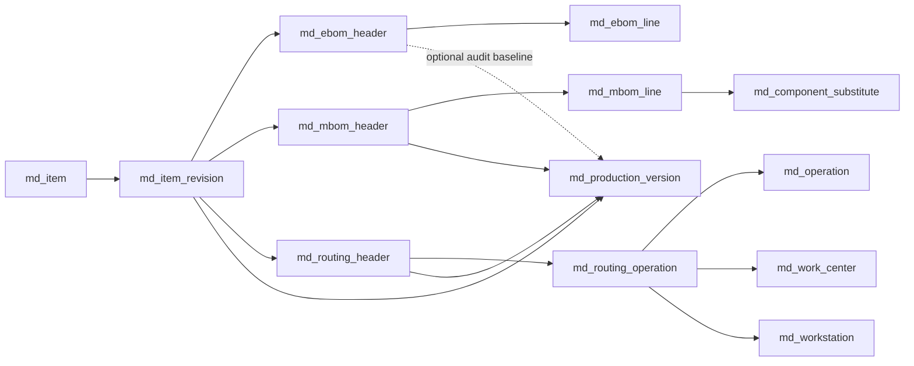
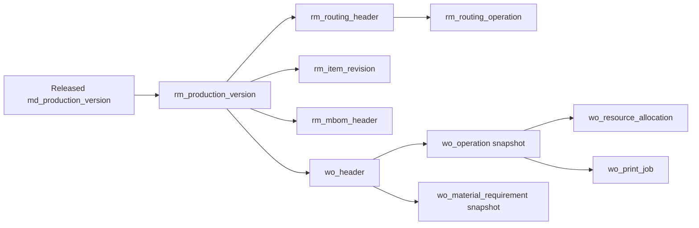
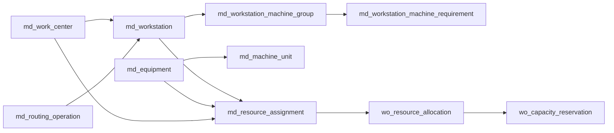

# MES Database ERD and Relationship Specification

**System:** S-Factory MOM Platform, MES
**Repository:** `/home/neurosus/mes-system`
**Verified:** 2026-07-30
**Status:** `IMPLEMENTED_AND_VERIFIED` for the structures and relationships described as current

This document is the canonical database reference for the MES bounded context. It describes the running
Master Data database, the MES Execution database, read-model projections, ownership rules, lifecycle rules,
and the relationships used by Production Version and Work Order flows.

It is based on:

- `services/mes-master-data-service/src/infrastructure/db/schema.ts`
- `services/mes-master-data-service/src/infrastructure/db/migrate.ts`
- `services/mes-execution-service/migrations/`
- current MES service handlers and execution use cases
- `AI_CONTEXT.md`
- `product-doc/II-PRODUCTS-&-MBOM-CATALOG.md`
- `product-doc/III-ROUTING-&-STANDARDS-CATALOG.md`
- `product-doc/IV-RESOURCES & CAPABILITIES CATALOG.md`
- `product-doc/VII-ERD-MATRIX-&-DEV-VALIDATION.md`

The migration chain and running source are authoritative when this document conflicts with an older product or
process prompt. UUIDs are internal identifiers. Business codes are the user-facing identifiers.

## 1. Database boundaries

MES uses two PostgreSQL ownership boundaries:

| Database | Owner | Tables | Responsibility |
|---|---|---|---|
| MES Master Data | `mes-master-data-service` | `md_*`, master-data `outbox_events` | Authoritative definitions, lifecycle, effectivity, hierarchy, production configuration |
| MES Execution | `mes-execution-service` | `wo_*`, execution tables, `rm_*`, execution `outbox_events` | Work Order transactions, immutable snapshots, planning, execution, print jobs, local projections |

The Execution database does **not** use cross-database foreign keys to Master Data. `rm_*` tables are projections
populated from released Master Data events. UUID equality and business ownership are validated by consumers and
application code, not by a PostgreSQL FK across databases.

WMS, QMS, Print Station, Kafka, and Keycloak are integration boundaries. Their tables are not MES tables and are
not included as owned entities in this ERD. MES stores correlation IDs, event IDs, and local projections where the
current execution contract requires them.

## 2. ERD overview

```mermaid
erDiagram
    md_site ||--o{ md_shopfloor : contains
    md_site ||--o{ md_production_area : owns
    md_site ||--o{ md_item_revision : scopes
    md_site ||--o{ md_shift : schedules
    md_site ||--o{ md_work_center : owns
    md_site ||--o{ md_workstation : owns
    md_site ||--o{ md_equipment : owns

    md_item ||--o{ md_item_revision : versions
    md_uom ||--o{ md_item : base_uom
    md_uom ||--o{ md_item_revision : base_uom
    md_material_group ||--o{ md_item : classifies
    md_material_group ||--o{ md_item_revision : classifies

    md_item_revision ||--o{ md_ebom_header : owns
    md_ebom_header ||--o{ md_ebom_line : contains
    md_ebom_line ||--o{ md_ebom_line : parent_child
    md_item_revision ||--o{ md_ebom_line : component

    md_item_revision ||--o{ md_mbom_header : owns
    md_mbom_header ||--o{ md_mbom_line : contains
    md_mbom_line ||--o{ md_component_substitute : substitutes
    md_item_revision ||--o{ md_mbom_line : component
    md_item_revision ||--o{ md_component_substitute : substitute

    md_item_revision ||--o{ md_routing_header : owns
    md_routing_header ||--o{ md_routing_operation : contains
    md_operation ||--o{ md_routing_operation : used_by
    md_work_center ||--o{ md_routing_operation : selected
    md_workstation ||--o{ md_routing_operation : authoritative_target

    md_item_revision ||--o{ md_production_version : configuration
    md_mbom_header ||--o{ md_production_version : configuration
    md_routing_header ||--o{ md_production_version : configuration
    md_ebom_header o|--o{ md_production_version : optional_baseline

    md_work_center ||--o{ md_workstation : contains
    md_workstation ||--o{ md_workstation_machine_group : owns
    md_workstation_machine_group ||--o{ md_workstation_machine_requirement : requires
    md_equipment ||--o{ md_machine_unit : units
    md_workstation ||--o{ md_resource_assignment : assigned
    md_equipment ||--o{ md_resource_assignment : assigned
    md_work_center ||--o{ md_resource_assignment : scopes
    md_work_center ||--o{ md_resource_capability : capability
    md_operation ||--o{ md_resource_capability : capability
    md_work_center ||--o{ md_resource_calendar : calendar
    md_workstation ||--o{ md_resource_calendar : calendar
    md_equipment ||--o{ md_resource_calendar : calendar

    md_operation ||--o{ md_production_standard : standard
    md_routing_operation o|--o{ md_production_standard : routing_standard
    md_operation ||--o{ md_operation_skill_requirement : requires
    md_skill ||--o{ md_operation_skill_requirement : skill

    md_employee ||--o{ md_employee_skill : has
    md_skill ||--o{ md_employee_skill : assigned
    md_employee ||--o{ md_employee_shift_schedule : scheduled
    md_shift ||--o{ md_employee_shift_schedule : shift

    md_production_version ||--o{ wo_header : creates
    wo_header ||--o{ wo_operation : snapshots
    wo_header ||--o{ wo_material_requirement : requires
    wo_header ||--o{ wo_approval_log : audits
    wo_operation ||--o{ execution_session : executes
    execution_session ||--o{ operation_confirmation : confirms
    wo_operation ||--o{ wo_operation_labor_assignment : labor
    wo_operation ||--o{ wo_resource_allocation : allocates
    wo_resource_allocation ||--o{ wo_capacity_reservation : reserves
    wo_operation ||--o{ wo_print_job : prints
    wo_print_job ||--o{ wo_print_job_attempt : retries
    wo_print_job ||--o{ wo_print_job_event : events
    wo_operation ||--o{ material_consumption : consumes
```



`||--o{` means one required parent to zero-or-many children. `o|` means the relationship is optional on the
parent side. Some relationships in the diagram are logical projection relationships rather than physical FKs.

## 3. Common Master Data columns

Most `md_*` business master tables use the common master columns:

| Column | Meaning |
|---|---|
| `master_id` | Internal UUID primary key |
| `code` | Human-readable business code; backend-owned where numbering is configured |
| `name` | Localized JSON object, normally `vi`, `en`, `ja`, `ko` |
| `version_no` | Technical/business version number |
| `lifecycle_status` | `Draft`, `InReview`, `Released`, `Inactive`, or `Obsolete` |
| `effective_from`, `effective_to` | UTC validity interval; `effective_to IS NULL` means open-ended |
| `created_by`, `created_at` | Creation audit |
| `updated_by`, `updated_at` | Last update audit |
| `approved_by`, `approved_at` | Release/approval audit where applicable |
| `row_version` | Optimistic concurrency version |
| `attributes` | Extensible JSON metadata, not a substitute for a relational field |

Not every specialized table has all common columns. Effective-dated rows are ended for history; they are not
normally physically deleted after release or use.

## 4. Master Data tables

### 4.1 Site and factory hierarchy

| Table | Primary key | Important columns | Relationships |
|---|---|---|---|
| `md_site` | `master_id` | `code`, localized `name`, `timezone`, `address`, lifecycle/effectivity | Root manufacturing site. Parent of Shopfloor, Area, Work Center, Workstation, Equipment, Shift and Item Revision scope. |
| `md_shopfloor` | `master_id` | `site_id`, `code`, localized `name`, lifecycle/effectivity | `md_shopfloor.site_id -> md_site.master_id`. Parent for Work Centers and Workstations. |
| `md_production_area` | `master_id` | `site_id`, `parent_area_id`, `area_type`, `sequence_no` | Site-scoped area hierarchy. `parent_area_id` self-references `md_production_area.master_id`. |
| `md_shift` | `master_id` | `site_id`, `start_time`, `end_time`, `crosses_midnight` | Site-scoped working time definition. |
| `md_reason_code` | `master_id` | `reason_type`, `requires_comment` | Reason catalog used by changes, interruptions, and audit flows. |

The hierarchy is:

```text
Site
 └── Shopfloor
      └── Production Area
           └── Work Center
                └── Workstation
                     └── Machine Group / runtime assignments
```

`area_id`, `shopfloor_id`, `work_center_id`, and `site_id` are validated together. A UI option filter is only
convenience; the backend is authoritative for hierarchy and same-site validation.

### 4.2 UOM and material classification

| Table | Primary key | Important columns | Relationships |
|---|---|---|---|
| `md_uom` | `master_id` | `code`, localized `name`, `uom_class`, `decimal_precision`, lifecycle | Base unit catalog. Quantity validation uses its precision and fractional policy. |
| `md_uom_conversion` | `master_id` | `from_uom_id`, `to_uom_id`, `factor` | Conversion graph between UOMs. Both IDs reference `md_uom.master_id`; decimal arithmetic is backend-authoritative. |
| `md_material_group` | `master_id` | unique `code`, localized `name`/`description` | Central material classification used by Item and Item Revision. It is distinct from Item Type and Skill Group. |

Item Type (`FG`, `SFG`, `RM`) is a classification on Item, not a material-group relationship. Material Group CRUD is
dependency-aware: referenced groups cannot be edited or deleted.

### 4.3 Item and Item Revision

| Table | Primary key | Important columns | Relationships |
|---|---|---|---|
| `md_item` | `master_id` | `code`, localized `name`, `item_type`, `item_group`, `material_group_id`, `base_uom_id` | `base_uom_id -> md_uom`; `material_group_id -> md_material_group`. One Item owns many revisions. |
| `md_item_revision` | `master_id` | `item_id`, `revision_code`, `site_id`, `base_uom_id`, planning/procurement/tracking fields, effective dates, `previous_revision_id` | `item_id -> md_item`; `site_id -> md_site`; `base_uom_id -> md_uom`; `previous_revision_id -> md_item_revision`. |
| `md_item_revision_numbering` | `item_id` | current revision sequence/numbering state | One numbering row per Item; used by backend revision code generation. |

The Item Revision is the ownership anchor for product structures in the current architecture. A released revision
is effective at a Site and carries its own base UOM. Other forms must show only Released/effective revisions when they
consume a revision as a production definition.

### 4.4 EBOM: engineering definition

| Table | Primary key | Important columns | Relationships |
|---|---|---|---|
| `md_ebom_header` | `master_id` | `item_revision_id`, localized identity, lifecycle/effectivity | One EBOM header belongs to exactly one output Item Revision. |
| `md_ebom_line` | `master_id` | `ebom_header_id`, optional `parent_line_id`, `seq`, `component_revision_id`, `quantity`, `uom_id` | Header and component revision references. `parent_line_id` is retained by the current schema for historical/tree compatibility. |

EBOM is engineering-only. It is not used for material explosion, resource planning, material staging, backflush,
operation execution, substitute validation, or Work Order readiness. Production Version may store optional
`ebom_header_id` for engineering traceability, but Work Order snapshots must not copy EBOM lines.

### 4.5 MBOM: manufacturing material definition

| Table | Primary key | Important columns | Relationships |
|---|---|---|---|
| `md_mbom_header` | `master_id` | `item_revision_id`, `site_id`, `base_quantity`, `base_uom_id`, `structure_version`, lifecycle/effectivity | Manufacturing BOM owned by the output Item Revision. Site and base UOM are validated against the revision/configuration. |
| `md_mbom_line` | `master_id` | `mbom_header_id`, optional `parent_line_id`, `seq`, `component_revision_id`, `quantity_per`, derived `uom_id`, `issue_operation_id`, scrap/backflush/phantom/optional flags | Header -> lines; component revision -> line; optional issue Operation -> `md_operation`; optional parent line -> same MBOM line. |
| `md_component_substitute` | `master_id` | `mbom_line_id`, `substitute_revision_id`, priority, conversion/max usage, approval/effectivity | One main MBOM line may have many substitute rows. Substitutes are manufacturing-only and remain separate from EBOM. |

The current UI treats MBOM line UOM as derived/read-only from the component Item Revision base UOM. The database
retains `uom_id` for snapshot/validation compatibility; it must equal the authoritative component UOM after current
normalization. `issue_operation_id` points to the reusable Operation Catalog and is resolved against a selected
Routing Operation only when Production Version combines MBOM and Routing.

### 4.6 Operation, Routing and Production Standards

| Table | Primary key | Important columns | Relationships |
|---|---|---|---|
| `md_operation` | `master_id` | operation definition, confirmation/quantity policies, material scan/output label flags, engineering defaults, schedulable flag | Reusable Operation Catalog. Referenced by Routing Operation, MBOM issue mapping, standards, instructions, skills and resource capabilities. |
| `md_routing_header` | `master_id` | localized identity, `business_version`, `routing_type`, optional `item_revision_id`, lifecycle/effectivity | Routing process definition. Its selected product configuration is bound through Production Version; ownership compatibility requires the same Item Revision when populated. |
| `md_routing_operation` | `master_id` | `routing_header_id`, `operation_id`, `work_center_id`, authoritative `workstation_id`, sequence/predecessor, scheduling/planning/label fields | Routing header -> ordered operations. `operation_id -> md_operation`, `work_center_id -> md_work_center`, `workstation_id -> md_workstation`. |
| `md_production_standard` | `master_id` | `operation_id`, `work_center_id`, optional `routing_operation_id`, optional `item_revision_id`, setup/cycle/base/yield/efficiency/labor values, lifecycle/effectivity | Generic Operation/Work Center standard, Routing-scoped standard, or Item Revision-specific standard. Resolution prefers item-specific, then Routing-scoped, then valid fallback according to the current validator. |
| `md_work_instruction` | `master_id` | `operation_id`, instruction text, document URL | Operation instruction reference. |

The authoritative assignment is:

```text
Routing Header
  -> Routing Operation
       -> Operation Catalog
       -> Work Center
       -> Workstation
```

Workstation CRUD does not own Supported Operations. `md_workstation_operation_capability` remains a legacy
compatibility table/API for historical data and dependency reporting. It must not be used to resolve a new Routing
execution target.

### 4.7 Production Version: frozen master-data configuration

| Table | Primary key | Important columns | Relationships |
|---|---|---|---|
| `md_production_version` | `master_id` | `item_revision_id`, `mbom_header_id`, `routing_header_id`, optional `ebom_header_id`, derived `site_id`, lot limits, default flag, lifecycle/effectivity | Configuration aggregate joining one Item Revision, one MBOM, one Routing, and optionally one EBOM baseline. |

Release validation requires ownership/effectivity compatibility:

```text
ProductionVersion.item_revision_id
  = MBOM.item_revision_id
  = Routing.item_revision_id
  = EBOM.item_revision_id (when EBOM is selected)
```

The Production Version is the only production configuration identity submitted by Work Order creation. Its Site is
derived/validated from the selected manufacturing configuration and Work Center hierarchy. The Work Order form must
not independently choose competing Item Revision, MBOM, Routing, or Site values.

### 4.8 Work Center, Workstation and equipment

| Table | Primary key | Important columns | Relationships |
|---|---|---|---|
| `md_work_center` | `master_id` | `site_id`, `area_id`, `shopfloor_id`, resource/capacity model, default shift, concurrency | Logical planning resource under Site/Area/Shopfloor. Parent of Workstations and target of Routing Operations. |
| `md_workstation` | `master_id` | `site_id`, optional `work_center_id`, `shopfloor_id`, execution mode, concurrency, machine requirement | Physical/logical execution station under Work Center. Direct target stored on Routing Operation. |
| `md_equipment` | `master_id` | `site_id`, optional `work_center_id`, equipment type, status, expected quantity, efficiency | Machine Definition and shared capacity model. Its quantity is not proof of identified physical inventory; legacy aggregate serial is deprecated. |
| `md_machine_unit` | `machine_unit_id` | `machine_id`, unique asset code, sequence, unique serial when identified, identity/lifecycle/execution status, planning eligibility | One individually identifiable physical machine owned by one Equipment definition. Pending-identity units are not assignable or executable. |
| `md_machine_unit_migration_reconciliation` | `reconciliation_id` | source machine, declared quantity, unit count, missing count, serial ambiguity, manual-action flag | Additive reconciliation report for legacy aggregate quantity/serial data. |
| `md_workstation_machine_group` | `master_id` | Site/Shopfloor/Work Center/Workstation IDs, minimum machines, concurrency | Repeatable execution resource group owned by Workstation. |
| `md_workstation_machine_requirement` | `requirement_id` | `machine_group_id`, `machine_id`, role, quantity, required/optional, pinned units, effectivity | Machine demand lines inside a Workstation group. |
| `md_work_center_composition` | `composition_id` | `work_center_id`, `workstation_id`, `operation_id`, effectivity/active flag | Legacy/hierarchy compatibility association. It is not the authoritative Routing assignment. |

Routing selects the default Workstation. Work Order planning separately selects runtime Equipment, Machine Group,
Machine Unit, Shift, and committed allocation. These are different responsibilities and must not be merged.

### 4.9 Resource planning and skills

| Table | Primary key | Important columns | Relationships |
|---|---|---|---|
| `md_resource_assignment` | `master_id` | Work Center, optional Workstation/Equipment/Group/Unit, Site, role, requirement/effectivity | Assignment of actual planning resources to hierarchy. |
| `md_resource_capability` | `master_id` | `operation_id`, `work_center_id`, optional Equipment, eligibility, priority, speed/lot limits | Planning eligibility/capability; distinct from the deprecated Workstation capability table. |
| `md_resource_calendar` | `master_id` | resource type/id, Site, Work Center/Workstation/Equipment, Shift/date, availability/minutes/capacity | Availability and capacity calendar used by readiness and candidate calculation. |
| `md_skill_group` | `skill_group_id` | unique code, localized name, scope, lifecycle, legacy flag | Skill taxonomy. Distinct from Material Group. |
| `md_skill` | `master_id` | `skill_group_id`, scope, minimum level, lifecycle | Skill definition. |
| `md_operation_skill_requirement` | `master_id` | `operation_id`, `skill_id`, optional `routing_operation_id`, minimum level, persons, mandatory | Labor competency requirement for Operation/Routing Operation. |
| `md_employee` | `master_id` | Site, default Work Center, employee status, hire date | Labor resource. |
| `md_employee_skill` | composite (`employee_id`,`skill_id`) | level, qualification, certificate/effectivity | Employee-to-Skill qualification. |
| `md_employee_shift_schedule` | `schedule_id` | employee, shift, optional Work Center, date/status | Labor availability by shift/date. |

## 5. Execution database tables

### 5.1 Work Order aggregate

| Table | Primary key | Important columns | Relationships |
|---|---|---|---|
| `wo_header` | `wo_id` | unique `wo_code`, `production_version_id`, Item Revision/product identity snapshot, quantity/UOM/Site/Shift, planned dates, lifecycle status, approval fields | One Work Order is created from one Production Version. IDs and display names are immutable context snapshots, not live joins to Master Data. |
| `wo_operation` | `wo_operation_id` | `wo_id`, sequence, Operation code/name snapshot, `routing_operation_id`, Work Center, `workstation_id`, Equipment, planning values/snapshot, status, print policy/status | One row per Routing Operation snapshot. It is the execution source after creation; later Master Data edits do not rewrite it. |
| `wo_material_requirement` | `requirement_id` | `wo_id`, component revision/code snapshot, required quantity/UOM, issue Operation, backflush/phantom, stock status | Exploded only from authoritative MBOM selected by Production Version. EBOM is never exploded here. |
| `wo_approval_log` | `log_id` | Work Order, action, actor/role/comment, approval mode/policy/allocation status, timestamp | Immutable lifecycle and approval audit. |
| `wo_creation_workflow` | workflow ID | Work Order creation workflow state | Durable step-by-step creation progress. |
| `wo_creation_workflow_event` | event ID | workflow, event/status/payload/timestamp | Workflow audit/event history. |

Work Order status is represented by `wo_status`: `Draft`, `PendingApproval`, `Approved`, `Released`, `InProgress`,
`Completed`, `Closed`, and `Cancelled`. Approval/release is backend-authoritative and must revalidate snapshots and
current required policies.

### 5.2 Execution and consumption

| Table | Primary key | Important columns | Relationships |
|---|---|---|---|
| `execution_session` | `session_id` | `wo_operation_id`, terminal, operator, start/end/status | Runtime session for one Work Order Operation. |
| `operation_confirmation` | `confirmation_id` | operation/session, good/scrap quantities, reason, labels, timestamp | Confirmation events inside an execution session. |
| `material_consumption` | `consumption_id` | Work Order/Operation, component revision, quantity/UOM, source (`BACKFLUSH`/`MANUAL_SCAN`), label, timestamp | Consumption ledger linked to a Work Order Operation. |
| `wo_operation_labor_assignment` | `assignment_id` | Work Order/Operation, employee/skill, required/matched level, status | Proposed/assigned labor for an operation. |

### 5.3 Resource allocation

| Table | Primary key | Important columns | Relationships |
|---|---|---|---|
| `wo_resource_allocation` | `allocation_id` | WO/Operation, Site, planned Work Center/Workstation/Equipment/Shift, dates, source/status/validation, standard/calendar/capability IDs, calculation snapshot | Current planning allocation. Partial unique index allows one active Draft/Validated/Committed allocation per operation. |
| `wo_capacity_reservation` | `reservation_id` | allocation/WO/Operation, resource type/id, shift/time window, capacity/status | Occupancy reservation for Work Center/Workstation/Equipment. |
| `wo_resource_allocation_audit` | `audit_id` | allocation, WO/Operation, action, previous/new allocation, actor, reason, validation/warnings, trace | Immutable allocation history. |
| `wo_resource_allocation_idempotency` | (`user_id`,`idempotency_key`) | request hash, allocation, response payload | Prevents duplicate allocation commands. |

Planning distinction:

```text
Routing Operation workstation_id = default execution target
wo_resource_allocation = actual runtime planning commitment
wo_capacity_reservation = occupied capacity window
```

Resource planning must never modify the immutable Routing or Work Order master-data snapshot.

### 5.4 Print execution

| Table | Primary key | Important columns | Relationships |
|---|---|---|---|
| `wo_print_job` | `print_job_id` | unique job code/idempotency key, WO/Operation, Routing/Operation/Workstation/Print Station, template, requested/label/copy quantities, status, event/correlation IDs, selected printer, timestamps/errors | One logical print job belongs to one Work Order Operation. |
| `wo_print_job_attempt` | `attempt_id` | print job, attempt number, command event, printer, status/errors/timestamps | Retry attempts; unique by job/attempt and command event. |
| `wo_print_job_event` | `event_id` | print job, event type, JSON payload, received timestamp | Idempotent event history from Kafka/Print Station. |

Print jobs are created transactionally with the relevant execution action/outbox. Browser code does not call the
printer directly. The current event flow is MES Execution -> Kafka -> remote Print Station/Printer Adapter -> Kafka
result/status -> MES Projection/Execution updates.

### 5.5 Master-data read models (`rm_*`)

`rm_*` tables are local projections, not copies that can be edited as master data:

| Projection | Source | Used by |
|---|---|---|
| `rm_item_revision` | Item Revision released events | Production Version/WO readiness and UOM context |
| `rm_mbom_header`, `rm_mbom_line` | MBOM released events | MBOM explosion and material snapshot |
| `rm_routing_header`, `rm_routing_operation` | Routing released events | Routing snapshot, operation readiness and dispatch |
| `rm_production_version` | Production Version released events | Authoritative WO configuration selection |
| `rm_production_standard` | Production Standard events | Planning calculation and resolution |
| `rm_work_center`, `rm_equipment` | Resource master events | Candidate resolution and execution planning |
| `rm_resource_capability`, `rm_resource_calendar` | Resource events | Eligibility, calendar and capacity checks |
| `rm_skill`, `rm_employee`, `rm_employee_skill` | Labor master events | Labor matching and assignment |
| `rm_employee_shift_schedule` | Employee schedule events | Labor availability |
| `rm_operation_skill_requirement` | Operation skill events | Labor readiness |

Projection IDs are correlated to Master Data IDs but are not cross-database FK constraints. Consumers must be
idempotent and event-version aware.

## 6. Outbox and event persistence

Both Master Data and Execution use an `outbox_events` table with:

| Column | Purpose |
|---|---|
| `id` | Event ID/idempotency identity |
| `event_type` | Versioned business event type |
| `topic` | Kafka destination |
| `payload` | Event envelope and payload JSON |
| `status` | Pending/published/error state |
| `created_at`, `published_at` | Delivery timing |
| `retry_count`, `error_message` | Retry and failure diagnostics |

Database state and the local outbox are written in one transaction. Kafka publication is asynchronous. Consumers
must tolerate duplicate delivery, preserve event IDs, and update projections idempotently.

## 7. Canonical business relationships

### 7.1 Product-to-production configuration



### 7.2 Production Version to Work Order



Creation uses only `production_version_id` as the authoritative user selection. The execution service resolves the
read model configuration, explodes MBOM lines, snapshots Routing Operations, and records required display/business
codes. The operation and material snapshots are not live joins.

### 7.3 Workstation and runtime resources



The direct Routing Workstation assignment and actual runtime resource allocation are intentionally separate.

## 8. Lifecycle, effectivity and immutability

1. New master data starts as `Draft`.
2. Draft structures may be edited through replacement semantics.
3. Release validation checks ownership, active references, effective dates, UOM rules, site/hierarchy, standards,
   predecessor graph and required Workstation assignment.
4. Released structures are immutable for production use. A changed definition requires a successor Draft version or
   revision according to the owning aggregate.
5. Effective-dated rows are ended with `effective_to`, `active_flag=false`, or `lifecycle_status=Inactive`.
6. Historical rows are retained for audit and are not returned as editable current defaults.
7. Work Order snapshots are immutable historical records; master-data changes must not rewrite existing snapshots.
8. Deletes are dependency-aware. Released or referenced structures are not physically deleted.

The current direct Workstation migration is:

| Migration | Purpose |
|---|---|
| `0059_routing_operation_authoritative_workstation` | Add nullable `md_routing_operation.workstation_id`, index, FK, and controlled legacy backfill |
| `0060_backfill_released_routing_workstations` | Backfill remaining released rows without rewriting Work Orders |

The column is nullable at physical schema level for additive deployment compatibility, but current Routing create,
replacement and release APIs require a valid direct Workstation.

## 9. Quantity and UOM rules

- Business quantities use PostgreSQL `numeric`, never binary floating point for persistence or calculations.
- `md_uom.decimal_precision` and UOM fractional policy govern accepted quantity scale.
- Item Revision owns the authoritative base UOM for that revision.
- MBOM line UOM is derived/validated against the component revision base UOM; it is not an independent user-owned
  manufacturing UOM in the current UI.
- EBOM line UOM is engineering line data and does not become Work Order material UOM unless separately converted by
  the manufacturing configuration flow.
- Work Order and execution quantities use explicit UOM snapshots and backend validation.

## 10. Referential integrity rules

The following are mandatory application invariants even where a physical FK is absent because of cross-database or
legacy compatibility requirements:

| Invariant | Enforcement |
|---|---|
| Item Revision belongs to Item and Site | Master Data transaction/API validation |
| EBOM/MBOM/Routing ownership matches selected Item Revision | Production Version release validation |
| MBOM issue Operation resolves exactly once in selected Routing | Production Version/WO readiness validation |
| Routing Workstation belongs to Routing Work Center and Site | Routing replacement/release validation |
| Workstation is active/effective | Routing validation and runtime readiness |
| Work Order material rows come only from MBOM | Execution transaction |
| Work Order operation rows come only from Routing | Execution transaction |
| Runtime allocation belongs to the Work Order Operation | Execution FK and transaction validation |
| One active allocation per Work Order Operation | Partial unique index |
| No overlapping committed capacity reservation | Transactional conflict validation |
| Duplicate print command does not print twice | Print job idempotency key, command event and attempt uniqueness |
| Released/current rows are not editable defaults when ended | Effective-date projections and API filters |

## 11. Deletion order and cleanup

Disposable Work Order cleanup is child-first and transactional:

```text
wo_print_job_event
 -> wo_print_job_attempt
 -> wo_print_job
 -> operation_confirmation / execution_session
 -> material_consumption
 -> wo_operation_labor_assignment
 -> wo_capacity_reservation
 -> wo_resource_allocation_audit
 -> wo_resource_allocation
 -> wo_material_requirement
 -> wo_operation
 -> wo_approval_log / workflow events
 -> wo_header
```

Master-data structures must not be cleaned by broad code-prefix deletion. The existing guarded demo reset uses an
owned fixture allow-list and preserves users, roles, migrations, shared resources, unrelated master data and valid
historical Work Orders.

## 12. Database maintenance and verification queries

These queries are safe read-only audits against the development database. Adjust connection credentials for the
environment; never run destructive cleanup against production-like databases.

```sql
-- Released Routing Operations must all have an authoritative Workstation.
SELECT COUNT(*) AS released_missing_workstation
FROM md_routing_operation
WHERE lifecycle_status = 'Released'
  AND effective_to IS NULL
  AND workstation_id IS NULL;

-- Direct Workstation must match the Routing Work Center and Site.
SELECT ro.master_id, ro.code, ro.work_center_id, ro.workstation_id
FROM md_routing_operation ro
JOIN md_work_center wc ON wc.master_id = ro.work_center_id
LEFT JOIN md_workstation ws ON ws.master_id = ro.workstation_id
WHERE ro.effective_to IS NULL
  AND (ws.master_id IS NULL OR ws.work_center_id <> ro.work_center_id OR ws.site_id <> wc.site_id);

-- Production Version ownership consistency.
SELECT pv.master_id, pv.code
FROM md_production_version pv
JOIN md_mbom_header mb ON mb.master_id = pv.mbom_header_id
JOIN md_routing_header rt ON rt.master_id = pv.routing_header_id
LEFT JOIN md_ebom_header eb ON eb.master_id = pv.ebom_header_id
WHERE pv.item_revision_id <> mb.item_revision_id
   OR pv.item_revision_id <> rt.item_revision_id
   OR (eb.master_id IS NOT NULL AND pv.item_revision_id <> eb.item_revision_id);

-- One current resource allocation per Work Order Operation.
SELECT wo_operation_id, COUNT(*)
FROM wo_resource_allocation
WHERE status IN ('Draft','Validated','Committed')
GROUP BY wo_operation_id
HAVING COUNT(*) > 1;
```

## 13. Change rules for future agents

- Read this document together with `AI_CONTEXT.md` before changing MES schema.
- Inspect the current migration and source before adding a field; do not guess legacy names.
- Prefer additive forward-only migrations and compatibility windows for cross-service changes.
- Do not introduce duplicate ownership for Item Revision, EBOM, MBOM, Routing, Production Version, Workstation, or
  Work Order snapshots.
- Do not make EBOM participate in manufacturing execution.
- Do not resolve a Routing Operation target by scanning legacy Workstation capability rows.
- Do not add a second Work Order seed/reset script; extend `npm run reset:seed:mes:wo` when appropriate.
- Update this document and `AI_CONTEXT.md` after verified schema or relationship changes.

## 14. Known compatibility surfaces

The following are intentionally retained and must not be mistaken for current ownership:

| Surface | Current meaning |
|---|---|
| `md_workstation_operation_capability` | Historical/deprecated capability data and compatibility APIs; not Routing target authority |
| `md_work_center_composition` | Work Center/Workstation hierarchy compatibility; not Routing target authority |
| nullable legacy ownership columns | Additive migration compatibility for unresolved historical structures |
| `rm_*` projections | Execution-local read models; not editable Master Data |
| `wo_header` denormalized codes/names | Immutable display snapshots; not replacement Master Data |

Any future removal requires a separate dependency audit, migration, historical-data decision, and deployment plan.
